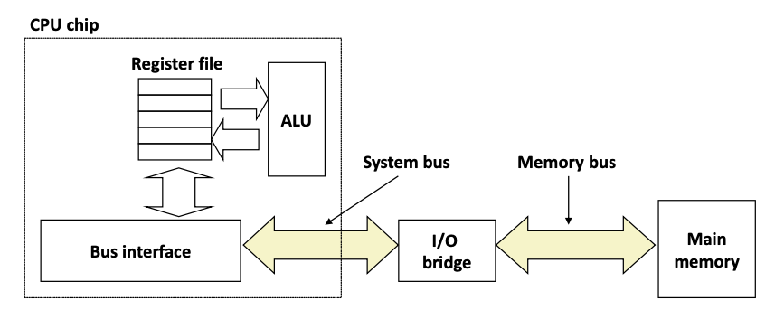
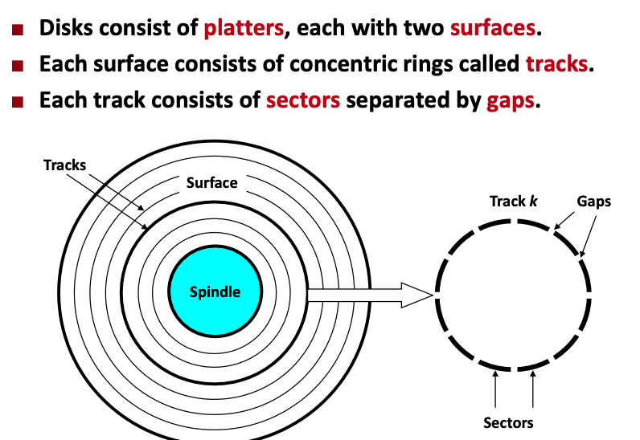
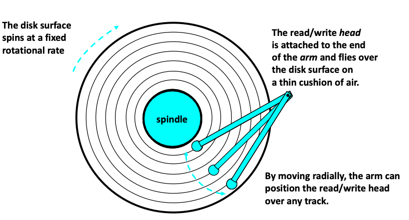
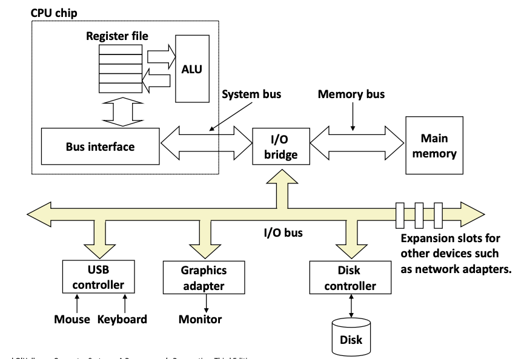

Bus: A bus is a collection of parallel wires that carry addres, data, and control signals. It's typically shared by multiple devices.

We need to notice the bus that carries data and address between components.

The disk is a cynlinder. The capacity of a disk is determined by three factors

1. Recording density: The amount of bits can be stored into 1 inch segement of track
2. Track Density: number of tracks can be squeezed into one inch of radia segment
3. Areal Density: product of recording and track density.

computing disk capacity

$Capacity = (\# bytes/sector)*(avg.\#sector/track)*(\# tracks/surface)*(\#surfaces/platter)*(\#platters/disk)$

Disk Operation(single-platter view)

Look at the operation image. Any read and write operation is done by moving the arm radially over any track.

### I/O Bus

## Locality

Locality bridges CPU-Memory gap.

Locality:

* Principle of Locality: Programs tend to access data that is near or equal the location of recent instructions.
* Temporal Locality: Recently referenced data is more likely to be referenced again in near future.
* Spatial Locality: data with nearby address tend to be referenced close together in time. (相邻数据在短时间内更可能同时调用)(that is data with near address tends to be referenced in a short interval)

## Memory Hierarchies

Facts:

* Fast storage technologies **cost more per byte**, have **less capacity** and require more power(heat!)
* Gap between CPU and main memory speed is widenning
* Well-written programs tend to exploit locality

**Caches**: A smaller, fasetr storage devie that acts as a staging area for a subset of the data in a larger, slower device.

**Important:** For each k, the faster, smaller device at level k serves as a cache for the larger, slower device at level k+1.

The reason why memory hierachies work is that because locality program tend to access data at level k more often than data at level k+1, so storage at level k+1 can be slower.

**Big idea**: The memory hierachy create a large pool of storage that costs as cheap as storage near the bottom, but serves data to programs at the rate of fast storage near the top. This means that eventually we want the storage  cost as low as bottom storage and as fast as top storage. **Cheap and Fast**

General Caching Concepts:

1. Cold(compulsory) miss: it occurs because the cache starts empty and this is the first reference to the block
2. Capacity miss: it occurs when the set of active cache blocks is larger than the cache
3. Conflict miss: it occurs when the level  cache is larg enough, but multiple data objects all map to the same level k block.
