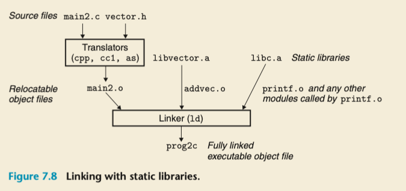
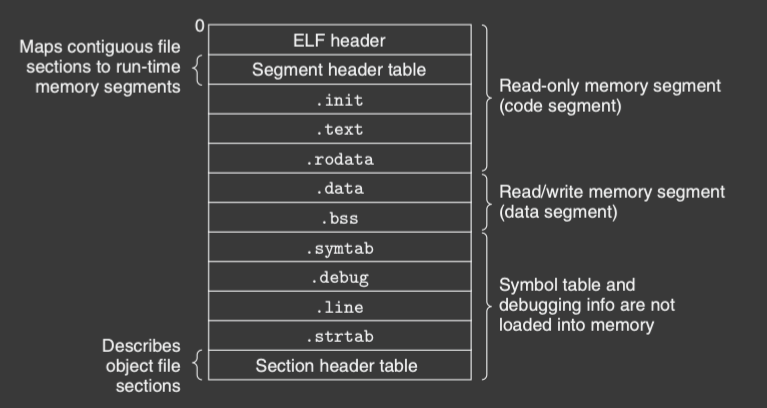
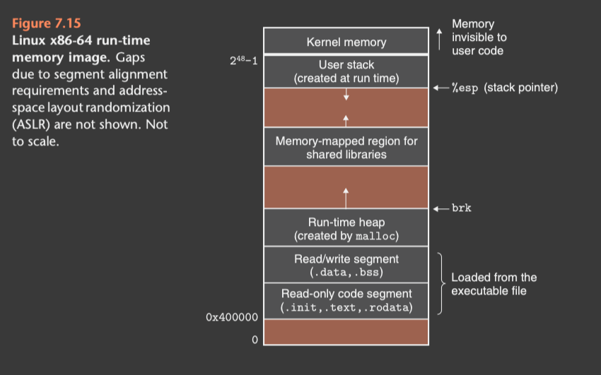

Why we need to understand Linking?

1. Understnad linkers will help you build large programs
2. Understand linkers will help you avoid dangerous programming errors
3. Understand linkers will help you understand how language scoping rules are implemented
4. Understand linking will enable you to exploit shared libraries

## Compiler Drivers


The compiler driver first convert the main.c file to main.i (ascii intermediate value), and then uses assembler to translate main.i into main.s which is the assembly file, and then from assembly file into object file. Finally it runs the linker program to combine main.o and with other file to produce *excutable object file*.


## Static Linking

To generate an relocatable object files, linker program should run two steps

1. Symbol Resolution: Object files define and reference *symbols*, where each symbol represents a function, a global variable or a static variable. The purpose of symbol resolution is to associate symbol *reference* with only one symbol definition.
2. Relocation: The linker relocates these sections by associating a memory location with each symbol definition, and then modifying all references to those symbols so that they all point to the memory location.


## Object Files

* Relocatable Object File: contains binary code and data in a form that can be combined with other relocatable object files at compile time to create an excutable object file.
* Excutable Object File: contains binary code and data in a form that can be copied into main memory and excutable
* Shared Object File: A special type of relocatable object file that can be loaded into memory and linked dynamically, at either load time or run time.

object module: a sequence of bytes.

## Symbols and Symbol Tables

3 types of symbols:

* Global Symbols: defined by module m and can be referenced by other modules. Global linker symbols correspond *non-static* C functions and global variables
* Global symbols that are referenced by module m but defined by other modules. These are calld *externals*\
* Local symbols that are defined and referenced exclusively by module m. These are static C functions and global variables defined with keyword static. They can't be referenced by other modules.

## Relocatable Object Files


ELF header begines with a 16-byte sequence that describes the word size and byte ordering of the system that generated the file. 

## Symbol Relocation

* Local symbols: defined in the same modules. The compiler allows only one definition of each local symbol per module.
* Global symbols: when referencing to global symbols, compilers   will only generate an entry in the symbol table and let linkers to find the module. If linkers can't find the module, it will raise an error.


## Symbol Resolutino

Strong Symbol: functions and initialized global variables are strong symboles

Weak Symbol: uninitialized global variables get weak symbols

3 Rules:

1. Multiple strong symbols with the same name are not allowed
2. Given a strong symbol and multiple weak symbol, the strong one will be selected
3. Given multiple weak symbol, one random weak symbol will be selected.

### Linking with static libraries

In practic, all compilation systems provide a machanism for packaging related object modules into a single file called *static library*

We create separate relocatable files for each standard function and storing them into a directory. But we need to explicitly link he appropriate object modules into their excutables.

```C
linux> gcc main.c /usr/lib/printf.o /usr/lib/scanf.o

```

In Linux system, static libraries are stored into a file called *archive*.

Archive: is a collection of concatenated relocatd object files, with a header that describes the *size* and *location* of each membner object file.

Steps to create a static library using AR tool

```C
linux> gcc -c addvec.c multvec.c
linux> ar rcs libvector.a addvec.o mulvec.o
```

To use the library, we can write a .c file which invokes addvec library routine.

```C
//below is linux comnmand
linux> gcc -c main2.c
linux> gcc -static -o prog2c main2.o ./libvector.a

#include <stdio.h>
#include "vector.h"

int x[2] = {1,2};
int y[2] = {3,4};
int z[2];

int main()
{
    addvec(x,y,z,2);
    printf("z = [%d %d]", z[0], z[1]);
    return 0;
}

```



### How linkers use static libraries to resolve references

The linker will scan the file from left to right and it will maintain a set E of relocatabe object files, a set U of undefined objects, and a set D of defined objects.

* In each input file f, if f is an executable file then it will be marked as E, and linkers will reflect symbols definition and references in U and D accordingly.
* If f is an archive, linkers will check if symboles defined in f solve any references in U. If solve, then m is added to E. This process will repeat interatively until there is no change in U and D. Finally any object not found in E will be discarded. 
* If U is non-empty, then linkers will raise an error-message; otherwise, linkers will merge all the executable files and then run.


## Relocation

In relocation step, it merges all files togather, and assigns run-time address to all symbols.

Two steps in relocation

1. Relocating  sections and symbol definitions: linkers will merge sections of the same type into a new aggregate of the same type. Then linkers will assign run-time address to all symbols defined in each sections.
2. Relocating symbol references within sections: linker will modify each symbol so that they point to the correct run-time address. Linkers will depend on a data structure *relocation entries* to achieve the assignments.

### Relocation Entries


```C
typedef struct{
    long offset; // offset of the reference to relocate
    long type:32; //relocation type
    long symbol:32; //symbol table index
    long addend; //constant part of relocation expression
} Elf64_Rela;
```


* R_X86_64_PC32: relocate uses a reference 32-bit pc-relative address. (add 32 bit to the address stored in Program counter)
* R_X86_64_32: relocate a reference that uses a 32-bit absolute address.

### Relocating Symbol references

```C

//relocation algorithm
foreach section s{
    foreach relocation entry r{
        refptr = s + r.offset;  //pointer to reference to be relocated

        // relcoate a pc-relative reference
        if(r.type == R_X86_64_PC32)
        {
            refaddr = ADDR(s) + r.offset;
            *refptr = (unsigned) (ADDR(r.symbol) + r.addend - refaddr);
        }

        // relocate an absolute reference
        if(r.type == R_X86_64_32)
        {
            *refptr = (unsigned) (ADDR(r.symbol)+r.addend);
        }
    }
}
```

## Excutable Object Files




Executable obejct files are similar to relocatable object files. The .text, .rodata, and .data sections are similar but 

## Loading Executable Object Files

```C
linux -> ./prog
```

All executable object files are loaded by the *loader*.

This loader copies code and data in executable object files into the memory, and jumps to the first instruction to be executed, known as entry point.

This process of copying the program into memory is called *loading*

On Linux x86-64 the code segment starts at address 0x4000000, followed by the data segment.

The run time heap follows the data segment and grows upward via calls to the malloc library.

This is followed by a region that is reserved for shared modules.

The user stack startsbelow the largest legal user address $$2^{48} -1$$


The region above the stack, starting at address $$2^{48}$$ is reserved for the code and data in the kernel, which is main part of hte operating system.




## Dynamic Library

Static library needs to be updated periodically, and programmers need to rethink the function implementation.

Shared libraries: is an object module that, at either run time r load time, can be loaded at n arbiratry memory address and linked with a program in memory. This is called *dynamic linking*.


Here *shared* have two meanings:

1. in any given file there only one .so file for a particular library. The code and data are shared y all of the executable object files that reference this library. Comparing to static libraries, they are copied and embedded in the executables.
2. a single copy of the .text section of a shared  library in memory can be shared by different running processes.


