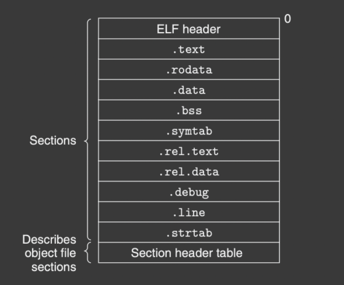

Why we need to understand Linking?

1. Understnad linkers will help you build large programs
2. Understand linkers will help you avoid dangerous programming errors
3. Understand linkers will help you understand how language scoping rules are implemented
4. Understand linking will enable you to exploit shared libraries

## Compiler Drivers

The compiler driver first convert the main.c file to main.i (ascii intermediate value), and then uses assembler to translate main.i into main.s which is the assembly file, and then from assembly file into object file. Finally it runs the linker program to combine main.o and with other file to produce *excutable object file*.

## Static Linking

To generate an relocatable object files, linker program should run two steps

1. Symbol Resolution: Object files define and reference *symbols*, where each symbol represents a function, a global variable or a static variable. The purpose of symbol resolution is to associate symbol *reference* with only one symbol definition.
2. Relocation: The linker relocates these sections by associating a memory location with each symbol definition, and then modifying all references to those symbols so that they all point to the memory location.

## Object Files

* Relocatable Object File: contains binary code and data in a form that can be combined with other relocatable object files at compile time to create an excutable object file.
* Excutable Object File: contains binary code and data in a form that can be copied into main memory and excutable
* Shared Object File: A special type of relocatable object file that can be loaded into memory and linked dynamically, at either load time or run time.

object module: a sequence of bytes.

## Symbols and Symbol Tables

3 types of symbols:

* Global Symbols: defined by module m and can be referenced by other modules. Global linker symbols correspond *non-static* C functions and global variables
* Global symbols that are referenced by module m but defined by other modules. These are calld *externals*\
* Local symbols that are defined and referenced exclusively by module m. These are static C functions and global variables defined with keyword static. They can't be referenced by other modules.

## Relocatable Object Files

ELF header begines with a 16-byte sequence that describes the word size and byte ordering of the system that generated the file. 

## Symbol Relocation

* Local symbols: defined in the same modules. The compiler allows only one definition of each local symbol per module.
* Global symbols: when referencing to global symbols, compilers   will only generate an entry in the symbol table and let linkers to find the module. If linkers can't find the module, it will raise an error.

