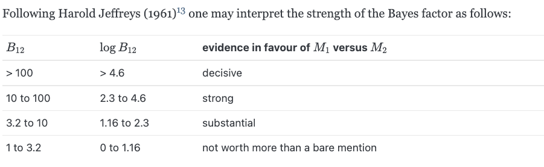

## Initiatives of Bayesian statistics

One fundamental theorem in Bayesian statistics is the **Bayes Theorem**

$$p(x|y) = \frac{p(y|x)p(x)}{p(y)} $$

* p(x\|y) is the posterior probability
* p(y\|x) is the likelihood of model
* p(x) is the prior probability
* p(y) is the marginal probability

The essence of Bayesian statistis is that given prior experience of an event with observations given by the likelihood function, how we can update our knowledge to the event in order to formulate the posterior knowledge.

## The differnce between Frequentist statistics and Bayesan statistics

The difference between two branches lies in the interpretation of probability. Frequentists consider probability as frequency. Among 100 times, how many times will be positive. This view is limited, since it can only be applied to large sample size, and can't apply to event that only occur once.

On the other hand, Baysesian statistician consider probability as description of state of knowlege and of uncertainty. Probability is not something can be observed but is our knowledge to some events. 

[read more on the difference between frequentist and bayesian](https://strimmerlab.github.io/publications/lecture-notes/MATH20802/essentials-of-bayesian-statistics.html#some-background-on-bayesian-statistics)

## Parameter Estimation

In bayesian framwork, Prior, Likeliood and Marginal are required to compute the posterior distribution. 

Morever, to describe a distribution, three properties should be computed, namely, proportion, mean, and variance. Below are three common models used to estimate these parameters.

* Proportion Estimation: Beta Binomial model
* Mean Estimation: normal normal model
* Variance Estimation: inverse-gamma normal model

### Beta Binomal Model

In this model, Beta is the Prior Distribution, and Binomial is the Likelihood, and p is the proportion parameter.

#### Beta Prior

The Prior Distribution is a Beta Distribution

$$
p  \sim Beta(\alpha, \beta)~~~ f(p) = \frac{p^{\alpha-1}(1-p)^{\beta-1} }{B(\alpha,\beta)}     ,~~~ \alpha \ge 0 ~~ and ~~ \beta \ge 0
$$

The prior mean and prior variance of Beta distribution is given by
$$
E[p] = \frac{\alpha}{m}=\mu_{prior}, ~~~ Var(p) = \frac{\mu_{prior}(1-\mu{prior})}{m+1}, ~~~ m = \frac{\alpha}{\alpha + \beta}
$$

#### Binomial Likelihood

$$
x|p \sim Bin(n,p), ~~~ f(x|p) = \binom{n}{x}p^x(1-p)^{n-x}
$$

where n  is sample  size, and f(x\|p) is the probability mass function of binomial distribution.

Given the prior and the likelihood, we are able to find the Posterior distribution.

#### Beta Posterior

$$
p|x \sim Beta(\alpha + x, \beta + n - x), ~~~ f(p|x) = \frac{p^{\alpha + x -1}(1-p)^{\beta + n - x +1}}{B(\alpha+x,\beta + n -x)}
$$

where f(x\|p) is the probability mass function of Beta distribution.

The posterior mean and posterior variance of the distribution is given below

$$
\mu_{posterior} = E[p|x] = \frac{x + \alpha}{n + m},~~~ \sigma_{posterior}^2 = Var(p|x) = \frac{\mu_{posterior}(1-\mu_{posterior})}{n+m+1}
$$

[This webiste provides more graphical demonstrations on the Beta-Bin Model](https://rpubs.com/FJRubio/BetaBinomial)

### Normal-Normal Model

The normal normal model is used to estimate the mean.

#### Normal Likelihood

$$
x|\mu \sim N(\mu, \sigma^2), ~~~ \hat{x}_{ML} = \bar{x}, ~~~ \bar{x} = \frac{1}{n} \sum_i^n x_i
$$

Note that the variance is fixed in Normal Likelihood, and the second term is the marximum liklihood estimator.

#### Normal Prior

To model the uncertainty about $\mu$, we use a Normal prior.

$$
\mu \sim N(\mu_o, \sigma^2/m), \mu_o = \mu ~ from ~liklihood, ~~ E[\mu] = \mu_o, ~~ Var(\mu) = \frac{\sigma^2}{m}
$$

m is the implied sample size, which is a real number.

#### Posterior Distribution

After we have observe n samples, the posterior distribution is normal.

$$
\mu|x_{1},...x_{n} \sim N(\mu_1, \sigma^2/(m+n)), ~~~ E[\mu|x_{1},...x_{n}] = \mu_{1} = \frac{m\mu_0 + n\bar{x}}{n+m} = \lambda \mu_0 + (1-\lambda)\hat{\mu}_{ML}
$$

### Inverse Gamma - Normal Model 

To estimate the variance we use the inverse gamma normal model

[The link provides a basic background for inverse gamma distribuiton](https://strimmerlab.github.io/publications/lecture-notes/MATH20802/bayesian-learning-in-practise.html#inverse-gamma-distribution)

Please note, it's is fine to be confused with inverse gamma distribution, because it's difficult.

#### Inverse Gamma Prior Distribution

$$
\sigma^2 \sim Inv-Gam(\mu = \sigma^2_0, k=m), ~~~ E(\sigma^2) = \sigma^2_0, ~~~ Var(\sigma^2) = \frac{2\sigma^4_0}{m-2}, ~~~ m > 2
$$

#### Normal Likelihood

$$
\sigma^2 \sim N(\mu, \sigma^2), ~~~ \hat{\sigma^2}_{ML} = \frac{1}{n} \sum_i^n(x_i-\mu), ~~~ \mu ~~ is ~~ fixed
$$

#### Inverse Gamma posterior Distribution

$$
\sigma^2|x_1,...,x_{n} \sim Inv-Gam(\mu =  \sigma^2_1, k=m+n), ~~~ \sigma^2_1 = \frac{\sigma^2_0m + n\hat{\sigma}^2_{ML}}{m+n}, ~~~ E[\sigma^2|x_1,..., x_n] = \sigma^2_1, ~~~ Var(\sigma^2|x_1,...,x_n) = \frac{2\sigma^4_1}{m+n-2}
$$

## Discussion 

The three models mentioned above is only the surface of bayesian framework. There is a linear relation between prior mean and posterior mean.[read this part to know how posterior mean can be written as linear combination of prior mean and MLE](https://strimmerlab.github.io/publications/lecture-notes/MATH20802/bayesian-learning-in-practise.html#linear-shrinkage-of-mean)

There are many optimal properties regarding Bayesian framework. [Read this link for more information about the optimalities of Bayesian framework](https://strimmerlab.github.io/publications/lecture-notes/MATH20802/optimality-properties-and-summary.html#optimality-properties-and-summary)

## Bayesian Model Comparison

only meniton simple model comparison and reference the composite model as a reading

When evaluating the null hypothesis, frequentist statisticians only consider information in the null hypthesis and ignore all information contained in the alternative hypothesis. For example, traditionally a 95% confidence interval will be set for the null hypothesis. If the value is within the confidence interval, we can't reject the null hypothesis. Here we only used the information in the null hypothsis i.e. sample mean and sample standard deviation of the observed data. 

In Bayesian framework, we include information in both the null hypothesis and the alternative hypothesis.

Baye's Rule

$$
p(\theta|D,M) = \frac{p(\theta|M)p(D|\theta,M)}{p(D|M)}
$$

The marginal likelihood at the denominator is computed differently for simple and composite models. If the model parameters are specified i.e. a number is given, then the model is simple. If the mdoel parameters are not specified, then it is a composite model, indicating it consists of a set of simple models.

For a simple model, it is computed as standard likelihood of the model M. For a composite model, it is more complex. The likelihood should be marginalised over all parameter $$\theta$$. To read more on the computation of marginal likelihood for composite models [go to this part](https://strimmerlab.github.io/publications/lecture-notes/MATH20802/bayesian-model-comparison.html#simple-and-composite-models)

Here we introduce the equation of Log-marginal likelihood as penalised maximum log-likelihood

$$
log(p(D|M)) = log(p(D|\theta,M)) - log(\frac{p(\theta|D,M)}{p(\theta,M)})
$$

The second part of on the write is the penalty for model complexity. The more complex the model is the lower the score is. [read here for a more detailed discussion for model complexity](https://strimmerlab.github.io/publications/lecture-notes/MATH20802/bayesian-model-comparison.html#model-complexity-and-occams-razor)

The penalisation idea will also be introduced in the later approximation equation. Keep in mind that a simpler model is always more preferable than a complex model in preventing over-fitting.

To compare two models, we introduce **Bayes Factor**: the ratio of the likelihoods of the two models.

$$B_{12} = \frac{p(D|M_1)}{p(D|M_2)} $$

If we apply logrithnm to the equation, we will git log-Bayes-factor, which is called **weight of evidence** for M_1 over M_2.

We introduce two more odds below, namely, Prior odds and Posterior odds.

$$
\frac{Pr(M_1)}{Pr(M_2)}, ~~~ \frac{Pr(M_1|D)}{Pr(M_2|D)} = \frac{p(D|M_1)}{p(D|M_2)} \frac{Pr(M_1)}{Pr(M_2)},
$$

The middle term is the Bayes factor mentioned above. We can think Bayes factor as a multiplicative factor which update prior odds to posterior odds.

### Scale of the Bayes Factor

Again, Bayes factor indicate the weight of evidence to prefer M_1 over M_2. The image above shows the scale of each weight evidence as well as the corresponding interpretations.

In practice, the Bayes factor and marginal likelihood are hard to compute, so below we intoduce some approximation techniques to estimate there terms.

Scharwarz approximation of log-marginal likelihood

$$
log(p(D|M)) \approx l^M_n(\hat{\theta}^M_{ML}) - \frac{1}{2}d_M log(n)
$$

where d is the number of parameters of the model M.

[read more approximation techniques in bayesian framework](https://strimmerlab.github.io/publications/lecture-notes/MATH20802/bayesian-model-comparison.html#approximate-computations)

## Discussion

In this tutorial, we have introduced the origination of Bayesian statistics, three common models to estimate parameters of posterior distribution, and techniques to perform bayesian testing.

The materials mentioned in this tutorial is difficult to understand, because they introduced more advanced techniques of parameter estimation as well as bayesian testing. 

This video gives a practical application and explanation of bayesian inference [here](https://www.youtube.com/watch?v=0w_4QcvBYII)

Moreover, the chapter 9 of this book gives an understandable and comprehensive introduction to Bayesian  inference [here](https://www.probabilitycourse.com/chapter9/9_1_0_bayesian_inference.php)

### We better further discuss how this links to bayesian neural network
