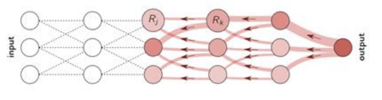

Four Properties of Good Explanation Tecniques

* Conservation: evidence in the explanabe output should correspond to somewhere in the features input
* Positivity: either a feature if relevant(positive) or irrelevant (zero)
* Continuity: if two points are almost the same and predictions are almost the same, then explanations shoule be amolst the same.
* Selectivity: models must agree with the explanation; removing the evidence in inputs, then the explanation should be less confident in the outputs.

## Layer Wise Relevance Propagation (LRP)

**LRP**: is an explanation technique which propagates the prediciton backwards using purposely designed local propagation rules.

LRP uses predictions to find explaining evidence in input features. 

The relevance score is computed by the below formula.

$$
R_j = \sum_k \frac{z_{jk}}{\sum_j z_{jk}} R_K
$$

z meatures which the amount of contribution made by each neuron to make neuron k relevant

