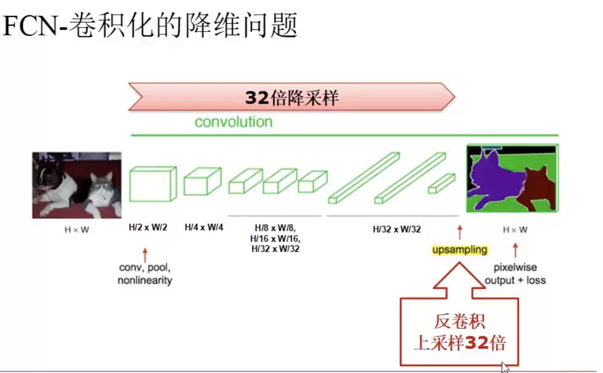
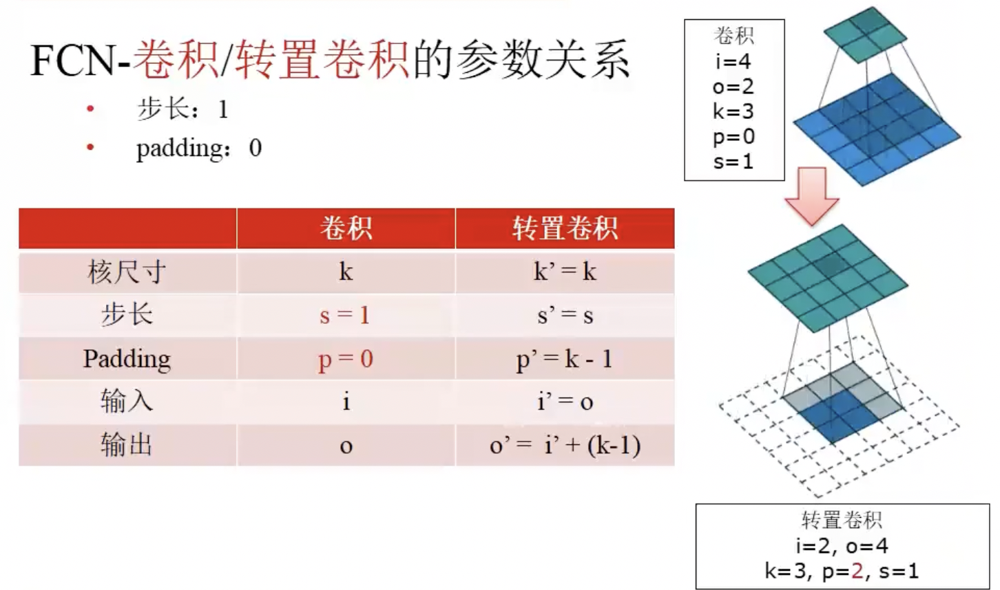

## Semantic Segmentation

Fully Convolutional Networks (FCN):

* Convolutionalization: all fully connected layers will be replaced by convolution layers. This is suitable for any scale input, and output low resolution images.
* Deconvolution: Sampling on low resolution images, and output segmented images on output.
* Skip-Layers: skip those final layers which make segmented boundaries blury.

### FCN-Deconvolution (Transposed convolution)

It turns a smaller layer into a larger one by adding paddings of zero around the previous smaller layer.

* Input: 2 x 2
* Output: 4 x 4
* Parameters: 
    * Kernel size: 3 x 3
    * Stride: 1
    * Padding: 2
* Skip-Layer: used

