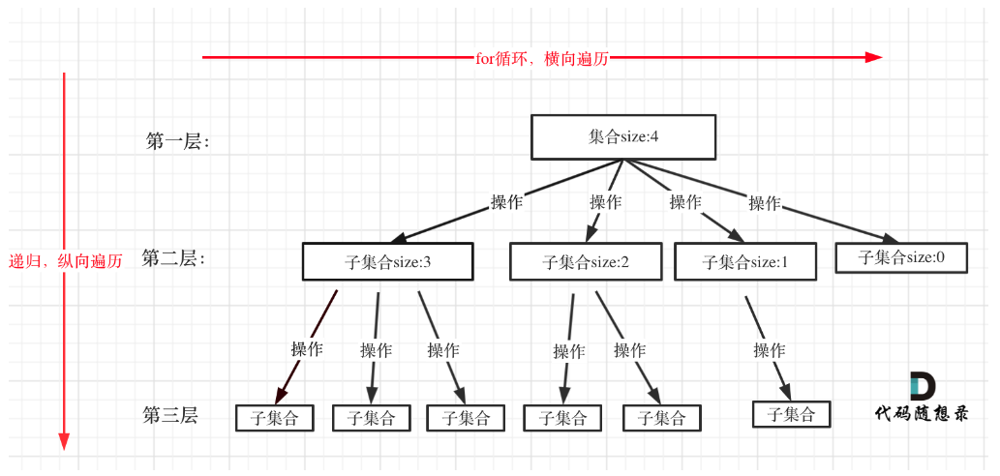
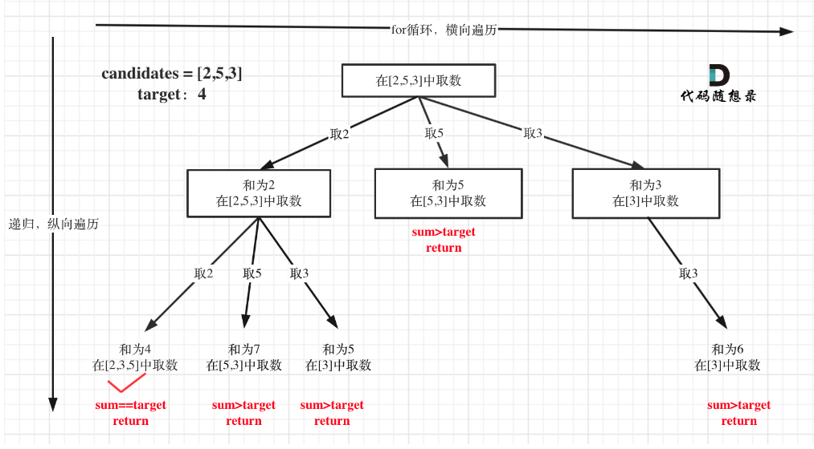
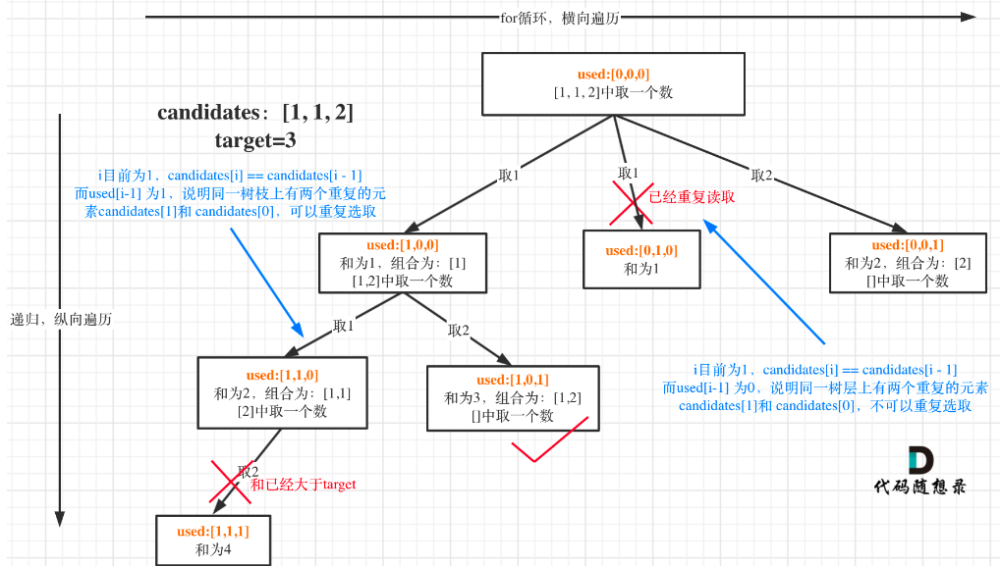
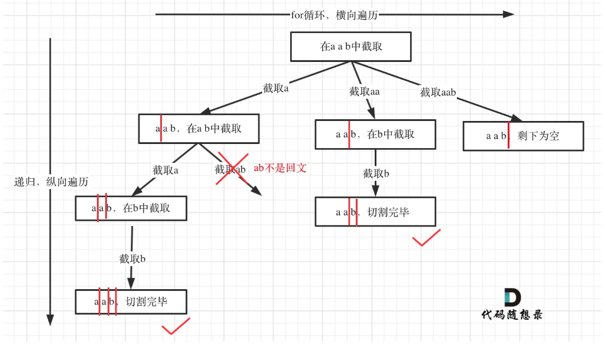
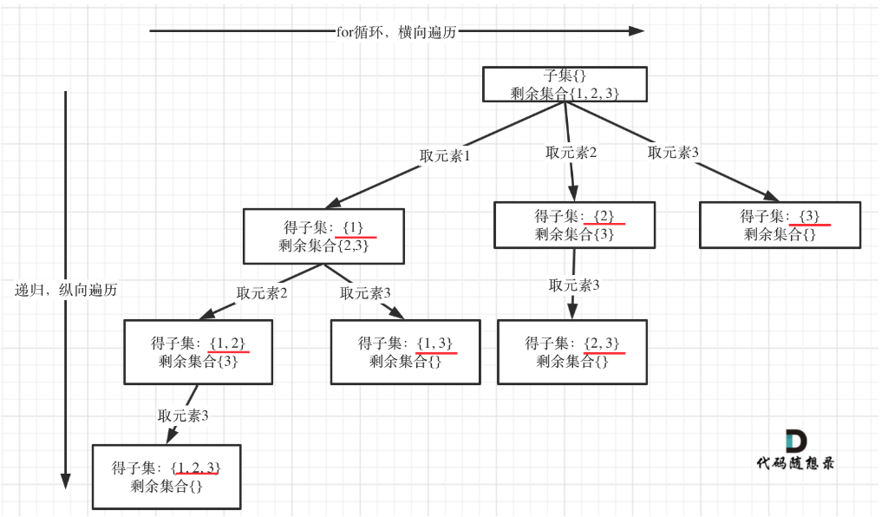
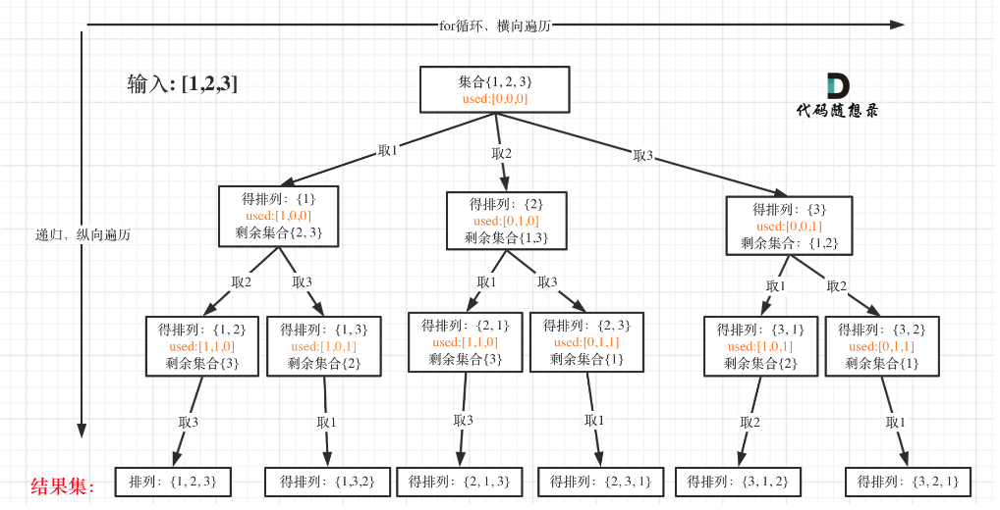

**这篇博客会记录自己学习算法是的思考以及相关学习资源**

## 数组
### 二分查找

给定一个 n 个元素**有序的**（升序）整型数组 nums 和一个目标值 target  ，写一个函数搜索 nums 中的 target，如果目标值存在返回下标，否则返回 -1。

```java
class Solution {
    public int search(int[] nums, int target) {
        int left = 0;
        int right = nums.length-1;
        // 定义左闭右闭区间
        while(left <= right)
        {
            int mid = left + ((right-left) >> 1); //不断更新寻找mid
            if(nums[mid] < target)
            {
                left = mid + 1;
            }
            else if(nums[mid] > target)
            {
                right = mid -1;
            }else{
                return mid;
            }
        }
        return -1;
    }
}
```

这个题目的细节在于

1. 对于区间的定义，循环不变量。 [left,right] 我们定义左闭右闭区间，在while 处就是<=,因为等于号是有意义的。相反[left,right)，就会是 < 因为right 不包括在区间内，所以不存在比较。
2. mid 一定是要定义在while 里面，这样就可以不断的计算mid
3. [left,right] 就是mid+1 和mid-1在对left 和right 更新时。因为前面的mid 已经包括在了区间内，我们需要再偏移一个元素。

**二分查找应用的前提是：1. 有序，2.元素不重复**

### 移除元素

给你一个数组 nums 和一个值 val，你需要 原地 移除所有数值等于 val 的元素，并返回移除后数组的新长度。
不要使用额外的数组空间，你必须仅使用 O(1) 额外空间并 原地 修改输入数组。
元素的顺序可以改变。你不需要考虑数组中超出新长度后面的元素。

```java
class Solution {
    public int removeElement(int[] nums, int val) {
        int slowIndex=0;
        for(int fastIndex=0; fastIndex<nums.length; fastIndex++)
        {
            if(nums[fastIndex] != val){
                nums[slowIndex] = nums[fastIndex];
                slowIndex++;
            }
        }
    }
}
```

使用快慢指针做两个for 循环的工作。快指针探索新的元素，慢指针决定新数组的下标。慢指针定义了一个左闭右开的区间，这个区间内不包含target。当fast 指向一个非target的值时，就将它复制给slow 指针。如果fast 指向target，那么这个值就不会放进slow 区间内，在后续的快慢指针数值交换的过程中被慢指针覆盖。

### 有序数组平方

给你一个按**非递减顺序** 排序的整数数组 nums，返回 每个数字的平方 组成的新数组，要求也按 非递减顺序 排序。
请你设计时间复杂度为 O(n) 的算法解决本问题

输入：nums = [-7,-3,2,3,11]
输出：[4,9,9,49,121]

```java
class Solution {
    public int[] sortedSquares(int[] nums) {

        int[] NewArray = new int[nums.length];
        int k = nums.length -1;
        int i,j;
        for(i=0,j=nums.length-1; i<=j; )
        {
            if(nums[i]*nums[i] > nums[j]*nums[j])
            {
                NewArray[k] = nums[i]*nums[i];
                i++;
            }else{
                NewArray[k] = nums[j]*nums[j];
                j--;
            }
            k--;
        }
        return NewArray;
    }
}

``` 
这个题目利用左右双指针的思路。首先一个包涵负数的生序数组，如果求平方，就会出现中间小两边大的情况。所以利用双指针，左右扫描。这里新建一个数组，从后往前放元素。

### 长度最小的子数组

给定一个含有 n 个正整数的数组和一个正整数 target 。

找出该数组中满足其和 ≥ target 的长度最小的 连续子数组 [numsl, numsl+1, ..., numsr-1, numsr] ，并返回其长度。如果不存在符合条件的子数组，返回 0 。

```
输入：target = 7, nums = [2,3,1,2,4,3]
输出：2
解释：子数组 [4,3] 是该条件下的长度最小的子数组。
```

我们是要发现一个新数组，它的元素之和大于等于target，它的长度最小。我们可以使用滑动窗口的思想。定义快慢指针，快指针不断的有一探索新的元素，慢指针不断右移获取最短子数组。慢指针移动时需要从数组和中间去慢指针位置上的数，并检查数组和是否仍然大于等于target。

**注：** 本题中使用滑动窗口主要确定一下三点

* 窗口内元素是什么？
* 如何移动窗口终止位置？
* 如何移动窗口起始位置？

```java
class Solution{
    public int minSubArrayLen(int target, int[] nums)
    {
        //
        int sum = 0;
        int result = Integer.MAX_VALUE;
        int subArrayLen = 0;
        int i=0;
        for(int j=0; j<nums.length; j++)
        {
            sum += nums[j];
            while(sum >= target)
            {
                sum -= nums[i];
                subArrayLen = j-i+1;
                result = Math.min(subArrayLen,result);
                i++;
            }
        }
        return result;
    }
}
```

### 螺旋矩阵

给你一个正整数 n ，生成一个包含 1 到 n2 所有元素，且元素按顺时针顺序螺旋排列的 n x n 正方形矩阵 matrix 。

这个问题涉及到定义循环不变量。我们定义[x,y) 左闭右开区间。还定义offset 偏移量，以及loop 这个会让我们确定有几个loop。

```java
class Solution {
    public int[][] generateMatrix(int n) {

        //loop invariant [x,y)
        int[][] result = new int[n][n];
        int startX=0;
        int startY=0;
        int offset = 1; //offset to the corner
        int loop = n/2;
        int mid = n/2;
        int count = 1; //record the number of loop run through
        int i,j;

        while(loop >= 0)
        {
            i=startX;
            j=startY;
            //left to right
            for(j=startY; j<n-offset; j++)
            {
                result[i][j] = count++;
            }
            //up to down on right
            for(i=startX; i<n-offset; i++)
            {
                result[i][j] = count++;
            }
            //right to left on down
            for(; j>startY; j--)
            {
                result[i][j] = count++;
            }
            //down to up on left
            for(; i>startX; i--)
            {
                result[i][j] = count++;
            }
            loop--;
            offset++;
            startX++;
            startY++;
        }
        if(n%2 == 1)
        {
            result[mid][mid]= count;
        }
        return result;
    }
}
```

## 链表
### 删除链表元素/ 虚拟头节点

给你一个链表的头节点 head 和一个整数 val ，请你删除链表中所有满足 Node.val == val 的节点，并返回 新的头节点 。
 
输入：head = [1,2,6,3,4,5,6], val = 6
输出：[1,2,3,4,5]

这个题目中我们需要注意，在检查链表中元素数值前，首先要检查这个节点是否存在。要有一个零时的节点作为head 的补充来获取更后面的节点。头节点是不能改的，我们需要current指针作为遍历的指针。

```java
class Solution{
    public ListNod removeElements(ListNode head, int val)
    {
        while(head != null && head.next == val)
        {
            head = head.next;
        }
        ListNode current = head;
        while(current != null && current.next != null) //当前与下一个节点都存在。如果第二个条件不符合就代表着当前节点是最后一个
        {
            if(current.next.val == val)
            {
                current.next = current.next.next;
            }else{
                current = current.next;
            }
        }
        return head;
    }
//虚拟头节点
        public ListNod removeElements2(ListNode head, int val)
    {
        ListNode dummyhead = new ListNode(0);
        dummyhead.next = head;
        ListNode current = dummyhead;

        while(current.next != null)
        {
            if(current.next.val == val)
            {
                current.next = current.next.next;
            }else{
                current = current.next;
            }
        }
        head = dummyhead.next;
        return head;
    }
}
```
这里我们要删除的是current 的下一个元素。实际上我们删除的方式，就是把current 的指针指向下一个的下一个，这样就删除了。所以while loop 的检查是current.next 不为空。在链表的题目中，我们需要注意的是空指针的问题。

### 实现链表增删操作


```java
class MyLinkedList {
    int size;
    ListNode head;

    public MyLinkedList() {
        size = 0;
        head = new ListNode(0);
    }

    public int get(int index) {
        if (index < 0 || index >= size) {
            return -1;
        }
        ListNode cur = head;
        for (int i = 0; i <= index; i++) {
            cur = cur.next;
        }
        return cur.val;
    }

    public void addAtHead(int val) {
        addAtIndex(0, val);
    }

    public void addAtTail(int val) {
        addAtIndex(size, val);
    }

    public void addAtIndex(int index, int val) {
        if (index > size) {
            return;
        }
        index = Math.max(0, index);
        size++;
        ListNode pred = head;
        for (int i = 0; i < index; i++) {
            pred = pred.next;
        }
        ListNode toAdd = new ListNode(val);
        toAdd.next = pred.next;
        pred.next = toAdd;
    }

    public void deleteAtIndex(int index) {
        if (index < 0 || index >= size) {
            return;
        }
        size--;
        ListNode pred = head;
        for (int i = 0; i < index; i++) {
            pred = pred.next;
        }
        pred.next = pred.next.next;
    }
}

class ListNode {
    int val;
    ListNode next;

    public ListNode(int val) {
        this.val = val;
    }
}
```

```java
class MyLinkedList {
    int size;
    ListNode head;

    public MyLinkedList() {
        size = 0;
        head = new ListNode(0);
    }
    
    public int get(int index) {
        if(index < 0 || index > this.size-1){
            return -1;
        }
        ListNode dummyhead = new ListNode(0);

        ListNode current = dummyhead.next;
        while(index > 0 )
        {
            current = current.next;
            index--;
        }
        return current.val;
    }
    
    public void addAtHead(int val) {
        ListNode dummyhead = new ListNode(0);
        dummyhead.next = head;
        ListNode newNode = new ListNode(val);
        newNode.next = head;
        dummyhead.next = newNode;
    }
    
    public void addAtTail(int val) {
        ListNode dummyhead = new ListNode(0);
        dummyhead.next = head;
        ListNode cur = dummyhead;
        ListNode newNode = new ListNode(val);

        while(cur.next != null)
        {
            cur = cur.next;
        }
        cur.next = newNode;
        this.size++;
    }
    
    public void addAtIndex(int index, int val) {
        if(index > size)
            return;
        ListNode newNode = new ListNode(val);
        ListNode current = dummyhead;

        while(index > 0)
        {
            current = current.next;
            index--;
        }
        newNode.next = curren.next;
        current.next = newNode;
        this.size++;
    }
    
    public void deleteAtIndex(int index) {
        ListNode dummyhead = new ListNode(0);
        ListNode current = dummyhead.next;
        dummyhead.next = head;

        while(index > 0)
        {
            current = current.next;
            index--;
        }
        current.next = null;

    }
}

class ListNode{
    int val;
    ListNode next;

    public void ListNode(int val)
    {
        this.val = val;
    }
}
```

### 反转链表

给定单链表的头节点 head ，请反转链表，并返回反转后的链表的头节点。

输入：head = [1,2,3,4,5]
输出：[5,4,3,2,1]

#### 双指针思路

双指针思路需要我们初始化当前节点，和前驱节点。pred 就是dummyhead，一开始是null，这也对应链表最后是null。
进入循环，直到current 为空。首先要存取 current.next 为 tmp，因为当我们之后对curernt.next 操作时，tmp 会
失去参考。之后就是current.next 指向 pred，current 赋给 pred，tmp 赋给 current。 最后当循环结束，让pred 成为head，因为current 当前为空指针。

```java
class Solution{
    pulic ListNode reverseList(ListNode head)
    {
        //双指针思路

        //初始化两个指针，当前指针与前驱指针
        ListNode pred = null;
        ListNode current = head;

        //当前指针是null 时，代表到达链表最后端
        while(current != null)
        {
            ListNode tmp = current.next; 
            current.next = pred; //前驱节点成为current.next
            pred = current;  //当前节点成为前驱节点
            current = tmp;  //临时节点成为
        }
        head = pred;
        return head;

    }
}
```

#### 递归法

递归法的思路其实与双指针类似，差别在于多定义了一个reverse 函数。其他的双指针初始化，都是一样的。我们通过递归的执行reverse，将链表反转。

```java
/**
 * Definition for singly-linked list.
 * public class ListNode {
 *     int val;
 *     ListNode next;
 *     ListNode() {}
 *     ListNode(int val) { this.val = val; }
 *     ListNode(int val, ListNode next) { this.val = val; this.next = next; }
 * }
 */
class Solution {
    public ListNode reverseList(ListNode head) {
    ListNode pred = null;
    ListNode curr = head;
    return reverse(curr, pred);        
}

public ListNode reverse(ListNode curr, ListNode pred)
{
    if(curr == null)
        return pred;
    ListNode tmp = curr.next;
    curr.next = pred;
    return reverse(tmp, curr);
}
}
```

### 两两交换链表

给你一个链表，两两交换其中相邻的节点，并返回交换后链表的头节点。你必须在不修改节点内部的值的情况下完成本题（即，只能进行节点交换）。

```
输入：head = [1,2,3,4]
输出：[2,1,4,3]

输入：head = []
输出：[]
```

``` java
class Solution{
    public ListNode swapParis(ListNode head)
    {
        ListNode dummyhead = new ListNode(0);
        dummyhead.next = head;
        ListNode current = dummyhead;
        ListNode firstNode, secondNode, tmp;

        while(current.next != null && current.next.next != null)
        {
            tmp = current.next.next.next;
            firstNode = current.next;
            secondNode = current.next.next;

            current.next = secondNode; //步骤一
            secondNode.next = firstNode; //步骤二
            firstNode.next = tmp //步骤三

            current = firstNode;
        }
        return dummyhead.next;
    }
}
```
为了更好的理解，我们初始化了三个变量firstNode, secondNode, tmp。循环条件，首先要写current.next 再写current.next.next 以避免空指针。因为current 是dummyhead，所以current不存在为空的现象。首先把第三个节点存储为tmp，再获取第一和第二个节点。先让current.next 指向第二个节点，再让第二个指向第一个，最后在让第一个指向第三个。此时第一个其实是第二个，因为他们互换了。这就是两两互换

### 删除链表的倒数第N个节点

给你一个链表，删除链表的倒数第 n 个结点，并且返回链表的头结点。
```
输入：head = [1,2,3,4,5], n = 2
输出：[1,2,3,5]
输入：head = [1,2], n = 1
输出：[1]
```

```java
class Solution{
    public ListNode removeNthFromEnd(ListNode head, int n)
    {
        ListNode dummhead = new ListNode(0);
        dummyhead.next = head;
        ListNode fast,slow = dummyhead;

        while(n>0 && fast !=null)
        {
            n--;
            fast = fast.next;
        }
        fast = fast.next;
        while(fast ! =null)
        {
            slow = slow.next;
            fast = fast.next;
        }
        slow.next= slow.next.next;
        return dummyhead.next;
    }
}
```

当我们要删除第n个节点时，我们需要获取n的前一个节点。所以我们需要把快指针在第一个循环之后再移动一下。先让快指针移动n次，就是为了让快慢指针之间的距离是n，当快指针移动到末端时，慢指针刚好指向倒数第n 个节点。本体的思路是先移动快指针n+1次，然后快慢指针同时移动至末端。最后慢指针删除下一个节点。


### 环形链表 2

给定一个链表的头节点  head ，返回链表开始入环的第一个节点。 如果链表无环，则返回 null。

如果链表中有某个节点，可以通过连续跟踪 next 指针再次到达，则链表中存在环。 为了表示给定链表中的环，评测系统内部使用整数 pos 来表示链表尾连接到链表中的位置（索引从 0 开始）。如果 pos 是 -1，则在该链表中没有环。注意：pos 不作为参数进行传递，仅仅是为了标识链表的实际情况。

不允许修改 链表。

```
输入：head = [3,2,0,-4], pos = 1
输出：返回索引为 1 的链表节点
解释：链表中有一个环，其尾部连接到第二个节点。

输入：head = [1,2], pos = 0
输出：返回索引为 0 的链表节点
解释：链表中有一个环，其尾部连接到第一个节点。

输入：head = [1], pos = -1
输出：返回 null
解释：链表中没有环。
```

```java
class Solution{
    public ListNode detectCycle(ListNode head)
    {
        //双指针思路
        ListNode fast = head;
        ListNode slow = head;

        while(fast != null && fast.next != null)
        {
            fast = fast.next.next;
            slow = slow.next;

            if(slow == fast)
            {
                ListNode index1 = head;
                ListNode index2 = fast;

                while(index1 != index2)
                {
                    index1 = index1.next;
                    index2 = index2.next;
                }
                return index1;
            }
        }
        return null;
    }
}
```

这一道题目首先涉及检查链表内是否有环，然后寻找环入口节点。

当我们让快指针每次移动两次，而慢指针每次移动一次，如果存在环，双指针就会相遇，否则不然。

在寻找环入口的时候，涉及到一些数学计算。x 是从头节点到环入口的距离，y 是从环入口到快慢指针相遇节点的距离，z是从相遇节点到环入口的距离。 y+z 等于环的长度。

$$
2(x+y) = x+y + n(y+z)
$$
$$
x = z 
$$
if z = 1.

当z >= 1 是拥有相同逻辑。我们需要。x=z 代表着从头节点到环入口的距离，和从相遇节点到环入口的距离相等，可以让两个指针同时从两处以相同速度出发，他们相遇的地方就是环入口。

### 链表总结


数组插入删除很贵，查询很便宜。链表插入删除很便宜，但查询很贵。

虚拟头节点的使用可以一体化的处理所有链表操作。我们要注意空指针异常，检查当前和下一个节点是否为空，这才循环中是很重要的一步。

## 哈希表

一般哈希问题都会用到三个数据结构
* 数组
* set
* map

如果要用最快的就用unordered set,如果要有序就用 ordered set

### 有效的字母异位词

给定两个字符串 s 和 t ，编写一个函数来判断 t 是否是 s 的字母异位词。

注意：若 s 和 t 中每个字符出现的次数都相同，则称 s 和 t 互为字母异位词。

```
输入: s = "anagram", t = "nagaram"
输出: true

输入: s = "rat", t = "car"
输出: false
```

这道题目我们用通过空间换时间的思路来解决问题。两个string 是否可以通过互换字母位置变为相等，最核心的点就是字母频率相等。通过使用一个数组记录两个string 字幕出现频率，就可以回答这个问题。如果遍历后，数组中的任何元素不为0，两个string 不可置换。

```java
class Solution {
    public boolean isAnagram(String s, String t) {
        int[] hashMap = new int[26];
        for(int i=0; i<s.length(); i++)
        {
            char a = s.charAt(i);
            hashMap[a - 'a']++; 
            // 在对应位置记录字母频率
        }

        for(int i=0; i<t.length(); i++)
        {
            char a = t.charAt(i);
            hashMap[a-'a']--;
        }

        for(int i=0; i<hashMap.length; i++)
        {
            if(hashMap[i]!= 0)
                return false;
        }
        return true;
    }
}
```

### 两个数组的交集

给定两个数组 nums1 和 nums2 ，返回 它们的交集 。输出结果中的每个元素一定是 唯一 的。我们可以 不考虑输出结果的顺序 。

```
输入：nums1 = [1,2,2,1], nums2 = [2,2]
输出：[2]

输入：nums1 = [4,9,5], nums2 = [9,4,9,8,4]
输出：[9,4]
解释：[4,9] 也是可通过的

1 <= nums1.length, nums2.length <= 1000
0 <= nums1[i], nums2[i] <= 1000
```

```java
import java.util.HashSet;
import java.util.Set;


class Solution {
    public int[] intersection(int[] nums1, int[] nums2)   
    {
        Set<Integer> hashSet = new HashSet<Integer>();
        Set<Integer> resultSet = new HashSet<Integer>();

        for(int i : nums1)
        {
            hashSet.add(i);
        }
        for(int i : nums2)
        {
            if(hashSet.contains(i))
            {
                resultSet.add(i);   
            }
        }
        int[] arr = new int[resultSet.size()];
        int j=0;
        for(int i : resultSet)
        {
            arr[j] = i;
            j++;
        }
        return arr;

    }
}
```

这个题目主要是要知道，正确的选择set数据结构。如果在没有数据范围的情况下，使用set可以很好的应对分散的数值情况而不浪费内存空间。但是有了范围，使用数组可以更快的解决。

定义两个set，第一个遍历记录数组1 的元素，然后遍历数组2，如果有重合的元素，再将该元素加入set2. 因为set 元素不重复，所以返回的数组是唯一且无序的。

### 两数之和
给定一个整数数组 nums 和一个整数目标值 target，请你在该数组中找出 和为目标值 target  的那 两个 整数，并返回它们的数组下标。
你可以假设每种输入只会对应一个答案。但是，数组中同一个元素在答案里不能重复出现。

你可以按任意顺序返回答案。

```java
import java.util.HashMap;
class Solution {
    public int[] twoSum(int[] nums, int target) {

        HashMap<Integer,Integer> map = new HashMap<>();
        int[] result = new int[2];


        for(int i=0; i<nums.length; i++)
        {
            int diff = target - nums[i];
            if(map.containsKey(diff))
            {
                result[0] = i;
                result[1] = map.get(diff);
                return result;
            }

            map.put(nums[i], i);
        }
        return result;
    }
}
```

### 三数之和

给你一个整数数组 nums ，判断是否存在三元组 [nums[i], nums[j], nums[k]] 满足 i != j、i != k 且 j != k ，同时还满足 nums[i] + nums[j] + nums[k] == 0 。请
你返回所有和为 0 且不重复的三元组。
注意：答案中不可以包含重复的三元组。

```
输入：nums = [-1,0,1,2,-1,-4]
输出：[[-1,-1,2],[-1,0,1]]
解释：
nums[0] + nums[1] + nums[2] = (-1) + 0 + 1 = 0 。
nums[1] + nums[2] + nums[4] = 0 + 1 + (-1) = 0 。
nums[0] + nums[3] + nums[4] = (-1) + 2 + (-1) = 0 。
不同的三元组是 [-1,0,1] 和 [-1,-1,2] 。
注意，输出的顺序和三元组的顺序并不重要。

输入：nums = [0,1,1]
输出：[]
解释：唯一可能的三元组和不为 0 。

输入：nums = [0,0,0]
输出：[[0,0,0]]
解释：唯一可能的三元组和为 0 。
```

```java
import java.util.ArrayList;
import java.util.Arrays;

class Solution {
    public List<List<Integer>> threeSum(int[] nums) {
        
        List<List<Integer>> result = new ArrayList<>();
        
        //对数组进行排序
        Arrays.sort(nums);

        for(int i=0; i<nums.length; i++)
        {
            //如果排序后第一个元素大于零，就代表不能找到和为0的三元组
            if(nums[i] > 0)
                return result;
            
            if(i>0 && nums[i]==nums[i-1])
                continue;
            
            int left = i+1;
            int right = nums.length-1;
            
            while(left < right)
            {
                int sum = nums[i] + nums[left] + nums[right];
                
                if(sum > 0)
                    right--;
                else if(sum < 0)
                    left++;
                else{
                    result.add(Arrays.asList(nums[i], nums[left], nums[right]));

                    //b and c 去重
                    while(left < right && nums[left]==nums[left+1]){
                        left++;
                    }
                    while(left < right && nums[right]==nums[right-1]){
                        right--;
                    }
                    // 找到答案时，双指针同时收缩
                    left++;
                    right--;
                }
            }
        }
        return result;
    }
}
```

这个题目不能使用哈希法的原因在于去重。哈希法的去重逻辑很复杂，在面试时容易出错。双指针的方法就可以有效避免很多错误。四数之和都可以用这样的双指针。用一个for 循环遍历i，然后在循环里面保持left 和 right 的双指针。如果i，left，right 上的数字相加小于0，就右移left。反之，则左移right。

这个题目中的一个重要步骤就是去重。对于abc 指针上的元素去重。对于a 的去重，要用i-1。同样，对于 left 和right 的去重，就是不等于他们的下一个元素。在这里就是left+1，right-1。如果是一样的话，那么这个指针给出的是一样的数字，就没有意义了。

### 四数之和

给你一个由 n 个整数组成的数组 nums ，和一个目标值 target 。请你找出并返回满足下述全部条件且不重复的四元组 [nums[a], nums[b], nums[c], nums[d]] （若两个四元组元素一一对应，则认为两个四元组重复）：

0 <= a, b, c, d < n
a、b、c 和 d 互不相同
nums[a] + nums[b] + nums[c] + nums[d] == target
你可以按 任意顺序 返回答案 。

```
输入：nums = [1,0,-1,0,-2,2], target = 0
输出：[[-2,-1,1,2],[-2,0,0,2],[-1,0,0,1]]

输入：nums = [2,2,2,2,2], target = 8
输出：[[2,2,2,2]]
```

```java
import java.util.ArrayList;
import java.util.Arrays;


class Solution {
    public List<List<Integer>> fourSum(int[] nums, int target) {
      List<List<Integer>> result = new ArrayList<>();
      Arrays.sort(nums);

      for(int k=0; k<nums.length; k++)
      {
          //k 剪枝
          if(nums[k] > target && target >= 0)
              break;
          //k 去重
          if(k>0 && nums[k] == nums[k-1])
              continue;
          for(int i=k+1; i<nums.length; i++)
          {
              //i 剪枝 nums[i] 大于0 就代表后面的数字单调递增，这就不会有target
              if(nums[k] + nums[i] > target && nums[i] > 0)
                  break;
              //i 去重
              if(i>k+1 && nums[i]==nums[i-1])
                  continue;

              new left = i+1;
              new right = nums.length-1;
              while(left < right)
              {
                  int sum = nums[k] + nums[i] + nums[left] + nums[right];
                  if(sum > target)
                    right--;
                  else if(sum < target)
                    left++;
                  else{
                          result.add(Arrays.asList(nums[k], nums[i], nums[left], nums[right]));
                          while(left < right && nums[left] == nums[left+1])
                              left++;
                          while(left < right && nums[right] == nums[right-1])
                              right--;

                          left++;
                          right--;                              
                      }
              }

          }
      }
      return result;
    }
}
```

这个题目的重点在于前两个指针的剪枝和去重逻辑。k指针指向的元素如果大于0，同时target 大于等于0，那就可以跳过，因为根据单调性就不会有满足target 的四元组。k 的去重和三数和相同。下一步进入二级剪枝 i 指针。i的剪枝，是检查nums[k] + nums[i] 是否大于0，同时 nums[i] > 0 这也是检查数组元素单调性的操作。


## 字符串

### 反转字符串2

给定一个字符串 s 和一个整数 k，从字符串开头算起，每计数至 2k 个字符，就反转这 2k 字符中的前 k 个字符。

如果剩余字符少于 k 个，则将剩余字符全部反转。
如果剩余字符小于 2k 但大于或等于 k 个，则反转前 k 个字符，其余字符保持原样。

```
输入：s = "abcdefg", k = 2
输出："bacdfeg"

输入：s = "abcd", k = 2
输出："bacd"
```

```java
class Solution {
    public String reverseStr(String s, int k) {

        char[] str = s.toCharArray();
        int length = str.length;

        for(int i=0; i<str.length; i += 2*k)
        {
            int left = i;

            //判断left + k -1 是否长于length
            int right = Math.min(length - 1, left + k - 1);

            while(left < right)
            {
                char tmp = str[left];
                str[left] = str[right];
                str[right] = tmp;

                left++;
                right--;
            }

        }
        return new String(str);
    }
}
```
这个题目的重点是怎样模拟复杂的规则。要判断当剩余部分不足k 或者超出k 但小于2k 是怎么操作。这里使用了一个min 函数选择两者之间的最小值。length-1 代表原数组长度， left+k-1 代表当前left 指针向右偏移k次的结果。如果前者大就代表当前还可以替换k个字母。如果后者大，那么就代表当前剩余字母不足k个，就把剩下的全部反转。如果有k个，就把前k个字母反转，如果不足就把剩下的反转。


### 替换空格
请实现一个函数，把字符串 s 中的每个空格替换成"%20"。

```
输入：s = "We are happy."
输出："We%20are%20happy."
```

```java
class Solution {
    public String replaceSpace(String s) {
        char[] charArray = s.toCharArray();
        int count = 0;
        for(char a : charArray)
        {
            if(a == ' ')
                count++;
        }
        //获取数组长度
        int oldSize = charArray.length;
        char[] newArray = new char[oldSize + 2*count];
        int left = charArray.length-1;
        int right = newArray.length-1;
        
        while(left >= 0)
        {
            if(charArray[left] == ' ')
            {
                newArray[right--] = '0';
                newArray[right--] = '2';
                newArray[right] = '%';
            }else{
            newArray[right] = charArray[left];

            }
            right--;
            left--;  
        }

        return new String(newArray);
    }
}
```

先扫描整个数组，寻找空格出现的次数。新建一个数组，长度是length + 两倍的空格出现频率。 使用双指针left 指向原数组的最后，right 指向新数组的最后。使用left遍历原数组，如果left 指向空格，就在新数组中写下 %20，right 指针向左移动2次。因为在if 里面指针只需要移动两次，在外面会统一的移动双指针。

### 反转字符串中的单词

给你一个字符串 s ，请你反转字符串中 单词 的顺序。

单词 是由非空格字符组成的字符串。s 中使用至少一个空格将字符串中的 单词 分隔开。

返回 单词 顺序颠倒且 单词 之间用单个空格连接的结果字符串。

注意：输入字符串 s中可能会存在前导空格、尾随空格或者单词间的多个空格。返回的结果字符串中，单词间应当仅用单个空格分隔，且不包含任何额外的空格。

```
输入：s = "the sky is blue"
输出："blue is sky the"
输入：s = "  hello world  "
输出："world hello"
解释：反转后的字符串中不能存在前导空格和尾随空格。
输入：s = "a good   example"
输出："example good a"
解释：如果两个单词间有多余的空格，反转后的字符串需要将单词间的空格减少到仅有一个。
```

```java
class Solution {
    // reverse the string 
    // reverse every word
    // remove spaces
    public String reverseWords(String s) {

        char[] str =s.toCharArray();
        int left =  0;     
        //remove extra spaces
        str = removeSpace(str);


        // reverse the string
        reverseString(str, left, str.length-1);


        // reverse words
        reverseSingleWord(str);
       System.out.println(str);

        return new String(str);

    }

    public void reverseString(char[] str, int left, int right)
    {
        if (right >= str.length)
        {
            System.out.println("set a wrong right");
            return;
        }
        while(left < right)
        {

            str[left] ^= str[right];
            str[right] ^= str[left];
            str[left] ^= str[right];

            left++;
            right--;
        }
    }

    public void reverseSingleWord(char[] str)
    {
        int slow = 0;

        // <= 是这里的一个关键。因为在下面reverseString 函数使用的是 fast < str.length
        // 如果这里也是用 <  那就会有最后一个字母漏掉。
        for(int fast=0; fast <= str.length; fast++)
        {
            //处理过的string，每次遇到space 就是一个单词结束
            if(fast == str.length || str[fast] == ' ')
            {
                reverseString(str, slow, fast - 1);
                slow = fast+1;
            }

        }
    }

    public char[] removeSpace(char[] str)
    {
        int slow = 0;
        for(int fast=0; fast<str.length; fast++)
        {
            if(str[fast] != ' ')
            {
                //开头不需要空格,再用slow 加空格
                if(slow != 0)
                {
                    str[slow++] = ' ';
                }
                //fast 遇到空格或遍历到字符串末尾，就证明遍历完一个单词了
                while(fast < str.length && str[fast] != ' ')
                {
                    str[slow++] = str[fast++];
                }
            }

        }

        //相当于 c++ 里的 resize()
        char[] newChars = new char[slow];
        System.arraycopy(str, 0, newChars, 0, slow); 
        return newChars;
    }´
}
```

这个题目要处理的细节非常多。整体的思路是，首先将多余的空格去除，首尾中间的空格，再将字符串反转，再将每一个单词反转。

移除空格时，就像在数组中移除一个元素，这个元素是空格。fast 指针探索新元素，slow 指针定义一个左闭右开区间，其中没有不需要的空格。使用if 判断 fast 是否指向 ‘ ’，如果不是，再判断slow 是否是在最开始的位置，如果是就不需要加空格，如果不是就会在下面的while loop 开始之前添加一个空格。while loop 会不断地将fast 指向的字母传给slow。当while 结束之后fast 会结束当前的传递，因为会指向‘ ’，然后进入下一个for loop 循环。因为每次在while 中都会 slow++ and fast ++，所以slow 在结束时也会指向‘ ’ 。但是这是中间可能你会有多个空格，所以fast 会不断遍历知道找到下一个非空格元素，从而进入第一个if。这时slow 因为不是0，代表这不是第一个单词了，所以单词之间要有一个空格，所以给slow 赋一个空格，然后再开始下一次的while loop。在最后返回一个新的char【】因为原有的长度和新的不一样。

之后的两不，反转字符串以及，反转单词都是


### 找出字符串中第一个匹配项的下标

给你一个字符串 s ，请你反转字符串中 单词 的顺序。
给你两个字符串 haystack 和 needle ，请你在 haystack 字符串中找出 needle 字符串的第一个匹配项的下标（下标从 0 开始）。如果 needle 不是 haystack 的一部分，则返回  -1 。

单词 是由非空格字符组成的字符串。s 中使用至少一个空格将字符串中的 单词 分隔开。
```
输入：haystack = "sadbutsad", needle = "sad"
输出：0
解释："sad" 在下标 0 和 6 处匹配。
第一个匹配项的下标是 0 ，所以返回 0 。


```java

class Solution {
    public int strStr(String haystack, String needle) {
        int j=-1; //j指向模式串起始位置，i指向文本出串起始位置。j 是-1，因为next从-1开始
        int[] next = new int[needle.length()];
        
        char[] haystackArray = haystack.toCharArray();
        char[] needleArray = needle.toCharArray();
        
        //构建next 数组
        getNext(next, needleArray);
        
        for(int i=0; i<haystackArray.length; i++)
        {
            while(j>=0 && haystackArray[i] != needleArray[j+1])
            {
                j = next[j];
            }

            if(haystackArray[i] == needleArray[j+1])
            {
                j++;
            }

            if(j == needleArray.length-1)
            {
                return i-needleArray.length+1; //
            }
        }
        return -1;
    }

    public void getNext(int[] next, char[] s )
    {
        //前缀表统一减一实现
        int j=-1; //j 指向前缀末尾
        next[0] = j;

        //i 指向后缀末尾

        for(int i=1; i<s.length; i++)
        {
            // i and j+1指向不同的字母
            while(j >= 0 && s[i] != s[j+1])
            {
                j = next[j]; //向前回退
            }
            //j+1 and i 指向相同的字母
            if(s[i] == s[j+1])
            {
                j++;
            }
            next[i] = j; //next 纪录最长前后缀的长度后缀的末端记录前缀末端的长度。这是最长前后缀子串相等的长度          
        }
    }
}
```

这个题目运用KMP 算法匹配字符串。答案由两部分组成。getNext 和 strStr 调用。

getNext 函数便利模式串，便利自己寻找前后缀最长子串。我们定义两个指针 i and j，j 指向前缀末尾，i指向后缀末尾。j=-1， 然后next 数组 next[0] = j。 i = 1，因为从第一个元素没有前后缀，所以从第二个元素开始遍历。

处理两个情况
1. s[i] != s[j+1]，通过使用while loop 不断回退。j = next[j]。这一个指令就会不断的往前寻找最长前后缀子串。如果没有匹配，j 就会回到最开始的地方 j=0。
2. s[i] == s[j+1], 双指针同时向后一位

最后将next[i] = j，就是把j 的长度赋给next 数组的第i 位。这个就是当之后匹配失败时，将作为参考回退到前后子串最长的情况。

strStr 函数调用getNext 函数构建next数组。同样定义两个指针i j。i 指向目标串的末尾，j 指向模式串的末尾。j=-1。

同样处理两种情况
1. s[i] != t[j+1]，这样就使用j=next[j]回退策略
2. s[i] == t[j+1] 双指针后移动一位。

在for loop 中判断，j 是否等于t.length -1，如果是就返回 i - t.length+1，也就是匹配子串开始的下标。

如果for loop 循环结束没有找到，return -1

### 重复的子字符串

```
输入: s = "abab"
输出: true
解释: 可由子串 "ab" 重复两次构成。

输入: s = "aba"
输出: false

输入: s = "abcabcabcabc"
输出: true
解释: 可由子串 "abc" 重复四次构成。 (或子串 "abcabc" 重复两次构成。)
```

```java
class Solution {
    public boolean repeatedSubstringPattern(String s) {

        char[] str = s.toCharArray();
        int[] next = new int[str.length];
        getNext(next, str);

        int len = next.length;        

        //不等于-1 代表有前后缀相等子串
        if(next[len-1] != -1 && len % (len - (next[len-1] + 1)) == 0)
        {
            return true;
        }
        return false;
    }

    public void getNext(int[] next, char[] s)
    {
        int j = -1;
        next[0] = j;
        for(int i = 1; i<next.length; i++)
        {
            while(j>=0 && s[i] != s[j+1])
            {
                j = next[j];
            }
            if(s[i] == s[j+1]){
                j++;
            }
            next[i] = j;
        }
    }
}
```

不被最长前后缀相等子串所包含的部分就是重复的子串，其原因在于，前缀不包含最后一个字母，后缀不包含第一个字母，这就意味着在字符串起始位置往后偏移几位的位置会成为最长相等前后缀子串的开始位置。同时前面不被包含的那一部分就会是重复子串。这里确定是否有重复子串的方式是通过取模判断字符串长度是否可以整除最长相等前后缀的长度与字符串长度之间的差而确定的。如果可以整除，就代表着字符串是由那个差构成。


## 栈与队列

### 用栈实现队列

请你仅使用两个栈实现先入先出队列。队列应当支持一般队列支持的所有操作（push、pop、peek、empty）：

实现 MyQueue 类：

void push(int x) 将元素 x 推到队列的末尾
int pop() 从队列的开头移除并返回元素
int peek() 返回队列开头的元素
boolean empty() 如果队列为空，返回 true ；否则，返回 false

```java
import java.util.Stack;


class MyQueue {

    Stack<Integer> stackIn;
    Stack<Integer> stackOut;


    public MyQueue() {
        stackIn = new Stack<>();
        stackOut = new Stack<>();
    }
    
    public void push(int x) {
        stackIn.push(x);
    }
    
    public int pop() {
        changeStack();
        return stackOut.pop();
    }
    
    public int peek() {

        if(stackOut.empty())
            changeStack();
        return stackOut.peek();
    }
    
    public boolean empty() {
        return stackIn.empty() && stackOut.empty();
    }

    public void changeStack()
    {
        if(!stackOut.empty())
            return;
        while(!stackIn.empty())
        {
            stackOut.push(stackIn.pop());
        }
    }
}

/**
 * Your MyQueue object will be instantiated and called as such:
 * MyQueue obj = new MyQueue();
 * obj.push(x);
 * int param_2 = obj.pop();
 * int param_3 = obj.peek();
 * boolean param_4 = obj.empty();
 */
```

### 用队列实现栈

请你仅使用两个队列实现一个后入先出（LIFO）的栈，并支持普通栈的全部四种操作（push、top、pop 和 empty）。

实现 MyStack 类：

void push(int x) 将元素 x 压入栈顶。
int pop() 移除并返回栈顶元素。
int top() 返回栈顶元素。
boolean empty() 如果栈是空的，返回 true ；否则，返回 false 。

```java
class MyStack {
    //q1作为主要的队列，其元素排列顺序和出栈顺序相同
    Queue<Integer> queue1 = new ArrayDeque<>();

    public MyStack() {

    }
    //在加入元素时先将q1中的元素依次出栈压入q2，然后将新加入的元素压入q1，再将q2中的元素依次出栈压入q1
    public void push(int x) {
        queue1.add(x);

        int size = queue1.size()-1;
        while(size > 0)
        {
            int tmp = queue1.poll();
            queue1.add(tmp);

            size--;
        }
    }

    public int pop() {

        return queue1.poll();
    }

    public int top() {
        return queue1.peek();
    }

    public boolean empty() {
        return queue1.isEmpty();
    }
}
```
这个题目主要就是在push函数上作准备。将最后一个进队列的元素一直移到第一个元素，从而形成stack 所需要的模式。当最后一个元素，成为下一个弹出的元素就会符合stack。


### 有效的括号
给定一个只包括 '('，')'，'{'，'}'，'['，']' 的字符串 s ，判断字符串是否有效。

有效字符串需满足：

左括号必须用相同类型的右括号闭合。
左括号必须以正确的顺序闭合。
每个右括号都有一个对应的相同类型的左括号。

```
输入：s = "()"
输出：true

输入：s = "()[]{}"
输出：true

输入：s = "(]"
输出：false
```

```java

class Solution {
    public boolean isValid(String s) {
        Stack<Character> stack = new Stack<>();

        char[] chars = s.toCharArray();
        for(int i=0; i<chars.length; i++)
        {
            if(chars[i] == '(')
                stack.push(')');
            else if(chars[i] == '{')
                stack.push('}');
            else if(chars[i] == '[')
               stack.push(']');
            else if(stack.empty() || stack.peek() != chars[i])
                return false;
            else
                stack.pop();
        }
        return stack.empty();
    }
}
```

这个题目处理括号有三种情况，左括号多，右括号多，括号不匹配。从左到右，遍历字符串。扫描到左括号，在stack 中添加对应的右括号。因为stack 先进后出的原则，括号的先后顺序可以解决。如果遍历没结束，stack 为空过就代表有多余的右括号，如果左括号扫描结束，开始右括号，就检查当前字符是否与stack.peek 匹配。如果不匹配就有问题。最后如果遍历结束，stack 不为空，这就代表着有多余的左括号。

stack 这个数据结构处理了先进后出的问题，在括号左右匹配问题上有所应用。


### 删除字符串中的所有相邻重复项

```java
class Solution {
    public String removeDuplicates(String s) {
        Stack<Character> stack = new Stack<>();

        char[] chars = s.toCharArray();

        for(int i=0; i<chars.length; i++)
        {
            if(!stack.empty() && chars[i] == stack.peek())
            {
                stack.pop();
            }else{
                stack.push(chars[i]);
            }
        }
        String str = "";
        while(!stack.empty())
        {
            str = stack.pop() + str;
        }

        return str;
    }
}
```

栈这个数据结构是否做相邻字符是否匹配，相邻字符运算之类的问题。

### 逆波兰表达式

给你一个字符串数组 tokens ，表示一个根据 逆波兰表示法 表示的算术表达式。

请你计算该表达式。返回一个表示表达式值的整数。

有效的算符为 '+'、'-'、'*' 和 '/' 。
每个操作数（运算对象）都可以是一个整数或者另一个表达式。
两个整数之间的除法总是 向零截断 。
表达式中不含除零运算。
输入是一个根据逆波兰表示法表示的算术表达式。
答案及所有中间计算结果可以用 32 位 整数表示。

```
输入：tokens = ["2","1","+","3","*"]
输出：9
解释：该算式转化为常见的中缀算术表达式为：((2 + 1) * 3) = 9

输入：tokens = ["4","13","5","/","+"]
输出：6
解释：该算式转化为常见的中缀算术表达式为：(4 + (13 / 5)) = 6
```

```java
class Solution {
    public int evalRPN(String[] tokens) {
        
        Stack<Integer> stack = new Stack<>();

        for(int i=0; i<tokens.length; i++)
        {

            if(tokens[i].equals("+") || tokens[i].equals("-") || tokens[i].equals("*")|| tokens[i].equals("/"))
            {
                if(tokens[i].equals("+"))
                {
                    int num1 = stack.pop();
                    int num2 = stack.pop();
                    stack.push(num2+num1);
                }else if(tokens[i].equals("-"))
                {
                    int num1 = stack.pop();
                    int num2 = stack.pop();
                    stack.push(num2-num1);
                }else if(tokens[i].equals("*"))
                {
                    int num1 = stack.pop();
                    int num2 = stack.pop();
                    stack.push(num2*num1);
                }else if(tokens[i].equals("/"))
                {
                    int num1 = stack.pop();
                    int num2 = stack.pop();
                    stack.push(num2/num1);
                }
            }else{
                int num = Integer.valueOf(tokens[i]);
                stack.push(num);
            }
        }
        return stack.pop();
    }
}
```

这个题目就是理解逆波兰表达式的后续遍历。每次遇到符号就弹出两个元素做运算，每次遇到数字就压进栈。

### 滑动窗口最大值

给你一个整数数组 nums，有一个大小为 k 的滑动窗口从数组的最左侧移动到数组的最右侧。你只可以看到在滑动窗口内的 k 个数字。滑动窗口每次只向右移动一位。

返回 滑动窗口中的最大值 。


```
输入：nums = [1,3,-1,-3,5,3,6,7], k = 3
输出：[3,3,5,5,6,7]
解释：
滑动窗口的位置                最大值
---------------               -----
[1  3  -1] -3  5  3  6  7       3
 1 [3  -1  -3] 5  3  6  7       3
 1  3 [-1  -3  5] 3  6  7       5
 1  3  -1 [-3  5  3] 6  7       5
 1  3  -1  -3 [5  3  6] 7       6
 1  3  -1  -3  5 [3  6  7]      7

输入：nums = [1], k = 1
输出：[1]
```

```java

class Solution {

    public class Myqueue{

        Deque<Integer> deque = new LinkedList<>();

        public void poll(int value){

            // 所有小于value 的值都已经弹出，除非等于否则不用再弹出
            if(!deque.isEmpty() && value == deque.peek())
                deque.poll();
        }

        public void add(int value)
        {
            //如果value 大于当前队列最大值，弹出所有元素队列元素，然后加入value
            while(!deque.isEmpty() && value > deque.peekLast())
                deque.pollLast();
            
            deque.add(value);
        }

        public int peek(){

            //返回当前单调队列最大值
            return deque.peek();
        }
    }
    public int[] maxSlidingWindow(int[] nums, int k) {
        Myqueue queue = new Myqueue();

        //储存结果
        int[] result = new int[nums.length - k + 1];
        int num = 0;

        for(int i=0; i<k; i++)
        {
            queue.add(nums[i]);
        }

        result[num++] = queue.peek();

        for(int i=k; i<nums.length; i++)
        {
            //先移除滑动窗空最左边的元素
            queue.poll(nums[i-k]);
            
            //添加新元素
            queue.add(nums[i]);

            result[num++] = queue.peek();
        }

        return result;
    }
}
```

这个题目使用单调队列解决。我们自行定义一个队列，pop 的时候如果当前值与队列出口值相等就弹出，否则忽略。忽略的原因是，在那之前，已经把那个值弹出了。 add 一个值时，如果如果队列出口的值小于就一直弹出。如果value 大于当前队尾，弹出队尾元素元素，直到对列为空或队尾大于value，然后加入value。这里维护的单调栈，让队列内元素单调递减。被弹出的元素如果不是之前的最大值，将不会被用于result 数组。如果窗口右移，同时弹出的元素是最大值，那么下一个元素就会是下一个窗口的最大值。这样设计的一个单调队列就可以维持一个窗口的最大值。

这里peek 直接返回最大值。

在maxSlidingWindow 中初始化一个 长为 length-k 的数组储存答案。现将前k个元素放进队列，再把当前最大值放进数组第一位。

遍历nums 数组，将最大值放进结果数组，弹出。

### 前 K 个高频元素

给你一个整数数组 nums 和一个整数 k ，请你返回其中出现频率前 k 高的元素。你可以按 任意顺序 返回答案。

```
输入: nums = [1,1,1,2,2,3], k = 2
输出: [1,2]

输入: nums = [1], k = 1
输出: [1]
```

```java
class Solution {
    public int[] topKFrequent(int[] nums, int k) {
        
        //将所有元素出现的频率放入map 中
        HashMap<Integer,Integer> map = new HashMap<>();

        for(int num: nums)
        {
            map.put(num, map.getOrDefault(num, 0)+1);
        }

        //使用min-heap 对k个元素进行排序。使用min-heap 是因为仅需要频率最高的k个元素。

        PriorityQueue<int[]> pq = new PriorityQueue<>((o1, o2) -> o1[1] - o2[1]); //定义小顶堆

        for(Map.Entry<Integer, Integer> entry: map.entrySet())
        {
            int num = entry.getKey();
            int count = entry.getValue();

            if(pq.size() == k)
            {
                if(count > pq.peek()[1])
                {
                    pq.poll();
                    pq.offer(new int[] {num, count});
                }
            }else{
                pq.offer(new int[] {num, count});
            }
        }
     int[] result = new int[k];

    for(int i=0; i<k; i++)
    {
        result[i] = pq.poll()[0];
    }   
    return result;
    }
}
```

这个题目首先使用map记录数字出现频率，然后使用min-heap 小顶堆存放map 里面的key。java 里使用priority queue，然后通过定义comparator 函数来定义 min-heap。

```
min-heap: PriorityQueue<>((o1,o2) -> o1[1] - o2[1])
max-heap: PriotyQueue<>((o1,o2) -> o2[1] - o1[1])
```

遍历map 里面的所有Entry，每一个entry 包含 (key,value)。获取这两个值。如果pq 的size 小于k就直接放入，如果大于k 就将当前count 的值与 pq 的peek 比较，如果后者大就忽略。如果前者大，就弹出peek 然后插入 {num, count} 进入pq。这里使用min-heap 的原因在于我们需要弹出堆中最不频繁出现的数字，如果当前的数字小于堆顶就弹出，反之则忽略。


## 二叉树

满二叉树：如果一棵二叉树只有度为0的结点和度为2的结点，并且度为0的结点在同一层上，则这棵二叉树为满二叉树。


完全二叉树的定义如下：在完全二叉树中，除了最底层节点可能没填满外，其余每层节点数都达到最大值，并且最下面一层的节点都集中在该层最左边的若干位置。若最底层为第 h 层（h从1开始），则该层包含 1~ 2^(h-1) 个节点。

前面介绍的树，都没有数值的，而二叉搜索树是有数值的了，二叉搜索树是一个有序树。

若它的左子树不空，则左子树上所有结点的值均小于它的根结点的值；
若它的右子树不空，则右子树上所有结点的值均大于它的根结点的值；
它的左、右子树也分别为二叉排序树

AVL（Adelson-Velsky and Landis）树，且具有以下性质：它是一棵空树或它的左右两个子树的高度差的绝对值不超过1，并且左右两个子树都是一棵平衡二叉树。

* 深度优先遍历
  * 前序遍历（递归法，迭代法）
  * 中序遍历（递归法，迭代法）
  * 后序遍历（递归法，迭代法）
广度优先遍历
  * 层次遍历（迭代法）


* 前序遍历：中左右
* 中序遍历：左中右
* 后序遍历：左右中

```java
public class TreeNode {
    int val;
    TreeNode left;
    TreeNode right;

    TreeNode() {}
    TreeNode(int val) { this.val = val; }
    TreeNode(int val, TreeNode left, TreeNode right) {
        this.val = val;
        this.left = left;
        this.right = right;
    }
}
```

## 二叉树遍历

递归框架：

1. 确定递归函数的参数和返回值： 确定哪些参数是递归的过程中需要处理的，那么就在递归函数里加上这个参数， 并且还要明确每次递归的返回值是什么进而确定递归函数的返回类型。

2. 确定终止条件： 写完了递归算法, 运行的时候，经常会遇到栈溢出的错误，就是没写终止条件或者终止条件写的不对，操作系统也是用一个栈的结构来保存每一层递归的信息，如果递归没有终止，操作系统的内存栈必然就会溢出。

3. 确定单层递归的逻辑： 确定每一层递归需要处理的信息。在这里也就会重复调用自己来实现递归的过程。

```java
class Solution {
    public List<Integer> preorderTraversal(TreeNode root) {
        List<Integer> list = new ArrayList<>();

        preorderTraversal(root, list);
        return list;
    }

    public void preorderTraversal(TreeNode root, List<Integer> list)
    {
        if(root == null)
            return;
        
        list.add(root.val);
        preorderTraversal(root.left, list);
        preorderTraversal(root.right, list);
    }
}

class Solution {
    public List<Integer> postorderTraversal(TreeNode root){
        
        List<Integer> list = new ArrayList<>();

        postorderTraversal(root, list);
        return list;
    }

    public void postorderTraversal(TreeNode root, List<Integer> list)
    {
        if(root == null)
            return;
        
        postorderTraversal(root.left, list);
        postorderTraversal(root.right, list);

        list.add(root.val);
    }
}

class Solution {
    public List<Integer> inorderTraversal(TreeNode root) {
        List<Integer> list = new ArrayList<>();

        inorderTraversal(root, list);

        return list;
    }

    public void inorderTraversal(TreeNode root, List<Integer> list)
    {
        if(root == null)
            return;
        
        inorderTraversal(root.left, list);

        list.add(root.val);

        inorderTraversal(root.right, list);

        
    }
}

```

### 迭代法遍历

使用stack 数据结构模拟树的遍历。

依次将root 放进stack，然后弹出处理，然后将右节点，然后左节点放入stack。根据先进后出的原则，stack 会先处理左节点从而符合前序遍历。

```java
class Solution {
    public List<Integer> preorderTraversal(TreeNode root) {
        List<Integer> list = new ArrayList<>();

        if(root == null)
            return list;
        
        Deque<TreeNode> stack = new LinkedList<>();
        stack.push(root);
        
        while(!stack.isEmpty())
        {
            TreeNode current = stack.pop();   

            list.add(current.val);

            if(current.right != null)
                stack.push(current.right);
            if(current.left != null)
                stack.push(current.left);
            
        }
        return list;
    }
}
```
后序遍历：
```java
class Solution {
    public List<Integer> preorderTraversal(TreeNode root) {
        List<Integer> list = new ArrayList<>();

        if(root == null)
            return list;
        
        Deque<TreeNode> stack = new LinkedList<>();
        stack.push(root);
        
        while(!stack.isEmpty())
        {
            TreeNode current = stack.pop();   

            list.add(current.val);

            if(current.right != null)
                stack.push(current.right);
            if(current.left != null)
                stack.push(current.left);
            
        }
        return list;
    }

}

//中序遍历
class Solution {
    public List<Integer> inorderTraversal(TreeNode root) {
        List<Integer> list = new ArrayList<Integer>();
        Deque<TreeNode> stack = new LinkedList<TreeNode>();  
        
        if(root == null)
            return list;       
          
        while(root != null || !stack.isEmpty())
        {
            if(root != null)
            {
                stack.push(root);
                root = root.left;
            }else{
                root = stack.pop();
                list.add(root.val);
                root = root.right;
            }                
        }
        return list;
    }
}
```
迭代法就是用栈模拟树的前中后序遍历。前后序遍历是相同的，中左右，左右中。都是使用栈，前者先将cur 加入list，再将右左节点入栈。后者先处理cur，再将左右节点入栈。这里的先后顺序是至关重要的。

中序遍历不能按照相同的逻辑，因为栈弹出的顺序与遍历顺序不相符。这个时候我们要先处理左节点，再处理中节点，最后右节点。利用cur 指针便利不断向左，直到指针为空，然后弹出栈，处理弹出的节点，再将cur 指向cur.right 查看右边的节点。如果也为空，在下一个循环中就会弹出上一层的节点，并且处理它。

### 二叉树的层序遍历

给你二叉树的根节点 root ，返回其节点值的 层序遍历 。 （即逐层地，从左到右访问所有节点）。

```
输入：root = [3,9,20,null,null,15,7]
输出：[[3],[9,20],[15,7]]

输入：root = [1]
输出：[[1]]

输入：root = []
输出：[]
```
```java
class Solution {
    public List<List<Integer>> levelOrder(TreeNode root) {

        List<List<Integer>> result = new ArrayList<List<Integer>>();

        Deque<TreeNode> queue = new LinkedList<>();

        //空指针不入栈
        if(root != null)
            queue.add(root);

        while(!queue.isEmpty())
        {
            int size = queue.size();
            ArrayList<Integer> list = new ArrayList<>();            
            while(size != 0)
            {
                TreeNode cur = queue.poll();
                list.add(cur.val);

                //空指针不入栈
                if(cur.left != null)
                    queue.add(cur.left);
                if(cur.right != null)
                    queue.add(cur.right);

                size--;
            }
            result.add(list);
        }
        return result;
    }
}
```

这个题目要返回层序遍历的二叉树结点。一层一层遍历使用队列先进先出的特性。每次入队都要检查节点是否为空，不为空加入队列中。否则不加入。

在最开始入队root 后队列不为空，然后使用while 循环直到队列为空。在循环内首先获取队列size，这个size 将会作为每一层list 加入的元素个数。可以让我们知道每一层应该有多少个数字加入list。然后初始化一个list，在使用while 循环直到size 为0。循环内队列弹出节点，获取当前节点的值，然后把左右子节点加入队列。然后size--。要检查左右节点是否为空。内循环结束后，将list 加入result 中。


### 翻转二叉树

给你一棵二叉树的根节点 root ，翻转这棵二叉树，并返回其根节点。

```
输入：root = [4,2,7,1,3,6,9]
输出：[4,7,2,9,6,3,1]

输入：root = [2,1,3]
输出：[2,3,1]

输入：root = []
输出：[]
```

```java
class Solution {
    public TreeNode invertTree(TreeNode root) {
        invertTrees(root);
        return root;
    }

    public void invertTrees(TreeNode cur)
    {
        if(cur == null)
            return;
        
        TreeNode tmp = cur.left;
        cur.left = cur.right;
        cur.right = tmp;

        invertTrees(cur.left);
        invertTrees(cur.right);
    }
}
```

递归法。首先定义函数参数以及返回值。参数就是root 当前节点，递归不需要返回，只需要反转。所以递归函数void，只是需要在整体的返回式 return root。终止条件就是当cur 为空时终止。递归逻辑是前序遍历。在cur 时交换左右指针，然后对左右子节点使用递归函数。

```java
class Solution {
    public TreeNode invertTree(TreeNode root) {

        Deque<TreeNode> stack = new LinkedList<>();

        if(root != null)
            stack.push(root);
        
        while(!stack.isEmpty())
        {
            TreeNode cur = stack.pop();
            
            TreeNode tmp = cur.left;
            cur.left = cur.right;
            cur.right = tmp;

            if(cur.right != null)
                stack.push(cur.right);
            if(cur.left != null)
                stack.push(cur.left);
        }

        return root;
    }
}
```

迭代法：这里使用深度优先前序遍历。借助stack 函数模拟深度优先算法。先把root 进栈，然后while stack 不为空，就stack 弹出元素，处理指针交换，然后右左子节点先后入栈。每次入栈前都需要检查节点是否为空。


```java
class Solution {
    public TreeNode invertTree(TreeNode root) {

        Deque<TreeNode> queue = new LinkedList<>();

        if(root != null)
            queue.push(root);
        
        while(!queue.isEmpty())
        {
            int size = queue.size();

            while(size != 0)
            {
                TreeNode cur = queue.poll();
                
                TreeNode tmp = cur.left;
                cur.left = cur.right;
                cur.right = tmp;

                if(cur.left != null)
                    queue.push(cur.left);   
                if(cur.right != null)
                    queue.push(cur.right);
             
                size--;
            }
        }
        return root;
    }

}
```

层序遍历：借助queue 数据结构完成先进先出的逻辑。先把root 进队。while queue 不为空，获取queue size，然后从队列中取出size 个元素处理。


### 对称二叉树

需要我们收集子节点信息，向上一层返回的的时候要使用**后序遍历**

给你一个二叉树的根节点 root ， 检查它是否轴对称。

```
输入：root = [1,2,2,3,4,4,3]
输出：true

输入：root = [1,2,2,null,3,null,3]
输出：false
```

```java
class Solution {
    public boolean isSymmetric(TreeNode root) {

        return compare(root.left, root.right);
    }

    public boolean compare(TreeNode left, TreeNode right)
    {
        if(left==null && right!=null)
            return false;
        else if(left!=null && right == null)
            return false;
        else if(left==null && right==null)
            return true;
        else if(left.val != right.val)
            return false;

        //后序遍历

        boolean outside = compare(left.left, right.right);
        boolean inside = compare(left.right, right.left);

        //内外都true
        return outside && inside;
    }
}
```
这个题目利用的是递归方法。
递归三步走：
1. 定义函数参数和返回值：这里需要返回boolean看两边子树是否相等，所以递归函数返回boolean。参数因为是要对比两个子树，所以要左右节点。
2. 终止条件：如果在左子树上的左节点为空，而右子树上的右节点不会空，两边不对称，所以false。同理右为空，左不空，也为false。如果两边都不为空，但是数值不相等，也是false。只有两边都为空的情况return true。这里是终止条件。如果左右两边都不为空，数值也相等，这就是继续递归的逻辑，如下
3. 单层递归的逻辑：outside 递归compare left.left and right.right。这个就是外侧树。 inside 递归 compare left.right and right.left。一棵二叉树只有内外两边，这也就是主要的变化。只有outside 和 inside 都true 才是true

我们使用后序遍历是因为要先把左右子节点信息传入父节点，然后比较。

这个题目要比较的不是左右节点，而是左右子树。明白了这一点才是题目的核心。一棵二叉树，有外侧和内侧，只有内外都相等了才能算对城。

### 二叉树的最大深度

给定一个二叉树 root ，返回其最大深度。

二叉树的 最大深度 是指从根节点到最远叶子节点的最长路径上的节点数。
```
输入：root = [3,9,20,null,null,15,7]
输出：3
输入：root = [1,null,2]
输出：2

```
```java
class Solution {
    public int maxDepth(TreeNode root) {

        return getHight(root);
    }

    public int getHight(TreeNode root)
    {
        if(root == null)
            return 0;
        
        //后序遍历
        int leftHight = getHight(root.left);
        int rightHight = getHight(root.right);

        int hight = Math.max(leftHight, rightHight);

        return hight+1;
    }
}
```

深度优先后序遍历。这里计算的其实是树的高度，但高度和深度其实是一样的。计算深度的逻辑使用前序遍历不断地在深度上+1。 题目要求返回一个int，所以计算高度时的递归函数也返回int，参数就一个TreeNode。参数里面不用传int 是因为高度将会作为返回值。终止条件是，当root 为空时返回0，因为这个时候就是叶子节点。 然后就是后序遍历逻辑，左右中。中间部分的处理就是获得最大高度，然后return hight+1

```java
class Solution {

    public int maxDepth(TreeNode root) {
        int result=0;
        Deque<TreeNode> queue = new LinkedList<>();

        if(root != null)
            queue.add(root);
        
        while(!queue.isEmpty())
        {
            int size = queue.size();
            result++;
            while(size != 0)
            {
                TreeNode cur = queue.poll();
                if(cur.left != null)
                    queue.add(cur.left);
                if(cur.right != null)
                    queue.add(cur.right);
                size--;
            }
        }
        return result;
    }
}
```

### 二叉树的最小深度

给定一个二叉树，找出其最小深度。

最小深度是从根节点到最近叶子节点的最短路径上的节点数量。

说明：叶子节点是指没有子节点的节点。
```
输入：root = [3,9,20,null,null,15,7]
输出：2

输入：root = [2,null,3,null,4,null,5,null,6]
输出：5
```
```java
class Solution {
    public int minDepth(TreeNode root) {
        
        return getDepth(root);
    }

    public int getDepth(TreeNode root)
    {
        if(root == null)
            return 0;
        
        int leftDepth = getDepth(root.left);
        int rightDepth = getDepth(root.right);

        if(root.left == null && root.right != null)
            return rightDepth+1;
        if(root.left != null && root.right == null)
            return leftDepth+1;
        
        return Math.min(leftDepth, rightDepth)+1;
    }
}
```
深度优先，后序遍历法。
1. 确定返回值和参数：返回int 二叉树最小深度。使用TreeNode 参数
2. 终止条件是 root==null，也就是达到叶节点 return 0
3. 单层递归逻辑：后序遍历，先处理左右子树的深度。return 部分的处理。因为有可能是左右子树有一边为空，所以要检查这种情况。如果这个情况属实，就return 另一边子树的深度+1。如果两边都有子树，那么就选择左右最小深度+1。

这个题目因为是使用的后序遍历，实际上会有很多多余的计算，因为是从最深处不断往上递归。因为使用层序遍历就更加快

二叉树的最大深度和最小深度的区别在于处理左右子树不为空的逻辑。最小深度要判断一个左右子树是否为空，如果左子树为空，那么要返回右子树的最小深度，而不是直接返回左子树为0的深度。

```java
class Solution {
    public int minDepth(TreeNode root) {
        int depth = 0;
        int size;
        Deque<TreeNode> queue = new LinkedList<>();
        if(root != null)
            queue.add(root);
    
        while(!queue.isEmpty())
        {
            size = queue.size();
            depth++;        
            while(size != 0)
            {
                TreeNode cur = queue.poll();

                if(cur.left == null && cur.right == null)
                    return depth;
                if(cur.left != null)
                    queue.add(cur.left);
                if(cur.right != null)
                    queue.add(cur.right);
                size--;
            }
        }
        return depth;
    }
}
```

层序遍历法：维持一个变量depth。使用正常的检查逻辑入队，然后开始while 循环。层序遍历要思考，什么情况下停止算法。这里我们是自顶向下，当我们遍历一层时，要思考怎样达到了最小深度。达到叶子节点就代表，达到最小深度。叶子节点就是没有左右子节点，这就是内while 循环中检查的逻辑。

 ### 完全二叉树的节点个数

给你一棵 完全二叉树 的根节点 root ，求出该树的节点个数。

完全二叉树 的定义如下：在完全二叉树中，除了最底层节点可能没填满外，其余每层节点数都达到最大值，并且最下面一层的节点都集中在该层最左边的若干位置。若最底层为第 h 层，则该层包含 1~ 2h 个节点。

```
输入：root = [1,2,3,4,5,6]
输出：6

输入：root = []
输出：0

输入：root = [1]
输出：1
```
```java
class Solution {
    public int countNodes(TreeNode root) {
        return count(root);
    }

    public int count(TreeNode root)
    {
        //终止条件
        if(root == null)
            return 0;
        
        TreeNode left = root.left;
        TreeNode right = root.right;

        int leftDepth = 0;
        int rightDepth = 0;

        while(left != null)
        {
            left = left.left;
            leftDepth++;
        }
        while(right != null)
        {
            right = right.right;
            rightDepth++;
        }
        if(leftDepth == rightDepth)
        {
            return (2 << leftDepth) -1;
        }

        //后序遍历
        int leftCount = count(root.left);
        int rightCount = count(root.right);

        return leftCount + rightCount + 1;
    }
}
```

本题使用一般二叉树求解同样可以通过，但是线性时间复杂度，远远不如 $(log(n))^2$。我们需要利用完全二叉树的特性，也就是处最后一层外二叉树全满，最后一层从左边开始填充。当我们不断往左右分解子树，就会遇到满二叉树，此时满二叉树节点个数可以通过 $2^k -1$ k 是当前二叉树深度。

那么如何判断是否有满二叉子树？通过不断遍历左指针和右指针。如果左右指针为空时，左右深度相同，那么就会是满二叉树，否则就继续使用正常的后序遍历逻辑。

### 平衡二叉树
给定一个二叉树，判断它是否是高度平衡的二叉树。

本题中，一棵高度平衡二叉树定义为：

一个二叉树每个节点 的左右两个子树的高度差的绝对值不超过 1 。

```
输入：root = [3,9,20,null,null,15,7]
输出：true

输入：root = [1,2,2,3,3,null,null,4,4]
输出：false

输入：root = []
输出：true
```
```java
class Solution {

    public boolean isBalanced(TreeNode root) {
        return check(root) == -1? false : true;
    }

    public int check(TreeNode root)
    {
        if(root == null)
            return 0;

        //后序遍历
        int left = check(root.left);
        if(left == -1)
            return -1;

        int right = check(root.right);
        if(right == -1)
            return -1;

        if(Math.abs(left - right) > 1)
        {
            return -1;           
        }        
        return Math.max(left, right)+1;
    }
}

class Solution {

    boolean balance = true;
    public boolean isBalanced(TreeNode root) {
        check(root);
        return balance;
    }

    public int check(TreeNode root)
    {
        if(root == null)
            return 0;

        //后序遍历
        int left = check(root.left);
        int right = check(root.right);

        if(Math.abs(left - right) > 1)
        {
            balance = false;
            return 1;           
        }        
        return Math.max(left, right)+1;
    }
}
```

这个题目的关键在于左右子树高度差不大于1。首先用题目函数返回值需要时boolean，所以做重要做一个true/false 比较。因为我们需要计算左右子树高度，所以使用int 作为递归函数的return。函数参数就是root。

* 终止条件，如果root为空返回0。
* 递归逻辑：后序遍历。先递归左子树，然后检查return 是否为-1，再递归右子树，检查return 是否为-1。如果是-1 直接return -1。中间的处理是，两边遍历完成了后，检查左右子树的高度如果相差大于1，直接return -1。两边相差小于1，就正常返回左右子树的高度最大值+1。

  
这里使用-1就是将结果作为比较结果。如果如果高度差大于1，就会返回-1。那么上层递归就会收到-1的返回，再继续返回-1，就会让整体函数的返回为-1。最后比较递归函数的返回是否为-1，如果是就不平衡，否则平衡。

这里我最开始的思路是维持一个变量balance ，如果不平衡就是false，否则就是true。这里的变量与返回的数字形成了冗余效果，因为出现不平衡情况后我们可以直接返回而不需要后续的计算。


### 二叉树的所有路径

给你一个二叉树的根节点 root ，按 任意顺序 ，返回所有从根节点到叶子节点的路径。

叶子节点 是指没有子节点的节点。

```
输入：root = [1,2,3,null,5]
输出：["1->2->5","1->3"]

输入：root = [1]
输出：["1"]
```

```java
class Solution {
    public List<String> binaryTreePaths(TreeNode root) {
        List<String> result = new ArrayList<>();  
        List<Integer> path = new ArrayList<>();      
        traversal(path,result, root);
        return result;
    }

    public void traversal(List<Integer> path, List<String> result, TreeNode root)
    {
        //前序遍历
        path.add(root.val);     

        if(root.left == null && root.right == null)
        {
           StringBuilder sb = new StringBuilder();
           for(int i=0; i<path.size(); i++)
           {
               if(i != path.size()-1)
               {
                    sb.append(path.get(i));
                    sb.append("->");                   
               }else
               {
                   sb.append(path.get(i));
               }
           }
           result.add(sb.toString());
        }
        if(root.left != null)
        {
            traversal(path, result, root.left);
            path.remove(path.size()-1); //回溯。 移除最后一个元素            
        }
        if(root.right != null)
        {
            traversal(path, result, root.right);
            path.remove(path.size()-1); //回溯。 移除最后一个元素   
        }
    }
}
```
快的版本

```java
class Solution {


    public List<String> binaryTreePaths(TreeNode root) {
        String path = "";
        List<String> paths = new ArrayList<>();        
        traversal(path,paths, root);
        return paths;
    }

    public void traversal(String path, List<String> paths, TreeNode root)
    {

        //前序遍历
        path = path + root.val;     

        if(root.left == null && root.right == null)
        {
            paths.add(path);
        }

        if(root.left != null)
        {
            traversal(path + "->", paths, root.left);            
        }

        if(root.right != null)
        {
            traversal(path + "->", paths, root.right);            
        }

    }
}
```
慢的版本

```java
class Solution {
    public List<String> binaryTreePaths(TreeNode root) {
        List<String> result = new ArrayList<>();  
        Deque<Integer> path = new LinkedList<>();      
        traversal(path,result, root);
        return result;
    }

    public void traversal(Deque<Integer> path, List<String> result, TreeNode root)
    {
        //前序遍历
        path.add(root.val);     

        if(root.left == null && root.right == null)
        {
           StringBuilder sb = new StringBuilder();
           int size = path.size();
            int i=0;
           while(i < size)
           {
                int tmp = path.pollFirst();               
               if(i != size-1)
               {
                    sb.append(tmp);
                    sb.append("->");                   
               }else{
                   sb.append(tmp);
               }
               path.add(tmp);
               i++;
           }
           result.add(sb.toString());
        }
        if(root.left != null)
        {
            traversal(path, result, root.left);
            path.pollLast(); //回溯。 移除最后一个元素            
        }
        if(root.right != null)
        {
            traversal(path, result, root.right);
            path.pollLast(); //回溯。 移除最后一个元素   
        }
    }
}
```
这个版本借助队列实现功能，更加繁琐。

两个版本都是正确的，但是第一个更快，原因在于对字符串的操作都集中在了最后，而第二个版本每一侧递归都会进行字符串操作。

这个题目使用递归解决，它涉及到回溯算法。
1. 确定函数返回值和参数：calling 函数要返回 List<String>，递归函数可以将那个result list 作为参数，同时使用List<Integer>，然后就是TreeNode
2. 终止条件：当碰到叶子节点就终止。
3. 单层递归逻辑：先将root.val 入list，然后检测左右子节点是否会空，然后再递归。

函数的最开始把中节点加入path，否则如果放在返回逻辑之后就会导致叶节点不能入list。当碰到叶节点时，使用stringbuilder，然后通过for 循环构造返回的路径字符串，然后加进result。
然后在完成左右递归后，要进行回溯操作，也就是把下一层递归加入的子节点移除。


### 左叶子之和

给定二叉树的根节点 root ，返回所有左叶子之和。

```
输入: root = [3,9,20,null,null,15,7] 
输出: 24 
解释: 在这个二叉树中，有两个左叶子，分别是 9 和 15，所以返回 24

输入: root = [1]
输出: 0
```

```java
class Solution {
    public int sumOfLeftLeaves(TreeNode root) {
        return nodeSum(root);
    }
    public int nodeSum(TreeNode root)
    {
        // 终止条件
        if(root == null)
            return 0;
        if(root.left == null && root.right == null)
            return 0;
        
        int left = nodeSum(root.left);
        int right = nodeSum(root.right);
        
        if(root.left != null && root.left.left == null && root.left.right == null)
            left =  root.left.val;
        return left + right;        
    }
}
```

这个题目要判断叶子节点，当我们遍历到底层时，返回0，因为不能判断是否为左叶子。当回溯到父节点时再判断左叶子节点是否为空，如果否，就将左叶子节点的数值赋给left。

这里使用后序遍历，左右中。当我们完成左遍历后，如果左叶子节点不为空，就可以完成上面提到的赋值。中的处理就是当前单层逻辑的处理，没有递归调用。

我们需要判断root的左孩子是否为叶子节点，如果不是，证明我们是在中间层，此时继续左右返回值相加。如果是左叶子，那么左边递归返回值将会是0，此时将leftValue 赋为left.val。


### 找树左下角的值

给定一个二叉树的 根节点 root，请找出该二叉树的 最底层 最左边 节点的值。

假设二叉树中至少有一个节点。

```
输入: root = [2,1,3]
输出: 1

输入: [1,2,3,4,null,5,6,null,null,7]
输出: 7
```

```java
/**
 * Definition for a binary tree node.
 * public class TreeNode {
 *     int val;
 *     TreeNode left;
 *     TreeNode right;
 *     TreeNode() {}
 *     TreeNode(int val) { this.val = val; }
 *     TreeNode(int val, TreeNode left, TreeNode right) {
 *         this.val = val;
 *         this.left = left;
 *         this.right = right;
 *     }
 * }
 */
class Solution {
    
    int result = 0;
    int maxDepth = Integer.MIN_VALUE;
    public int findBottomLeftValue(TreeNode root) {
        traversal(root, 0);
        return result;
    }

    public void traversal(TreeNode root, int depth)
    {
        if(root == null)
            return;
        if(root.left == null && root.right == null)
        {
            if(depth > maxDepth)
            {
                maxDepth = depth;
                result = root.val;
            }
            return;
        }

        if(root.left != null)
        {
            depth++;
            traversal(root.left, depth);
            depth--;
        }
        if(root.right != null)
        {
            depth++;
            traversal(root.right, depth);
            depth--;
        }
    }
}
```

递归法：

1. 返回值与参数：我们不返回值，而是维持两个全局变量 result，maxDepth。函数的传入参数，是节点与该节点的深度。题目中要求返回最后一行最左边的数值，那么就需要知道当前节点的depth 以及，从而与最大深度比较。一个叶子节点，但不一定会是最深的，所以要通过记录当前节点的depth 与maxDepth 比较。
2. 终止条件：遇到叶子节点时返回，处理深度比较，如果更加深，就对maxDepth 和result进行修改。
3. 单层递归逻辑：处理左右就行了，没有中。因为不需要在中间节点获得信息或处理什么信息。

```java
class Solution {
    public int findBottomLeftValue(TreeNode root) {
        Deque<TreeNode> queue = new LinkedList<>();

        if(root == null)
            return 0;
        else
            queue.add(root);

        int result = 0;
        while(!queue.isEmpty())
        {
            int size = queue.size();
            for(int i=0; i<size; i++)
            {
                TreeNode cur = queue.poll();
                if(i==0)
                    result = cur.val;
                if(cur.left != null)
                    queue.add(cur.left);
                if(cur.right != null)
                    queue.add(cur.right);
            }
        }
        return result;
    }
}
```

迭代法：层序遍历是最直观的方式。每一层遍历时，就记录当前层第一个元素，直到队列为空。

### 路径总和

给你二叉树的根节点 root 和一个表示目标和的整数 targetSum 。判断该树中是否存在 根节点到叶子节点 的路径，这条路径上所有节点值相加等于目标和 targetSum 。如果存在，返回 true ；否则，返回 false 。

叶子节点 是指没有子节点的节点。

```
输入：root = [5,4,8,11,null,13,4,7,2,null,null,null,1], targetSum = 22
输出：true
解释：等于目标和的根节点到叶节点路径如上图所示。

输入：root = [1,2,3], targetSum = 5
输出：false
解释：树中存在两条根节点到叶子节点的路径：
(1 --> 2): 和为 3
(1 --> 3): 和为 4
不存在 sum = 5 的根节点到叶子节点的路径。
```

```java
class Solution {
    public boolean hasPathSum(TreeNode root, int targetSum) {

        return traversal(root, targetSum);
    }
    public  boolean traversal(TreeNode root, int targetSum)
    {
        if(root == null)
            return false;
        
        if(root.left == null && root.right == null)
            return targetSum == root.val;
        
        if(root.left != null)
        {
            if(traversal(root.left, targetSum - root.val))
                return true;
        }
        if(root.right != null)
        {
            if(traversal(root.right, targetSum - root.val))
                return true;
        }
        return false;
    }
}
```


使用递归法需要同样思考三要素

1. 返回值与函数参数：题目要求返回boolean，所以递归函数也适用boolean。参数使用TreeNode 和targetSum。每一次都递减targetSum，直到结果为0.
2. 终止条件：如果root为空返回false；如果遇到叶子节点，判断targetSum == root.val。因为如果二者相等，再减去targetSum-root.val 等于0，就是答案。如果不相等，就是返回false，就代表这个路径不行。
3. 单层递归逻辑：如果使用if 判断traversal 递归调用的结果，因为其返回值是boolean，所以我们要判断在下一层返回上来的是否为true，如果true，那么就继续向上返回true。这样的一个逻辑就确保了中间层收到下层递归答案后继续向上传递信息。如果是false，就不会传递信息，而是继续右子树的遍历。

因为不是每一次路径的寻找都是成功的，所以需要进行回溯。我们在 targetSum-root.val 的递归传导中并没有改变targetSum 的数值，而是在其基础上增加了root.val，当回归到路径寻找失败return false 返回上层后，targetSum 仍然是之前的数值。

整体叙述一遍思路

本题需要判断是否有一个路径的和等于目标值，而并没有要求返回路径是什么，所以并不需要记录路径，而是管理targetSum。 targetSum 减去root.val 在代码不同的位置会有不同效果，具体实现也会有不同的方法。上面的那个版本，因为root.val 是在递归函数里面减去的，所以在base case 时，最后一个root.val 没有被剪去，所以判断的条件是targetSum==root.val。 如果targetSum -= root.val 写在叶子节点判断句上面，此时在叶子节点中就要写成 targetSum == 0 ，同时在递归函数中就不剪去root.val。

还需要注意的是root == null 的判断是不能少的，因为这是对空指针的排除。

```java
class Solution {
    public boolean hasPathSum(TreeNode root, int targetSum) {

        return traversal(root, targetSum);
    }
    public  boolean traversal(TreeNode root, int targetSum)
    {
        if(root == null)
            return false;
        
        if(root.left == null && root.right == null)
            return targetSum == root.val;
        targetSum -= root.val;
        if(traversal(root.left, targetSum))
            return true;                
        if(traversal(root.right, targetSum))
            return true;
        return false;
    }
}
```

第二个版本并没有使用之前提到的回溯技巧，在参数位置做运算，而是在中的位置上做的运算。这与之前的想法不一致，这里没有用到回溯。然而事实是，这里的回溯是隐形的。每一次递归调用函数都会有一套独立的栈，当下层递归完成返回上层栈时，上层栈的本地变量 targetSum 并没有改变。

### 路径总和2

给你二叉树的根节点 root 和一个整数目标和 targetSum ，找出所有 从根节点到叶子节点 路径总和等于给定目标和的路径。

叶子节点 是指没有子节点的节点。

```
输入：root = [5,4,8,11,null,13,4,7,2,null,null,5,1], targetSum = 22
输出：[[5,4,11,2],[5,8,4,5]]

输入：root = [1,2,3], targetSum = 5
输出：[]

输入：root = [1,2], targetSum = 0
输出：[]
```


```java
class Solution {
 
    List<List<Integer>> result = new ArrayList<List<Integer>>();
    List<Integer> path = new ArrayList<>();

    public List<List<Integer>> pathSum(TreeNode root, int targetSum) {

        traversal(root, targetSum);
        return result;
    }
    public void traversal(TreeNode root, int targetSum)
    {
        if(root==null)
            return;
        path.add(root.val);
        targetSum -= root.val;

        if(root.left == null && root.right == null && targetSum == 0)
            result.add(new ArrayList<>(path));
        
        traversal(root.left, targetSum);
        traversal(root.right, targetSum);
        path.remove(path.size()-1);
    }
}

class Solution {
    ArrayList<List<Integer>> result = new ArrayList<List<Integer>>();
    List<Integer> path = new ArrayList<>();    

    public List<List<Integer>> pathSum(TreeNode root, int targetSum) {

        traversal(root, targetSum);
        return result;
    }

    public void traversal(TreeNode root, int targetSum)
    {
        if(root==null)
            return;
        path.add(root.val);
        targetSum -= root.val;

        if(targetSum == 0 && root.left == null && root.right == null)
            result.add(new ArrayList<>(path));
        
        if(root.left != null)
        {
            traversal(root.left, targetSum);            
            path.remove(path.size()-1);
            targetSum += root.val;
        }
        if(root.right != null)
        {
            traversal(root.right, targetSum);          
            path.remove(path.size()-1);
            targetSum += root.val;
        }

    }
}
```

维持两个全局变量result，path。在参数上只保留root 和 targetSum。
这个题目令我费解的地方在于，targetSum 不需要回溯在前序遍历中，targetSum 的递减，或许在每一层都是不一样的，虽然是同一个名字。前序遍历的中部分，就是将路径中加入新的节点，然后减去当前的数字。当我们遇到叶子节点，判断targetSum 是否为0，如果是，就是正确的。在这里有些题解会用targetSum==root.val 而不是上文提到的。这是因为在之前的```targetSum -= root.val```
提前减去了数字。而有些思路会在之后叶子节点判断之后减去数值，这就要用到后者。

当targetSum==0，以及叶子节点为真，那么就将当前的path 新建一个数组放入result。之所以要新建，是因为直接放入path，在后续的删除中会让result 里的path改变，从而失去记录的意义。

在本题中有一个重要的点在于回溯。我们需要在完成一层左右递归后弹出path中最后一个元素。最好是按照第二种写法判断是否为空，然后完成一个递归弹出这次递归中path 的最后一个元素

### 从中序与后序遍历序列构造二叉树

给定两个整数数组 inorder 和 postorder ，其中 inorder 是二叉树的中序遍历， postorder 是同一棵树的后序遍历，请你构造并返回这颗 二叉树 。

```
输入：inorder = [9,3,15,20,7], postorder = [9,15,7,20,3]
输出：[3,9,20,null,null,15,7]

输入：inorder = [-1], postorder = [-1]
输出：[-1]
```

```java
class Solution {
    HashMap<Integer, Integer> map = new HashMap<>();
    public TreeNode buildTree(int[] inorder, int[] postorder) {
    
    for(int i=0; i<inorder.length;i++)
        map.put(inorder[i], i);
    
    TreeNode root = traversal(inorder, 0, inorder.length-1, postorder, 0, postorder.length-1);
    return root;
    }

    public TreeNode traversal(int[] inorder, int inBegin, int inEnd, int[] postorder, int postBegin, int postEnd)
    {
        //定义左闭右闭区间
        if(inBegin > inEnd || postBegin > postEnd)
            return null;

        TreeNode root = new TreeNode(postorder[postEnd]);
        if(postorder.length==1)
            return root;
        
        int rootIndex = map.get(root.val);
        int leftLength = rootIndex - inBegin; //计算左中序数组长度

        root.left = traversal(inorder, inBegin, rootIndex-1, postorder, postBegin, postBegin + leftLength-1);
        root.right = traversal(inorder, rootIndex+1, inEnd, postorder, postBegin + leftLength, postEnd-1);

        return root;

    }
}
```
这个方法定义了左闭右闭区间。

```java
class Solution {
    HashMap<Integer, Integer> map = new HashMap<>();
    public TreeNode buildTree(int[] inorder, int[] postorder) {
    
    for(int i=0; i<inorder.length;i++)
        map.put(inorder[i], i);
    
    TreeNode root = traversal(inorder, 0, inorder.length, postorder, 0, postorder.length);
    return root;
    }

    public TreeNode traversal(int[] inorder, int inBegin, int inEnd, int[] postorder, int postBegin, int postEnd)
    {
        //定义左闭右开区间
        if(inBegin >= inEnd || postBegin >= postEnd)
            return null;

        TreeNode root = new TreeNode(postorder[postEnd-1]);
        if(postorder.length==1)
            return root;
        
        int rootIndex = map.get(root.val);
        int leftLength = rootIndex - inBegin; //计算左中序数组长度

        root.left = traversal(inorder, inBegin, rootIndex, postorder, postBegin, postBegin + leftLength);
        root.right = traversal(inorder, rootIndex+1, inEnd, postorder, postBegin + leftLength, postEnd-1);

        return root;

    }
}
```

这个题目的核心在于

1. 认识到后序遍历数组的最后一个元素是二叉树的根节点
2. 在中序数组中找到那个根节点，就可以将数组分为左子树和右子树数组
3. 中后序遍历的左右子数组的长度是相等的，在计算出左中序数组后，可以根据其长度构建左后序数组

对于左右中后序数组的定义是一个难点。以上给出了左闭右开，和左闭右闭两种定义方式。

如果是左闭右开，在最外面的inEnd 和 postEnd 使用length，但是要注意到在获取postorder 最后一个元素时，要length-1，因为右边是开的。在后面的递归左子树时，需要从inBegin 到rootIndex。因为右开，所以不包含rootIndex。postBegin 到 leftLength，因为长度是偏移的次数，不是index，所以不用减一。

在递归右子树时，需要从rootIndx + 1 开始，到inEnd，因为左闭。postBegin + leftLength 到 postEnd -1。 这里减一是因为后序数组的最后一个元素是root，是要被排除在外的。

最后讨论一下终止条件。在左闭右开时，inBegin 和 inEnd 如果相等就代表数组为空，结束了。如果左边开始的index 大于等于右边的inEnd，因为是右开，这样的情况下就已经越界了。相反如果是左闭右闭，inBegin 和 inEnd 可以相等而不越界，所以左闭右闭就需要大于号。

同样的第一个方法定义了左闭右闭区间。这代表着两端的数字都有效。

在最外层的函数call 中需要将length-1，而让index 可被直接调用。
所以在递归时就需要rootIndex-1，以及postBegin + leftLength-1。后者是因为加上leftLength会越界到postorder 的右数组中。


### 构造二叉树

**构造二叉树类的题目一定要使用前序遍历**

给定一个不重复的整数数组 nums 。 最大二叉树 可以用下面的算法从 nums 递归地构建:

创建一个根节点，其值为 nums 中的最大值。
递归地在最大值 左边 的 子数组前缀上 构建左子树。
递归地在最大值 右边 的 子数组后缀上 构建右子树。
返回 nums 构建的 最大二叉树 。

You are given an integer array nums with no duplicates. A maximum binary tree can be built recursively from nums using the following algorithm:

Create a root node whose value is the maximum value in nums.
Recursively build the left subtree on the subarray prefix to the left of the maximum value.
Recursively build the right subtree on the subarray suffix to the right of the maximum value.
Return the maximum binary tree built from nums.

```
Input: nums = [3,2,1,6,0,5]
Output: [6,3,5,null,2,0,null,null,1]
Explanation: The recursive calls are as follow:
- The largest value in [3,2,1,6,0,5] is 6. Left prefix is [3,2,1] and right suffix is [0,5].
    - The largest value in [3,2,1] is 3. Left prefix is [] and right suffix is [2,1].
        - Empty array, so no child.
        - The largest value in [2,1] is 2. Left prefix is [] and right suffix is [1].
            - Empty array, so no child.
            - Only one element, so child is a node with value 1.
    - The largest value in [0,5] is 5. Left prefix is [0] and right suffix is [].
        - Only one element, so child is a node with value 0.
        - Empty array, so no child.

Input: nums = [3,2,1]
Output: [3,null,2,null,1]
```

```java
class Solution {
    public TreeNode constructMaximumBinaryTree(int[] nums) {
        return traversal(nums, 0, nums.length);
    }

    public TreeNode traversal(int[] nums, int leftIndex, int rightIndex)
    {
        //定义左闭右开区间

        //终止条件
        //检查空数组
        if(leftIndex >= rightIndex)
            return null;
        //检查数组是否为叶子节点
        if(rightIndex - leftIndex == 1)
            return new TreeNode(nums[leftIndex]);
        
        //寻找最大元素
        int maxVal = nums[leftIndex];
        int index = leftIndex;
        for(int i=leftIndex+1; i<rightIndex; i++)
        {
            if(nums[i] > maxVal)
            {
                maxVal = nums[i];
                index = i;
            }
        }
        TreeNode root = new TreeNode(maxVal);
        root.left = traversal(nums, leftIndex, index);
        root.right = traversal(nums, index+1, rightIndex);
        return root;
    }
}
```

递归三部曲：

1. 确定返回值和递归参数：题目需要返回根节点，所以函数也返回根节点。参数是nums 数组，以及数组左右index。左右index 是为了避免在递归中不断的新建数组。
2. 终止条件：如果数组左边大于等于右边，就代表数组为空，此时返回空节点。如果数组长度为一，也就是$rightIndex - leftIndex == 1$，那么就是叶子节点。此时需要构建TreeNode。
3. 单层递归逻辑：

* 使用前序遍历构建二叉树
* 首先寻找到由leftIndex 和 rightIndex 给定数组的最大值及其index。
* 使用最大值新建一个root节点
* 递归地使用 traversal 构建root.left 和 root.right。左子树就是用leftIndex 到 index，右子树就是用index+1 到 rightIndex。这里区间选择的逻辑依然保持左闭右开。

### 合并二叉树

给你两棵二叉树： root1 和 root2 。

想象一下，当你将其中一棵覆盖到另一棵之上时，两棵树上的一些节点将会重叠（而另一些不会）。你需要将这两棵树合并成一棵新二叉树。合并的规则是：如果两个节点重叠，那么将这两个节点的值相加作为合并后节点的新值；否则，不为 null 的节点将直接作为新二叉树的节点。

返回合并后的二叉树。

注意: 合并过程必须从两个树的根节点开始。

You are given two binary trees root1 and root2.

Imagine that when you put one of them to cover the other, some nodes of the two trees are overlapped while the others are not. You need to merge the two trees into a new binary tree. The merge rule is that if two nodes overlap, then sum node values up as the new value of the merged node. Otherwise, the NOT null node will be used as the node of the new tree.

Return the merged tree.

Note: The merging process must start from the root nodes of both trees.

```
Input: root1 = [1,3,2,5], root2 = [2,1,3,null,4,null,7]
Output: [3,4,5,5,4,null,7]

Input: root1 = [1], root2 = [1,2]
Output: [2,2]
```

```java
class Solution {
    public TreeNode mergeTrees(TreeNode root1, TreeNode root2) {
        return merge(root1, root2);
    }

    public TreeNode merge(TreeNode root1, TreeNode root2)
    {
        //终止条件
        if(root1==null && root2==null)
            return null;
        if(root1 == null)
            return root2;
        if(root2 == null)
            return root1;

        root1.val += root2.val;

        root1.left = merge(root1.left, root2.left);
        root1.right = merge(root1.right, root2.right);
        return root1;

    }
}
```

递归三部曲：

1. 函数返回值与参数

题目要求返回TreeNode 所以这里也返回TreeNode。同样两个TreeNode 作为参数。这个题目的不同之处就在于两颗二叉树的传导。

2. 终止条件

当两个TreeNode 都为 空时，返回null，如果有一边不为空，一边为空，就返回不为空的那边。

3. 单层递归逻辑

修改tree1 的结构，将两个节点想加。对root1 左右节点递归合并。最后返回root1。

### 二叉搜索树中的搜索

给定二叉搜索树（BST）的根节点 root 和一个整数值 val。

你需要在 BST 中找到节点值等于 val 的节点。 返回以该节点为根的子树。 如果节点不存在，则返回 null 。

You are given the root of a binary search tree (BST) and an integer val.

Find the node in the BST that the node's value equals val and return the subtree rooted with that node. If such a node does not exist, return null.

```
输入：root = [4,2,7,1,3], val = 2
输出：[2,1,3]

输入：root = [4,2,7,1,3], val = 5
输出：[]
```

```java
class Solution {
    public TreeNode searchBST(TreeNode root, int val) {
        return bst(root, val);
    }

    public TreeNode bst(TreeNode root, int val)
    {
        if(root == null || root.val == val)
            return root;

        if(root.val > val)
            return bst(root.left, val);
        else
            return bst(root.right, val);     
    }
}
```

递归法：

递归法我们也是要利用bst 的特性，根据数字大小选择左右子树遍历。如果root.val 大于val，就遍历左树，如果root.val 小于val 就遍历右树。如果相等就直接返回root。

递归三部曲

1. 函数返回值和参数

返回TreeNode，参数就是TreeNode 和 val。

2. 终止条件

如果root 为空，或者root.val == val 就返回root。前者与return null 没有区别，后者返回所需要的值

3. 单层递归逻辑

如果root.va 大于 val，就遍历左子树，否则就遍历右子树。直接return 函数的返回值。

```java
class Solution {
    public TreeNode searchBST(TreeNode root, int val) {

        while(root != null)
        {
            if(root.val > val)
            {
                root = root.left;
            }else if(root.val < val)
                root = root.right;
            else    
                return root;
        }
        return null;
    }
}
```

迭代法：

迭代法利用while 循环不断的利用bst 数值的特性选择性的遍历左右子树，直到找到数值，或者root 为空。

### 验证二叉搜索树

给你一个二叉树的根节点 root ，判断其是否是一个有效的二叉搜索树。

有效 二叉搜索树定义如下：

节点的左子树只包含 小于 当前节点的数。
节点的右子树只包含 大于 当前节点的数。
所有左子树和右子树自身必须也是二叉搜索树。

Given the root of a binary tree, determine if it is a valid binary search tree (BST).

A valid BST is defined as follows:

The left 
subtree
 of a node contains only nodes with keys less than the node's key.
The right subtree of a node contains only nodes with keys greater than the node's key.
Both the left and right subtrees must also be binary search trees.

```
Input: root = [2,1,3]
Output: true

Input: root = [5,1,4,null,null,3,6]
Output: false
Explanation: The root node's value is 5 but its right child's value is 4.
```

**遇到二叉搜索树，或者判断一棵二叉搜索树，都需要想到中序遍历。** 中序遍历会给出bst 的有序排列

对二叉搜索树的遍历都需要想到中序遍历，就像数组的遍历一样，bst 在中序遍历下就会得出一个有序数组。我们对于bst 的遍历处理，不一定要转换成数组，也可以利用双指针的思路再一次遍历中完成。主要的思路就是利用bst 节点中的大小比较。

```java
class Solution {
    long maxVal = Long.MIN_VALUE;

    public boolean isValidBST(TreeNode root) {
        
        return traversal(root);
    }

    public boolean traversal(TreeNode root)
    {
        if(root == null)
            return true;

        //中序遍历
        boolean left = traversal(root.left);

        if(maxVal < root.val)
            maxVal = root.val;
        else
            return false;

        boolean right = traversal(root.right);

        return left && right;
    }
}
```

递归法

当我们递归到底层时，只需要返回，不需要对树进行操作。当root 为空时，返回true。递归使用中序遍历

递归三部曲

1. 函数返回值与参数：题目要求返回boolean，所以递归函数也返回boolean。参数上，就记录一个TreeNode
2. 终止条件：root=null。之前我错误的认为在叶子节点需要做一些事，比如将数值放入list，在直观解法中。我们只需要在空节点时return true。空节点是有效的二叉搜索树
3. 单层递归逻辑：使用中序遍历，左中右。左子树遍历，返回boolean。检查root是否大于maxVal，也就是当前最大值。如果是，就就把root.val 赋给maxVal。


```java
class Solution {
    List<Integer> list = new ArrayList<>();

    public boolean isValidBST(TreeNode root) {
        traversal(root);
        for(int i=1; i<list.size(); i++)
        {
            if(list.get(i-1) >= list.get(i))
                return false;
        }
        return true;
    }

    public void traversal(TreeNode root)
    {
        if(root == null)
            return;

        //中序遍历
        traversal(root.left);
        list.add(root.val);
        traversal(root.right);
    }
}
```

直观解法

### 二叉搜索树的最小绝对差

给你一个二叉搜索树的根节点 root ，返回 树中任意两不同节点值之间的最小差值 。

差值是一个正数，其数值等于两值之差的绝对值。

Given the root of a Binary Search Tree (BST), return the minimum absolute difference between the values of any two different nodes in the tree.


```
Input: root = [4,2,6,1,3]
Output: 1

Input: root = [1,0,48,null,null,12,49]
Output: 1
```

```java
class Solution {
    int diff = Integer.MAX_VALUE;
    TreeNode prev = null;
    
    public int getMinimumDifference(TreeNode root) {
        traversal(root);
        return diff;
    }
    public void traversal(TreeNode root)
    {
        if(root == null) return;       

        traversal(root.left);

        if(prev !=null && root.val - prev.val < diff)
            diff = root.val - prev.val;
        prev = root;

        traversal(root.right);
    }
}
```

递归三部曲

1. 函数返回值与参数：我们维持一个最小绝对差的全局变量，所以在递归函数中，不返回任何东西。参数就是TreeNode
2. 终止条件：如果root 为空直接返回。这确保了base case
3. 单层递归逻辑：

* 中序遍历，左中右。中的逻辑是，维持一个prev 节点，如果prev 不为空，同时prev.val > root.val 这就代表着二叉搜索树不合理。直接return false
* 之后让prev = root，然后右子树遍历。

### 二叉搜索树中的众数

给你一个含重复值的二叉搜索树（BST）的根节点 root ，找出并返回 BST 中的所有 众数（即，出现频率最高的元素）。

如果树中有不止一个众数，可以按 任意顺序 返回。

假定 BST 满足如下定义：

结点左子树中所含节点的值 小于等于 当前节点的值
结点右子树中所含节点的值 大于等于 当前节点的值
左子树和右子树都是二叉搜索树

Given the root of a binary search tree (BST) with duplicates, return all the mode(s) (i.e., the most frequently occurred element) in it.

If the tree has more than one mode, return them in any order.

Assume a BST is defined as follows:

The left subtree of a node contains only nodes with keys less than or equal to the node's key.
The right subtree of a node contains only nodes with keys greater than or equal to the node's key.
Both the left and right subtrees must also be binary search trees.

```
输入：root = [1,null,2,2]
输出：[2]

输入：root = [0]
输出：[0]
```

```java
class Solution {

    int maxCount = 0;
    int count = 0;
    TreeNode prev;
    List<Integer> list = new ArrayList<>();

    public int[] findMode(TreeNode root) {
        traversal(root);
        int[] result = new int[list.size()];
        for(int i=0; i<result.length; i++)
        {
            result[i] = list.get(i);
        }
        return result;
    }
    public void traversal(TreeNode root)
    {
        if(root == null) return;

        traversal(root.left);

        if(prev==null || prev.val != root.val)
            count=1;
        if(prev!=null && prev.val == root.val)
            count++;
        prev = root;

        if(count == maxCount)
            list.add(root.val);
        if(count > maxCount)
        {
            maxCount = count;
            list.clear();
            list.add(root.val);
        }

        traversal(root.right);
        return;
    }
}
```

递归三部曲

1. 函数返回值与参数：要遍历整棵树，所以不需要返回值，参数就是TreeNode。
2. 终止条件：root==null 作为base case。不需要更多，在最下面保证递归的回弹就行
3. 单层递归逻辑：

* 维持三个全局变量，maxCount，count， prev (前驱节点)， list (存众数)。
* 使用中序遍历。主要讲中的逻辑。首先如果如果prev 为空或者 prev.val 不等于 root.val，前者意味着遍历刚开始到第一个元素，后者意味着遇到了一个新元素，所以root.val 不等于prev.val。在这两种情况count 都设为1
* 如果prev 不为空，同时root.val 与prev.val 相等，这就代表着遇到了相同的元素，此时count 加一
* 下一步做双指针交换，prev = root
* 接着如果count(当前元素的频率) == maxCount (最大频率)，那么就将root.val 存入list。如果count > maxCount，就清空list再放入root.val。此时list 中包含新的众数，最后再更新maxCount。

这里维持的count 和 maxCount 都是为了计数。如果按照最直观的方式，遍历二叉树，然后存入map。将map 转成数组再排序，就用了更多的空间和时间。这里通过双指针思路，在一次遍历的情况下完成了任务

### 二叉树的最近公共祖先

给定一个二叉树, 找到该树中两个指定节点的最近公共祖先。

百度百科中最近公共祖先的定义为：“对于有根树 T 的两个节点 p、q，最近公共祖先表示为一个节点 x，满足 x 是 p、q 的祖先且 x 的深度尽可能大（一个节点也可以是它自己的祖先）。”

Given a binary tree, find the lowest common ancestor (LCA) of two given nodes in the tree.

According to the definition of LCA on Wikipedia: “The lowest common ancestor is defined between two nodes p and q as the lowest node in T that has both p and q as descendants (where we allow a node to be a descendant of itself).”

```
Input: root = [3,5,1,6,2,0,8,null,null,7,4], p = 5, q = 1
Output: 3
Explanation: The LCA of nodes 5 and 1 is 3.

Input: root = [3,5,1,6,2,0,8,null,null,7,4], p = 5, q = 4
Output: 5
Explanation: The LCA of nodes 5 and 4 is 5, since a node can be a descendant of itself according to the LCA definition.

Input: root = [1,2], p = 1, q = 2
Output: 1
```

```java
lass Solution {
    public TreeNode lowestCommonAncestor(TreeNode root, TreeNode p, TreeNode q) {
        return traversal(root, p, q);
    }

    public TreeNode traversal(TreeNode root, TreeNode p, TreeNode q)
    {
        if(root==null) return null;
        if(root==p || root==q)  return root;

        TreeNode left = traversal(root.left, p, q);
        TreeNode right = traversal(root.right, p, q);

        if(left!=null && right!= null)
            return root;
        if(left != null && right == null)
            return left;
        if(left == null && right != null)
            return right;
        return null;
    }
}
```

递归三部曲

1. 函数参数与返回值：返回TreeNode，因为问题需要返回TreeNode。参数是三个TreeNode，root，p，q。 后两者不变，在每次递归中放入
2. 终止条件：root==null，返回null，如果root 等于p或q中的一个就返回root
3. 单层递归逻辑

* 后序遍历：因为要自底向上传递信息，最后左右中的顺序可以帮算法更便捷的提取信息。
* 递归遍历左右子树，获取left 和 right
* 如果left 和 right 都不为空，直接返回root，因为当左右都不会空时，这就是第一次遇到了公共祖先。
* 如果left 或 right 为空，这代表有一边的子树找到了p 或 q，返回不为空的那个
* 最后返回null，这代表左右都为空，直接返回null。

### 二叉搜索树的最近公共祖先

给定一个二叉搜索树, 找到该树中两个指定节点的最近公共祖先。

百度百科中最近公共祖先的定义为：“对于有根树 T 的两个结点 p、q，最近公共祖先表示为一个结点 x，满足 x 是 p、q 的祖先且 x 的深度尽可能大（一个节点也可以是它自己的祖先）。”

例如，给定如下二叉搜索树:  root = [6,2,8,0,4,7,9,null,null,3,5]

Given a binary search tree (BST), find the lowest common ancestor (LCA) node of two given nodes in the BST.

According to the definition of LCA on Wikipedia: “The lowest common ancestor is defined between two nodes p and q as the lowest node in T that has both p and q as descendants (where we allow a node to be a descendant of itself)

```
输入: root = [6,2,8,0,4,7,9,null,null,3,5], p = 2, q = 8
输出: 6 
解释: 节点 2 和节点 8 的最近公共祖先是 6。

输入: root = [6,2,8,0,4,7,9,null,null,3,5], p = 2, q = 4
输出: 2
解释: 节点 2 和节点 4 的最近公共祖先是 2, 因为根据定义最近公共祖先节点可以为节点本身。
```

```java
class Solution {
    public TreeNode lowestCommonAncestor(TreeNode root, TreeNode p, TreeNode q) {
        return traversal(root, p, q);
    }

    public TreeNode traversal(TreeNode root, TreeNode p, TreeNode q)
    {
        if(root == null) return null;

        if(root.val == p.val || root.val == q.val) return root;

        if(root.val > p.val && root.val > q.val)
        {
             TreeNode left = traversal(root.left, p, q);
             if(left != null)   
                return left;
        }   
        else if(root.val < p.val && root.val < q.val)
        {
            TreeNode right = traversal(root.right, p, q);
            if(right != null)
            {
                return right;
            } 
        }
        return root;
    }
}
```

递归法

递归三部曲
1. 函数参数与返回值 ：题目要求返回TreeNode 所以递归函数返回值也是TreeNode。参数上也是三个TreeNode， root，p，q。p q 是目标值，需要在每次递归中携带，以方便base case 返回
2. 终止条件：root==null 返回null。 如果root 的值与p q中的任何一个相等，就返回root，这代表我们寻找到了一个目标值。这里要再次强调，终止条件大多数情况下只讨论什么时候返回。
3. 单层递归逻辑：

* 题目不需要中的逻辑，只需要左右。每一次都判断，root.val 是在p.val q.val 的左边还是右边。如果实在左边就遍历右子树，如果root是在右边就遍历左子树。如果恰好是在p 和 q 的中间就刚好是最近祖先，这里就直接返回root

刚好在 p q 之间[p,q]，就说明 root 是它们的公共祖先，但需要回答是否是最近公共祖先。事实上，如果自上而下遍历，第一次遇到在这个区间的root 就是最近公共祖先，因为再继续往左或右遍历，就会失去p 和 q 之间的一个。

这里我们选择遍历一条边。二叉树也可以遍历整棵树

遍历一条边的写法
```
if (递归函数(root->left)) return ;
if (递归函数(root->right)) return ;
```

遍历一棵树的写法
```
left = 递归函数(root->left);
right = 递归函数(root->right);
left与right的逻辑处理;
```


```java
class Solution {
    public TreeNode lowestCommonAncestor(TreeNode root, TreeNode p, TreeNode q) {
        while(root != null)
        {
            if(root.val > p.val && root.val > q.val)
                root = root.left;
            else if(root.val < p.val && root.val < q.val)
                root = root.right;
            else    
                return root;
        }
        return null;
    }
}
```

迭代法的逻辑也是一样，要寻找区间。

二叉搜索树的最近祖先问题比普通二叉树的公共祖先问题更容易，因为搜索树自带方向性，这就将问题简化成了寻找特定区间


###  删除二叉搜索树中的节点

给定一个二叉搜索树的根节点 root 和一个值 key，删除二叉搜索树中的 key 对应的节点，并保证二叉搜索树的性质不变。返回二叉搜索树（有可能被更新）的根节点的引用。

一般来说，删除节点可分为两个步骤：

首先找到需要删除的节点；
如果找到了，删除它。

Given a root node reference of a BST and a key, delete the node with the given key in the BST. Return the root node reference (possibly updated) of the BST.

Basically, the deletion can be divided into two stages:

Search for a node to remove.
If the node is found, delete the node.

```java
class Solution {
    public TreeNode deleteNode(TreeNode root, int key) {
        return delete(root, key);
    }

    public TreeNode delete(TreeNode root, int key)
    {
        if(root == null) return null;

        if(root.val == key)
        {
            if(root.left == null && root.right == null)
                return null;
            else if(root.left != null && root.right == null)
                return root.left;
            else if(root.left == null && root.right != null)
                return root.right;
            else if(root.left != null && root.right != null)
            {
                TreeNode cur = root.right;
                while(cur.left != null)
                {
                    cur = cur.left;
                }
                cur.left = root.left;
                root = root.right;
            }
        }

        if(key < root.val)
            root.left = delete(root.left, key);
        if(key > root.val)
            root.right = delete(root.right, key);
        return root;
    }
}
```

递归三部曲

1. 函数返回值与参数：返回TreeNode 参数包括TreeNode 以及key。
2. 终止条件：

* 当root==null 返回null
* 当root.val == key，我们有以下四种情况
    * root 为叶子节点，我们可以直接删除该节点而不需要改变二叉搜索树的结果。直接返回null
    * root 左为空而右不为空，返回右子节点
    * root 左不为空右为空，返回左子节点
    * root 左右都不为空，利用一个cur，它初始化为root.right，然后不断遍历cur 的左子节点直到为空。此时将让cur.left = root.left。然后root = root.right

3. 单层递归逻辑：如果key 小于 root.val，就递归遍左子树。让root.left 接住递归函数的返回值。这里接住的就是下层递归传上来的null，left 或 right。同理，如果key 大于root.val 就遍历右子树。

这个题目的关键在于终止条件的处理，要全部考虑到几种情况，然后处理。最后一种情况是最难的。要考虑到把root 左子树插入到root 右子树的最左边，然后用 root.right 替换root。

### 修剪二叉搜索树

给你二叉搜索树的根节点 root ，同时给定最小边界low 和最大边界 high。通过修剪二叉搜索树，使得所有节点的值在[low, high]中。修剪树 不应该 改变保留在树中的元素的相对结构 (即，如果没有被移除，原有的父代子代关系都应当保留)。 可以证明，存在 唯一的答案 。

所以结果应当返回修剪好的二叉搜索树的新的根节点。注意，根节点可能会根据给定的边界发生改变。

Given the root of a binary search tree and the lowest and highest boundaries as low and high, trim the tree so that all its elements lies in [low, high]. Trimming the tree should not change the relative structure of the elements that will remain in the tree (i.e., any node's descendant should remain a descendant). It can be proven that there is a unique answer.

Return the root of the trimmed binary search tree. Note that the root may change depending on the given bounds.

```java
class Solution {
    public TreeNode trimBST(TreeNode root, int low, int high) {
        return trim(root, low, high);
    }

    public TreeNode trim(TreeNode root, int low, int high)
    {
        if(root==null) return null;

        if(root.val < low)
            return trim(root.right, low, high);
        else if(root.val > high)
            return trim(root.left, low, high);

        root.left = trim(root.left, low, high);
        root.right = trim(root.right, low, high);

        return root;
    }
}
```

本题的一个核心就是，在root.val 小于 low 时，遍历root.val 右子树。因为根据二叉搜索树的特性，左子树一定是小于root，那么就可以直接放弃，而右子树还可能在区间之内。但不是所有右子树的值都在区间之内，所以需要递归的调用trim 对右子树进行调整。同理root.val 大于 high，函数遍历root.left，而放弃右子树。每一次递归函数都有返回值，在单层逻辑中，使用root.left 接住递归函数的返回值，从而对改变搜索树的父子关系。


###  将有序数组转换为二叉搜索树

给你一个整数数组 nums ，其中元素已经按 升序 排列，请你将其转换为一棵 高度平衡 二叉搜索树。

高度平衡 二叉树是一棵满足「每个节点的左右两个子树的高度差的绝对值不超过 1 」的二叉树。

Given an integer array nums where the elements are sorted in ascending order, convert it to a 
height-balanced
 binary search tree.

```
Input: nums = [-10,-3,0,5,9]
Output: [0,-3,9,-10,null,5]
Explanation: [0,-10,5,null,-3,null,9] is also accepted:
```

```java
class Solution {
    public TreeNode sortedArrayToBST(int[] nums) {
        return sort(nums, 0, nums.length-1);
    }

    public TreeNode sort(int[] nums, int left, int right)
    {
        //左闭右闭区间

        if(left > right) return null;

        int mid = left + ((right - left)/2);
        TreeNode root = new TreeNode(nums[mid]);

        root.left = sort(nums, left, mid-1);
        root.right = sort(nums, mid+1, right);

        return root;
    }
}
```

本题的思路与构造二叉树相似，但是更加容易。我们不断的维持left right 两个变量，从而不断引用数组。

递归三部曲

1. 函数返回值与参数：nums，left， right
2. 终止条件：因为这里维持的是左闭右闭区间，所以我们需要当left>right 就返回null
3. 单层递归逻辑：

* 在数组中获取mid，然后使用这个值构建根节点。
* 对根节点的左右子树，递归的调用sort
* 注意区间的标注，需要维持左闭右闭。所以左子树 left=left， right=mid-1。右子树left=mid+1，right=right


### 二叉树纲领总结

一个二叉树问题可以有两种思路

1. 通过遍历traversal 一遍和维持一个全局变量来寻找到答案。也就是维持一个全局深度。
2. 通过分解问题，使用子问题的答案来推导最终问题，这里就要利用好递归函数的返回值。例如在二叉树的最大深度问题上。

无论采取怎样的思路，都需要清楚在每个节点需要做什么，用什么顺序做。

如果发现问题与子树相关，那么就需要精确定义函数以及返回值了，在后序位置写代码。


## 回溯算法

回溯伏算法适合的问题类型

* 组合: N 个数里面按一定规则找出k个数的集合
* 切割：一个字符串按一定规则有几种切割方式
* 子集： 一个N个数的集合里有多少符合条件的子集
* 排列：N个数按一定规则全排列，有几种排列方式
* 棋盘：N 皇后，解数独

所有的回溯算法都可以抽象为树形结构。回溯算法都是在集合中递归查找自己，集合的大小就构成了树的宽度，递归的深度，都成了树的深度。



```
回溯算法模版

void backtrackintg(参数)
{
    if(终止条件)
    {
        存放结果
        return;
    }
    for(选择：本层集合中元素（树中节点孩子的数量就是集合的大小)
    {
        处理节点；
        backtracking（路径，选择列表）；//递归
        回溯，撤销处理结果
    }
}

```

### 组合

给定两个整数 n 和 k，返回范围 [1, n] 中所有可能的 k 个数的组合。

你可以按 任何顺序 返回答案。

Given two integers n and k, return all possible combinations of k numbers chosen from the range [1, n].

You may return the answer in any order.

```
Input: n = 4, k = 2
Output: [[1,2],[1,3],[1,4],[2,3],[2,4],[3,4]]
Explanation: There are 4 choose 2 = 6 total combinations.
Note that combinations are unordered, i.e., [1,2] and [2,1] are considered to be the same combination.

Input: n = 1, k = 1
Output: [[1]]
Explanation: There is 1 choose 1 = 1 total combination.
```

```java
class Solution {

    ArrayList<List<Integer>> result = new ArrayList<List<Integer>>();
    ArrayList<Integer> path = new ArrayList<>();

    public List<List<Integer>> combine(int n, int k) {
        backtrack(n, k, 1);
        return result;
    }

    public void backtrack(int n, int k, int startIndex)
    {
        if(path.size()==k)
        {
            result.add(new ArrayList<>(path));
            return;
        }

        for(int i=startIndex; i<= n-(k-path.size())+1; i++)
        {
            path.add(i);
            backtrack(n, k, i+1);
            path.remove(path.size()-1);
        }
    }
}
```

这是一个剪枝优化版。在for loop中，原本是i<=n， 而现在给出了一个更加精确的upper bound。我们要选择k 个元素，已经选了path.size 个，还需要选x 个。n-x +1就是搜索的上限位置，超过这个上限，剩余的元素不足以满足搜索的数量要求。这就是剪枝。

回溯三部曲

1. 函数返回值与参数：返回void 因为要遍历全部，参数是n, k, startIndex。startIndex 记录在本层递归中，集合从哪里开始遍历。每一次递归调用，都是在集合里面选取一个元素，收缩选择范围，而这个范围的控制，就是通过startIndex。
2. 终止条件：当选取的值的数量达到所需要的，就加入result，然后return
3. 单层递归逻辑：for 循环横向遍历，递归函数纵向遍历。运行的逻辑是在for 循环中选取一个元素，然后进行纵向递归调用。在下一层的递归中，也会有一层for 循环，但是因为遍历数量有限，而且startIndex 不断递增，这导致最终for 循环会停下来。

* 每一层for 循环都需要将数字加入数组，然后递归调用backtrack，然后进行回溯操作把数组最后一个元素弹出。

### 组合总和 III

找出所有相加之和为 n 的 k 个数的组合，且满足下列条件：

只使用数字1到9
每个数字 最多使用一次 
返回 所有可能的有效组合的列表 。该列表不能包含相同的组合两次，组合可以以任何顺序返回。

Find all valid combinations of k numbers that sum up to n such that the following conditions are true:

Only numbers 1 through 9 are used.
Each number is used at most once.
Return a list of all possible valid combinations. The list must not contain the same combination twice, and the combinations may be returned in any order.

```
Input: k = 3, n = 7
Output: [[1,2,4]]
Explanation:
1 + 2 + 4 = 7
There are no other valid combinations.

Input: k = 3, n = 9
Output: [[1,2,6],[1,3,5],[2,3,4]]
Explanation:
1 + 2 + 6 = 9
1 + 3 + 5 = 9
2 + 3 + 4 = 9
There are no other valid combinations.

Input: k = 4, n = 1
Output: []
Explanation: There are no valid combinations.
Using 4 different numbers in the range [1,9], the smallest sum we can get is 1+2+3+4 = 10 and since 10 > 1, there are no valid combination.
```

```java
class Solution {
    List<Integer> path = new ArrayList<>();
    List<List<Integer>> result = new ArrayList<List<Integer>>();
    
    public List<List<Integer>> combinationSum3(int k, int n) {
        backtrack(k, n, 0, 1);
        return result;
    }

    public void backtrack(int k, int n, int sum, int startIndex)
    {
        if(sum > n)
            return;
        if(path.size() == k)
        {
            if(n == sum)
                result.add(new ArrayList<>(path));
            return;
        }

        for(int i=startIndex; i<= 9-(k-path.size())+1; i++)
        {
            sum += i;
            path.add(i);
            backtrack(k, n, sum, i+1);
            sum -= i;
            path.remove(path.size()-1);

        }
        return;
    }
}
```

这个问题和之前的组合问题是相似的。都是选k个数，但是现在n是targetSum。大体的逻辑是相似的，只是在具体的细节上有区别。

回溯三部曲

1. 函数参数与返回值：不需要返回值，参数就是 n，k，startIndex，sum。n 就是目标和，k 是选取的数量，startIndex 就是for 循环起始位置，这样保证了元素不重复。
2. 终止条件：当path.size == k，然后判断和是否为n，如果是就加入result，不是就直接返回
3. 单层回溯逻辑：

* for 循环从startIndex 开始，然后遍历到 9
* 每次层把当前的 i 加入path，sum 加上 i，然后递归调用backtrack。接下来从sum 中 减去 i，再将path 中的最后一个元素移除。

4. 剪植操作

* 如果当前的sum 已经大于n 了，也就是说不管选什么数字都会得到n，那么此时就直接返回，因此就不用向下继续递归。
* 如果当前i 的位置，不满足元选去k 个元素，也无法完成k的指标，所以 i 最多遍历到 9-(k-path.size())+1 的位置。
* 这两个剪植操作是在纵向和横向上分别剪植。

### 电话号码的字母组合

给定一个仅包含数字 2-9 的字符串，返回所有它能表示的字母组合。答案可以按 任意顺序 返回。

给出数字到字母的映射如下（与电话按键相同）。注意 1 不对应任何字母。

Given a string containing digits from 2-9 inclusive, return all possible letter combinations that the number could represent. Return the answer in any order.

A mapping of digits to letters (just like on the telephone buttons) is given below. Note that 1 does not map to any letters.

```java
class Solution {
    List<String> result = new ArrayList<>();
    StringBuilder sb = new StringBuilder();
    String[] map = {
        "",
        "",
        "abc",
        "def",
        "ghi",
        "jkl",
        "mno",
        "pqrs",
        "tuv",
        "wxyz"
    };
    public List<String> letterCombinations(String digits) {
        if(digits.equals("")) return result;
        backtrack(digits, 0);
        return result;
    }

    public void backtrack(String digits, int index)
    {
        if(index == digits.length())  
        {
            result.add(new String(sb.toString()));
            return;
        }
        int digit = digits.charAt(index) - '0';
        String str = map[digit];

        for(int i=0; i<str.length(); i++)
        {
            sb.append(str.charAt(i));
            backtrack(digits, index+1);
            sb.deleteCharAt(sb.length()-1);
        }
        return;
    }
}
```

这个题目的思路是，首先有一个映射，将输入的数字，映射到对应的字母集合上，这里我用的是一个String 数组，也可以用hashmap。将这map 定义为一个全局变量。然后因为是操作String，所以定一个StringBuilder 全局变量，最后定义一个result list。

1. 函数参数与返回值：没有返回值。参数包含digits，也就是输入的所有数字。外加一个index，它指示当前digits 遍历到了哪一个数字。这里我们不用startIndex 是因为之前的问题都是在一个集合里进行操作，所以需要知道之前已经获取了什么元素。这里的index 控制的是递归的深度，当递归至index 等于digits 长度后就将结果加入result 中。
2. 终止条件：当index 等于digits 长度
3. 单层回溯逻辑

* 获取digits 当前数字，通过减去“0”，来获取对应的数字，因为数字的asscci value有字母表现形式，但是减去0，就会回到原始值。
* 在map中获得数字对应的字母串
* for 循环遍历这个字母串，每次循环中将该字母加入sb，然后递归调用backtrack。最后回溯删除sb 中最后加入的字母。

这个题目的for 循环不是从startIndex 开始，反而是从0开始。原因在于，之前是在同一个集合里，而

### 一周总结

回溯算法的本质是暴力算法，在某一单一设置下，问题可以用for 循环暴力求解，但是在很多问题中可能要写n 个for 循环。这就无法掌控，此时就需要我们使用回溯算法。回溯算法递归的调用backtrack函数，这就让我们可以往深度探索。在递归调用的时候，需要有一个参数或者性质来控制递归深度。在前两题中，就是 path.size 而在电话号码问题中就是index。

### 组合总和3

给你一个 无重复元素 的整数数组 candidates 和一个目标整数 target ，找出 candidates 中可以使数字和为目标数 target 的 所有 不同组合 ，并以列表形式返回。你可以按 任意顺序 返回这些组合。

candidates 中的 同一个 数字可以 无限制重复被选取 。如果至少一个数字的被选数量不同，则两种组合是不同的。 

对于给定的输入，保证和为 target 的不同组合数少于 150 个。

Given an array of distinct integers candidates and a target integer target, return a list of all unique combinations of candidates where the chosen numbers sum to target. You may return the combinations in any order.

The same number may be chosen from candidates an unlimited number of times. Two combinations are unique if the 
frequency
 of at least one of the chosen numbers is different.

The test cases are generated such that the number of unique combinations that sum up to target is less than 150 combinations for the given input.


```
Input: candidates = [2,3,6,7], target = 7
Output: [[2,2,3],[7]]
Explanation:
2 and 3 are candidates, and 2 + 2 + 3 = 7. Note that 2 can be used multiple times.
7 is a candidate, and 7 = 7.
These are the only two combinations.

Input: candidates = [2,3,5], target = 8
Output: [[2,2,2,2],[2,3,3],[3,5]]


```


当可以重复使用集合内元素时，startIndex 就设置成i 而不是i+1。原因在于，如果是i+1，那么在横向上就少了一个元素遍历，也就是上一个递归用到的元素。如果是i，那每次递归都拥有上一层递归相同的可选元素。

关于组合问题startIndex 是否设置的问题

* 如果是向这个组合求和问题，在同一个集合内寻找元素，就需要使用startIndex 控制选素选择起始位置
* 如果是电话号码问题，在两个不相关的集合内进行组合，所以就不需要startIndex。

如果是排列问题就是不同的思考路径



```java
class Solution {
    List<List<Integer>> result = new ArrayList<List<Integer>>();
    List<Integer> path = new ArrayList<>();

    public List<List<Integer>> combinationSum(int[] candidates, int target) {
        Arrays.sort(candidates);
        backtrack(candidates, target, 0, 0);
        return result;
    }

    public void backtrack(int[] candidates, int target, int sum, int startIndex)
    {
        if(sum > target) return;

        if(sum == target)
        {
            result.add(new ArrayList<>(path));
            return;
        }

        for(int i=startIndex; i<candidates.length && sum + candidates[i] <= target; i++)
        {

            int tmp = candidates[i];
            sum += tmp;
            path.add(tmp);
            backtrack(candidates, target, sum, i);
            sum -= tmp;
            path.remove(path.size()-1);
        }

        return;
    }
}
```

回溯三部曲

1. 函数参数与返回值：没有返回值，参数使用 candidates，target，sum （记录当前和的数量）, startIndex （控制下层遍历开始的位置）
2. 终止条件：当sum == target 把当前路径加入result 中。 当 sum > target 直接返回
3. 单层回溯逻辑：

* for 循环 控制横向遍历，i 从 startIndex 开始
* 将本次candidates 中 i 所对应的元素加给sum，将当前元素加入path
* 递归调用backtrack，除了startIndex 外其他参数都一样。startIndex 不会与其他问题一样+1，而是保持i。原因在于下层递归依然可以原则相同的元素集合，而不是更小的元素集合。这么做的原因在于，本题是允许重复选择相同的元素的。
* 回溯操作

4. 剪植操作：本题的剪植操作，可以通将candidates 数组排序。此时如果当前sum 大于 target，就代表剩下的任何数字都不会得到target，因为数组单调递增。这个剪植操作，可以用在for 循环中的判断条件。如果 sum += candidates <= target，循环继续。否则停止。这里为什么是小于等于而不是小于？因为如果是小于就排除了 二者相加等于target 的情况。而两者相等正是我们需要寻找的。所以保持小于等于。


### 组合总和2

给定一个候选人编号的集合 candidates 和一个目标数 target ，找出 candidates 中所有可以使数字和为 target 的组合。

candidates 中的每个数字在每个组合中只能使用 一次 。

注意：解集不能包含重复的组合。 

Given a collection of candidate numbers (candidates) and a target number (target), find all unique combinations in candidates where the candidate numbers sum to target.

Each number in candidates may only be used once in the combination.

Note: The solution set must not contain duplicate combinations.


```
Input: candidates = [10,1,2,7,6,1,5], target = 8
Output: 
[
[1,1,6],
[1,2,5],
[1,7],
[2,6]
]
```

```java
class Solution {
    List<List<Integer>> result = new ArrayList<List<Integer>>();
    List<Integer> path = new ArrayList<>();

    public List<List<Integer>> combinationSum2(int[] candidates, int target) {
        Arrays.sort(candidates);
        boolean[] used = new boolean[candidates.length];

        backtrack(candidates, used, target, 0, 0);
        return result;
    }

    public void backtrack(int[] candidates, boolean[] used, int target, int sum, int startIndex)
    {
        if(sum > target) return;

        if(sum == target)
        {
            result.add(new ArrayList<>(path));
            return;
        }

        for(int i=startIndex; i<candidates.length && sum+candidates[i] <= target; i++)
        {
            if(i>0 && candidates[i] == candidates[i-1] && used[i-1] == false)
                continue;

            int tmp = candidates[i];
            path.add(tmp);
            sum += tmp;
            used[i] = true;
            backtrack(candidates,used, target, sum, i+1);
            sum -= tmp;
            path.remove(path.size()-1);
            used[i] = false;
        }
        return;
    }
}
```

本题的难点在于，一个有重复数组的元素要输出没有重复组合的集合。去重是这个的难点。

首先将数组进行排序，然后构建一个used 数组其大小与candidates 数组一样。used 数组记录一个元素是否被使用在组合中。



在树枝上的重复，也就是纵向重复是可以的，这代表着选去不同的元素，只不过元素的值一样。这个情况在used 数组就会体现在 used[i-1] == true。这代表着纵向上选取元素。 相反如果used[i-1] == false. 这代表此时是树层重复，这是需要去除的。因为如果 在i-1元素纵向遍历时，已经把后面的元素全部使用过了，如果现在 i 上的元素与i-1 相等，那么后面的元素在之前已经被i-1 的元素组合过了。所以要设置一个树层去重。

为什么used[i-1]==false 代表当前i所在的位置是从上一个for 循环中回溯上来的。因为每次递归完成后，都会有一个回溯的操作。

这个去重就是这个题目的重点逻辑。其他都可以参照上一提combination 3。

### 分割回文串

给你一个字符串 s，请你将 s 分割成一些子串，使每个子串都是 回文串 。返回 s 所有可能的分割方案。

回文串 是正着读和反着读都一样的字符串。

Given a string s, partition s such that every 
substring
 of the partition is a 
palindrome
. Return all possible palindrome partitioning of s.


```
Input: s = "aab"
Output: [["a","a","b"],["aa","b"]]

Input: s = "a"
Output: [["a"]]
```

```java
class Solution {
    List<List<String>> result = new ArrayList<List<String>>();
    List<String> path = new ArrayList<>();

    public List<List<String>> partition(String s) {
        backtrack(s,0);
        return result;
    }

    public void backtrack(String s, int startIndex)
    {
        if(startIndex >= s.length())
        {
            result.add(new ArrayList<>(path));
            return;
        }

        for(int i=startIndex; i<s.length(); i++)
        {
            if(palindrom(s, startIndex, i))
            {
                String str = s.substring(startIndex, i+1);
                path.add(str);
            }else
                continue;
            backtrack(s, i+1);
            path.remove(path.size()-1);
        }
    }

    public boolean palindrom(String s, int start, int end)
    {
        for(int i=start, j=end; i<=j; i++, j--)
        {
            if(s.charAt(i) != s.charAt(j))
                return false;
        }
        return true;
    }
}
```

回溯三部曲

1. 函数返回值与参数：没需要返回值，参数就是 string 以及startIndex。因为这里处理的是同一集合（同一个string）所以用startIndex。
2. 终止条件：在这里我们使用startIndex 进行切割，所以当startIndex 大于等于string 的长度时就是终止的时刻。把path 加入result
3. 单层回溯逻辑

* 利用for 循环从左到右遍历字符串。使用 一个palindrom 函数检查从startIndex 到 i 是否是回文串。
* palindrom 函数有三个参数，string start end。string 就是处理的字符串。[start, end] 定义了一个左闭右闭的区间。不断检查左右两边字母是否相等。
* 如果palindrom 返回true 就代表当前部分是回文串。然后截取substring startIndex 至 i+1 的部分。因为subtring 是左闭右开，所以需要+1 来包括最后一个元素。最后将其加入path
* 如果palindrom 返回false 就跳过。这代表当前字符串不是回文串就没有必要继续处理
* 递归调用 backtrack startIndex 为 i+1，最后就是回溯过程

这个题目我们使用startIndex 作为分割线，如果[startIndex, i] 是回文串，就会被加入path 。最后由回文串组成的字符串也是回文串。



根据图中第一个切割位置a，在下一个地点就是在剩余ab 中选择。再一次切割a，就会剩余b，最后在b上切割就会生成三个长度为1的回文串。然后递归返回至第二层，在ab 中在b后面切割，此时不是回文串，所以跳过。第二层for 循环结束，返回第一层for 循环。进入第二个树枝startIndex 移动至 aa，剩余b。此时的切割也是回文串。返回至第一层for 循环，此时aab 不是回文串，所以跳过。最后循环结束。

在不断的递归调用中，backtrack 是在根据已选择的字母，在更深层选择可能的回文串切割方式。在每一层for 循环中都会检查是否当前 startIndex 到 i 是否构成回文串。这个回文串的长度可能是1 也可能更多。

本题有以下几个难点

1. 如何将切割问题抽象为树的结构
2. 如何设置终止条件。这里startIndex 可以是大于等于，也可以是等于 s.length。因为startIndex 但以递增不会有增加2的情况，所以不会跳过s.length
3. 如何使用palindrom 函数，以及字符串检查的区间如何设置？这里使用的是左闭右闭。
3. 当palindrome 函数返回true 时，需要怎样截取子串？这里就涉及到substring 的实现是左闭右开的方式，所以需要+1


### 复原 IP 地址

有效 IP 地址 正好由四个整数（每个整数位于 0 到 255 之间组成，且不能含有前导 0），整数之间用 '.' 分隔。

例如："0.1.2.201" 和 "192.168.1.1" 是 有效 IP 地址，但是 "0.011.255.245"、"192.168.1.312" 和 "192.168@1.1" 是 无效 IP 地址。
给定一个只包含数字的字符串 s ，用以表示一个 IP 地址，返回所有可能的有效 IP 地址，这些地址可以通过在 s 中插入 '.' 来形成。你 不能 重新排序或删除 s 中的任何数字。你可以按 任何 顺序返回答案。

A valid IP address consists of exactly four integers separated by single dots. Each integer is between 0 and 255 (inclusive) and cannot have leading zeros.

For example, "0.1.2.201" and "192.168.1.1" are valid IP addresses, but "0.011.255.245", "192.168.1.312" and "192.168@1.1" are invalid IP addresses.
Given a string s containing only digits, return all possible valid IP addresses that can be formed by inserting dots into s. You are not allowed to reorder or remove any digits in s. You may return the valid IP addresses in any order.

```
Input: s = "25525511135"
Output: ["255.255.11.135","255.255.111.35"]

Input: s = "0000"
Output: ["0.0.0.0"]

Input: s = "101023"
Output: ["1.0.10.23","1.0.102.3","10.1.0.23","10.10.2.3","101.0.2.3"]
```

```java
class Solution {
    List<String> result = new ArrayList<>();

    public List<String> restoreIpAddresses(String s) {
        StringBuilder sb = new StringBuilder(s);
        backtrack(sb, 0, 0);
        return result;
    }

    public void backtrack(StringBuilder sb, int startIndex, int pointNum)
    {
        if(pointNum == 3)
        {
            if(isValid(sb, startIndex, sb.length()-1))
            {
                result.add(sb.toString());
            }
            return;
        }

        for(int i=startIndex; i<sb.length(); i++)
        {
            if(isValid(sb, startIndex, i))
            {
                sb.insert(i+1, ".");
                backtrack(sb, i+2, pointNum+1);
                sb.deleteCharAt(i+1);
            }else
                break;
        }
        return;
    }

    public boolean isValid(StringBuilder sb, int start, int end)
    {
    // initiate a left right closed interval
        if(start > end) return false;

        if(sb.charAt(start)== '0' && start != end) return false; //0 开头不合法

        int num = 0;
        for(int i=start; i<= end; i++)
        {
            if(sb.charAt(i) > '9' || sb.charAt(i) < '0') //遇到非数字不合法，直接返回
                return false;

            num = num * 10 + (sb.charAt(i)- '0');
            if(num > 255)
                return false;
        }
        return true;

    }
}
```

回溯三部曲

1. 函数参数与返回值：回溯算法没有返回值，参数使用Stringbuilder，startIndex，以及 pointNum。 第三个参数用来记录切割了几次。pointNum 也控制递归深度
2. 终止条件：当pointNum == 3 时，检查最后一段是否符合[startIndex, sb.length()-1] 是否合法，如果合法就加入result
3. 单层回溯逻辑

* 使用for 循环从startIndex 遍历到字符串结尾
* 每一层for 循环都使用 isValid 函数 判断此时[startIndex, i] 这个子串是否合法。
* 如果合法就在i+1 位置上插入'.'， 然后 pointNum++
* 递归调用backtrack 但是startIndex 应该是i+2，因为插入了'.'
* isValid 函数使用三个参数，stringbuilder， start， end
    * 如果start > end false
    * 开头是0，而且start 不等于end。二者不想等，代表子串长度大于1
    * 使用for 循环遍历子串。如果数字大于255就代表不合法。
    * 将字符串转化为数字也是一个难点。具体做法就是用当前字母减去'0'，计算机会使用ascci value 进行计算，从而得到一个十进制的数字。在下一层for 循环中num * 10，原先的数字就会去到十位上，在用前文提到的减法操作得到新的个位数，最后二者相加。下一层for 循环使用同样的逻辑。

这个题目有多个难点

1. 不能使用startIndex 作为递归结束的判断，而是要根据条件使用切割数作为终止条件。分成四段，也就是切割三次。
2. 过去都是在终止条件下直接把结果加入result 数组，但是因为采用的是切割计数，第四段没有被检查过。所以在终止条件里，还需要调用isValid 函数进行检查。最后一段的长度就是[startindex, sb.length()-1]
3. 意识到将string 转化成stringbuilder 从而避免对整个string 进行复制操作。这也是一个效率提高的点
4. isValid 函数 在使用位置以及接受参数的数量和参数类型上都是与之前回文串问题中的palindrom 函数相似的，但是二者在函数内部的细节不同。在参数上start end 两个参数定义了一个左闭右闭区间。进一步isValid 要达到的检查的要求是什么，这需要对什么是inValid 有所思考

* 不能有字符
* 数字在[0,255] 之间
* 字符开头不能是0
* 对区间进行操作就需要判断 start>end，避免区间越界

5. char 类型转化成数字的操作也是需要明白的。这就需要对ascci value 有所理解。在ascci 值48-57 之间分别对应 0-9，大于或小于这个区间的都是字符或者字母，而不是数字。


### 子集1

给你一个整数数组 nums ，数组中的元素 互不相同 。返回该数组所有可能的子集（幂集）。

解集 不能 包含重复的子集。你可以按 任意顺序 返回解集。


Given an integer array nums of unique elements, return all possible 
subsets
 (the power set).

The solution set must not contain duplicate subsets. Return the solution in any order.

```java
class Solution {
    List<List<Integer>> result = new ArrayList<>();
    List<Integer> path = new ArrayList<>();

    public List<List<Integer>> subsets(int[] nums) {
        backtrack(nums, 0);
        return result;
    }
    void backtrack(int[] nums, int startIndex)
    {
        result.add(new ArrayList<>(path));
        //终止条件
        if(startIndex >= nums.length) return;

        //单层逻辑
        for(int i=startIndex; i<nums.length; i++)
        {
            path.add(nums[i]);
            backtrack(nums, i+1);
            path.remove(path.size()-1);
        }
        return;
    }
}
```

本题与之前遇到的回溯问题的区别在于，我们需要搜索到所有的节点，并且收集结果的时间不是在终止条件内，而是在每一层for 循环内。所以每个单层递归都会把path 加入result 里面。

自己在第一次尝试这个问题时，我没又想到怎样处理单层逻辑。将nums[i] 加入path 然后进行递归backtrack 就可以了。下一层递归时，就会吧上一层for 循环加入path 的元素加入result 数组里。



自己在接下来做回溯算法时，要首先尝试自己解题，独立完成树形结构的抽象。

在独立解题时，就不会使用递归思维，而是更加依赖于直觉中的for 循环迭代法。

### 回溯周总结

在求和问题中，排序之后加剪植是常见的套路。

### 子集2

给你一个整数数组 nums ，其中可能包含重复元素，请你返回该数组所有可能的子集（幂集）。

解集 不能 包含重复的子集。返回的解集中，子集可以按 任意顺序 排列。

Given an integer array nums that may contain duplicates, return all possible 
subsets
 (the power set).

The solution set must not contain duplicate subsets. Return the solution in any order.

```
Input: nums = [1,2,2]
Output: [[],[1],[1,2],[1,2,2],[2],[2,2]]

Input: nums = [0]
Output: [[],[0]]

```

```java
class Solution {
    List<List<Integer>> result = new ArrayList<>();
    List<Integer> path = new ArrayList<>();


    public List<List<Integer>> subsetsWithDup(int[] nums) {
        boolean[] used = new boolean[nums.length];
        Arrays.sort(nums);
        backtrack(nums, used, 0);
        return result;
    }

    public void backtrack(int[] nums, boolean[] used, int startIndex)
    {
        result.add(new ArrayList<>(path));

        if(startIndex >= nums.length) return;

        for(int i=startIndex; i<nums.length; i++)
        {
            if(i>0 && nums[i]==nums[i-1] && used[i-1]==false)
                continue;
            path.add(nums[i]);
            used[i] = true;
            backtrack(nums, used, i+1);
            path.remove(path.size()-1);
            used[i] = false;
        }
        return;
    }
}
```

本题是子集1 和 组合总和2的一个结合体。首先是要求所有子集，然后要在有重复元素的结合里面给出不重复的组合。这就要去重。所以就要回想起树层去重，以及子集组合问题的解法。

这里求的是所有子集，就要把求子集的思路应用上来。

1. 在每一层递归都收集结果。 result.add 这个操作放在backtrack 第一行 
2. for 循环中path 加入nums[i]，然后递归调用backtrack，最后回溯

去重操作

1. 首先将nums 排序
2. 然后建立used 数组，记录当前nums 中第i 个元素是否被使用
3. 在for 循环中，进行一个判断 当i大于0，nums[i] 等于 nums[i-1]， 同时used[i-1] 为false，此时就是树层重复，这里就需要跳过这层for 循环，横向的进入下一层for 循环。**树层重复的判断，以及树枝重复的判断在组合总和2中已经讨论过了。** 总的来说就是i used[i-1] 为false 就代表这个i 是从上一层递归回溯来的，这就形成了树层重复

### 递增子序列

给你一个整数数组 nums ，找出并返回所有该数组中不同的递增子序列，递增子序列中 至少有两个元素 。你可以按 任意顺序 返回答案。

数组中可能含有重复元素，如出现两个整数相等，也可以视作递增序列的一种特殊情况。

Given an integer array nums, return all the different possible non-decreasing subsequences of the given array with at least two elements. You may return the answer in any order.

```
Input: nums = [4,6,7,7]
Output: [[4,6],[4,6,7],[4,6,7,7],[4,7],[4,7,7],[6,7],[6,7,7],[7,7]]

Input: nums = [4,4,3,2,1]
Output: [[4,4]]
```

```java
class Solution {
    List<List<Integer>> result = new ArrayList<>();
    List<Integer> path = new ArrayList<>();

    public List<List<Integer>> findSubsequences(int[] nums) {
        backtrack(nums, 0);
        return result;
    }

    public void backtrack(int[] nums, int startIndex)
    {
        if(path.size()>1)
            result.add(new ArrayList<>(path));
        
        boolean[] used = new boolean[201]; //[-100, 100] 包含0

        for(int i=startIndex; i<nums.length; i++)
        {
            if((path.size() != 0 && nums[i] < path.get(path.size()-1)))
                continue;
            if(used[nums[i]+100]==true)
                continue;
            path.add(nums[i]);
            used[nums[i] + 100] = true;
            backtrack(nums, i+1);
            path.remove(path.size()-1);

            //used 不用回溯，因为每层递归新建一个hashset
        }
        return;
    }
}
```

这里的代码是使用数组去重

```java
class Solution {
    List<List<Integer>> result = new ArrayList<>();
    List<Integer> path = new ArrayList<>();

    public List<List<Integer>> findSubsequences(int[] nums) {
        backtrack(nums, 0);
        return result;
    }

    public void backtrack(int[] nums, int startIndex)
    {
        if(path.size()>1)
            result.add(new ArrayList<>(path));
        
        HashSet<Integer> used = new HashSet<>();

        for(int i=startIndex; i<nums.length; i++)
        {
            if((path.size() != 0 && nums[i] < path.get(path.size()-1)))
                continue;
            if(used.contains(nums[i]))
                continue;
            
            path.add(nums[i]);
            used.add(nums[i]);
            backtrack(nums, i+1);
            path.remove(path.size()-1);

            //used 不用回溯，因为每层递归新建一个hashset
        }
        return;
    }
}
```

这里的代码是使用HashSet 去重


两个不同的版本都是使用了相同的逻辑去重，就是在一层递归中新建一个used 数据结构，避免树层重复。因为在一层重复使用一个元素是要避免的。 去重的逻辑在这一道题里面是重点。根据原本的去重思路，首先要对数组进行排序，但是这里不能对数组排序，因为这会改变原有的顺序。 那么之前的那种建立used 全局数组的思路，在循环中回溯的操作是不行的。所以引入了一种新的去重方式，在每一层的递归中都新建一个数据结构，set 或 数组来记录元素的使用情况。

回溯三部曲

1. 函数参数与返回值：返回值是void。参数是nums 和 startIndex
2. 终止条件：这里没有终止条件，而只有收集条件。也就是当path.size > 1 时，在每层递归手机path 里的元素
3. 单层回溯逻辑

* 当path 不为空，同时nums[i] 小于 path 中最后一个元素，也就是无法形成递增数组。所以不选择这个元素，而是continue
* 如果used 数据结构中有nums[i] 就代表这里有树层重复，所以选择continue
* 接下来就是正常的回溯逻辑

当使用数组作为used 数据结构时，我们要申请一个长度为201的数组，而nums[i] + 100 上所对应的值就是这个元素是否出现过。如果要知道元素是否出现过，就使用array or set，如果还要知道它的坐标，或其他信息，就需要使用map。


###  全排列

给定一个不含重复数字的数组 nums ，返回其 所有可能的全排列 。你可以 按任意顺序 返回答案。

Given an array nums of distinct integers, return all the possible permutations. You can return the answer in any order.

```
Input: nums = [1,2,3]
Output: [[1,2,3],[1,3,2],[2,1,3],[2,3,1],[3,1,2],[3,2,1]]

Input: nums = [0,1]
Output: [[0,1],[1,0]]
```

```java
class Solution {
    List<List<Integer>> result = new ArrayList<>();
    List<Integer> path = new ArrayList<>();
    
    public List<List<Integer>> permute(int[] nums) {
        boolean[] used = new boolean[nums.length];

        backtrack(nums, used);
        return result;
    }

    public void backtrack(int[] nums, boolean[] used)
    {
        if(path.size() == nums.length)
        {
            result.add(new ArrayList<>(path));
            return;
        }

        for(int i=0; i<nums.length; i++)
        {
            if(used[i] == true)
                continue;
            used[i] = true;
            path.add(nums[i]);
            backtrack(nums, used);
            used[i]= false;
            path.remove(path.size()-1);
        }
        return;
    }
}
```

排列问题与之前的组合问题，以及切割问题都不一样，这里每一个不同的组合都要被考虑。所以我们不使用startIndex 这个参数控制重复组合

回溯三部曲

1. 函数参数与返回值：递归函数没有返回值。参数上用nums，used。后者是一个与nums 相同长度的布尔数组。这个数组会用来记录每一个元素是否被使用过。如果used[i] 被使用过，就进入下一层for 循环
2. 终止条件：每一次收集元素都是在叶子节点，也就是path 长度等于nums 数组长度时，所以就是path.size == nums.length
3. 单层回溯逻辑

* for 循环从0开始遍历。这一点与其他组合问题不同，其他都是从startIndex 开始遍历。从0开始的原因在于，这里不同的顺序是不同的排列，而在组合问题中，不同的顺序是相同的组合。
* 判断used[i] 是否为 true。如果是true 就代表当前元素已经在递归的上层被使用过了，所以continue。这里不能使用break，因为当前元素不可用，但是后面的其他元素还可以考虑
* 把used[i] 设为true，path 加上当前元素。递归调用backtrack，进行回溯操作。




### 全排列2

给定一个可包含重复数字的序列 nums ，按任意顺序 返回所有不重复的全排列。

Given a collection of numbers, nums, that might contain duplicates, return all possible unique permutations in any order.

```
Input: nums = [1,1,2]
Output:
[[1,1,2],
 [1,2,1],
 [2,1,1]]
```

```java
class Solution {

    List<List<Integer>> result = new ArrayList<>();
    List<Integer> path = new ArrayList<>();

    public List<List<Integer>> permuteUnique(int[] nums) {
        Arrays.sort(nums);
        boolean[] used = new boolean[nums.length];
        backtrack(nums, used);
        return result;
    }

    public void backtrack(int[] nums, boolean[] used)
    {
        if(path.size() == nums.length)
        {
            result.add(new ArrayList<>(path));
            return;
        }

        for(int i=0; i<nums.length; i++)
        {
            if(i>0 && nums[i] == nums[i-1] && used[i-1] == false)
                continue;           
            if(used[i] == true)
                continue;
            used[i] = true;
            path.add(nums[i]);
            backtrack(nums, used);
            used[i] = false;
            path.remove(path.size()-1);
        }
        return;
    }
}
```

这个题目的关键在于排列问题的去重。说到去重，首先想到used 数组的方法，然后结合排列问题的特性。

如果nums[i]==nums[i-1],同时used[i-1]为false，跳过。这里是树层去重。然后如果used[i]为true，也跳过，因为这代表当前元素在树枝上被用过。

### N 皇后

按照国际象棋的规则，皇后可以攻击与之处在同一行或同一列或同一斜线上的棋子。

n 皇后问题 研究的是如何将 n 个皇后放置在 n×n 的棋盘上，并且使皇后彼此之间不能相互攻击。

给你一个整数 n ，返回所有不同的 n 皇后问题 的解决方案。

每一种解法包含一个不同的 n 皇后问题 的棋子放置方案，该方案中 'Q' 和 '.' 分别代表了皇后和空位。

```
输入：n = 4
输出：[[".Q..","...Q","Q...","..Q."],["..Q.","Q...","...Q",".Q.."]]
解释：如上图所示，4 皇后问题存在两个不同的解法。
```

```java
class Solution {
    List<List<String>> res = new ArrayList<>();

    public List<List<String>> solveNQueens(int n) {
        char[][] chessboard = new char[n][n];
        for (char[] c : chessboard) {
            Arrays.fill(c, '.');
        }
        backTrack(n, 0, chessboard);
        return res;
    }


    public void backTrack(int n, int row, char[][] chessboard) {
        if (row == n) {
            res.add(Array2List(chessboard));
            return;
        }

        for (int col = 0;col < n; ++col) {
            if (isValid (row, col, n, chessboard)) {
                chessboard[row][col] = 'Q';
                backTrack(n, row+1, chessboard);
                chessboard[row][col] = '.';
            }
        }

    }


    public List Array2List(char[][] chessboard) {
        List<String> list = new ArrayList<>();

        for (char[] c : chessboard) {
            list.add(String.copyValueOf(c));
        }
        return list;
    }


    public boolean isValid(int row, int col, int n, char[][] chessboard) {
        // 检查列
        for (int i=0; i<row; ++i) { // 相当于剪枝
            if (chessboard[i][col] == 'Q') {
                return false;
            }
        }

        // 检查45度对角线
        for (int i=row-1, j=col-1; i>=0 && j>=0; i--, j--) {
            if (chessboard[i][j] == 'Q') {
                return false;
            }
        }

        // 检查135度对角线
        for (int i=row-1, j=col+1; i>=0 && j<=n-1; i--, j++) {
            if (chessboard[i][j] == 'Q') {
                return false;
            }
        }
        return true;
    }
}
```

这个题目要把N皇后问题抽象为树形结构。因为棋盘大小为n，所以不能用for 循环控制循环规模，所以要使用回溯算法。

本题难点

1. 生成一个棋盘，然后最终通过棋盘内条件。 通过将棋盘char[][] 每一层的情况转换为string，然后加入list 中，最后再加入result 中。
2. 对于棋盘的检查，只需要检查之前的棋盘，而不用扫描为处理的棋盘。
3. 使用row 控制递归深度，然后使用for 循环横向遍历列。

### 解数独

编写一个程序，通过填充空格来解决数独问题。

数独的解法需 遵循如下规则：

数字 1-9 在每一行只能出现一次。
数字 1-9 在每一列只能出现一次。
数字 1-9 在每一个以粗实线分隔的 3x3 宫内只能出现一次。（请参考示例图）
数独部分空格内已填入了数字，空白格用 '.' 表示。

```java
class Solution {
    public void solveSudoku(char[][] board) {
         backtrack(board);
    }

    boolean backtrack(char[][] board)
    {
        for(int i=0; i<9; i++)
        {
            for(int j=0; j<9; j++)
            {
                if(board[i][j] != '.') 
                    continue;                
                
                for(char k='1'; k<='9'; k++)
                {
                    if(validBoard(board, i, j, k))
                    {
                        board[i][j] = k;
                        if(backtrack(board)){
                            return true;                            
                        }
                        board[i][j] = '.';
                    }
                }
                return false;
            }
        }
        return true;
    }

    boolean validBoard(char[][] board, int row, int col, char k)
    {
        for(int i=0; i<9; i++)
        {
            if(board[row][i] == k) 
                return false;
        }

        for(int j=0; j<9; j++)
        {
            if(board[j][col] == k) 
                return false;            
        }


        int startRow = (row/3) * 3;
        int startCol = (col/3) * 3;

        for(int i=startRow; i<startRow+3; i++)
        {
            for(int j=startCol; j<startCol+3; j++)
            {
                if(board[i][j] == k)
                    return false;
            }
        }

        return true;
    }
}
```

## 贪心算法

### 贪心算法理论基础

贪心算法解题步骤

1. 将问题分解为若干个子问题
2. 找出适合的贪心策略
3. 求解每一个字问题的最优解
4. 将局部最优解堆叠成全局最优解


### 分发饼干

假设你是一位很棒的家长，想要给你的孩子们一些小饼干。但是，每个孩子最多只能给一块饼干。

对每个孩子 i，都有一个胃口值 g[i]，这是能让孩子们满足胃口的饼干的最小尺寸；并且每块饼干 j，都有一个尺寸 s[j] 。如果 s[j] >= g[i]，我们可以将这个饼干 j 分配给孩子 i ，这个孩子会得到满足。你的目标是尽可能满足越多数量的孩子，并输出这个最大数值。

```
输入: g = [1,2,3], s = [1,1]
输出: 1
解释: 
你有三个孩子和两块小饼干，3个孩子的胃口值分别是：1,2,3。
虽然你有两块小饼干，由于他们的尺寸都是1，你只能让胃口值是1的孩子满足。
所以你应该输出1。

```

```java
class Solution {
    public int findContentChildren(int[] g, int[] s) {
        Arrays.sort(g);
        Arrays.sort(s);

        int result = 0;
        int index = s.length-1;

        for(int i=g.length-1; i>=0; i--)
        {
            if(index>=0 && g[i] <= s[index])
            {
                index--;
                result++;
            }
        }
        return result;
    }
}
```

首先将g，s 数组进行排序。 维持index 指针，有条件的遍历 s 数组。
使用一个for 循环遍历g 数组，也就是为每一个胃口的小孩分配合适的饼干，由大到小。

如果是for loop遍历g 数组，最大饼干不能满足最大的胃口，for 循环就会递减寻找更小的胃口，并尝试用最大的饼干满足第二大的胃口。

```java
class Solution {
    public int findContentChildren(int[] g, int[] s) {
        Arrays.sort(g);
        Arrays.sort(s);

        int result = 0;
        int index = 0;

        for(int i=0; i<s.length && index<g.length; i++)
        {
            if(g[index] <= s[i])
            {
                index++;
                result++;
            }
        }
        return result;
    }
}
```
由小到大满足胃口。

两种思路标志着，两种不同的思想。前者是为每一个胃口寻找适合大小的饼干，后者是给每一个饼干寻找适合的胃口。主体不一样，但是中心思想都是当条件不满足时，下一个选择可能会满足条件。如果第一个代码，是由大到小遍历饼干数组，那么当最大的饼干无法满足最大的胃口时，代码会进一步去选择更小的一个饼干，这不符合逻辑。应该是不满足时，选择更小的胃口。

时间复杂度 O(nlogn)
空间复杂度 O(1)

### 摆动序列

如果连续数字之间的差严格地在正数和负数之间交替，则数字序列称为 摆动序列 。第一个差（如果存在的话）可能是正数或负数。仅有一个元素或者含两个不等元素的序列也视作摆动序列。

例如， [1, 7, 4, 9, 2, 5] 是一个 摆动序列 ，因为差值 (6, -3, 5, -7, 3) 是正负交替出现的。

相反，[1, 4, 7, 2, 5] 和 [1, 7, 4, 5, 5] 不是摆动序列，第一个序列是因为它的前两个差值都是正数，第二个序列是因为它的最后一个差值为零。
子序列 可以通过从原始序列中删除一些（也可以不删除）元素来获得，剩下的元素保持其原始顺序。

给你一个整数数组 nums ，返回 nums 中作为 摆动序列 的 最长子序列的长度 。

 A wiggle sequence is a sequence where the differences between successive numbers strictly alternate between positive and negative. The first difference (if one exists) may be either positive or negative. A sequence with one element and a sequence with two non-equal elements are trivially wiggle sequences.

For example, [1, 7, 4, 9, 2, 5] is a wiggle sequence because the differences (6, -3, 5, -7, 3) alternate between positive and negative.
In contrast, [1, 4, 7, 2, 5] and [1, 7, 4, 5, 5] are not wiggle sequences. The first is not because its first two differences are positive, and the second is not because its last difference is zero.
A subsequence is obtained by deleting some elements (possibly zero) from the original sequence, leaving the remaining elements in their original order.

Given an integer array nums, return the length of the longest wiggle subsequence of nums.

```
输入：nums = [1,7,4,9,2,5]
输出：6
解释：整个序列均为摆动序列，各元素之间的差值为 (6, -3, 5, -7, 3) 。

输入：nums = [1,17,5,10,13,15,10,5,16,8]
输出：7
解释：这个序列包含几个长度为 7 摆动序列。
其中一个是 [1, 17, 10, 13, 10, 16, 8] ，各元素之间的差值为 (16, -7, 3, -3, 6, -8) 。

输入：nums = [1,2,3,4,5,6,7,8,9]
输出：2
```

```java
class Solution {
    public int wiggleMaxLength(int[] nums) {
        if(nums.length <= 1)
            return nums.length;
        int result = 1;
        int curDiff = 0;
        int preDiff = 0;

        for(int i=1; i<nums.length; i++)
        {
            curDiff = nums[i] - nums[i-1];
            if((preDiff >= 0 && curDiff < 0) || (preDiff <= 0 && curDiff > 0))
            {
                result++;
                preDiff = curDiff;
            }
        }
        return result;
    }
}
```

局部的峰值最大化，可以推导出全局的峰值最大化。这里就可以使用贪心的思路。

上下差值一正一负，就算是波动。我们就需要统计有多少个波动。 

本题的难点在于

1. 怎样统计波动
2. 数组长度为2时，如何计算出峰值数量
3. 如何处理平坡的情况，也就是{1,2,2,2,1}。这里平坡要怎样处理
4. 如何处理上下平坡的情况, {1,2,4,2}。这里的上升平坡要怎样处理。

#### 怎样统计波动

使用两个差preDif, curDiff。如果一个大于零，另一个小于零，就将结果加1.

#### 数组长度为2时，如何处理

如果长度为2，也被视为摆动序列，直接返回数组长度。但如果要使用代码灵活的计算就需要，把result 初始化为1 。也就是当数组长度为2时，我们需要把result 初始化为1。

#### 平坡的情况

通过忽略左边平坡上的数值，允许preDiff == 0 的情况，就是前一个的差是0。这也就是在for 循环中preDiff >= 0 和 preDiff <=0 出现的原因。举例而言，preDiff >= 0 && curDiff < 0，可能的情况就是{2,2,1}。但如果是在中间{2,2,2,1} preDiff == 0 && curDiff == 0 。 

#### 上下平坡情况

{1,2,2,3,4,1} 此时如果preDiff = curDiff 不是放在if 里面，而是放在for 循环下，就代表着每一次循环都会交换值。preDiff 只记录坡度变化时的初始方向。就不会在平坡的时候改变preDiff 的值。只有在出现摆动时，才会改变preDiff 的值。 


### 最大子序和

给你一个整数数组 nums ，请你找出一个具有最大和的连续子数组（子数组最少包含一个元素），返回其最大和。

子数组 是数组中的一个连续部分。

Given an integer array nums, find the 
subarray
 with the largest sum, and return its sum.

 ```java
 class Solution {
    public int maxSubArray(int[] nums) {
        if(nums.length == 1)
            return nums[0];
        int count = 0;
        int result = Integer.MIN_VALUE;

        for(int i=0; i<nums.length; i++)
        {
            count += nums[i];
            if(count > result)
                result = count;
            
            if(count < 0)
            {
                count = 0;
            }
        }
        return result;
    }
}
 ```

本题是贪心算法。 就是要寻找最长的子序列，要寻找到序列和最大。如果发现序列和为负数，就将计数归零。用result记录返回最大值，如果当前count 大于 result，就更新result。

### 买卖股票的最佳时机 II

给你一个整数数组 prices ，其中 prices[i] 表示某支股票第 i 天的价格。

在每一天，你可以决定是否购买和/或出售股票。你在任何时候 最多 只能持有 一股 股票。你也可以先购买，然后在 同一天 出售。

返回 你能获得的 最大 利润 。

You are given an integer array prices where prices[i] is the price of a given stock on the ith day.

On each day, you may decide to buy and/or sell the stock. You can only hold at most one share of the stock at any time. However, you can buy it then immediately sell it on the same day.

Find and return the maximum profit you can achieve.

```
输入：prices = [7,1,5,3,6,4]
输出：7
解释：在第 2 天（股票价格 = 1）的时候买入，在第 3 天（股票价格 = 5）的时候卖出, 这笔交易所能获得利润 = 5 - 1 = 4 。
     随后，在第 4 天（股票价格 = 3）的时候买入，在第 5 天（股票价格 = 6）的时候卖出, 这笔交易所能获得利润 = 6 - 3 = 3 。
     总利润为 4 + 3 = 7 。

输入：prices = [1,2,3,4,5]
输出：4
解释：在第 1 天（股票价格 = 1）的时候买入，在第 5 天 （股票价格 = 5）的时候卖出, 这笔交易所能获得利润 = 5 - 1 = 4 。
     总利润为 4 。

输入：prices = [7,6,4,3,1]
输出：0
解释：在这种情况下, 交易无法获得正利润，所以不参与交易可以获得最大利润，最大利润为 0 。
```

```java
class Solution {
    public int maxProfit(int[] prices) {
        int result = 0;
        for(int i=1; i<prices.length; i++)
        {
            result += Math.max(prices[i]-prices[i-1], 0);
        }
        return result;
    }
}
```

本题要寻找买卖股票的最大收益。要寻找正收益，也就是第二天的股价，减去第一天的股价，差为正数。这就需要我们找到所有正收益。这里不需要找到哪一天买卖，只需要找到最大收益。如果每一笔交易都是正数，也就是 prices[i] - prices[i-1] > 0 。我们就计入总和中。然后不断累加总和。

这里贪心的思想在于，如果每单笔交易都是正数，那么累积起来，也会得到全局正数。我们这里避免了负收益，和之前最大子序和很相似。

### 跳跃游戏

给你一个非负整数数组 nums ，你最初位于数组的 第一个下标 。数组中的每个元素代表你在该位置可以跳跃的最大长度。

判断你是否能够到达最后一个下标，如果可以，返回 true ；否则，返回 false 。

You are given an integer array nums. You are initially positioned at the array's first index, and each element in the array represents your maximum jump length at that position.

Return true if you can reach the last index, or false otherwise.

```
输入：nums = [2,3,1,1,4]
输出：true
解释：可以先跳 1 步，从下标 0 到达下标 1, 然后再从下标 1 跳 3 步到达最后一个下标。

输入：nums = [3,2,1,0,4]
输出：false
解释：无论怎样，总会到达下标为 3 的位置。但该下标的最大跳跃长度是 0 ， 所以永远不可能到达最后一个下标。
```

```java
class Solution {
    public boolean canJump(int[] nums) {
        
        int cover = 0;
        if(nums.length == 1)
            return true;
        for(int i=0; i<=cover; i++)
        {
            cover = Math.max(i+nums[i], cover);
            if(cover >= nums.length-1)
                return true;
        }
        return false;
    }
}
```

本题的核心思想是观念的转变。从寻找最优步幅，到寻找最长覆盖范围。不需要管怎样到一个位置，只需要知道能够到达一个位置。此时问题就成了覆盖范围最大化，如果覆盖范围能够碰到最后一个位置就返回true


### 跳跃游戏2

给定一个长度为 n 的 0 索引整数数组 nums。初始位置为 nums[0]。

每个元素 nums[i] 表示从索引 i 向前跳转的最大长度。换句话说，如果你在 nums[i] 处，你可以跳转到任意 nums[i + j] 处:

0 <= j <= nums[i] 
i + j < n
返回到达 nums[n - 1] 的最小跳跃次数。生成的测试用例可以到达 nums[n - 1]。

```
输入: nums = [2,3,1,1,4]
输出: 2
解释: 跳到最后一个位置的最小跳跃数是 2。
     从下标为 0 跳到下标为 1 的位置，跳 1 步，然后跳 3 步到达数组的最后一个位置。

输入: nums = [2,3,0,1,4]
输出: 2
```

```java
class Solution {
    public int jump(int[] nums) {
        int nextCover = 0;
        int curCover = 0;
        int steps = 0;
        if(nums.length==1)
            return 0;
        for(int i=0; i<nums.length; i++)
        {
            nextCover = Math.max(i+nums[i], nextCover);
            if(i==curCover)
            {
                //i 走到当前覆盖范围尽头
                curCover = nextCover;
                steps++;
                if(curCover >= nums.length-1)
                    break;
            }
        }
        return steps;
    }
}
```

本题的思路与跳跃游戏1相似，都是要最大化覆盖范围，不同之处在于记录最小步数。贪心算法在于用最小步数，最大化覆盖范围。

我们使用curCover 记录当前的覆盖范围，nextCover，记录下一步最大可能的覆盖范围。当i遍历到curCover，也就是当前覆盖范围尽头时，步数加一。然后nextCover 赋给curCover。如果此时curCover 大于等于数组最后一个下标，直接停止for 循环。

代码细节上的一个难点在于，使用nextCover不断的在 i+num[i] 与nextCover当前值之前选择最大值。这个最大值，就会在i走到curCover时，更新curCover。


### k 次取翻后最大化数组和

给你一个整数数组 nums 和一个整数 k ，按以下方法修改该数组：

选择某个下标 i 并将 nums[i] 替换为 -nums[i] 。
重复这个过程恰好 k 次。可以多次选择同一个下标 i 。

以这种方式修改数组后，返回数组 可能的最大和 。

Given an integer array nums and an integer k, modify the array in the following way:

choose an index i and replace nums[i] with -nums[i].
You should apply this process exactly k times. You may choose the same index i multiple times.

Return the largest possible sum of the array after modifying it in this way.

```
输入：nums = [4,2,3], k = 1
输出：5
解释：选择下标 1 ，nums 变为 [4,-2,3] 。

输入：nums = [3,-1,0,2], k = 3
输出：6
解释：选择下标 (1, 2, 2) ，nums 变为 [3,1,0,2] 。

输入：nums = [2,-3,-1,5,-4], k = 2
输出：13
解释：选择下标 (1, 4) ，nums 变为 [2,3,-1,5,4] 。

```

```java
class Solution {
    public int largestSumAfterKNegations(int[] nums, int k) {
        List<Integer> list = new ArrayList<>();
        for(int i=0; i<nums.length; i++)
        {
            list.add(nums[i]);
        }
        list.sort((o1, o2) -> Math.abs(o2) - Math.abs(o1)); //用绝对值排序，由大到小
        
        int sum=0;
        for(int i=0; i<nums.length; i++)
        {
            int num = list.get(i);
            if(k > 0 && num < 0)
            {
                //从前往后，遇到负数变为正数
                list.set(i, -num);
                k--;
            }
        }
        // 如果k在遍历后仍不为0，意味着原本数组里不足k个负数
        if(k%2 == 1)
        {
            int tmp = list.get(list.size()-1);
            list.set(list.size()-1, -tmp);
            
            // System.out.println(list.get();
        }
        for(int i=0; i<list.size(); i++)
        {
            int num = list.get(i);
            // System.out.println(num);
            sum += list.get(i);
        }

        return sum;
    }
}
```

这里的思路是，

1. array 传入list，然后对list根据绝对值大小，降序排序。b
2. 从前到后，把负数变成正数，在k 大于 0 的情况下
3. 如果循环结束，k不为0，也就是 取模数为1，就把list 最后一个元素取翻。注意list 是由绝对值由大到小排序。
4. 最后遍历数组求和。

这个思路是非常直接的。难点在于

1. 不清楚如何对array 自定义排序：答案是转化成list 进行自定义排序。
2. 自定义排序中，compare 函数怎样定义顺序。o1 - o2 这个是升序， o2 - o1 这个是降序。
3. 最后取模操作，如果模数不为0，就对绝对值最小的数取反。

```java
class Solution {
    public int largestSumAfterKNegations(int[] nums, int K) {
    // 将数组按照绝对值大小从大到小排序，注意要按照绝对值的大小
	Arrays.sort(nums);
    int sum = 0;
	int len = nums.length;	 
    int min = Integer.MAX_VALUE;   
	for (int i = 0; i < len; i++) {
	    //从前向后遍历，遇到负数将其变为正数，同时K--
	    if (nums[i] < 0 && K > 0) {
	    	nums[i] = -nums[i];
	    	K--;
	    }
        sum += nums[i];
        min = nums[i] < min ? nums[i] : min;
	}
	// 如果K还大于0，那么反复转变数值最小的元素，将K用完

	if (K % 2 == 1) 
    {
        sum -= 2*min;
    }
	return sum;

    }
}
```

这个思路只进行一次排序，由小到大。如果遇到负数就取反，然后sum 加上这个正数，同时记录一下最小值min。如果遍历结束 k 为基数，那么就需要减去一个数。因为是最大化，就要减去最小的数，这里就减去两个min。 因为在之前已经加上了一个min。

为什么min 值一定会被加上？因为前面的判断逻辑，如果nums[i] 小于0，就取反，如果大于零直接 加上sum。无论那个结果，都是正数相加。

### 加油站

在一条环路上有 n 个加油站，其中第 i 个加油站有汽油 gas[i] 升。

你有一辆油箱容量无限的的汽车，从第 i 个加油站开往第 i+1 个加油站需要消耗汽油 cost[i] 升。你从其中的一个加油站出发，开始时油箱为空。

给定两个整数数组 gas 和 cost ，如果你可以按顺序绕环路行驶一周，则返回出发时加油站的编号，否则返回 -1 。如果存在解，则 保证 它是 唯一 的。

```
输入: gas = [1,2,3,4,5], cost = [3,4,5,1,2]
输出: 3
解释:
从 3 号加油站(索引为 3 处)出发，可获得 4 升汽油。此时油箱有 = 0 + 4 = 4 升汽油
开往 4 号加油站，此时油箱有 4 - 1 + 5 = 8 升汽油
开往 0 号加油站，此时油箱有 8 - 2 + 1 = 7 升汽油
开往 1 号加油站，此时油箱有 7 - 3 + 2 = 6 升汽油
开往 2 号加油站，此时油箱有 6 - 4 + 3 = 5 升汽油
开往 3 号加油站，你需要消耗 5 升汽油，正好足够你返回到 3 号加油站。
因此，3 可为起始索引。
```

```java
class Solution {
    public int canCompleteCircuit(int[] gas, int[] cost) {
        int curSum = 0;
        int index = 0;
        int totalSum = 0;
        for(int i=0; i<cost.length; i++)
        {
            curSum += gas[i] - cost[i];
            totalSum += gas[i] - cost[i];
            if(curSum < 0)
            {
                curSum = 0;
                index = (i+1) % cost.length;
            }
        }
        if(totalSum < 0)
        {
            return -1;
        }
        return index;
    }
}
```

贪心算法思路，不断的寻找油箱剩余为正数的区间。 由 [0,i] 所构成的curSum 如果小于0，就代表目前区间有负数的油箱剩余，此时新起点从 i+1 处开始。


我们不断像 curSum 累加 gas[i] - cost[i] 之间的差，给totalSum 做同样的操作。如果碰到curSum 为负数，就代表[0,i]之间有一个节点的油箱剩余为负数，开销过于大。此时充值curSum，让后将 i+1作为新的起点。如果for 循环结束后，totalsum 为负数，就代表整体开销大于整体油量。此时返回-1 。

### 分发糖果

n 个孩子站成一排。给你一个整数数组 ratings 表示每个孩子的评分。

你需要按照以下要求，给这些孩子分发糖果：

每个孩子至少分配到 1 个糖果。
相邻两个孩子评分更高的孩子会获得更多的糖果。
请你给每个孩子分发糖果，计算并返回需要准备的 最少糖果数目 。

```
输入：ratings = [1,0,2]
输出：5
解释：你可以分别给第一个、第二个、第三个孩子分发 2、1、2 颗糖果。

输入：ratings = [1,2,2]
输出：4
解释：你可以分别给第一个、第二个、第三个孩子分发 1、2、1 颗糖果。
     第三个孩子只得到 1 颗糖果，这满足题面中的两个条件。
```

```java
class Solution {
    public int candy(int[] ratings) {
        int[] candy = new int[ratings.length];
        Arrays.fill(candy, 1);
        for(int i=1; i<candy.length; i++)
        {
            if(ratings[i] > ratings[i-1])
            {
                candy[i] = candy[i-1]+1;
            }
        }

        for(int i=ratings.length-2; i>=0; i--)
        {
            if(ratings[i] > ratings[i+1])
            {
                candy[i] = Math.max(candy[i+1]+1, candy[i]);
            }
        }
        int sum = 0;
        for(int i=0; i<ratings.length; i++)
        {
            sum += candy[i];
        }
        return sum;
    }
}
```

本题需要两个方向的检查。从左到右，从右到左。

candy 数组被初始化为1 。 从左到右的检查，处理的是所有节点左边的关系，但是有些情况，右边的评分更高，而那些孩子应该得到更多的糖果。

举个例子

```
[3,2,1,4,3,2,1]
```

从左到右的分发糖果会是
```
[1,1,1,2,1,1,1]
```

这里评分为3的孩子就应该得到更多的糖果，评分2 也应该获得比评分1 多的糖果。 这就是需要使用从右到左遍历的原因。

第二次遍历考虑的是所有坐标右边的关系。当 candy[i] > candy[i+1] 时，我们可以有两种选择: max(candy[i+1]+1, candy[i]) 。取 比右边一个孩子加一的数量，或从左到右遍历时记录的candy[i] 数量的最大值。这样的一种考虑，就确保了局部所有孩子都活的比自己评分更低的孩子更多的糖果。维持这样的一个原则，从而得到全局最优。

