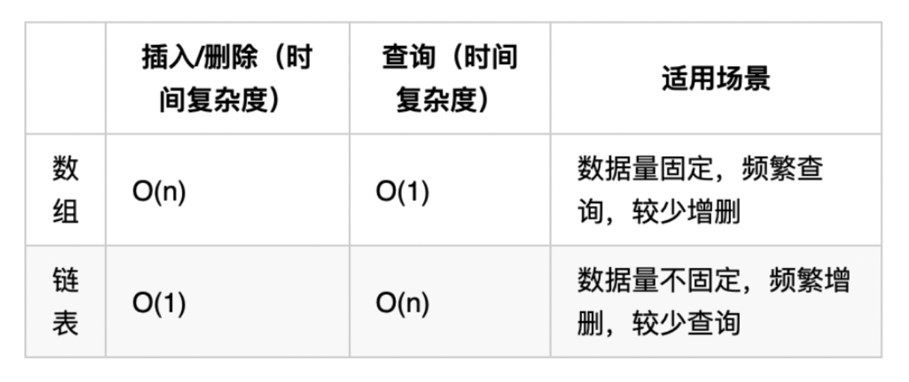

**这篇博客会记录自己学习算法是的思考以及相关学习资源**

## 数组
### 二分查找

给定一个 n 个元素**有序的**（升序）整型数组 nums 和一个目标值 target  ，写一个函数搜索 nums 中的 target，如果目标值存在返回下标，否则返回 -1。

```java
class Solution {
    public int search(int[] nums, int target) {
        int left = 0;
        int right = nums.length-1;
        // 定义左闭右闭区间
        while(left <= right)
        {
            int mid = left + ((right-left) >> 1); //不断更新寻找mid
            if(nums[mid] < target)
            {
                left = mid + 1;
            }
            else if(nums[mid] > target)
            {
                right = mid -1;
            }else{
                return mid;
            }
        }
        return -1;
    }
}
```

这个题目的细节在于

1. 对于区间的定义，循环不变量。 [left,right] 我们定义左闭右闭区间，在while 处就是<=,因为等于号是有意义的。相反[left,right)，就会是 < 因为right 不包括在区间内，所以不存在比较。
2. mid 一定是要定义在while 里面，这样就可以不断的计算mid
3. [left,right] 就是mid+1 和mid-1在对left 和right 更新时。因为前面的mid 已经包括在了区间内，我们需要再偏移一个元素。

**二分查找应用的前提是：1. 有序，2.元素不重复**

### 移除元素

给你一个数组 nums 和一个值 val，你需要 原地 移除所有数值等于 val 的元素，并返回移除后数组的新长度。
不要使用额外的数组空间，你必须仅使用 O(1) 额外空间并 原地 修改输入数组。
元素的顺序可以改变。你不需要考虑数组中超出新长度后面的元素。

```java
class Solution {
    public int removeElement(int[] nums, int val) {
        int slowIndex=0;
        for(int fastIndex=0; fastIndex<nums.length; fastIndex++)
        {
            if(nums[fastIndex] != val){
                nums[slowIndex] = nums[fastIndex];
                slowIndex++;
            }
        }
    }
}
```

使用快慢指针做两个for 循环的工作。快指针探索新的元素，慢指针决定新数组的下标。慢指针定义了一个左闭右开的区间，这个区间内不包含target。当fast 指向一个非target的值时，就将它复制给slow 指针。如果fast 指向target，那么这个值就不会放进slow 区间内，在后续的快慢指针数值交换的过程中被慢指针覆盖。

### 有序数组平方

给你一个按**非递减顺序** 排序的整数数组 nums，返回 每个数字的平方 组成的新数组，要求也按 非递减顺序 排序。
请你设计时间复杂度为 O(n) 的算法解决本问题

输入：nums = [-7,-3,2,3,11]
输出：[4,9,9,49,121]

```java
class Solution {
    public int[] sortedSquares(int[] nums) {

        int[] NewArray = new int[nums.length];
        int k = nums.length -1;
        int i,j;
        for(i=0,j=nums.length-1; i<=j; )
        {
            if(nums[i]*nums[i] > nums[j]*nums[j])
            {
                NewArray[k] = nums[i]*nums[i];
                i++;
            }else{
                NewArray[k] = nums[j]*nums[j];
                j--;
            }
            k--;
        }
        return NewArray;
    }
}

``` 
这个题目利用左右双指针的思路。首先一个包涵负数的生序数组，如果求平方，就会出现中间小两边大的情况。所以利用双指针，左右扫描。这里新建一个数组，从后往前放元素。

### 长度最小的子数组

给定一个含有 n 个正整数的数组和一个正整数 target 。

找出该数组中满足其和 ≥ target 的长度最小的 连续子数组 [numsl, numsl+1, ..., numsr-1, numsr] ，并返回其长度。如果不存在符合条件的子数组，返回 0 。

```
输入：target = 7, nums = [2,3,1,2,4,3]
输出：2
解释：子数组 [4,3] 是该条件下的长度最小的子数组。
```

我们是要发现一个新数组，它的元素之和大于等于target，它的长度最小。我们可以使用滑动窗口的思想。定义快慢指针，快指针不断的有一探索新的元素，慢指针不断右移获取最短子数组。慢指针移动时需要从数组和中间去慢指针位置上的数，并检查数组和是否仍然大于等于target。

**注：** 本题中使用滑动窗口主要确定一下三点

* 窗口内元素是什么？
* 如何移动窗口终止位置？
* 如何移动窗口起始位置？

```java
class Solution{
    public int minSubArrayLen(int target, int[] nums)
    {
        //
        int sum = 0;
        int result = Integer.MAX_VALUE;
        int subArrayLen = 0;
        int i=0;
        for(int j=0; j<nums.length; j++)
        {
            sum += nums[j];
            while(sum >= target)
            {
                sum -= nums[i];
                subArrayLen = j-i+1;
                result = Math.min(subArrayLen,result);
                i++;
            }
        }
        return result;
    }
}
```

### 螺旋矩阵

给你一个正整数 n ，生成一个包含 1 到 n2 所有元素，且元素按顺时针顺序螺旋排列的 n x n 正方形矩阵 matrix 。

这个问题涉及到定义循环不变量。我们定义[x,y) 左闭右开区间。还定义offset 偏移量，以及loop 这个会让我们确定有几个loop。

```java
class Solution {
    public int[][] generateMatrix(int n) {

        //loop invariant [x,y)
        int[][] result = new int[n][n];
        int startX=0;
        int startY=0;
        int offset = 1; //offset to the corner
        int loop = n/2;
        int mid = n/2;
        int count = 1; //record the number of loop run through
        int i,j;

        while(loop >= 0)
        {
            i=startX;
            j=startY;
            //left to right
            for(j=startY; j<n-offset; j++)
            {
                result[i][j] = count++;
            }
            //up to down on right
            for(i=startX; i<n-offset; i++)
            {
                result[i][j] = count++;
            }
            //right to left on down
            for(; j>startY; j--)
            {
                result[i][j] = count++;
            }
            //down to up on left
            for(; i>startX; i--)
            {
                result[i][j] = count++;
            }
            loop--;
            offset++;
            startX++;
            startY++;
        }
        if(n%2 == 1)
        {
            result[mid][mid]= count;
        }
        return result;
    }
}
```

## 链表
### 删除链表元素/ 虚拟头节点

给你一个链表的头节点 head 和一个整数 val ，请你删除链表中所有满足 Node.val == val 的节点，并返回 新的头节点 。
 
输入：head = [1,2,6,3,4,5,6], val = 6
输出：[1,2,3,4,5]

这个题目中我们需要注意，在检查链表中元素数值前，首先要检查这个节点是否存在。要有一个零时的节点作为head 的补充来获取更后面的节点。头节点是不能改的，我们需要current指针作为遍历的指针。

```java
class Solution{
    public ListNod removeElements(ListNode head, int val)
    {
        while(head != null && head.next == val)
        {
            head = head.next;
        }
        ListNode current = head;
        while(current != null && current.next != null) //当前与下一个节点都存在。如果第二个条件不符合就代表着当前节点是最后一个
        {
            if(current.next.val == val)
            {
                current.next = current.next.next;
            }else{
                current = current.next;
            }
        }
        return head;
    }
//虚拟头节点
        public ListNod removeElements2(ListNode head, int val)
    {
        ListNode dummyhead = new ListNode(0);
        dummyhead.next = head;
        ListNode current = dummyhead;

        while(current.next != null)
        {
            if(current.next.val == val)
            {
                current.next = current.next.next;
            }else{
                current = current.next;
            }
        }
        head = dummyhead.next;
        return head;
    }
}
```
这里我们要删除的是current 的下一个元素。实际上我们删除的方式，就是把current 的指针指向下一个的下一个，这样就删除了。所以while loop 的检查是current.next 不为空。在链表的题目中，我们需要注意的是空指针的问题。

### 实现链表增删操作


```java
class MyLinkedList {
    int size;
    ListNode head;

    public MyLinkedList() {
        size = 0;
        head = new ListNode(0);
    }

    public int get(int index) {
        if (index < 0 || index >= size) {
            return -1;
        }
        ListNode cur = head;
        for (int i = 0; i <= index; i++) {
            cur = cur.next;
        }
        return cur.val;
    }

    public void addAtHead(int val) {
        addAtIndex(0, val);
    }

    public void addAtTail(int val) {
        addAtIndex(size, val);
    }

    public void addAtIndex(int index, int val) {
        if (index > size) {
            return;
        }
        index = Math.max(0, index);
        size++;
        ListNode pred = head;
        for (int i = 0; i < index; i++) {
            pred = pred.next;
        }
        ListNode toAdd = new ListNode(val);
        toAdd.next = pred.next;
        pred.next = toAdd;
    }

    public void deleteAtIndex(int index) {
        if (index < 0 || index >= size) {
            return;
        }
        size--;
        ListNode pred = head;
        for (int i = 0; i < index; i++) {
            pred = pred.next;
        }
        pred.next = pred.next.next;
    }
}

class ListNode {
    int val;
    ListNode next;

    public ListNode(int val) {
        this.val = val;
    }
}
```

```java
class MyLinkedList {
    int size;
    ListNode head;

    public MyLinkedList() {
        size = 0;
        head = new ListNode(0);
    }
    
    public int get(int index) {
        if(index < 0 || index > this.size-1){
            return -1;
        }
        ListNode dummyhead = new ListNode(0);

        ListNode current = dummyhead.next;
        while(index > 0 )
        {
            current = current.next;
            index--;
        }
        return current.val;
    }
    
    public void addAtHead(int val) {
        ListNode dummyhead = new ListNode(0);
        dummyhead.next = head;
        ListNode newNode = new ListNode(val);
        newNode.next = head;
        dummyhead.next = newNode;
    }
    
    public void addAtTail(int val) {
        ListNode dummyhead = new ListNode(0);
        dummyhead.next = head;
        ListNode cur = dummyhead;
        ListNode newNode = new ListNode(val);

        while(cur.next != null)
        {
            cur = cur.next;
        }
        cur.next = newNode;
        this.size++;
    }
    
    public void addAtIndex(int index, int val) {
        if(index > size)
            return;
        ListNode newNode = new ListNode(val);
        ListNode current = dummyhead;

        while(index > 0)
        {
            current = current.next;
            index--;
        }
        newNode.next = curren.next;
        current.next = newNode;
        this.size++;
    }
    
    public void deleteAtIndex(int index) {
        ListNode dummyhead = new ListNode(0);
        ListNode current = dummyhead.next;
        dummyhead.next = head;

        while(index > 0)
        {
            current = current.next;
            index--;
        }
        current.next = null;

    }
}

class ListNode{
    int val;
    ListNode next;

    public void ListNode(int val)
    {
        this.val = val;
    }
}
```

### 反转链表

给定单链表的头节点 head ，请反转链表，并返回反转后的链表的头节点。

输入：head = [1,2,3,4,5]
输出：[5,4,3,2,1]

#### 双指针思路

双指针思路需要我们初始化当前节点，和前驱节点。pred 就是dummyhead，一开始是null，这也对应链表最后是null。
进入循环，直到current 为空。首先要存取 current.next 为 tmp，因为当我们之后对curernt.next 操作时，tmp 会
失去参考。之后就是current.next 指向 pred，current 赋给 pred，tmp 赋给 current。 最后当循环结束，让pred 成为head，因为current 当前为空指针。

```java
class Solution{
    pulic ListNode reverseList(ListNode head)
    {
        //双指针思路

        //初始化两个指针，当前指针与前驱指针
        ListNode pred = null;
        ListNode current = head;

        //当前指针是null 时，代表到达链表最后端
        while(current != null)
        {
            ListNode tmp = current.next; 
            current.next = pred; //前驱节点成为current.next
            pred = current;  //当前节点成为前驱节点
            current = tmp;  //临时节点成为
        }
        head = pred;
        return head;

    }
}
```

#### 递归法

递归法的思路其实与双指针类似，差别在于多定义了一个reverse 函数。其他的双指针初始化，都是一样的。我们通过递归的执行reverse，将链表反转。

```java
/**
 * Definition for singly-linked list.
 * public class ListNode {
 *     int val;
 *     ListNode next;
 *     ListNode() {}
 *     ListNode(int val) { this.val = val; }
 *     ListNode(int val, ListNode next) { this.val = val; this.next = next; }
 * }
 */
class Solution {
    public ListNode reverseList(ListNode head) {
    ListNode pred = null;
    ListNode curr = head;
    return reverse(curr, pred);        
}

public ListNode reverse(ListNode curr, ListNode pred)
{
    if(curr == null)
        return pred;
    ListNode tmp = curr.next;
    curr.next = pred;
    return reverse(tmp, curr);
}
}
```

### 两两交换链表

给你一个链表，两两交换其中相邻的节点，并返回交换后链表的头节点。你必须在不修改节点内部的值的情况下完成本题（即，只能进行节点交换）。

```
输入：head = [1,2,3,4]
输出：[2,1,4,3]

输入：head = []
输出：[]
```

``` java
class Solution{
    public ListNode swapParis(ListNode head)
    {
        ListNode dummyhead = new ListNode(0);
        dummyhead.next = head;
        ListNode current = dummyhead;
        ListNode firstNode, secondNode, tmp;

        while(current.next != null && current.next.next != null)
        {
            tmp = current.next.next.next;
            firstNode = current.next;
            secondNode = current.next.next;

            current.next = secondNode; //步骤一
            secondNode.next = firstNode; //步骤二
            firstNode.next = tmp //步骤三

            current = firstNode;
        }
        return dummyhead.next;
    }
}
```
为了更好的理解，我们初始化了三个变量firstNode, secondNode, tmp。循环条件，首先要写current.next 再写current.next.next 以避免空指针。因为current 是dummyhead，所以current不存在为空的现象。首先把第三个节点存储为tmp，再获取第一和第二个节点。先让current.next 指向第二个节点，再让第二个指向第一个，最后在让第一个指向第三个。此时第一个其实是第二个，因为他们互换了。这就是两两互换

### 删除链表的倒数第N个节点

给你一个链表，删除链表的倒数第 n 个结点，并且返回链表的头结点。
```
输入：head = [1,2,3,4,5], n = 2
输出：[1,2,3,5]
输入：head = [1,2], n = 1
输出：[1]
```

```java
class Solution{
    public ListNode removeNthFromEnd(ListNode head, int n)
    {
        ListNode dummhead = new ListNode(0);
        dummyhead.next = head;
        ListNode fast,slow = dummyhead;

        while(n>0 && fast !=null)
        {
            n--;
            fast = fast.next;
        }
        fast = fast.next;
        while(fast ! =null)
        {
            slow = slow.next;
            fast = fast.next;
        }
        slow.next= slow.next.next;
        return dummyhead.next;
    }
}
```

当我们要删除第n个节点时，我们需要获取n的前一个节点。所以我们需要把快指针在第一个循环之后再移动一下。先让快指针移动n次，就是为了让快慢指针之间的距离是n，当快指针移动到末端时，慢指针刚好指向倒数第n 个节点。本体的思路是先移动快指针n+1次，然后快慢指针同时移动至末端。最后慢指针删除下一个节点。


### 环形链表 2

给定一个链表的头节点  head ，返回链表开始入环的第一个节点。 如果链表无环，则返回 null。

如果链表中有某个节点，可以通过连续跟踪 next 指针再次到达，则链表中存在环。 为了表示给定链表中的环，评测系统内部使用整数 pos 来表示链表尾连接到链表中的位置（索引从 0 开始）。如果 pos 是 -1，则在该链表中没有环。注意：pos 不作为参数进行传递，仅仅是为了标识链表的实际情况。

不允许修改 链表。

```
输入：head = [3,2,0,-4], pos = 1
输出：返回索引为 1 的链表节点
解释：链表中有一个环，其尾部连接到第二个节点。

输入：head = [1,2], pos = 0
输出：返回索引为 0 的链表节点
解释：链表中有一个环，其尾部连接到第一个节点。

输入：head = [1], pos = -1
输出：返回 null
解释：链表中没有环。
```

```java
class Solution{
    public ListNode detectCycle(ListNode head)
    {
        //双指针思路
        ListNode fast = head;
        ListNode slow = head;

        while(fast != null && fast.next != null)
        {
            fast = fast.next.next;
            slow = slow.next;

            if(slow == fast)
            {
                ListNode index1 = head;
                ListNode index2 = fast;

                while(index1 != index2)
                {
                    index1 = index1.next;
                    index2 = index2.next;
                }
                return index1;
            }
        }
        return null;
    }
}
```

这一道题目首先涉及检查链表内是否有环，然后寻找环入口节点。

当我们让快指针每次移动两次，而慢指针每次移动一次，如果存在环，双指针就会相遇，否则不然。

在寻找环入口的时候，涉及到一些数学计算。x 是从头节点到环入口的距离，y 是从环入口到快慢指针相遇节点的距离，z是从相遇节点到环入口的距离。 y+z 等于环的长度。

$$
2(x+y) = x+y + n(y+z)
$$
$$
x = z 
$$
if z = 1.

当z >= 1 是拥有相同逻辑。我们需要。x=z 代表着从头节点到环入口的距离，和从相遇节点到环入口的距离相等，可以让两个指针同时从两处以相同速度出发，他们相遇的地方就是环入口。

### 链表总结



数组插入删除很贵，查询很便宜。链表插入删除很便宜，但查询很贵。

虚拟头节点的使用可以一体化的处理所有链表操作。我们要注意空指针异常，检查当前和下一个节点是否为空，这才循环中是很重要的一步。

## 哈希表

一般哈希问题都会用到三个数据结构
* 数组
* set
* map

如果要用最快的就用unordered set,如果要有序就用 ordered set

### 有效的字母异位词

给定两个字符串 s 和 t ，编写一个函数来判断 t 是否是 s 的字母异位词。

注意：若 s 和 t 中每个字符出现的次数都相同，则称 s 和 t 互为字母异位词。

```
输入: s = "anagram", t = "nagaram"
输出: true

输入: s = "rat", t = "car"
输出: false
```

这道题目我们用通过空间换时间的思路来解决问题。两个string 是否可以通过互换字母位置变为相等，最核心的点就是字母频率相等。通过使用一个数组记录两个string 字幕出现频率，就可以回答这个问题。如果遍历后，数组中的任何元素不为0，两个string 不可置换。

```java
class Solution {
    public boolean isAnagram(String s, String t) {
        int[] hashMap = new int[26];
        for(int i=0; i<s.length(); i++)
        {
            char a = s.charAt(i);
            hashMap[a - 'a']++; 
            // 在对应位置记录字母频率
        }

        for(int i=0; i<t.length(); i++)
        {
            char a = t.charAt(i);
            hashMap[a-'a']--;
        }

        for(int i=0; i<hashMap.length; i++)
        {
            if(hashMap[i]!= 0)
                return false;
        }
        return true;
    }
}
```

### 两个数组的交集

给定两个数组 nums1 和 nums2 ，返回 它们的交集 。输出结果中的每个元素一定是 唯一 的。我们可以 不考虑输出结果的顺序 。

```
输入：nums1 = [1,2,2,1], nums2 = [2,2]
输出：[2]

输入：nums1 = [4,9,5], nums2 = [9,4,9,8,4]
输出：[9,4]
解释：[4,9] 也是可通过的

1 <= nums1.length, nums2.length <= 1000
0 <= nums1[i], nums2[i] <= 1000
```

```java
import java.util.HashSet;
import java.util.Set;


class Solution {
    public int[] intersection(int[] nums1, int[] nums2)   
    {
        Set<Integer> hashSet = new HashSet<Integer>();
        Set<Integer> resultSet = new HashSet<Integer>();

        for(int i : nums1)
        {
            hashSet.add(i);
        }
        for(int i : nums2)
        {
            if(hashSet.contains(i))
            {
                resultSet.add(i);   
            }
        }
        int[] arr = new int[resultSet.size()];
        int j=0;
        for(int i : resultSet)
        {
            arr[j] = i;
            j++;
        }
        return arr;

    }
}
```

这个题目主要是要知道，正确的选择set数据结构。如果在没有数据范围的情况下，使用set可以很好的应对分散的数值情况而不浪费内存空间。但是有了范围，使用数组可以更快的解决。

定义两个set，第一个遍历记录数组1 的元素，然后遍历数组2，如果有重合的元素，再将该元素加入set2. 因为set 元素不重复，所以返回的数组是唯一且无序的。

### 两数之和
给定一个整数数组 nums 和一个整数目标值 target，请你在该数组中找出 和为目标值 target  的那 两个 整数，并返回它们的数组下标。
你可以假设每种输入只会对应一个答案。但是，数组中同一个元素在答案里不能重复出现。

你可以按任意顺序返回答案。

```java
import java.util.HashMap;
class Solution {
    public int[] twoSum(int[] nums, int target) {

        HashMap<Integer,Integer> map = new HashMap<>();
        int[] result = new int[2];


        for(int i=0; i<nums.length; i++)
        {
            int diff = target - nums[i];
            if(map.containsKey(diff))
            {
                result[0] = i;
                result[1] = map.get(diff);
                return result;
            }

            map.put(nums[i], i);
        }
        return result;
    }
}
```

### 三数之和

给你一个整数数组 nums ，判断是否存在三元组 [nums[i], nums[j], nums[k]] 满足 i != j、i != k 且 j != k ，同时还满足 nums[i] + nums[j] + nums[k] == 0 。请
你返回所有和为 0 且不重复的三元组。
注意：答案中不可以包含重复的三元组。

```
输入：nums = [-1,0,1,2,-1,-4]
输出：[[-1,-1,2],[-1,0,1]]
解释：
nums[0] + nums[1] + nums[2] = (-1) + 0 + 1 = 0 。
nums[1] + nums[2] + nums[4] = 0 + 1 + (-1) = 0 。
nums[0] + nums[3] + nums[4] = (-1) + 2 + (-1) = 0 。
不同的三元组是 [-1,0,1] 和 [-1,-1,2] 。
注意，输出的顺序和三元组的顺序并不重要。

输入：nums = [0,1,1]
输出：[]
解释：唯一可能的三元组和不为 0 。

输入：nums = [0,0,0]
输出：[[0,0,0]]
解释：唯一可能的三元组和为 0 。
```

```java
import java.util.ArrayList;
import java.util.Arrays;

class Solution {
    public List<List<Integer>> threeSum(int[] nums) {
        
        List<List<Integer>> result = new ArrayList<>();
        
        //对数组进行排序
        Arrays.sort(nums);

        for(int i=0; i<nums.length; i++)
        {
            //如果排序后第一个元素大于零，就代表不能找到和为0的三元组
            if(nums[i] > 0)
                return result;
            
            if(i>0 && nums[i]==nums[i-1])
                continue;
            
            int left = i+1;
            int right = nums.length-1;
            
            while(left < right)
            {
                int sum = nums[i] + nums[left] + nums[right];
                
                if(sum > 0)
                    right--;
                else if(sum < 0)
                    left++;
                else{
                    result.add(Arrays.asList(nums[i], nums[left], nums[right]));

                    //b and c 去重
                    while(left < right && nums[left]==nums[left+1]){
                        left++;
                    }
                    while(left < right && nums[right]==nums[right-1]){
                        right--;
                    }
                    // 找到答案时，双指针同时收缩
                    left++;
                    right--;
                }
            }
        }
        return result;
    }
}
```

这个题目不能使用哈希法的原因在于去重。哈希法的去重逻辑很复杂，在面试时容易出错。双指针的方法就可以有效避免很多错误。四数之和都可以用这样的双指针。用一个for 循环遍历i，然后在循环里面保持left 和 right 的双指针。如果i，left，right 上的数字相加小于0，就右移left。反之，则左移right。

这个题目中的一个重要步骤就是去重。对于abc 指针上的元素去重。对于a 的去重，要用i-1。同样，对于 left 和right 的去重，就是不等于他们的下一个元素。在这里就是left+1，right-1。如果是一样的话，那么这个指针给出的是一样的数字，就没有意义了。

### 四数之和

给你一个由 n 个整数组成的数组 nums ，和一个目标值 target 。请你找出并返回满足下述全部条件且不重复的四元组 [nums[a], nums[b], nums[c], nums[d]] （若两个四元组元素一一对应，则认为两个四元组重复）：

0 <= a, b, c, d < n
a、b、c 和 d 互不相同
nums[a] + nums[b] + nums[c] + nums[d] == target
你可以按 任意顺序 返回答案 。

```
输入：nums = [1,0,-1,0,-2,2], target = 0
输出：[[-2,-1,1,2],[-2,0,0,2],[-1,0,0,1]]

输入：nums = [2,2,2,2,2], target = 8
输出：[[2,2,2,2]]
```

```java
import java.util.ArrayList;
import java.util.Arrays;


class Solution {
    public List<List<Integer>> fourSum(int[] nums, int target) {
      List<List<Integer>> result = new ArrayList<>();
      Arrays.sort(nums);

      for(int k=0; k<nums.length; k++)
      {
          //k 剪枝
          if(nums[k] > target && target >= 0)
              break;
          //k 去重
          if(k>0 && nums[k] == nums[k-1])
              continue;
          for(int i=k+1; i<nums.length; i++)
          {
              //i 剪枝 nums[i] 大于0 就代表后面的数字单调递增，这就不会有target
              if(nums[k] + nums[i] > target && nums[i] > 0)
                  break;
              //i 去重
              if(i>k+1 && nums[i]==nums[i-1])
                  continue;

              new left = i+1;
              new right = nums.length-1;
              while(left < right)
              {
                  int sum = nums[k] + nums[i] + nums[left] + nums[right];
                  if(sum > target)
                    right--;
                  else if(sum < target)
                    left++;
                  else{
                          result.add(Arrays.asList(nums[k], nums[i], nums[left], nums[right]));
                          while(left < right && nums[left] == nums[left+1])
                              left++;
                          while(left < right && nums[right] == nums[right-1])
                              right--;

                          left++;
                          right--;                              
                      }
              }

          }
      }
      return result;
    }
}
```

这个题目的重点在于前两个指针的剪枝和去重逻辑。k指针指向的元素如果大于0，同时target 大于等于0，那就可以跳过，因为根据单调性就不会有满足target 的四元组。k 的去重和三数和相同。下一步进入二级剪枝 i 指针。i的剪枝，是检查nums[k] + nums[i] 是否大于0，同时 nums[i] > 0 这也是检查数组元素单调性的操作。


## 字符串

### 反转字符串2

给定一个字符串 s 和一个整数 k，从字符串开头算起，每计数至 2k 个字符，就反转这 2k 字符中的前 k 个字符。

如果剩余字符少于 k 个，则将剩余字符全部反转。
如果剩余字符小于 2k 但大于或等于 k 个，则反转前 k 个字符，其余字符保持原样。

```
输入：s = "abcdefg", k = 2
输出："bacdfeg"

输入：s = "abcd", k = 2
输出："bacd"
```

```java
class Solution {
    public String reverseStr(String s, int k) {

        char[] str = s.toCharArray();
        int length = str.length;

        for(int i=0; i<str.length; i += 2*k)
        {
            int left = i;

            //判断left + k -1 是否长于length
            int right = Math.min(length - 1, left + k - 1);

            while(left < right)
            {
                char tmp = str[left];
                str[left] = str[right];
                str[right] = tmp;

                left++;
                right--;
            }

        }
        return new String(str);
    }
}
```
这个题目的重点是怎样模拟复杂的规则。要判断当剩余部分不足k 或者超出k 但小于2k 是怎么操作。这里使用了一个min 函数选择两者之间的最小值。length-1 代表原数组长度， left+k-1 代表当前left 指针向右偏移k次的结果。如果前者大就代表当前还可以替换k个字母。如果后者大，那么就代表当前剩余字母不足k个，就把剩下的全部反转。如果有k个，就把前k个字母反转，如果不足就把剩下的反转。


### 替换空格
请实现一个函数，把字符串 s 中的每个空格替换成"%20"。

```
输入：s = "We are happy."
输出："We%20are%20happy."
```

```java
class Solution {
    public String replaceSpace(String s) {
        char[] charArray = s.toCharArray();
        int count = 0;
        for(char a : charArray)
        {
            if(a == ' ')
                count++;
        }
        //获取数组长度
        int oldSize = charArray.length;
        char[] newArray = new char[oldSize + 2*count];
        int left = charArray.length-1;
        int right = newArray.length-1;
        
        while(left >= 0)
        {
            if(charArray[left] == ' ')
            {
                newArray[right--] = '0';
                newArray[right--] = '2';
                newArray[right] = '%';
            }else{
            newArray[right] = charArray[left];

            }
            right--;
            left--;  
        }

        return new String(newArray);
    }
}
```

先扫描整个数组，寻找空格出现的次数。新建一个数组，长度是length + 两倍的空格出现频率。 使用双指针left 指向原数组的最后，right 指向新数组的最后。使用left遍历原数组，如果left 指向空格，就在新数组中写下 %20，right 指针向左移动2次。因为在if 里面指针只需要移动两次，在外面会统一的移动双指针。

### 反转字符串中的单词

给你一个字符串 s ，请你反转字符串中 单词 的顺序。

单词 是由非空格字符组成的字符串。s 中使用至少一个空格将字符串中的 单词 分隔开。

返回 单词 顺序颠倒且 单词 之间用单个空格连接的结果字符串。

注意：输入字符串 s中可能会存在前导空格、尾随空格或者单词间的多个空格。返回的结果字符串中，单词间应当仅用单个空格分隔，且不包含任何额外的空格。

```
输入：s = "the sky is blue"
输出："blue is sky the"
输入：s = "  hello world  "
输出："world hello"
解释：反转后的字符串中不能存在前导空格和尾随空格。
输入：s = "a good   example"
输出："example good a"
解释：如果两个单词间有多余的空格，反转后的字符串需要将单词间的空格减少到仅有一个。
```

```java
class Solution {
    // reverse the string 
    // reverse every word
    // remove spaces
    public String reverseWords(String s) {

        char[] str =s.toCharArray();
        int left =  0;     
        //remove extra spaces
        str = removeSpace(str);


        // reverse the string
        reverseString(str, left, str.length-1);


        // reverse words
        reverseSingleWord(str);
       System.out.println(str);

        return new String(str);

    }

    public void reverseString(char[] str, int left, int right)
    {
        if (right >= str.length)
        {
            System.out.println("set a wrong right");
            return;
        }
        while(left < right)
        {

            str[left] ^= str[right];
            str[right] ^= str[left];
            str[left] ^= str[right];

            left++;
            right--;
        }
    }

    public void reverseSingleWord(char[] str)
    {
        int slow = 0;

        // <= 是这里的一个关键。因为在下面reverseString 函数使用的是 fast < str.length
        // 如果这里也是用 <  那就会有最后一个字母漏掉。
        for(int fast=0; fast <= str.length; fast++)
        {
            //处理过的string，每次遇到space 就是一个单词结束
            if(fast == str.length || str[fast] == ' ')
            {
                reverseString(str, slow, fast - 1);
                slow = fast+1;
            }

        }
    }

    public char[] removeSpace(char[] str)
    {
        int slow = 0;
        for(int fast=0; fast<str.length; fast++)
        {
            if(str[fast] != ' ')
            {
                //开头不需要空格,再用slow 加空格
                if(slow != 0)
                {
                    str[slow++] = ' ';
                }
                //fast 遇到空格或遍历到字符串末尾，就证明遍历完一个单词了
                while(fast < str.length && str[fast] != ' ')
                {
                    str[slow++] = str[fast++];
                }
            }

        }

        //相当于 c++ 里的 resize()
        char[] newChars = new char[slow];
        System.arraycopy(str, 0, newChars, 0, slow); 
        return newChars;
    }´
}
```

这个题目要处理的细节非常多。整体的思路是，首先将多余的空格去除，首尾中间的空格，再将字符串反转，再将每一个单词反转。

移除空格时，就像在数组中移除一个元素，这个元素是空格。fast 指针探索新元素，slow 指针定义一个左闭右开区间，其中没有不需要的空格。使用if 判断 fast 是否指向 ‘ ’，如果不是，再判断slow 是否是在最开始的位置，如果是就不需要加空格，如果不是就会在下面的while loop 开始之前添加一个空格。while loop 会不断地将fast 指向的字母传给slow。当while 结束之后fast 会结束当前的传递，因为会指向‘ ’，然后进入下一个for loop 循环。因为每次在while 中都会 slow++ and fast ++，所以slow 在结束时也会指向‘ ’ 。但是这是中间可能你会有多个空格，所以fast 会不断遍历知道找到下一个非空格元素，从而进入第一个if。这时slow 因为不是0，代表这不是第一个单词了，所以单词之间要有一个空格，所以给slow 赋一个空格，然后再开始下一次的while loop。在最后返回一个新的char【】因为原有的长度和新的不一样。

之后的两不，反转字符串以及，反转单词都是


### 找出字符串中第一个匹配项的下标

给你一个字符串 s ，请你反转字符串中 单词 的顺序。
给你两个字符串 haystack 和 needle ，请你在 haystack 字符串中找出 needle 字符串的第一个匹配项的下标（下标从 0 开始）。如果 needle 不是 haystack 的一部分，则返回  -1 。

单词 是由非空格字符组成的字符串。s 中使用至少一个空格将字符串中的 单词 分隔开。
```
输入：haystack = "sadbutsad", needle = "sad"
输出：0
解释："sad" 在下标 0 和 6 处匹配。
第一个匹配项的下标是 0 ，所以返回 0 。


```java

class Solution {
    public int strStr(String haystack, String needle) {
        int j=-1; //j指向模式串起始位置，i指向文本出串起始位置。j 是-1，因为next从-1开始
        int[] next = new int[needle.length()];
        
        char[] haystackArray = haystack.toCharArray();
        char[] needleArray = needle.toCharArray();
        
        //构建next 数组
        getNext(next, needleArray);
        
        for(int i=0; i<haystackArray.length; i++)
        {
            while(j>=0 && haystackArray[i] != needleArray[j+1])
            {
                j = next[j];
            }

            if(haystackArray[i] == needleArray[j+1])
            {
                j++;
            }

            if(j == needleArray.length-1)
            {
                return i-needleArray.length+1; //
            }
        }
        return -1;
    }

    public void getNext(int[] next, char[] s )
    {
        //前缀表统一减一实现
        int j=-1; //j 指向前缀末尾
        next[0] = j;

        //i 指向后缀末尾

        for(int i=1; i<s.length; i++)
        {
            // i and j+1指向不同的字母
            while(j >= 0 && s[i] != s[j+1])
            {
                j = next[j]; //向前回退
            }
            //j+1 and i 指向相同的字母
            if(s[i] == s[j+1])
            {
                j++;
            }
            next[i] = j; //next 纪录最长前后缀的长度后缀的末端记录前缀末端的长度。这是最长前后缀子串相等的长度          
        }
    }
}
```

这个题目运用KMP 算法匹配字符串。答案由两部分组成。getNext 和 strStr 调用。

getNext 函数便利模式串，便利自己寻找前后缀最长子串。我们定义两个指针 i and j，j 指向前缀末尾，i指向后缀末尾。j=-1， 然后next 数组 next[0] = j。 i = 1，因为从第一个元素没有前后缀，所以从第二个元素开始遍历。

处理两个情况
1. s[i] != s[j+1]，通过使用while loop 不断回退。j = next[j]。这一个指令就会不断的往前寻找最长前后缀子串。如果没有匹配，j 就会回到最开始的地方 j=0。
2. s[i] == s[j+1], 双指针同时向后一位

最后将next[i] = j，就是把j 的长度赋给next 数组的第i 位。这个就是当之后匹配失败时，将作为参考回退到前后子串最长的情况。

strStr 函数调用getNext 函数构建next数组。同样定义两个指针i j。i 指向目标串的末尾，j 指向模式串的末尾。j=-1。

同样处理两种情况
1. s[i] != t[j+1]，这样就使用j=next[j]回退策略
2. s[i] == t[j+1] 双指针后移动一位。

在for loop 中判断，j 是否等于t.length -1，如果是就返回 i - t.length+1，也就是匹配子串开始的下标。

如果for loop 循环结束没有找到，return -1

### 重复的子字符串

```
输入: s = "abab"
输出: true
解释: 可由子串 "ab" 重复两次构成。

输入: s = "aba"
输出: false

输入: s = "abcabcabcabc"
输出: true
解释: 可由子串 "abc" 重复四次构成。 (或子串 "abcabc" 重复两次构成。)
```

```java
class Solution {
    public boolean repeatedSubstringPattern(String s) {

        char[] str = s.toCharArray();
        int[] next = new int[str.length];
        getNext(next, str);

        int len = next.length;        

        //不等于-1 代表有前后缀相等子串
        if(next[len-1] != -1 && len % (len - (next[len-1] + 1)) == 0)
        {
            return true;
        }
        return false;
    }

    public void getNext(int[] next, char[] s)
    {
        int j = -1;
        next[0] = j;
        for(int i = 1; i<next.length; i++)
        {
            while(j>=0 && s[i] != s[j+1])
            {
                j = next[j];
            }
            if(s[i] == s[j+1]){
                j++;
            }
            next[i] = j;
        }
    }
}
```

不被最长前后缀相等子串所包含的部分就是重复的子串，其原因在于，前缀不包含最后一个字母，后缀不包含第一个字母，这就意味着在字符串起始位置往后偏移几位的位置会成为最长相等前后缀子串的开始位置。同时前面不被包含的那一部分就会是重复子串。这里确定是否有重复子串的方式是通过取模判断字符串长度是否可以整除最长相等前后缀的长度与字符串长度之间的差而确定的。如果可以整除，就代表着字符串是由那个差构成。


## 栈与队列

### 用栈实现队列

请你仅使用两个栈实现先入先出队列。队列应当支持一般队列支持的所有操作（push、pop、peek、empty）：

实现 MyQueue 类：

void push(int x) 将元素 x 推到队列的末尾
int pop() 从队列的开头移除并返回元素
int peek() 返回队列开头的元素
boolean empty() 如果队列为空，返回 true ；否则，返回 false

```java
import java.util.Stack;


class MyQueue {

    Stack<Integer> stackIn;
    Stack<Integer> stackOut;


    public MyQueue() {
        stackIn = new Stack<>();
        stackOut = new Stack<>();
    }
    
    public void push(int x) {
        stackIn.push(x);
    }
    
    public int pop() {
        changeStack();
        return stackOut.pop();
    }
    
    public int peek() {

        if(stackOut.empty())
            changeStack();
        return stackOut.peek();
    }
    
    public boolean empty() {
        return stackIn.empty() && stackOut.empty();
    }

    public void changeStack()
    {
        if(!stackOut.empty())
            return;
        while(!stackIn.empty())
        {
            stackOut.push(stackIn.pop());
        }
    }
}

/**
 * Your MyQueue object will be instantiated and called as such:
 * MyQueue obj = new MyQueue();
 * obj.push(x);
 * int param_2 = obj.pop();
 * int param_3 = obj.peek();
 * boolean param_4 = obj.empty();
 */
```

### 用队列实现栈

请你仅使用两个队列实现一个后入先出（LIFO）的栈，并支持普通栈的全部四种操作（push、top、pop 和 empty）。

实现 MyStack 类：

void push(int x) 将元素 x 压入栈顶。
int pop() 移除并返回栈顶元素。
int top() 返回栈顶元素。
boolean empty() 如果栈是空的，返回 true ；否则，返回 false 。

```java
class MyStack {
    //q1作为主要的队列，其元素排列顺序和出栈顺序相同
    Queue<Integer> queue1 = new ArrayDeque<>();

    public MyStack() {

    }
    //在加入元素时先将q1中的元素依次出栈压入q2，然后将新加入的元素压入q1，再将q2中的元素依次出栈压入q1
    public void push(int x) {
        queue1.add(x);

        int size = queue1.size()-1;
        while(size > 0)
        {
            int tmp = queue1.poll();
            queue1.add(tmp);

            size--;
        }
    }

    public int pop() {

        return queue1.poll();
    }

    public int top() {
        return queue1.peek();
    }

    public boolean empty() {
        return queue1.isEmpty();
    }
}
```
这个题目主要就是在push函数上作准备。将最后一个进队列的元素一直移到第一个元素，从而形成stack 所需要的模式。当最后一个元素，成为下一个弹出的元素就会符合stack。


### 有效的括号
给定一个只包括 '('，')'，'{'，'}'，'['，']' 的字符串 s ，判断字符串是否有效。

有效字符串需满足：

左括号必须用相同类型的右括号闭合。
左括号必须以正确的顺序闭合。
每个右括号都有一个对应的相同类型的左括号。

```
输入：s = "()"
输出：true

输入：s = "()[]{}"
输出：true

输入：s = "(]"
输出：false
```

```java

class Solution {
    public boolean isValid(String s) {
        Stack<Character> stack = new Stack<>();

        char[] chars = s.toCharArray();
        for(int i=0; i<chars.length; i++)
        {
            if(chars[i] == '(')
                stack.push(')');
            else if(chars[i] == '{')
                stack.push('}');
            else if(chars[i] == '[')
               stack.push(']');
            else if(stack.empty() || stack.peek() != chars[i])
                return false;
            else
                stack.pop();
        }
        return stack.empty();
    }
}
```

这个题目处理括号有三种情况，左括号多，右括号多，括号不匹配。从左到右，遍历字符串。扫描到左括号，在stack 中添加对应的右括号。因为stack 先进后出的原则，括号的先后顺序可以解决。如果遍历没结束，stack 为空过就代表有多余的右括号，如果左括号扫描结束，开始右括号，就检查当前字符是否与stack.peek 匹配。如果不匹配就有问题。最后如果遍历结束，stack 不为空，这就代表着有多余的左括号。

stack 这个数据结构处理了先进后出的问题，在括号左右匹配问题上有所应用。


### 删除字符串中的所有相邻重复项

```java
class Solution {
    public String removeDuplicates(String s) {
        Stack<Character> stack = new Stack<>();

        char[] chars = s.toCharArray();

        for(int i=0; i<chars.length; i++)
        {
            if(!stack.empty() && chars[i] == stack.peek())
            {
                stack.pop();
            }else{
                stack.push(chars[i]);
            }
        }
        String str = "";
        while(!stack.empty())
        {
            str = stack.pop() + str;
        }

        return str;
    }
}
```

栈这个数据结构是否做相邻字符是否匹配，相邻字符运算之类的问题。

### 逆波兰表达式

给你一个字符串数组 tokens ，表示一个根据 逆波兰表示法 表示的算术表达式。

请你计算该表达式。返回一个表示表达式值的整数。

有效的算符为 '+'、'-'、'*' 和 '/' 。
每个操作数（运算对象）都可以是一个整数或者另一个表达式。
两个整数之间的除法总是 向零截断 。
表达式中不含除零运算。
输入是一个根据逆波兰表示法表示的算术表达式。
答案及所有中间计算结果可以用 32 位 整数表示。

```
输入：tokens = ["2","1","+","3","*"]
输出：9
解释：该算式转化为常见的中缀算术表达式为：((2 + 1) * 3) = 9

输入：tokens = ["4","13","5","/","+"]
输出：6
解释：该算式转化为常见的中缀算术表达式为：(4 + (13 / 5)) = 6
```

```java
class Solution {
    public int evalRPN(String[] tokens) {
        
        Stack<Integer> stack = new Stack<>();

        for(int i=0; i<tokens.length; i++)
        {

            if(tokens[i].equals("+") || tokens[i].equals("-") || tokens[i].equals("*")|| tokens[i].equals("/"))
            {
                if(tokens[i].equals("+"))
                {
                    int num1 = stack.pop();
                    int num2 = stack.pop();
                    stack.push(num2+num1);
                }else if(tokens[i].equals("-"))
                {
                    int num1 = stack.pop();
                    int num2 = stack.pop();
                    stack.push(num2-num1);
                }else if(tokens[i].equals("*"))
                {
                    int num1 = stack.pop();
                    int num2 = stack.pop();
                    stack.push(num2*num1);
                }else if(tokens[i].equals("/"))
                {
                    int num1 = stack.pop();
                    int num2 = stack.pop();
                    stack.push(num2/num1);
                }
            }else{
                int num = Integer.valueOf(tokens[i]);
                stack.push(num);
            }
        }
        return stack.pop();
    }
}
```

这个题目就是理解逆波兰表达式的后续遍历。每次遇到符号就弹出两个元素做运算，每次遇到数字就压进栈。

### 滑动窗口最大值

给你一个整数数组 nums，有一个大小为 k 的滑动窗口从数组的最左侧移动到数组的最右侧。你只可以看到在滑动窗口内的 k 个数字。滑动窗口每次只向右移动一位。

返回 滑动窗口中的最大值 。


```
输入：nums = [1,3,-1,-3,5,3,6,7], k = 3
输出：[3,3,5,5,6,7]
解释：
滑动窗口的位置                最大值
---------------               -----
[1  3  -1] -3  5  3  6  7       3
 1 [3  -1  -3] 5  3  6  7       3
 1  3 [-1  -3  5] 3  6  7       5
 1  3  -1 [-3  5  3] 6  7       5
 1  3  -1  -3 [5  3  6] 7       6
 1  3  -1  -3  5 [3  6  7]      7

输入：nums = [1], k = 1
输出：[1]
```

```java

class Solution {

    public class Myqueue{

        Deque<Integer> deque = new LinkedList<>();

        public void poll(int value){

            // 所有小于value 的值都已经弹出，除非等于否则不用再弹出
            if(!deque.isEmpty() && value == deque.peek())
                deque.poll();
        }

        public void add(int value)
        {
            //如果value 大于当前队列最大值，弹出所有元素队列元素，然后加入value
            while(!deque.isEmpty() && value > deque.peekLast())
                deque.pollLast();
            
            deque.add(value);
        }

        public int peek(){

            //返回当前单调队列最大值
            return deque.peek();
        }
    }
    public int[] maxSlidingWindow(int[] nums, int k) {
        Myqueue queue = new Myqueue();

        //储存结果
        int[] result = new int[nums.length - k + 1];
        int num = 0;

        for(int i=0; i<k; i++)
        {
            queue.add(nums[i]);
        }

        result[num++] = queue.peek();

        for(int i=k; i<nums.length; i++)
        {
            //先移除滑动窗空最左边的元素
            queue.poll(nums[i-k]);
            
            //添加新元素
            queue.add(nums[i]);

            result[num++] = queue.peek();
        }

        return result;
    }
}
```

这个题目使用单调队列解决。我们自行定义一个队列，pop 的时候如果当前值与队列出口值相等就弹出，否则忽略。忽略的原因是，在那之前，已经把那个值弹出了。 add 一个值时，如果如果队列出口的值小于就一直弹出。如果value 大于当前队尾，弹出队尾元素元素，直到对列为空或队尾大于value，然后加入value。这里维护的单调栈，让队列内元素单调递减。被弹出的元素如果不是之前的最大值，将不会被用于result 数组。如果窗口右移，同时弹出的元素是最大值，那么下一个元素就会是下一个窗口的最大值。这样设计的一个单调队列就可以维持一个窗口的最大值。

这里peek 直接返回最大值。

在maxSlidingWindow 中初始化一个 长为 length-k 的数组储存答案。现将前k个元素放进队列，再把当前最大值放进数组第一位。

遍历nums 数组，将最大值放进结果数组，弹出。

### 前 K 个高频元素

给你一个整数数组 nums 和一个整数 k ，请你返回其中出现频率前 k 高的元素。你可以按 任意顺序 返回答案。

```
输入: nums = [1,1,1,2,2,3], k = 2
输出: [1,2]

输入: nums = [1], k = 1
输出: [1]
```

```java
class Solution {
    public int[] topKFrequent(int[] nums, int k) {
        
        //将所有元素出现的频率放入map 中
        HashMap<Integer,Integer> map = new HashMap<>();

        for(int num: nums)
        {
            map.put(num, map.getOrDefault(num, 0)+1);
        }

        //使用min-heap 对k个元素进行排序。使用min-heap 是因为仅需要频率最高的k个元素。

        PriorityQueue<int[]> pq = new PriorityQueue<>((o1, o2) -> o1[1] - o2[1]); //定义小顶堆

        for(Map.Entry<Integer, Integer> entry: map.entrySet())
        {
            int num = entry.getKey();
            int count = entry.getValue();

            if(pq.size() == k)
            {
                if(count > pq.peek()[1])
                {
                    pq.poll();
                    pq.offer(new int[] {num, count});
                }
            }else{
                pq.offer(new int[] {num, count});
            }
        }
     int[] result = new int[k];

    for(int i=0; i<k; i++)
    {
        result[i] = pq.poll()[0];
    }   
    return result;
    }
}
```

这个题目首先使用map记录数字出现频率，然后使用min-heap 小顶堆存放map 里面的key。java 里使用priority queue，然后通过定义comparator 函数来定义 min-heap。

```
min-heap: PriorityQueue<>((o1,o2) -> o1[1] - o2[1])
max-heap: PriotyQueue<>((o1,o2) -> o2[1] - o1[1])
```


遍历map 里面的所有Entry，每一个entry 包含 (key,value)。获取这两个值。如果pq 的size 小于k就直接放入，如果大于k 就将当前count 的值与 pq 的peek 比较，如果后者大就忽略。如果前者大，就弹出peek 然后插入 {num, count} 进入pq。这里使用min-heap 的原因在于我们需要弹出堆中最不频繁出现的数字，如果当前的数字小于堆顶就弹出，反之则忽略。


## 二叉树

满二叉树：如果一棵二叉树只有度为0的结点和度为2的结点，并且度为0的结点在同一层上，则这棵二叉树为满二叉树。


完全二叉树的定义如下：在完全二叉树中，除了最底层节点可能没填满外，其余每层节点数都达到最大值，并且最下面一层的节点都集中在该层最左边的若干位置。若最底层为第 h 层（h从1开始），则该层包含 1~ 2^(h-1) 个节点。

前面介绍的树，都没有数值的，而二叉搜索树是有数值的了，二叉搜索树是一个有序树。

若它的左子树不空，则左子树上所有结点的值均小于它的根结点的值；
若它的右子树不空，则右子树上所有结点的值均大于它的根结点的值；
它的左、右子树也分别为二叉排序树

AVL（Adelson-Velsky and Landis）树，且具有以下性质：它是一棵空树或它的左右两个子树的高度差的绝对值不超过1，并且左右两个子树都是一棵平衡二叉树。

* 深度优先遍历
  * 前序遍历（递归法，迭代法）
  * 中序遍历（递归法，迭代法）
  * 后序遍历（递归法，迭代法）
广度优先遍历
  * 层次遍历（迭代法）


* 前序遍历：中左右
* 中序遍历：左中右
* 后序遍历：左右中

```java
public class TreeNode {
    int val;
    TreeNode left;
    TreeNode right;

    TreeNode() {}
    TreeNode(int val) { this.val = val; }
    TreeNode(int val, TreeNode left, TreeNode right) {
        this.val = val;
        this.left = left;
        this.right = right;
    }
}
```

## 二叉树遍历

递归框架：

1. 确定递归函数的参数和返回值： 确定哪些参数是递归的过程中需要处理的，那么就在递归函数里加上这个参数， 并且还要明确每次递归的返回值是什么进而确定递归函数的返回类型。

2. 确定终止条件： 写完了递归算法, 运行的时候，经常会遇到栈溢出的错误，就是没写终止条件或者终止条件写的不对，操作系统也是用一个栈的结构来保存每一层递归的信息，如果递归没有终止，操作系统的内存栈必然就会溢出。

3. 确定单层递归的逻辑： 确定每一层递归需要处理的信息。在这里也就会重复调用自己来实现递归的过程。

```java
class Solution {
    public List<Integer> preorderTraversal(TreeNode root) {
        List<Integer> list = new ArrayList<>();

        preorderTraversal(root, list);
        return list;
    }

    public void preorderTraversal(TreeNode root, List<Integer> list)
    {
        if(root == null)
            return;
        
        list.add(root.val);
        preorderTraversal(root.left, list);
        preorderTraversal(root.right, list);
    }
}

class Solution {
    public List<Integer> postorderTraversal(TreeNode root){
        
        List<Integer> list = new ArrayList<>();

        postorderTraversal(root, list);
        return list;
    }

    public void postorderTraversal(TreeNode root, List<Integer> list)
    {
        if(root == null)
            return;
        
        postorderTraversal(root.left, list);
        postorderTraversal(root.right, list);

        list.add(root.val);
    }
}

class Solution {
    public List<Integer> inorderTraversal(TreeNode root) {
        List<Integer> list = new ArrayList<>();

        inorderTraversal(root, list);

        return list;
    }

    public void inorderTraversal(TreeNode root, List<Integer> list)
    {
        if(root == null)
            return;
        
        inorderTraversal(root.left, list);

        list.add(root.val);

        inorderTraversal(root.right, list);

        
    }
}

```

### 迭代法遍历

使用stack 数据结构模拟树的遍历。

依次将root 放进stack，然后弹出处理，然后将右节点，然后左节点放入stack。根据先进后出的原则，stack 会先处理左节点从而符合前序遍历。

```java
class Solution {
    public List<Integer> preorderTraversal(TreeNode root) {
        List<Integer> list = new ArrayList<>();

        if(root == null)
            return list;
        
        Deque<TreeNode> stack = new LinkedList<>();
        stack.push(root);
        
        while(!stack.isEmpty())
        {
            TreeNode current = stack.pop();   

            list.add(current.val);

            if(current.right != null)
                stack.push(current.right);
            if(current.left != null)
                stack.push(current.left);
            
        }
        return list;
    }
}
```
后序遍历：
```java
class Solution {
    public List<Integer> preorderTraversal(TreeNode root) {
        List<Integer> list = new ArrayList<>();

        if(root == null)
            return list;
        
        Deque<TreeNode> stack = new LinkedList<>();
        stack.push(root);
        
        while(!stack.isEmpty())
        {
            TreeNode current = stack.pop();   

            list.add(current.val);

            if(current.right != null)
                stack.push(current.right);
            if(current.left != null)
                stack.push(current.left);
            
        }
        return list;
    }

}
```


 


