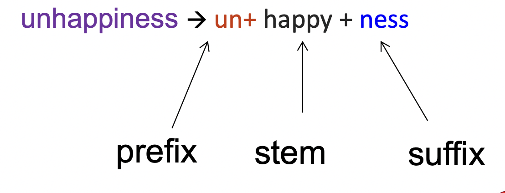
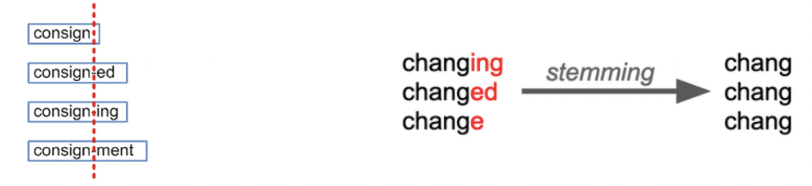
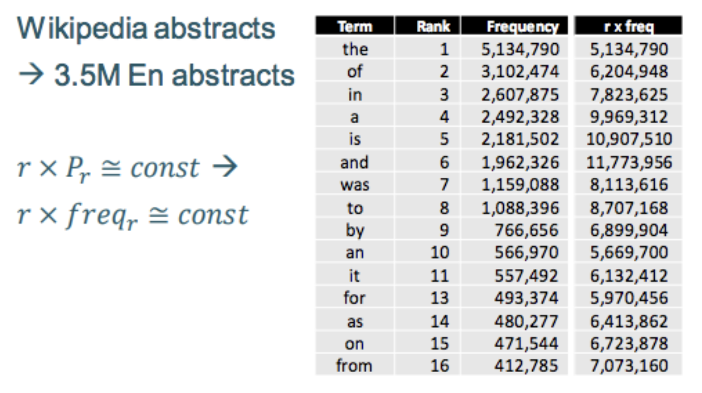

## Week 1

### Aims of NLP Course

* Explain the fundamental principles and the major challenges in processing large-scale natural language text.
* Demonstrate how the essential components of NLP systems are built and tuned
* Introduce some principal appplications of NLP
    * information extraction
    * text classification
    * spoken language processing

Necessary steps for *understanding* a piece of data represented by a language

* text mining
* text analytics
* computational linguistics

### Natural Language System

A lanuage processing application requies the **use of knowledge about human language**

* information retrieval: searching document
* document classification: sorting documents into categories
* question answering: short answer for a question
* text summarisation: summarise a set of documents
* sentiment analysis: product reviews, hate cirme detection
* machien translation:
* natural language generation
* authoring and markin tools: check spelling, grammar, style

### Challenges of NLP

* unstructured data
* variability: many ways to express the same thing
* ambibuity: different meanings of words and sentences
    * lexical ambiguity: a word with multiple part of speech tags
    * lexical-semantic ambiguity: a word with different senses
    * syntactic ambiguity: ambiguity coming from possible word groupings.

### Basic Linguistic concepts

* parts of speech (POS)
    * open class words: nouns, verbs, adjectives, adverbs
    * closed class words: pronouns, prepositions
* features/attributes
    * syntactic ambiguity

Syntactic ambiguity

* attachment ambiguity
* coordination ambiguity
* local ambiguity

### Corpus

a large collection of linguistic data

corpus can be 
* unannotated - raw text/speech
* annoated - enhanced with linguistic information

Annotaed (labelled) corpus: is a repository of explicit linguistic information

Annotation types

* grammatical
* semantic
* pragmatics
* combined

we need annotation for training and evaluation.

## Week2

*Question:* Do we know the natural language of the document?

### Dealing with Words: text pre-processing

#### Typical tokenisation steps

1. initial sementation: mostly on white-spaces
2. handinling abbreviations and apostrophes
3. handling hypehnations
4. dealing with other speicial expressions: emails, URLs, emoticons, numbers. 

**Tokenisation:** is the step, in which a sentence is broken down into small chunks of words.

#### Normalisation

* map tokens to normalised forms
    * {walsk, walked, walk}-> walk
* Two principal approaches
    * lemmatisation
    * Stemming
* Case Foldind: convert everything to lowercase
    * **Good** for collecting stas and behaviour of words
    * **Good** for seach engines: users usuallly use lowercase regardless of the correct case of words.
    * **Lose** the ability to identify entity names i.e. organisation names, or people names.

#### Lemmatisation

reduction to "dictionary headword" form (lemma)
    * examples:
        * {am, are, is}-> be
        * {horse, horses, horse's}-> horse
    * How to do lemmatisation
        * Distionary of word forms
            * dictionary look-up might be slow
            * what to do with words not in the dictionary

##### Morphological analysis (词根词缀分析)
        * morphemes: 词根词缀
        * morphemes: stem and affixes (prefix, suffix)

##### Stemming
        * chop "ends of words": remove suffixes, possibly prefixes。 去除前后缀，仅保留词根

Stemming erros:
* under-stemming fails to conflate related forms
    * divide -> divid
    * division -> divis
* over-stemming conflates unrelated forms
    * neutron, neutral 

##### Porter Stemmer

1. get rid of plurals and -ed or -ing suffixes
2. turn terminal y to i when there is another vowel in the stem
3. map double suffixes to single ones
4. deal with suffices, -full, -ness etc
5. take off -ant, -ence, etc
6. tidy up

Byte-Pair Encoding

* token learner: takes a row training corpus and induces a vocabulary
* token segmenter: takes a row test, input sentence and tokenizes it according to that vocabulary.

### N-Gram Language Models and Representations

**Model:** an abstract representation of sth. in computational form.

**Language Model:** a function that assigns a probability over a piece of text so that 'plural' pieces have a larger probability.

**BoW:** Bag of words representation: reduce each 

*Question:* 

* is the meaning lost without order?
* are all words equally important?
* would it work for all language?
* **Bow** is efficient

##### Frequency of Words

**Zipf's Law**: frequency of any word in a given collection is inversely proportional to its rank in the frequency table.

