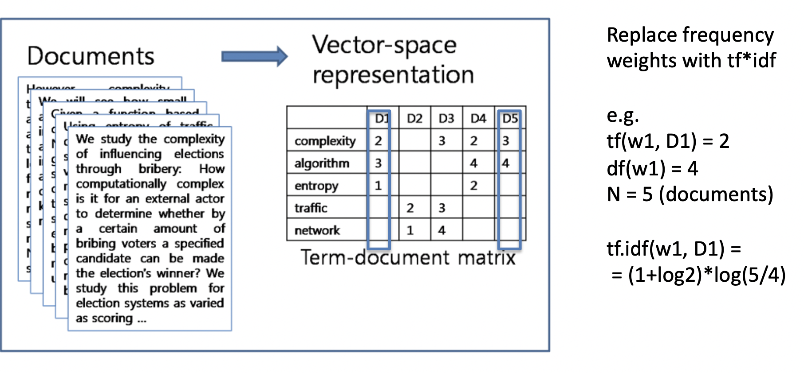
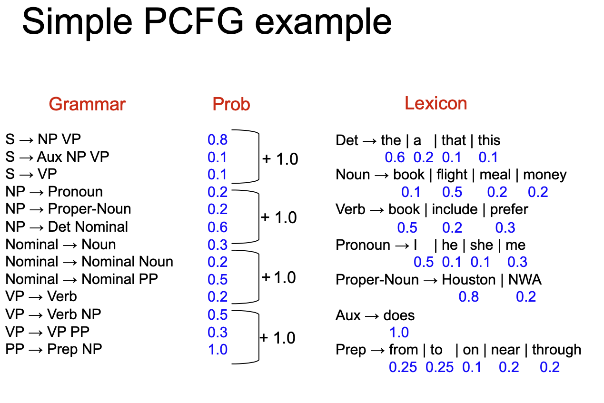
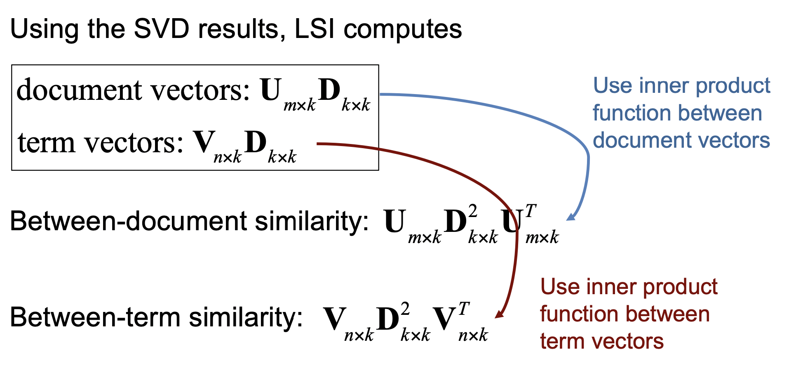
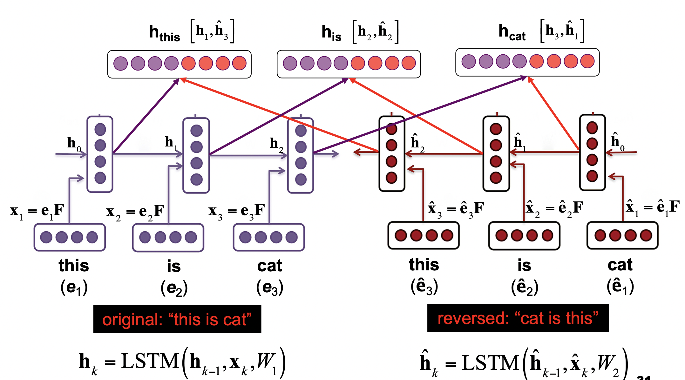
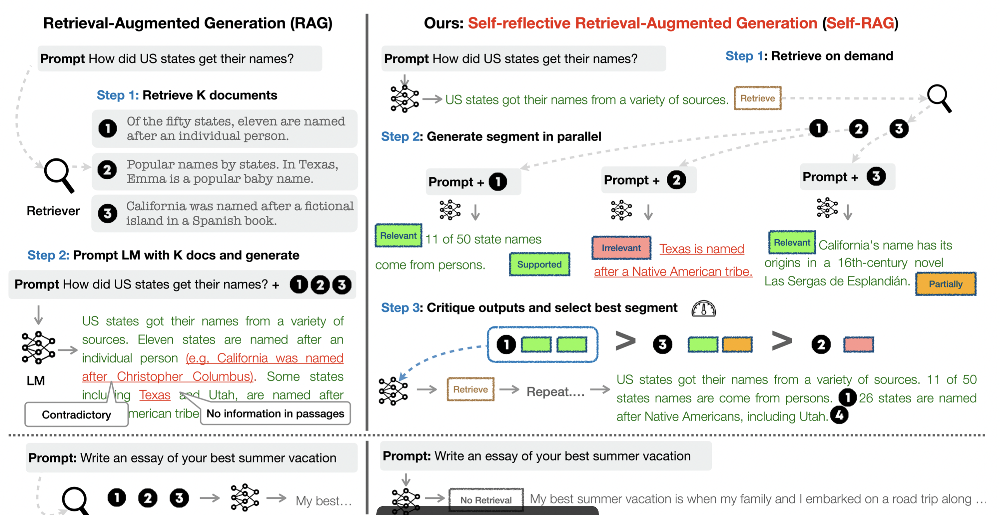

## Week 1

### Aims of NLP Course

* Explain the fundamental principles and the major challenges in processing large-scale natural language text.
* Demonstrate how the essential components of NLP systems are built and tuned
* Introduce some principal appplications of NLP
    * information extraction
    * text classification
    * spoken language processing

Necessary steps for *understanding* a piece of data represented by a language

* text mining
* text analytics
* computational linguistics

### Natural Language System

A lanuage processing application requies the **use of knowledge about human language**

* information retrieval: searching document
* document classification: sorting documents into categories
* question answering: short answer for a question
* text summarisation: summarise a set of documents
* sentiment analysis: product reviews, hate cirme detection
* machien translation:
* natural language generation
* authoring and markin tools: check spelling, grammar, style

### Challenges of NLP

* unstructured data
* variability: many ways to express the same thing （多义性）
* ambibuity: different meanings of words and sentences （模糊性）
    * lexical ambiguity: a word with multiple part of speech tags (一个单词可以做名词也可以做动词)
    * lexical-semantic ambiguity: a word with different senses （一个单词可以有多个意思）
    * syntactic ambiguity: ambiguity coming from possible word groupings. （单词有不同的组合方式）
* special expressions: idioms, proversb, irony
* context interpretation
* spoken language: non-verval communication
* size: large scale

### Basic Linguistic concepts

* parts of speech (POS)
    * open class words: nouns, verbs, adjectives, adverbs
    * closed class words: pronouns, prepositions
* features/attributes
    * syntactic ambiguity

Syntactic ambiguity

* attachment ambiguity: I saw the girl with the telescope
* coordination ambiguity: Old men and women
* local ambiguity

### Language resoruces

* dictionaries of words or phrases
    * with meaning, WordNet
    * with pronunciation
    * with waht goes with what
* collections of texts or speech (corpora)
    * language in use
    * examples of sentences, documents, conversations

### Corpus

a large collection of linguistic data

corpus can be 
* unannotated - raw text/speech
* annoated - enhanced with linguistic information

Annotaed (labelled) corpus: is a repository of explicit linguistic information

Annotation types

* grammatical: POS tags, noun/verb phrases
* semantic: person, drug
* pragmatics: language in use
* combined

we need annotation for training and evaluation.

#### Corpus annotation

* training:
    * train linguists, language learners
    * researchers
    * nlp develpment: use ML/statistics to learn patterns from an annotated corpus
* NLP evaluation:
    * compare NLP results with a manually coded "gold standard"

* cost of *manual* annotation is huge
* quality of annotation: 
    * do people agree on annotations?
    * how consistent can human are?

## Week2

*Question:* Do we know the natural language of the document?

Goal: break input into basic units of text = tokens

### Dealing with Words: text pre-processing

#### Typical tokenisation steps

1. initial sementation: mostly on white-spaces
2. handinling abbreviations and apostrophes
3. handling hypehnations
4. dealing with other speicial expressions: emails, URLs, emoticons, numbers. 

**Tokenisation:** is the step, in which a sentence is broken down into small chunks of words.

* tokenisation is the first step, and it affect the rest of NLP system
* traditinoal NLP use simple word-like tokenisation
* modern NLP uses more with sub-word tokenisation
Tokenisation is to know where to split *not* where to combine.

#### Normalisation

* map tokens to normalised forms
    * {walsk, walked, walk}-> walk
* Two principal approaches
    * lemmatisation
    * Stemming
* Case Foldind: convert everything to lowercase
    * **Good** for collecting stas and behaviour of words
    * **Good** for seach engines: users usuallly use lowercase regardless of the correct case of words.
    * **Lose** the ability to identify entity names i.e. organisation names, or people names.

#### Lemmatisation

reduction to "dictionary headword" form (lemma)

* examples:
    * {am, are, is}-> be
    * {horse, horses, horse's}-> horse
* How to do lemmatisation
    * Distionary of word forms
        * dictionary look-up might be slow
        * what to do with words not in the dictionary

##### Morphological analysis (词根词缀分析)

* morphemes: 词根词缀
* morphemes: stem and affixes (prefix, suffix)

##### Stemming

* chop "ends of words": remove suffixes, possibly prefixes。 去除前后缀，仅保留词根

Stemming erros:

* under-stemming fails to conflate related forms
    * divide -> divid
    * division -> divis
    * 删除的不够，导致相关的形式没有被整合起来
* over-stemming conflates unrelated forms
    * neutron, neutral 
    * 删除太多整合不相关的形式

##### Porter Stemmer

* focus on suffix stripping
* rules-based: implement specific patterns 

1. get rid of plurals and -ed or -ing suffixes
2. turn terminal y to i when there is another vowel in the stem
3. map double suffixes to single ones
4. deal with suffices, -full, -ness etc
5. take off -ant, -ence, etc
6. tidy up

Byte-Pair Encoding

* token learner: takes a row training corpus and induces a vocabulary
* token segmenter: takes a row test, input sentence and tokenizes it according to that vocabulary.

Repeat
* choose the two symbols that are most frequently adjacent in he training corpus (say 'A', 'B')
* ad a new merged symbol 'AB' to the vocabulary
* replace every adacent 'A' 'B' in the corpus with 'AB'

Split every word into individual character, and based on the frequency of co-occurance we merge these characters.

### BoW representation

Questions:

* is the meaning lost without order?
* what about negations
* are all words equally important
* is the meaning lost without context? ambiguities
* would it work for all languagesd

* use all words: or skip stpo words (the, and, of,...)
* do we need to 'rank' them, i.e. give weights to more important terms

Zipf's Law: the importance of a word is inversely proportional to its rank in the frequency table

Luhn's hypothesis: the words exceeding the upper cut-off are considered to be common. Those below the lower cut-off are rare

### Language Modelling

An language model = a function that assigns a probability over a piece of text so that 'natural' pieces have a larger probability.

### N-Gram Language Models and Representations

**Model:** an abstract representation of sth. in computational form.

**Language Model:** a function that assigns a probability over a piece of text so that 'plural' pieces have a larger probability.

**BoW:** Bag of words representation: reduce each 

*Question:* 

* is the meaning lost without order?
* are all words equally important?
* would it work for all language?
* **Bow** is efficient

##### Frequency of Words

**Zipf's Law**: frequency of any word in a given collection is inversely proportional to its rank in the frequency table.

##### Luhn's hypothesis

The words excedding the upper cut-off ar econsidered to be common.

Those below the lower cut-off rare, and therefore not contributig significantly to the content of the article.

#### Removing stop words

Highly frequently occuring words have low distingguishing power for representing documents

* i.e the ,and , of, it
* these words could be filtered.

#### Vector Representation

Vector representation is a way to implement the BoW model.

* Each document is represented |V| dimensional vector

#### Term-Document Matrix

#### Inverse Document Frequency

$$idf_t = log_{10}(\frac{N}{df_t})$$

df_t is the number of documents tht contain term t

**tf.idf**: the weight of a term is the product of its tf weight and its idf weight

$$tf.idf_{t,d} = (1+log_{10})\times(log_{10}(\frac{N}{df_t}))$$

**Question**: how to get more dense models? Now we only have sparse models.

#### Probabilistic Language Models

A *language model*(LM) meansures the probability of natural langauge utterances, giving higher scores to those that are more common, more grammatical, more "natural"

#### n-gram Language Model

n-tram: a contiguous sequence of n words from a given sequence of text.

consider the sequence

$$S = w_1 w_2 ... w_n$$

#### Unigram model

We assume independently and identically distributed (iid) of each other.

the unigram model does not model words orders

#### Chain Rule in Probability Theory

$$p(S)=p(the)\times p(cat|the)\times p(in|the, cat) \times p(the | the,cat, in) \times p(hat| the, cat, in, the) $$

$$p(w_1, w_2, ... w_L) = p(w_1) \times p(w_2|w_1) ... p(w_L| w_1,w_2,..., w_{L-1}) = \prod_{k=1}^L p(w_k|w_1,w_2,...,w_{k-1})$$

$$p(w_{1:L}) = \prod_{k=1}^L p (w_k|w_{k-N+1:k-1}) = \prod_{k=1}^L p(w_k|w_{k-1})$$

For example

Bigram model corresponds to Markov chain. It assumes that a state depends only on its previous state not on the other events that occurred before it.

A **Tri-gram** model takes care of previous two states, and a **N-gram** model takes care of previous N-1 states.

How to estimate the N-gram conditional probabilityusing a training corpus

* using statistical models such as hidden markov model
* using a ML model

##### Count based estimation

here we count the count the co-occurance of word w_k with w_k-1 over the occurance of word w_k-1. This proportion can estimate the N-gram probability.

N-gram model is **generative**. 

#### Evaluation: How good is our model

* extrinsic evaluation of LM
    * put each model in a task: spelling corrector, speech rcognizer
    * run the task, get an accuracy for A and B models
    * ocmpare accuracy for A and B
    * not easy and time consuming

* intrinsic evaluation of LMs
    * the best language model is one that best predicts an unseen test set.
    * gives best probabilityies for test set
    * *But* it doesn't tell us how usefulthe model is
    
**Note**: The problem of N-gram models is over-fitting. For unseen example, it provides unreliable prediction.

##### Maximum Likelihood Estimates

maximizes the likelihodd of the training set T given the model M

#### Smoothing

Laplace smoothing

##### Backoff and Interpolation

* sometimes it helps to use less context. Condition on less context for contexts you haven't learned much.
* Backoff: 
    * use *trigram* if you hve good evidence
    * otherwise bigram, otherwise unigram
* Interpolation:
    * mix unigram, bigram, trigram

interpolation gives variable N-gram weights. This idea is similar to numerical analysis in math.

## Week 3

### Part of Speech

**POS**: a linguistic category of words, which i generally defined by their syntactic or morphological behaviour

POS expalin how words are used.

* open word classes constanty acquire new members
* closed word classes generally do not acquire new members.
* content words: (lexical wods) are words that cary the content or the meaning of a sentence
    * includes nouns, verbs, adjectives and most adverbs
    * open class words
* function words: are words that have little lexical meaning, but instead serve to express gramatical relationships with other words or the speaker's mood.
    * prepositions(from), pronouns(you), auxiliary verbs(can), conjunctions(or), articles(a)

### Part of Speech Tagging

* POS tagging - assigning a part of speech to each words in a corpus

* input: a sequence of words
* output: tag for each word

* **Main issue**: same word form can have different POS tags depending on the context.
* the main task of POS tagging is to resolve lexical ambiguities given the context.

#### POS tag Prediction

internal cues: morphology(on particular affixes) can be used to guess POS of unkown words.

external cues: POS tags can be predicted using (limited amount of) context.

#### Types of POS taggers

* Rule-based taggers: involve a large set of hand-written rules
* stochastic taggers: resolve ambiguities by using a training dataset to estimate the probability of given word having a given POS in a given context.
* transformation taggers: 
    * shares features from both architectures
    * rules are automatically induced from a previously tagged training dataset.

##### Rules-Based POS Tagging

* start with a dictionary
* assign all possible tags to words from the dictionary/vocab
    * need tags for all words
    * what to do with out of vocab. words? (这意味着OOV单词怎样处理是一个问题)
* apply rules to selectively remove tags, leaving the correct tag for each word.

##### Stochastic POS tagging

* what i the best sequence of tags that corresponds to this sequence of words?
* out of this universe of sequences, choose the tag sequence which is most probable given the sequence of words
* **We need an POS-annotated corpus**.

Estimate p(t_i|t_i-1) by counting

$$ 
    P(t_i|t_{i-1}) = \frac{C(t_{i-1},t_i)}{C(t_{i-1})}
$$

$$
P(NN|DT) = \frac{C(DT,NN)}{C(DT)} = \frac{56,509}{116,454}
$$

Word likelihood probabilities

* given tag t_i, how likely is that the corresponding word is w_i

$$
P(w_i|t_i) = \frac{C(t_i, w_i)}{C(t_i)}
$$

$$
P(is|VBZ) = \frac{VBZ, is}{C(VBZ)} = \frac{10,073}{21,627} = 0.47
$$

##### Transformation-based Learning

* transformation-based learning(TBL)
    * start with simple solution to the problem
    * iteration: apply transformation to get best results,
    * stop when no more improvement can be made
* Rules for transformation are automatically induced from the training data

* at the start, each word is tagged with its most likely tag
* but erros will appear
* learn *transformations* (rules) that correct errors from tagged data

* learn a rule based on the training data that specifies change the tag from NN to VB if the preceding word is modal (MD)

Brill POS tagger: tagging

* once rules/transformation are learnt
* apply the initial tagging (most frequent POS tags)
* apply re-write rules based on the trainnig data

##### POS Evaluation

* Accuracy: how many tags did we get right? typically, accuracy 96-99%
* Overall Error Rate: 
    * err rates on particular tags
    * err rates on particular words
    * tag confusions

### Chunking

How do we move from individual words to ind groups of words that have specific grammatical roles.

Nound Phrase: (NP) is a phrase (sequence of words) that has a noun(as it head) and perorms the same grammatical function as that noun.

* This sentence contains two noun phrases

Verb Phrase: (VP) is a syntactic unit composed of at least one verb and its dependents.

**head**: the central noun of a NP

#### Noun phrase structure

#### NP-determiners

NP can start with determiners

Determiners can be

* simple lexical items: the, this, a ,an, etc
* or simple possessives: Alex's
* complex recrsive version of that: Ale's sistem's husband's son's car

#### NP-Nominals

follows after determiners

* Nominals: contains the head and any pre- and post- modifers of the head
* Pre-modifiers:
    * quantifiers: three cars
    * adjecives: large, small
    * ordering pre-modifers: three large cars,
* Post-modifiers
    * prepositional phrases: from Seattle
    * non-finites clauses (arring before noon)
    * relateive clauses( that serve rekfast)

You are not expected to know all these specific rules and sub-types, but rather the idea/need to have pre- and post-modifiers, and to appreciate their complexity, even for a relatively ‘simple’ concept as a noun phrase

#### Verb Phrase

VPs consist of a head verb along with 0 or more following consitituentswhich we call *arguments*.

#### Subcategorisation

Treebanks: pay liguiss to annotate real sentences with parse trees. Then use the annotated data to learn the rules.

#### Treebanks

treebanks are corpora in which each sentence has been paired with a parse tree.

* The idea is that instead of paying linguists to write a grammar, pay them to annotate real sentences with parse df

#### Probabilistic CFG

Create a probabilistic version of a CFG where each production rule has a probability.

* Each rule A -> a is assigned a probability P(a|A)
    * the sum over all expnsions of A must equal 1
* Easiest way to create a PCFG from a treebank:
    * use maximum likeliood expectation (MLE)
    * count all occurrences of A -> a in the treeback
    * Divid by the count of all rules whose LHS is A to get P(a|A)
* chunking is probabilistic, where production probabilities are used to non-determinsitically select a roduction for rewriting a given non-terminal.

#### NLP Piepline

## Week 4 Word Senses

* word sense refers to one of the meanings of a word in linguistics
* **Word Sense Disambiguation (WSD)** is an NLP task of selecting which sense of a word is used in a given piece of text from a set of multiple known possibilities (sense candidates)

### WSD Applications

* machine translation: lexical choices for words that need different translations for different senses
* search engines

### Two typical types of WSD approaches

* use external lexical resources: dictionaries, thesaurus
* supervised machine learning approaches

### Simplified Lesk Algorithm

* it examines overlap between sense difinition of a word and its current context. (This definition studies the **overlap** meaning of sense defintion and its current context, which tells how the sense definition match the **context**)

* retrive from the dictionary al sense definitions of the word to be disambiguated
* calculate the overlap between each sense definition and the current context.
* choose the sense that leads to the highest overlap.

### Corpus + Lesk Approach

$$
score = \sum_{w\in I}idf_w
$$

I is the set of overlapping words between the target sentence and sense definition.

idf means the inverse document frequency to weigh down the words appearing in every document.

$$
idf_w = log(\frac{the\space total \space number\space of\space document}{the \space number\space of\space documnts\space containig\space the \space word\space  w})
$$

### Naive Bayes Classifier for WSD

Calculate the join probability P(x,y) of observing an input sample x and a sense class y

p("line, guitar, jazz, jazz", bass1)
= p(bass1) * p("line, guitar, jazz, jazz"|bass1)
= p(bass1) * p("line"|bass1) * p("guitar"|bass1) * p("jazz"|bass1) * p("jazz"|bass1)

### WSD as Sequence Labeling

* Sequence labeling is the task of assiging a sequence of labels to a sequence of words (tokens, observations)

## Distriutional Semantic Model

* Basic idea:
    * generate a **multi-dimensional** feature vector to characterise the meaning of the linguistic item. 使用一个高维特征向量来描述一个语言实体。
    * subsequently, the semantic similarity between the linguistic items can be quantified in terms of vector similarity, using measures like **cosine** or **inner product** between vectors.

* linguistic items include, words, sub-words, phrases, text pieces (windows of words) sentences, documents

#### Distributional hypothesis: 

It suggests that one can infer the meaning of a word just by looking at the context it occurs in. 仅仅通过上下文就可以推理一个单词的意义。

#### Distributional semantics

Assumes that contextual information alone consititues a viable representation of linguistic items, in contrast to formal linguistics and the formal theory of grammar。 

假设上下文信息构成了一个描述语言实体的有效表征。

### Distributional semantics models to introduce

* simplest: vector space model (VSM)
    * docuent term matrix：term 单词在文本中出现的次数
    * term-context occurrence matrix: term 单词与vocab 中的单词同时在window 中出现的次数
* classical: latent semantic indexing
* commonly used: word2vec and GloVe
* Advanced: based on neural language models 

#### Sparse vs Dense Models

* VSM generate high-dimensional sparse word vectors

#### Laten Semantic Indexing (LSI)

LSI is a classical method for learning a low dimensional dense representation from a document term matrix

* Mathmatically, LSI is a singular value decomposition

#### Predictive

Calculate the word embedding by performing prediction tasks formulated based on the word co-occurrence information.

1. Define your context
2. Define your prediction task to predict

* whether a word appears in a context of a targeted word (word2vec)
* how many times a word appears in the context text of a targeted word (GloVe)

##### Word2Vec

##### GloVe

Given a semantic space what next?

* clustering: grouping similar words
* data visualisation: mapping the semantic space to a two dimensinoal space
* support other NLP tasks: to be used as the input of machine learning models, NN for solving NLP tasks.

#### Pros and Cons

* Pros: 
    * very practical in terms of processing
    * effective in capturing word meaning and relations, and support the training of neural language models
* Cons: 
    * Not sure whether statistical co-occurrences along are enough to address deeper semantic questions
    * semantic similarity is a vague notion.
    * what type of semantic information can be captured from context, and what part of the meaning of words remains unreachable without complementary knowledge.

## Week 5

Deep Learning Tasks

* sequence distribution: Model probability distribution of a sequence 。模拟序列分布

$$
p(x_k|x_1,x_2,...,x_{k-1}) \space or \space p(x_1,x_2,...,x_{k-1, k_k})
$$

* sequence classification: to learn a representation vector of a sequence, and use it to classify the sequence. 序列分类

* sequence labelling: to learn a representation vector for each state in a sequence, and use it to predict the class label for each state. 序列标注，为每一个序列中的状态学习到一个向量
    * POS tagging is a sequence labelling

* seq2seq learning: to encode information in an input sequence (seq), and decode it to generate an output sequence(2seq) $$f(x_1 \rarr x_2 \rarr ... \rarr x_k) = y_1 \rarr y_2 \rarr ... y_{k-1} \rarr y_k $$

### Basic NN Architecture

### Recurrent Neural Network

RNNs are good at capturing data patterns and encoding information in sequential data

* input feature can be extracted from a feature extractor i.e e_1 or word vector, or hidden features

RNN uses the input x1 with one previous learned hidden representation to form the current state. The current state will be used as hidden representation for the next state.

h3 表征向量编码了由前三个

#### Vanishing Gradient: 

* if the numbers in the gradients matrix are very small for long distance past states, then they don't contribute to the learning of correct weights

weight 矩阵怎样会收敛？

#### LSTM

#### Gate Recurrent Units

### RNN-Based Tagging Model

#### POS Tagging

POS tagging 将每个单词转化为hidden representation h, 然后对这个这个h 进行clasification。 sequence labelling task

#### Seq2Seq Model

通过使用encoder从一个sequence，在用decoder 一个个把h 转化为结果

### Advanced RNN Architectures

#### Bi-Directinoal RNN

use two RNN computed using the original and the reversed sequences as the input.

* benefit: takes care of both left and right context, as the representation vector of state is affected by both left and right state

#### Multi Layer RNN

## Week 7

the hidden representation from encoder to decoder is an information bottleneck, in which information learned from previous h1 or h2 were not used or lost.

### Attention RNN and its benefit

* Attention architecture allows to automatically search for parts of a source sequence that are relevant to the target prediction

#### Attention Benefit

* imrpove model performance
* solve bottelneck information problem
* help vanishing gradient problem
* provide interpretability

$$
s_i^1 = similarity(h_i,\tilde{h_1}),\space i=1,2,3
$$

$$
[a_1,a_2,a_3]=softmax(s_1^1,s_2^1,s_3^1)
$$

### Generalise Attention ormulation

### Multi-head attention

multi-head attention use linear project to process the input.

it concatenates 

### Transformer

#### Positional Encoding

motivation: inject order information to the model

Equal dimensionality to input vector, denoted by d

#### Multi-head Encoder Attention

#### Add and Layer Normalization

Motivation: prevent information loss/change caused by a layer.

* Step 1: add the input and output of the previous layer together
* Step 2: Normalize the sum by re-centering and rescaling

#### Multi-head Decoder Attention

* Mask subsequent states
* Set the query, key and value matrices all as G'
* Rows of Z=multi-head attention(Q,K,V,Para) store z0,z1,z2

与encoder 的不同之处在于multi-head decoder 不可以知道下一个状态的值。

#### Transformer Encoder

## Week 8 Large Language Model

### LLM Architecture

Transformer encoder used by BERT which allows two states to connect 

Transformer decoder used by GPT which uses predictions from previous state as the input of the current state. No connection to subsequendt states.

### LLM Training: pretraining and fine-tuning

* Model Parameters: An LLM contains a large amount of parameters like input vectors for tokens, neural network weights, and projection matrices for attention

* Objective: To find the best values for the model parameters using training instances

* Objective Function: Performance measure examined over a collection of tasks using training instances.

* Training: Finding good model parameters by optimizing the objective function.

* Iterative Optimisation: Given an objective function O, one starts from random initial guess of parameters, and iteratively applies a change to the guess to increase

* Mini-batch Gradient Descent for Training LLM

* Hyper-parameters for Training LLM

#### LLM Training steps

1. Unsupervised pretraining using unlabelled text.
2. Supervised fine-tuning based on downstream NLP tasks

#### Bidirectional Encoder Representatiosn from Transformers (BERT)

* transformer encoder structure, taking either a single sentence or a sentence pair as input
    * A sentence input is a sequence of tokens, starting with [CLS]: "[CLS] my dog is cute"

BERT is pretrained on two learning tasks

* masked language model (MLM) pretraining
* next sentence prediction (NSP) pretraining 

#### Generative Pre-trained Transformer (GPT)

### Advanced LLM training techniques

#### Instruction Fine-Tuning

It describes all NLP task using natural language instruction and fine-tune an LLM to understand and process instructions.

#### Chain of Thought Annotation

* Goal: Improve LLM performance on unseen reasoning tasks
* Solution: Construct tarining data with chain of thought (COT) annotation
* Example: Question: “Roger has 5 tennis balls. He buys 2 more cans of tennis balls. Each can has 3 tennis balls. How many tennis balls does he have now?”
Answer: “Roger started with 5 balls. 2 cans of 3 tennis balls each is 6 tennis balls. 5 + 6 = 11. The answer is 11.”

### Recent LLM Trend

## Week9

Goal of NLP

* Scientific Goal
    * identify the computational machinery needed for an agent to exhibt various forms of linguistic behavior.
* Engineering Goal:
    * Design, implement and test systems that process natural languages for practical applications.

### Application

* Speech processing
* Information extraction
* Machine Translation
* Question answering: find answers to natural language questions in a text collection or database.
* Summarization: generate a short biography from one or more news articles.

#### Speech Processing

* Speech coding
    * compress a speech file
    * why not use MP3 format?
* Speech Synthesis
    * construct speech waveform from words
    * Speaker quality and accent

* Speech Recognition
    * it is a field of developing methodologies and technologies to translate spoken language into text by computers.

Components of Speech Recognition Systems

* Audio input: This is the human speech that the users provides as input to the device. It can be collected using external or built-in microphones.
* Feature extraction: This step analyses the audio signal to extract relevant features that can be used for further processing. Common features include pitch, intensity, and spectral properties of the signal.
* Pattern matching: The extracted features are then compared to a database of speech patterns to identify the words spoken by the user. This database also know as the acoustic model is created through machine learning techniques that analyse large amounts of speech data
* Language modelling: The system uses a probabilistic model to predict which words are likely to occur next in the user's speech, based on the context and grammar of the language.
* Output generation: Once the spoken words are identified, the system converts them into text or actions based on the user's intention, which can then be used for various applications.

### Deep Learning Approaches

* Acoustic phonetic approach: this technique involves analysing the acoustics of speech to identify phonetic units, the smallest units of sound that make up words. It requires a deep understanding of phonetics and relies on the analysis of a speech's frequency components
* Hidden Markov Model (HMM) based approach: HMMs are statistical models used to represent the temporal structure of an audio signal. They model speech as a sequence of states, where each state corresponds to a specific segment of speech. The HMM-based approach is widely used in speech recognition due to its ability to capture complex patterns in speech.
* Deep Learning: is a branch of ML based on a set of algorithms that attempt to model high level abstractions in data by using deep graphs with multiple hierarhal processing layers, composed of multiple linear and non-linear transformations.
    * more neurons than traditional neural networks
    * rather more complex architectures of connecting layers/neurons in the underlying neural networks
    * requires explosive amount of computing power to be available to train and automatic features extraction

现在深度学习的进步主要是因为更强大的计算能力CPU GPU， 更多的数据可以更好的学习.

Real life speech recognition examples

* virtual assistants
* mobile applications
* customer service: Interactive Voice Response (IVR) systems employ speech recognition to better understand customer queries and route them to the correct department.
* transcription service: transcribe audio and video files into text.
* accessbility aids: for people with mobility or speech impairments, speech recognition technology is used in various assistive devices to help with communication, computer access, and controlling smart home devices.
* language learning apps

* Automatic speech recognition (ASR) 
* Computer speech recognition
* Speech to text (STT)

### Why speech recognition difficult?

* many source of variation
* speaker tuned for a particular speaker, or speaker-independent?
* environment noise, competing speakers, channel conditions
* style continuously spoken or isolated? planned monologue or conversation

#### From a ML prospective (ASR)

* As a classification problem: very high dimensional output space
* As a sequence to sequence problem: very long input sequence
* Data is often noisy
* Very Limited quantities of trainining data available compared to text-based NLP
* Manual speech transcription is very expensive
* hierarchical and compositional nature of speech production & comprehension makes it difficult to handle with a single model.

* Pitch-frequency: Frequency of vocal cord vibration 
* Jitter: Variation of pitch-frequency
* Shimmer: Variation in amplitude of glottal pulses
* Tremor: Combined (rhythmic) jitter & shimmer

GRBAS

* Grade: Overall degree of hoarseness or voice abnormality
* Roughness: Irregular fluctuation in amplitude and fundamental frequency of voicing source
* Breathiness: Air leakage
* Asthenia: Weakness in the voice
* Strain: Difficulty in initiating voiced speech

four scales 0,1,2,3

* Pros
    * Widely reognised and understood by clinicians world wide
* Cons
    * Highly trained human listeners are required
    * Listening to patients is time consuming
    * Inconsistencies will occur

## Week 10

### Information Retrieval

IE System: find and understand relevant parts of a document. It also produces structured representation of relevant information.

#### Goal 

Put information in a semantically precise form which allows further inference to be made by computer algorithm

*Who did what to whom when?*

#### IE Step 1: entities

identify entities of interest

* dictionaries approach
* rule based: define term pattern
* ML approaches: generalize from a training set

#### IE Step 2: Relation

* extract specific facts, events and relations by linking entities
    * use template or grammar
    * PERSON is appointed as a JOB of COMPANY 
    * designed around important *ve*
* Relies on many features
    * identification of syntactic units and their relations
    * finding syntactic chunks (noun phrases, verb phrases), subjects, objects

#### NER

* find and classify names in text

#### Two Kinds of NER Approaches

* Knowledge Engineering
    * developed by experienced language engineers
    * make use of human intuition
    * time consuming
* Learning systems: 
    * use statistics or other machine learning
    * developers don't need language expertise
    * requires large amount of annotated training data
    * some changes may require re-annotation of the entire training corpus

### Baseline: Dictionary lookup

A system which recognises only entities stored in its lists

* Pros: simple and fast, language independent, easy to retarget
* Cons
    * often possible to enumerate all names
    * daeling with names variants
    * cannot resolve ambiguity
    * maintenance of lists

### Rule Based Approaches

* Use context clues indicative of specific entity types

* Many Issues
    * ambiguously capitalised words
    * semantic ambiguity:  一个实体具体属于location 还是机构名字
        * "Jogn F. Kennedy" air port
        * "Philp Morris" organisation
    * structural ambiguity: 结构模糊性，and 是实体的一部分还是连接两个实体
        * Cable and WireLess v.s. MicroSoft and Dell

We can use context pattern to resulve ambiguity

* PERSON earsn MONEY
* PERSON joined ORGANIZATION
* ORG's JOBTITLE PERSON

### ML Sequence model approach to NER

* IO Encoding
* IOB Encoding

Example - HMM NER

**Cons**:
* difficult to add our own features that can help discriminate between diferent tags in HMMs

words and tags are limited to work with

More features for sequence labeling

* Words: 
    * current word (essentially like a learned dictionary)
    * previous/next word (context)
    * word shape (capitalization, numerals, Greek letters, internal punctuation)
* Other kinds of inferred linguistic information: POS tags chunks, head-word
* Label context previous label

#### BERT for NER

BERT is considered as a lcal approach: it does NOT take into account dependencies between tags.

* take the softmax output from the classifier on top of BERT
* pass it on to the CRF layer, which takes a global approach: takes into account the label of the previous token

#### Fine tuning pre-trained models

* The idea of transfer learning: 
    * pretrain a large neural network in an unsupervised way
    * then fine tuning that neural network on a task of interest i.e. NER

1. Use BERT and fine-tune it using a labelled dataset as a token classification problem (IO(B))
2. Tune it to make precitions at the token level, rather than the sequence level

#### Comparison

* ML based sequence labelling
    * requires feature engineering
    * no need for pre-trained embeddings
    * mdels are more interpretable
* Deep Learning based sequence labelling
    * No need for feature engineering
    * make use of pre-trained embeddings and or language models
    * models cannot be interpreted as features are implicit

### Domain Adaption

How to adopt an NER modelfrom a source to a target domain?

Both sofmax layer and CRF layer require a consistent labe lset between training and testing. As a result, given a new targert domain, the output layer needs adjustmentand training must be conducted again using both source and target domain, which can be costly.

#### Applications of NER

 indexing, linking 
 * sentiment can be attributedto entities
 * in machine translation

### Extracting Relations

Classify the relation between two entities in a sentence

#### Extracting Relations using Rules

* PERSON, POSITION of ORG
* PERSON verb PERSON Prep

#### Hand-built patterns for relations

* Pros:
    * Human patterns tend to be high-precision
    * Can be tailored to specific domain
* Cons
    * Human pattern are often low-recall
    * A lot work to think of all possible patterns
    * We need to have better accuracy

#### Supervised ML for Relations

* Choose a set of relations you want to extract
* Choose a set of relevant named entities
* Find and label data
* Train a classifier on the training set
    * engineer relevant features
    * Use pre-trained models and fine tune

#### Trigger word features for relation extraction

* are specific trigger words mentioend in the sentence 
    * trigger list for family relation: parent, wife, husband
    * trigger list for jobs: spokesman, boss, CEO

#### Semi-supervised methods

* Boostrapping: 
    1. Gather a set of seed pairs that are linked by the given relation
    2. Iterate
        * Find sentences with these pairs
        * Look at the context between or around the pair and generalize the context to create patterns
        * Use the patterns to "grep" for more pairs

### IE challenges

* Variability and ambiguity of "templates"
    * IBM today announed ...
    * John Lewis today announced ... (company or person?)
    * They bought the company with last year's profits
    * They bought the company with 100 employees
* Co-references: using different words to refer to the same entity

### Knowledge Destillation

* Large models can be computationally chanllenging to train/run
* knowledge dsitillation: a smaller model, the student, is trained to keep comparable "knowledge" of a larger model - the teacher

### Template Based NER

An example of few shot learning

## Week 11 Conversation AI

Speech Recogition

* spontaneous speech is usually disorganized and less fluent

* variability in speech -accent, dialect, pronunciation, tone, and background noise
* domain-specific lexicon
* contextual understanding
* speech disfluency -self corrections

Speech Synthesis: natural, emotional, personalised and real-time

* Naturalness and intelligibility - balancing between natural-sounding speech and clear intelligibility
* Prosody and Emotions - conveying prosodic (韵律) elements and expressing a range of emotions
* Multilingual and cross-lingual synthesis - supporting different languages without compromising quality
* Adaptability and personalisation - adapting to different speaking styles
* Real-time synthesis - achieving low -latency synthesis

speech synthesis

* text input
* text analysis
* Text To Speech (TTS) Acoustic Predictor
* TTS Generator

Voice Cloning

* target waveform

#### Response Generating

Types of Conversation

* Task Oriented Conversation
    * Clear Goal and Objective
    * Closed Domain and Limited Knowledge
    * Short And Task Driven Conversation
    * Predictable Conversation Flow
    * Logic And Fulfillment
* Open domain Conversation
    * No Exact goal
    * unrestricted input and output
    * long session conversation
    * unpredictable conversation flow
    * emotions and empathy

#### Task Oriented Conversation

Language Understanding

we need to classify the intent of the sentence and fill out the required information

输入问题，将问题转化为embeddings，在数据库里寻找相关内容，结合提取相关内容，和query 生成回答

#### How can we improve generated response

Self-reflective Retrieval-Augmented Generation

### Fine-Tuning v.s. Retrival Augmented Generation

* Always start with prompt engineering
* To improve short term memory: i.e. you need specific information to answer questions -> RAG
* To improve long term memory: i.e you want to your persona to have specific style, structure or format -> Fine-Tuning
* Fine-tuning and RAG are not exclusive so you can combine both

### How to evaluate your LLM

* RAG Score
    * how well LLM answered the question
    * how factually accurate is the generated answer
    * how relevant is the generated answer to the question
* Retrival: how relevant si the content retrived to the question
    * context precision: the signal to noise ratio of retrived context
    * context recall: can it retrive all the relevant information required to answer the question?

#### Security

Prompt Injection and attacks

* protect your LLM to avoid unintended consequences and data leakage.

### LLM Today

* Foundation Model
    * capable of doing multiple tasks

What do LLM learns?

* Formal Competence: knowledge of linguistic rules and patterns, producing reasonable utterance
* Functional Competence: understanding and using language in the real world

LLMs are good at formal competence. But not sure in functional competence

### Using LLM

use pre-trained model and fine-tune using annotated data

#### Prompts based learning

prompts involves instructions and context passed to LLM to achive a desired tasks

**In Context Learning**: PLM performs tasks by conditioning on input and output examples, not changing any parameters

Three steps in INL

1. pretrain a model
2. warming up: fine-tune the PLM for expected prompt formats
3. scoring: a function (conditional probability) to transform the predictions of LLM to an estimation of the likelihood of a specific answer based on the prompt

#### Warming Up

* supervised in-context learning: fine tune the LLM containg a broad range of tasks prepared in ICL formats similar to the format will use in the task
* self-supervised in-context training: use the frozen PLM to generate some synthetic data

1. goal
2. context: why do you need it and how you will use it
3. expectation: what format and structure you want the response tailored to
4. source: is there a plugin

#### Chain of Thought

COT helps develop reasoning by providing some few-shot examples, where the reasoning process is explained.

#### Hullucination

LLMs generate statements that are not supported by actual data

Reducing hullucination is a key task

#### Retrival Augmented Generation (RAG)

Evidence based response. It reduces the risk of hullucination as it has reality checks

## Week 12

### Data Pollution
What if we generate (and keep generating) a large (synthetic) corpus of “human-like thoughts” that were never actually uttered or written by humans?

### Responsible AI

It's not about data nd methodology

We need to be aware the impact of our tools and understand the relation between ideas and consequences

## Information Retrieval

Components of IR

* An automated or manually operated indexing system used to index and search etchniques and proceduers
* A collection of documents in texts
* A set of queries that serve as the input to a system
* An evaluation metric to measure or evaluate system effectivenes.

1. Text procesing: sub words tokenisation
    * remove stop words
    * lemmatisation
    * stemming
