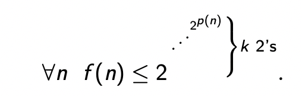
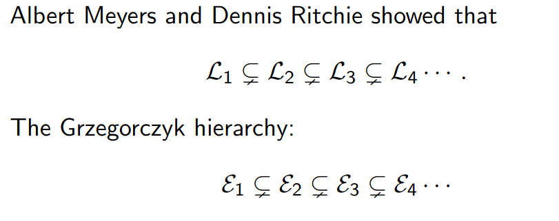
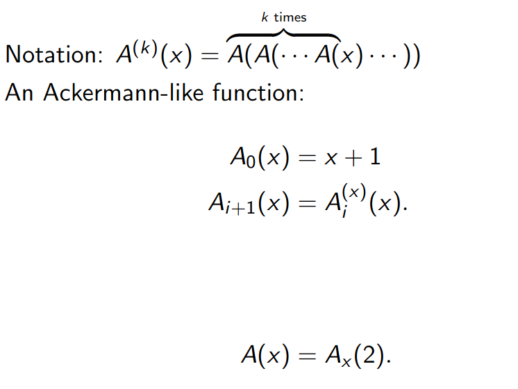
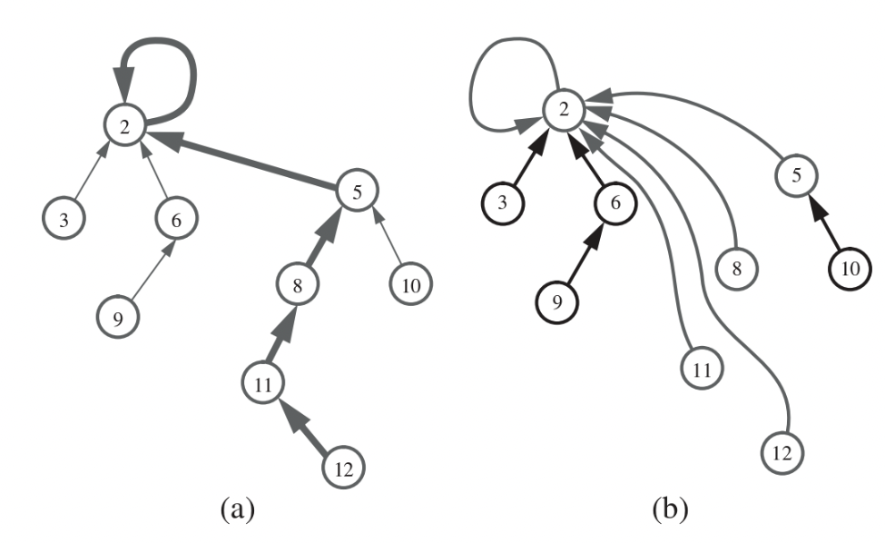
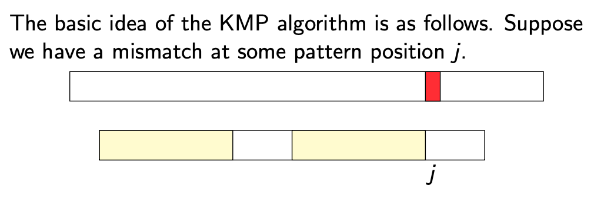

## Week 1

### Directed Graph

Directed Graph has ordered pairs of vertices

### Union-Find

A *graph* is a pair G = (V,E), where V is a finite set and E a set of subsets of V of cardinality exatctly 2.

A *path* is a sequence of distinct vertices such that, for all i from 0 to less k.

```
underected st-CON

Given: A graph G=(V,E) and vertices s,t in V.
Return: Yes if t is reachable from s in G, No otherwise
```

```
Connectivity
Given: A graph G=(V,E)
Return: Yes if G is connected, No otherwise
```

A *Connected component* of a graph is a maximal set of vertices each of which is reachable from any other.

use depth-first search to find connected components of a graph G in linear time.

```
begin DFS(G, v, i) 
    mark v with i
    for each w ∈ G.edges(v) do 
        if w unmarked
            DFS(G, w, i)
```

```
begin CC(G) 
    i←0
    for v ∈ G.vertices 
        if v is unmarked 
            DFS(G, v, i)
            i←i+1
```

* makeSet(e): Create a singleton set containing the element e and name this set "e"
* union(A,B): Update A and B to create    AUB, naming the result as "A" or "B"
* find(e): Return the name of the set containg the element e.


#### List-Based Implementation for Disjoint Sets

```
makeSet():
    s = |v|
    s ->size = 1
    v -> cell = s
    add s to P
```

```
find(x):
    retunr x.head
```

```
union(s,t)
    if s->size > t->size
        remove t from P
        for v in t
            v ->cell = s
        s = append(s,t)
        s -> size = (s->size) + (t->size)
    else 
        do the same, but with s and t exchanged
```


```
union(u,v)
    if the set u is smaller than v then
        for each element x in the set u do
            remove x from u and addit v
            x.head <- v
    else
        for each element x in the set v do
            remove x from v and add it u
            x.head <- u
```
**Lemma:** In a series of operations of makesSet, union and find on n elements using the size-heuristic no element can have its cell field assigned more than round_down(log n)+1 times.

**Theorem:** With the above implementation the running time of union-find(G) is O(m + nlog(n))

**Theorem**: performing a sequence of m union and find operations, starting from n singleton sets, using the above list-based implementation of unionfind strucure, takes 
$$O(n log n + m) $$

```
union-find(V,E)
let P= ∅
for v ∈ V 
    makeSet(v )
for (u,v) ∈ E
    if find(u)  ̸= find(v)
        union(find(u),find(v ))
```

```
find(v)
    if v->parent is not a root
        v->parent = find(v->parent) //flattening step
    return v->parent
```

## Week 2

### Fast and Slow

A polynomial is an expression p(x) of the form

$$
a_nx^n + a_{n-1}x^{n-1}+...+a_1x+a_0
$$

A function f: N -> N is polynomially bounded f for some polynomial p $ f(n) <= p(n)$

A function f: N -> N is doubly exponentially bounded if for some polynomial p $f(n)<= 2^{2^p(n)} $

A function f: N -> N is k-tubly exponentially bounded exponentially bounded if for some polynomial p 



Defind L_k to be the class of function N -> N that can be defined by programs in LOOP featuring at most k-tuples.



* Any function defined in L_2 is primitive
* Any function in the collection $\cup_{i=1}^{\infty}L_i = \cup_{i=1}^{\infty}\epsilon_i$ is primitive recursive

**Note**: primitive recursive functions are a class of functions that can be computed by a formal system of computation with particularly simple and well-defined rules. The concept of primitive recursive functions is essential in the study of computability and complexity theory. 

*A function f:Nk→Nf:Nk→N (where NN represents the natural numbers, including zero) is primitive recursive if it can be obtained from some basic functions using a few simple rules. The basic functions are:
  * Constant functions: Functions like z(x1,x2,…,xk)=cz(x1​,x2​,…,xk​)=c for some constant cc.
  * Successor function: S(x)=x+1S(x)=x+1.
  * Projection functions: Functions like πik(x1,x2,…,xk)=xiπik​(x1​,x2​,…,xk​)=xi​ for 1≤i≤k1≤i≤k. 

**Note**: elementary functions are functions of a single variable (typically real or complex) that is defined as taking sums, products, roots and compositions of finitely many polynomial, rational, trigonometric, hyperbolic, and exponential functions, including possibly their inverse functions.

#### Ackerman function

Ackerman function is an extremly fast growing function. it's a useful tools to make comparison in computationality theory.


A(m,n)
- n+1, if m=0
- A(m-1,1), if m>0 and n=0
- A(m-1, A(m,n-1)), otherwise



#### Tree Implementation of Union-Find

**Theorem**: Using the tree implementation, the algorithm union-find(G=(V,E)) runs in $$O((n+m)\alpha(n))$$ time, where n=|V| and m=|E|

**Proof**: 
Define n(v) to be the number of nodes in the tree rooted at v, assuming no path compression
$$r(v) = \lfloor{log(n(v))}\rfloor + 2$$

call r(v) the rank of vertex v. Denote parent of v by p(v)
1. $$r(v)\leq \lfloor{log n}\rfloor + 2 $$
2. if p(v)=2, then r(v) < r(w)
3. the number of vertices with rank s is at most $\frac{n}{2^{s-2}}$

Suppose we carry out m makeSet, union and find operations on a collection of n vetices. Each call to makeSet or union requires a constant number of operations. We need only worry about the work done by the calls to find.

the tree-structure changes as we modify the pointers(path compression) let the parent of v after t pointer modifications be denoted $p^t(v)$

We give each vertex v a lable during the evolving computation:

$$L^t(v) = the\space largest\space i \space s.t. \space r(p^t(v)) \geq A_i(r(v))$$

the equation above is subtle. It says that the mapping function for v is the largest i which satisfies the inequality. LHS of the inquality give the rank of the parent of v after t tree modification, and the RHS of the inequality gives the i iterations of the Ackerman function $A^x(s)$, where the rank of vertex v is the taken as the parameter for A(x).

**Note**: if i=2, the function will computed as two iterations for A(x), and i=100, the function will give 100 multiplications for A(x)


Union-by-size: Store with each node v the size of the subtree rooed at v, denoted by n(v). In a union, weow make the tree of the smaller set a subtree of the other tree, and update the size field of the root of the resulting tree.


Path Compression: In a find operaion, for each node v that the fid visits, reset the parent pointer from v to point to the root.



```
makeSet():
    for each singleton element x do
        x.parent <- x
        x.size <- 1
```

```

union(x,y):
    if x.size < y.size then
        x.parent <- y
        y.size <- y.size + x.size
    else
        y.parent <- x
        x.size <- y.size + x.size
```

```
find(x)
r <- x
while r.parent ≠ r do
    r <- r.pare

z <- x
while z.parent ≠ z do
    w <- z
    z <- z.parent
    w.parent <- r
```
r ← x: Initialize a variable r with the current element x.

while r.parent ≠ r do: Loop until r is its own parent, which means r is the root of the current set.

Inside the loop, r ← r.parent: Move r up the parent pointers until the root is found.
z ← x: Reset the variable z to the current element x for path compression.

while z.parent ≠ z do: Loop until z is its own parent, which means z is the root of the original set before path compression.

Inside the loop:
w ← z: Store the current element in a variable w.
z ← z.parent: Move z up the parent pointers until the root is found.
w.parent ← r: Set the parent pointer of w to the root r.
In summary, this algorithm finds the root of the set to which element x belongs (variable r) and performs path compression by updating the parent pointers of the elements on the path from x to the root r. Path compression optimizes future find operations by making the trees representing sets more balanced and shallow.


**Theorem:** Performing a sequence of m union and find operations, starting fom n singleton sets, using the above tree based implementation of a union find structure, takes **O(n + mlog(n))** time


### Searching Strings


#### Rabin-Karp Algorithm

* n = |T| and m = |P|
* P is the numbe $P[0].b^{m-1} + ... + P[m-1].b^0$
* T[i, ..., i+m-1] is $T[i].b^{m-1}+...+T[i+m-1].b^0 $
* to calculate T[i+1, ..., i+m ] from T[i ,...,i+m-1], write $$T[i+1,..., i+m] = (T[i,...,i+m-1] - T[i].b^{m-1}).b+T[i+m] (mod q) $$

the mod q is to avoid the number get too large, where q is a prime

if T[i, ..., i+m-1] not equal to P mod q, then we know that there is no match at shift i

Wost case: Time complexity: O(|T| |P|)
Averae case: O(n+,+m(n/q)) -> O(n+m). since q>m

Rabin-Karp Algorithm

```
Rabin-Karp(T,Pq,b)
    m <- |P|
    t <- T[0].b^(m-1) + ... + T[m-1].b^0 mod q
    p <- P[0].b^(m-1) + ... + P[m-1].b^0 mod q
    i ->0
    while i<= |T| - m
        if p=t
            j <- 0
            while P[j]=T[i+j] and j < |P|
                j++
            if j=|P|
                return i
        t <- (t-T[i].b^(m-1).b + T[i+m] mod q)
        i++
    return "NO Match"
end

```

**Question**: where it tells you there is a match
**Answer** the return i tells you the starting position of the match.

Details of Rabin-Karp is not clear. We know how to calculate it, but don't know why.

### The Knuth-Morris-Pratt algorithm




KMP Algorithm

```
KMP(T,P)
    compute pi(P)
    i <- 0, j <- 0
    while i<|T|
        if P[j]= T[i]
            if j = |P|-1
                return i-|P|+1 //return the start index of the matched string
            else
                i++, j++ //increment i and j to continue matching
        else if j>0
            j <- pi[j]
        else
            i++
    return "Not found"
end
```

```java
public int strStr(String haystack, String needle) {
        int j=-1; //j指向模式串起始位置，i指向文本出串起始位置。j 是-1，因为next从-1开始
        int[] next = new int[needle.length()];
        
        char[] haystackArray = haystack.toCharArray();
        char[] needleArray = needle.toCharArray();
        
        //构建next 数组
        getNext(next, needleArray);
        
        for(int i=0; i<haystackArray.length; i++)
        {
            while(j>=0 && haystackArray[i] != needleArray[j+1])
            {
                j = next[j];
            }

            if(haystackArray[i] == needleArray[j+1])
            {
                j++;
            }

            if(j == needleArray.length-1)
            {
                return i-needleArray.length+1; //
            }
        }
        return -1;
    }
```
computing pi()
```
compute-pi(P)
    pi(o) <- 0
    i <- 1
    j <- 0
    while i+j <- |P|
        while i+j <-|P| and P[i+j] = P[j]
            pi(i+j) <- j+1
            j <- j+1
        if j>0
            i <- i+j-pi(j-1); j <- pi(j-1)
        else
            pi(i) <- 0;i <- i+1
```

java implementation

```java
    public void getNext(int[] next, char[] s )
    {
        //前缀表统一减一实现
        int j=-1; //j 指向前缀末尾
        next[0] = j;

        //i 指向后缀末尾

        for(int i=1; i<s.length; i++)
        {
            // i and j+1指向不同的字母
            while(j >= 0 && s[i] != s[j+1])
            {
                j = next[j]; //向前回退
            }
            //j+1 and i 指向相同的字母
            if(s[i] == s[j+1])
            {
                j++;
            }
            next[i] = j; //next 纪录最长前后缀的长度后缀的末端记录前缀末端的长度。这是最长前后缀子串相等的长度          
        }
    }
```

### Walking

If m and n are positive integers (m <=n), a walk is a surjection 

$$f:[1,n] -> [1,m]\space s.t\space |f(i+1)-f(i)| <=1 for\space all\space i(1<=i<n)$$

If u = a1 ···am and w = c1 ···cn, say u generates v if there exists a walk

$$f:[1,n]→[1,m]suchthatci =af(i) foralli (1≤i ≤n)$$

there is no jumps
