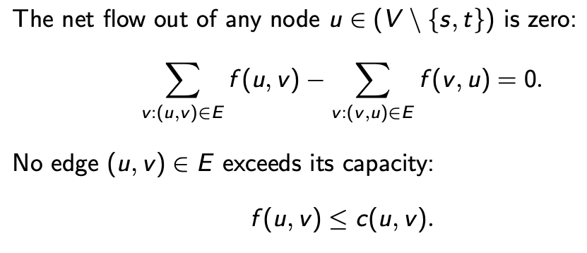

## Week 1

### Directed Graph

Directed Graph has ordered pairs of vertices

### Union-Find

A *graph* is a pair G = (V,E), where V is a finite set and E a set of subsets of V of cardinality exatctly 2.

A *path* is a sequence of distinct vertices such that, for all i from 0 to less k.

```
underected st-CON

Given: A graph G=(V,E) and vertices s,t in V.
Return: Yes if t is reachable from s in G, No otherwise
```

```
Connectivity
Given: A graph G=(V,E)
Return: Yes if G is connected, No otherwise
```

A *Connected component* of a graph is a maximal set of vertices each of which is reachable from any other.

use depth-first search to find connected components of a graph G in linear time.

```
begin DFS(G, v, i) 
    mark v with i
    for each w ∈ G.edges(v) do 
        if w unmarked
            DFS(G, w, i)
```

```
begin CC(G) 
    i←0
    for v ∈ G.vertices 
        if v is unmarked 
            DFS(G, v, i)
            i←i+1
```

* makeSet(e): Create a singleton set containing the element e and name this set "e"
* union(A,B): Update A and B to create    AUB, naming the result as "A" or "B"
* find(e): Return the name of the set containg the element e.


#### List-Based Implementation for Disjoint Sets

```
makeSet():
    s = |v|
    s ->size = 1
    v -> cell = s
    add s to P
```

```
find(x):
    retunr x.head
```

```
union(s,t)
    if s->size > t->size
        remove t from P
        for v in t
            v ->cell = s
        s = append(s,t)
        s -> size = (s->size) + (t->size)
    else 
        do the same, but with s and t exchanged
```


```
union(u,v)
    if the set u is smaller than v then
        for each element x in the set u do
            remove x from u and addit v
            x.head <- v
    else
        for each element x in the set v do
            remove x from v and add it u
            x.head <- u
```
**Lemma:** In a series of operations of makesSet, union and find on n elements using the size-heuristic no element can have its cell field assigned more than round_down(log n)+1 times.

**Theorem:** With the above implementation the running time of union-find(G) is O(m + nlog(n))

**Theorem**: performing a sequence of m union and find operations, starting from n singleton sets, using the above list-based implementation of unionfind strucure, takes 
$$O(n log n + m) $$

```
union-find(V,E)
let P= ∅
for v ∈ V 
    makeSet(v )
for (u,v) ∈ E
    if find(u)  ̸= find(v)
        union(find(u),find(v ))
```

```
find(v)
    if v->parent is not a root
        v->parent = find(v->parent) //flattening step
    return v->parent
```

## Week 2

### Fast and Slow

A polynomial is an expression p(x) of the form

$$
a_nx^n + a_{n-1}x^{n-1}+...+a_1x+a_0
$$

A function f: N -> N is polynomially bounded f for some polynomial p $ f(n) <= p(n)$

A function f: N -> N is doubly exponentially bounded if for some polynomial p $f(n)<= 2^{2^p(n)} $

A function f: N -> N is k-tubly exponentially bounded exponentially bounded if for some polynomial p 


Defind L_k to be the class of function N -> N that can be defined by programs in LOOP featuring at most k-tuples.


* Any function defined in L_2 is primitive
* Any function in the collection $\cup_{i=1}^{\infty}L_i = \cup_{i=1}^{\infty}\epsilon_i$ is primitive recursive

**Note**: primitive recursive functions are a class of functions that can be computed by a formal system of computation with particularly simple and well-defined rules. The concept of primitive recursive functions is essential in the study of computability and complexity theory. 

*A function f:Nk→Nf:Nk→N (where NN represents the natural numbers, including zero) is primitive recursive if it can be obtained from some basic functions using a few simple rules. The basic functions are:
  * Constant functions: Functions like z(x1,x2,…,xk)=cz(x1​,x2​,…,xk​)=c for some constant cc.
  * Successor function: S(x)=x+1S(x)=x+1.
  * Projection functions: Functions like πik(x1,x2,…,xk)=xiπik​(x1​,x2​,…,xk​)=xi​ for 1≤i≤k1≤i≤k. 

**Note**: elementary functions are functions of a single variable (typically real or complex) that is defined as taking sums, products, roots and compositions of finitely many polynomial, rational, trigonometric, hyperbolic, and exponential functions, including possibly their inverse functions.

#### Ackerman function

Ackerman function is an extremly fast growing function. it's a useful tools to make comparison in computationality theory.


A(m,n)
- n+1, if m=0
- A(m-1,1), if m>0 and n=0
- A(m-1, A(m,n-1)), otherwise


#### Tree Implementation of Union-Find

**Theorem**: Using the tree implementation, the algorithm union-find(G=(V,E)) runs in $$O((n+m)\alpha(n))$$ time, where n=|V| and m=|E|

**Proof**: 
Define n(v) to be the number of nodes in the tree rooted at v, assuming no path compression
$$r(v) = \lfloor{log(n(v))}\rfloor + 2$$

call r(v) the rank of vertex v. Denote parent of v by p(v)
1. $$r(v)\leq \lfloor{log n}\rfloor + 2 $$
2. if p(v)=2, then r(v) < r(w)
3. the number of vertices with rank s is at most $\frac{n}{2^{s-2}}$

Suppose we carry out m makeSet, union and find operations on a collection of n vetices. Each call to makeSet or union requires a constant number of operations. We need only worry about the work done by the calls to find.

the tree-structure changes as we modify the pointers(path compression) let the parent of v after t pointer modifications be denoted $p^t(v)$

We give each vertex v a lable during the evolving computation:

$$L^t(v) = the\space largest\space i \space s.t. \space r(p^t(v)) \geq A_i(r(v))$$

the equation above is subtle. It says that the mapping function for v is the largest i which satisfies the inequality. LHS of the inquality give the rank of the parent of v after t tree modification, and the RHS of the inequality gives the i iterations of the Ackerman function $A^x(s)$, where the rank of vertex v is the taken as the parameter for A(x).

**Note**: if i=2, the function will computed as two iterations for A(x), and i=100, the function will give 100 multiplications for A(x)


Union-by-size: Store with each node v the size of the subtree rooed at v, denoted by n(v). In a union, weow make the tree of the smaller set a subtree of the other tree, and update the size field of the root of the resulting tree.


Path Compression: In a find operaion, for each node v that the fid visits, reset the parent pointer from v to point to the root.


```
makeSet():
    for each singleton element x do
        x.parent <- x
        x.size <- 1
```

```

union(x,y):
    if x.size < y.size then
        x.parent <- y
        y.size <- y.size + x.size
    else
        y.parent <- x
        x.size <- y.size + x.size
```

```
find(x)
r <- x
while r.parent ≠ r do
    r <- r.pare

z <- x
while z.parent ≠ z do
    w <- z
    z <- z.parent
    w.parent <- r
```
r ← x: Initialize a variable r with the current element x.

while r.parent ≠ r do: Loop until r is its own parent, which means r is the root of the current set.

Inside the loop, r ← r.parent: Move r up the parent pointers until the root is found.
z ← x: Reset the variable z to the current element x for path compression.

while z.parent ≠ z do: Loop until z is its own parent, which means z is the root of the original set before path compression.

Inside the loop:
w ← z: Store the current element in a variable w.
z ← z.parent: Move z up the parent pointers until the root is found.
w.parent ← r: Set the parent pointer of w to the root r.
In summary, this algorithm finds the root of the set to which element x belongs (variable r) and performs path compression by updating the parent pointers of the elements on the path from x to the root r. Path compression optimizes future find operations by making the trees representing sets more balanced and shallow.


**Theorem:** Performing a sequence of m union and find operations, starting fom n singleton sets, using the above tree based implementation of a union find structure, takes **O(n + mlog(n))** time


### Searching Strings


#### Rabin-Karp Algorithm

* n = |T| and m = |P|
* P is the numbe $P[0].b^{m-1} + ... + P[m-1].b^0$
* T[i, ..., i+m-1] is $T[i].b^{m-1}+...+T[i+m-1].b^0 $
* to calculate T[i+1, ..., i+m ] from T[i ,...,i+m-1], write $$T[i+1,..., i+m] = (T[i,...,i+m-1] - T[i].b^{m-1}).b+T[i+m] (mod q) $$

the mod q is to avoid the number get too large, where q is a prime

if T[i, ..., i+m-1] not equal to P mod q, then we know that there is no match at shift i

Wost case: Time complexity: O(|T| |P|)
Averae case: O(n+,+m(n/q)) -> O(n+m). since q>m

Rabin-Karp Algorithm

```
Rabin-Karp(T,Pq,b)
    m <- |P|
    t <- T[0].b^(m-1) + ... + T[m-1].b^0 mod q
    p <- P[0].b^(m-1) + ... + P[m-1].b^0 mod q
    i ->0
    while i<= |T| - m
        if p=t
            j <- 0
            while P[j]=T[i+j] and j < |P|
                j++
            if j=|P|
                return i
        t <- (t-T[i].b^(m-1).b + T[i+m] mod q)
        i++
    return "NO Match"
end

```

**Question**: where it tells you there is a match
**Answer** the return i tells you the starting position of the match.

Details of Rabin-Karp is not clear. We know how to calculate it, but don't know why.

Is this the abstract algorithm of the sliding window algorithm.

### The Knuth-Morris-Pratt algorithm


KMP Algorithm

```
KMP(T,P)
    compute pi(P)
    i <- 0, j <- 0
    while i<|T|
        if P[j]= T[i]
            if j = |P|-1
                return i-|P|+1 //return the start index of the matched string
            else
                i++, j++ //increment i and j to continue matching
        else if j>0
            j <- pi[j]
        else
            i++
    return "Not found"
end
```

```java
public int strStr(String haystack, String needle) {
        int j=-1; //j指向模式串起始位置，i指向文本出串起始位置。j 是-1，因为next从-1开始
        int[] next = new int[needle.length()];
        
        char[] haystackArray = haystack.toCharArray();
        char[] needleArray = needle.toCharArray();
        
        //构建next 数组
        getNext(next, needleArray);
        
        for(int i=0; i<haystackArray.length; i++)
        {
            while(j>=0 && haystackArray[i] != needleArray[j+1])
            {
                j = next[j];
            }

            if(haystackArray[i] == needleArray[j+1])
            {
                j++;
            }

            if(j == needleArray.length-1)
            {
                return i-needleArray.length+1; //
            }
        }
        return -1;
    }
```
computing pi()
```
compute-pi(P)
    pi(o) <- 0
    i <- 1
    j <- 0
    while i+j <- |P|
        while i+j <-|P| and P[i+j] = P[j]
            pi(i+j) <- j+1
            j <- j+1
        if j>0
            i <- i+j-pi(j-1); j <- pi(j-1)
        else
            pi(i) <- 0;i <- i+1
```

java implementation

```java
    public void getNext(int[] next, char[] s )
    {
        //前缀表统一减一实现
        int j=-1; //j 指向前缀末尾
        next[0] = j;

        //i 指向后缀末尾

        for(int i=1; i<s.length; i++)
        {
            // i and j+1指向不同的字母
            while(j >= 0 && s[i] != s[j+1])
            {
                j = next[j]; //向前回退
            }
            //j+1 and i 指向相同的字母
            if(s[i] == s[j+1])
            {
                j++;
            }
            next[i] = j; //next 纪录最长前后缀的长度后缀的末端记录前缀末端的长度。这是最长前后缀子串相等的长度          
        }
    }
```

前缀表不减一实现，这个版本与课上的伪代码一致
```java
    private void getNext(int[] next, String s) {
        int j = 0;
        next[0] = 0;
        for (int i = 1; i < s.length(); i++) {
            while (j > 0 && s.charAt(j) != s.charAt(i)) 
                j = next[j - 1];
            if (s.charAt(j) == s.charAt(i)) 
                j++;
            next[i] = j; 
        }
    }
```
计算后缀的原因在于，我们需要用最小的移动来确定下一次搜索的起始位置。最长前后缀，的目的也就是在于此。在一次失败匹配之后，我们从后缀的起始位置开始重新搜索，这样就利用了之前的搜索信息。

### Walking

If m and n are positive integers (m <=n), a walk is a surjection 

$$f:[1,n] -> [1,m]\space s.t\space |f(i+1)-f(i)| <=1 for\space all\space i(1<=i<n)$$

If u = a1 ···am and w = c1 ···cn, say u generates v if there exists a walk

$$f:[1,n]→[1,m]suchthatci =af(i) foralli (1≤i ≤n)$$

there is no jumps


## Week3

### Flow Networks and Matching

**Flow Network**: is a quintyple (V,E,s,t,c) where (V,E) is a directed graph with no back-loops, s,t in V are distinct and c:E -> N


Let N = (V,E,s,t,c) be a flow network. A *flow* in N is a function f:E->R+ with the following perperties:

* the net flow out of any node u in V except s and t is zero
* no edge (u,v) in E exceeds its capacity



The *value* of f is the quantity

$$\sum_{v:(s,v)\in E} f(s,v) $$

A flow is **optimal** if its value is maximal among all flows.


The set is the union of flow that under capacity, and the set of back flow that greater than 0.

The idea is the same to what have discussed in the graph theory course.


#### Lemma (Min-Cut, Max-Flow)

Let N=(V,E,s,t,c) be a flow network and f a flow in N. Then there is a path in N_f from s to t if and ony if f is not optimal.


**Proof**:

The only-if direction is trivial. Suppose, conversely, there is no path from s to t in N_f. Let S be the set of nodes V reachable from s in N-f, and T = V\S. There is no backflow from T to S, and no spare capacity from S to T.


```
begin flowMax(V,E,s,t,c)
    set f(e) = 0 for all e in E
    whie reachable(N_f, s,t)
        let e1,...,e_m be the edges on a path from s o t
            for 1 <= i<= m
                if e_i in E increment f(e_i)
                else decrement f(e_i^(-1))
    return f
```

**Theorem**: If N=(V,E,s,t,c) is a flow network with integral capacty-function c, then flowMax(V,E,s,t,c) returns an optimal flow for N.

**Corollary**: If a flow network N has integral capacities, then there exists an optimal flow for N; in fact, there exists an optimal flow for N which is integer-valued.


Suppose we have a network with n verticies, m edges,maximum edge capacity C

We know that REACHABILITY can be solved in O((n+m)) where n is the number of nodes and m the number of edges

* the value of any flow <= nC
* time complexity of finding maximal flow is O((n+m)C)


#### 2D Matching

**Bipartite graph**: is a triple G=(U,V,E) where U and V are disjoint sets and E is a subset of UxV


A *matching* is a subset E' in E such that for all v in V, there is at most one w in W with (v,w) in E', and for all w in W, there is at most one v in V with (v,w) in E'

**Note**: matching is a pair, which matches an element to another element in the other party. 

The matching is **perfect** if every node in V and W is incident to some e ∈ E′.

```
Maximal Matching
Given: A bipartite graph G
Return: A matchign of maximal cardinality
```

```
Matching
Given: A bipartite graph G
Return: Yes if G has a perfect matching, and No otherwise.
```

```
naitveMatch(V,W,E)
    if V = ∅
        if W = ∅ return Yes
        else return No
    pick v ∈ V
    for each {w | (v,w) ∈ E}
        let (V',W',E') be result of removing v,w from (V,W,E)
        if naiveMatch(V',W',E'), return Yes
    return No
```

这个算法类似于回溯算法。对每一个V中的节点进行横向遍历，然后通过for loop 遍历每一个与v 有边的w。这个就是纵向遍历

#### Model the 2D matching problem as directed graph

A maximum maching is a the maximal flow of the flow network.

This algorithm runs in quadratic time **O(n^2)**


A flow with *costs* is a sextuple N=(V,E,s,t,c,γ), where(V,E,s,t,c) is a flow network and γ:E->N

If f is a flow, the total cost of f is

$$\sum_{e\in E} f(e)\times \gamma(e) $$


* if (u,v) is an edge of N_f and (u,v) in E, the distance (u,v) is γ(e)
* if (r,v) is an edge of N_f and (v,u) in E, the distance d(u,v) -γ(e)


**Lemma**:

Let N be a flow network with cost function, and suppose f is a flow of value v through N, such that f has minimal cost among all flows of value v. Suppose π is a pat in N_f from s to t of minimal length, and let f' be obtained from f by augmenting along π (in the usual way). Then f' has minimal cost among all flows of value v+1

**Busacker-Gowen algorithm**

```
flowMaxCost(V,E,s,,c,γ)
    set f(e)=0 for all e in E
    while reachable(N_f, s, t)
        let e1,...em be the edges on a shortest path from s to t
        for 1<= i<= m
            if e_i in E, increment f(e_i)
            else decrement f(e_i^(-1))
    return f
```


## Stable Marriage Problem

* we are given
    * a set of n boys and n girls
    * a strict ranking for each boy, of all the girls
    * a strict ranking for each girl of all the boys.
* we want to compute
    * a 1-1 pairig of boys with girls in which, for evry boy a and girl b, either a prefers is partner to b or  prefers her partner to a. (**Stable matching**)


```
Gale-Shapley algorithm

Gale-Shapeley(Boys' ankings, Girls' rankings)
    until all boys are engaged do
        for each boy a with no partner do
            a proposes to the girl he most prefers among those that a has not yet proposed to
        for each girl b with new proposals do
            let a be b's most prferred new suitor
            if b has not partner
                b gets engaged to a
            if b prefers a to her existing partner
                b cancels her exsting engagement
                b get engaged to a
    all the engaged couples get married
end
```

**Theorem**: The Gale-Shapley algorithm terminates with a stable matching

**Proof**: 

The algorithm terminates since no boy proposes to any girl twice. When the algorithm terminates, every girl will have recieved a proposal, since any unmatech boys will have proposed to all the girls.

Once a girl has recieved a proposal, she always has some partner or other. Hence all the girls get engaged. So we have a matching.

Suppse (a,b') and (a',b) are distince married couples produced by the algorithm. If b prefers a to a', then anever proposed to b. But a proposed to all girls better than or equal to b'. Therefore, a does not prefer b to b'.


**Theorem**: 

The stable matching, M, produced by the Gale-Shapeley algorithm is optimal for boys: if boy a is married to girl b in M, but prefers gir' b', then there is no stable matching M' in which a is married to b'

**Proof**

if a prefers b' to b, then the pair (a,b') in M' must have been rejectged proposal or cancelled engagement in the construction of M.

## Week4

### Turing Machines

Formally a Turing Machine is a quintuple

$$M = <K,\Sigma, Q, q_0, T>$$

where

* K >= 2(number of tapes)
* Sigma is a non-empty, finite set (alphabet)
* Q is a non-empty, finite set(set of states)
* q_0 in Q (initial state)
* T is a set of transition (for K, ∑ and Q)


A transition (for K, ∑ and Q) is a quintuple

$$<p,\bar s, q, \bar t, \bar d> $$

where 

* q in Q and p in Q
* s and t are Ktyples of symbls
* d is a K-tuple whose elements from {left, right, stay}

* Informal meaning
    * If you are in state p, and the symbols written on the squares currently bing scaned on the K tapes aregiven bys, then setr teh new state to be q, write the symbols of t on the K tapes and move the heads as dircted by d.

* tape never moves left past
* tape 1 is read-only(input) and Tape K write only (output)
* start is never over written with anything else, and nothing lse is over-writtn with start
* nothig is ever over-wirtten with blank

A **Configuration** of M: a K-tuple of strings $\sigma_1, ..., \sigma_K$ where $\sigma_K (1 \le k \le K)$ is of the form

$$▸, s_{k,1},...s_{k,i-1}, q, s_{k,i}, ... s_{k,n(k)} $$


This states that the kth tape of M reads ◃, sk,1, . . . , sk,n(k), the head is over square i, and the current state is q (same for all K strings)

* A **run** of machien M on input x is a sequence of configuratins (finite or infinite) in which successive configurations conform to some transition in T, and such that, if some transition is possible in a configuration of the run, that configuration cannot be final. （这意味着当config 不可能的时候那个config 才是final 的吗？）
* The run is **terminating** if it is finite
* M is deterministic if, for every p and s, there is at most one transition $<p, \bar s, q, \bar t, \bar d>$


**Definition**: Let M be a deterministic Turing machine over alphabet ∑, and let x in ∑. If M is terminating, then the output tape of M will contains a fefinite string y in ∑; and we can define the partial function $f_M: \Sigma -> \Sigma$

一个函数是可计算的的，如果对于任何输入x，M 都会输出f(x)


We say that M **computes** the function f_M. A partial function f is computable if it is computed by some deterministic Turing Machine


### Theorem

Fix some alphabet ∑. There exists a Turing machine U with the following property. For any Turing Machine M over alpabet ∑ and with code m, and any strings x, y in ∑, U has a terminating run on input (m;x) leaving y on the output tape if and only if M has a terminating rn on input x leaving y on the output tape; moreover, U has a non-terminating run on input x.

在原本的图灵机上是可解的，就等价于着在另一台图灵机上也是可解的；反之亦然。

**Definition**: Acceptance and Recognition

Let M be a Tuing machine over alphaet ∑, and let x in ∑. We say M accepts x if M has a halting run on input x, *with the first head over the leftmost square*

如果M在x上有一个停机运行，并且第一个头在最左边的方格上，M接受x

The set of strings accepted by M is called the language recognized by M.

被 M 所接受的字符串集合，被称作M可是别的语言（Language）.

**Language** 是一个可接受字符串集合

M is **deterministic** if for every p and s, there is at most one transition (p,s,q,t,d)

**Theorem**: If a language is recognized by some Turing machine M, then it is recognized by some deterministic Turing Machine M′


* A language is recursively enumerable if there is a deterministic Turing Machine which recognizes it
    * 一个language 如果可以被D-TM 识别，这个语言就是递归可枚举的
* A language L over alphabet ∑ is co-recursively enumerable if ∑'\L is recursively enumerable
* A language is recursive if and only if it is both r.e and co-r.e

**Theorem**: A language is recursive if and only if there is a deterministic Turing Machien M recogniing it, such that M always halts.   

一个语言是递归的 IFF 有一个确定图灵机

* Note:果一个图灵机在处理所有可能的输入时都停机，那么它被称为“有限的”。有限性是一个有用的性质，因为它确保了图灵机在有限的时间内完成其计算。因此，在实际应用中，我们通常会寻找能够有限地识别语言的图灵机，以确保它们的有效性和可靠性


language equavalent to (decision) problem
recursive equivalent to decidable


**Definition**: The *Halting* problem is the following problem:

* Given: a pair of strings m, x
* Return Yes if m is the code of a deterministic Turing Machine, M, and x a tring in the alphabet of M su that M↓x ; No otherwise.


在停机问题中我们试用一下算法解决：

1. 验证代码的有效性: 首先，你需要验证字符串m是否定义了一个有效的图灵机。这通常涉及检查m是否满足图灵机的语法规则，例如正确的指令集、正确的状态转换等。
2. 模拟运行: 接下来，你需要模拟图灵机M在输入x上的运行。从初始状态开始，按照M的指令逐步执行操作，直到它停机或进入一个无限循环。
3. 检查停机状态: 如果在某个时刻，图灵机到达一个接受状态（表示M接受x），或者进入一个无限循环（表示M不接受x），那么你需要根据这些信息来决定返回"Yes"还是"No"。

**Theorem: The Halting Proble is not decidable**


### Time Complexity

#### P

P 代表着一类实际中可被解决的一类问题，它们包括图遍历，排序，搜索

P 问题
* PATH
* Relative Prime 

#### NP

* Hamilton Path: Finding a path in a graph is Hamliltonian Path is difficult, but it's esay to check if a given path is Hamiltonian. We can simply present the path to verify.

**Verifier**: A verifier is an algorithm for a language. The time of a verifier is measured by the length of w. So a Language is polynomial verifiable if it has a polynomial time verifier.

**NP**: NP is a class of language that have polynomial time verifiers

**NP**: A language is NP IFF it is decided by some non-determinstic polynomial time turing machine


Examples of NP Problems

* Cliques
* HamPATH

* P the class of languages for which membership can be decided quickly
* NP the class of languages for which membership can be verified quickly

### Space Complexity


### Intractability

**Space Hierachy Theorem**: For any space constructible funciton f: N -> N a language A exists that is decidable in O(f(n)) space but not in o(f(n)) space


**Time Hierachy Theorem**: For any time constructible function t: N -> N a language A exists that is decidable in O(t(n)) time but not decidable in time o(t(n)/log(t(n)))


## Week5

### Definitions


Handy function classes


Problems we know arein PTime

* st-Con
* undirected st-Con
* Cyclicity
* 2D-Matching


LPF is in PTime


Prime is in PTime

A few deterministic space-bounds

* Any language generated by a context-sensitive grammar is in
Space(n) ⊆ PSpace.
* Undirected st-CON is in LogSpace. (O. Reingold, 2008);


Turing machine 之前定义中是deterministic TM 二者是不一样的


**Theorem**: Reachability is in **NLogSpace**


```
begin reachND(G,u,v)
    n := number of vertices in G
    w := u
    c : 0
    while w ≠ v and c < n
        pick w' such that w = w' or there is an edge from w to w'
        w := w'
        increment c
    if c<n
        return Y
    return N
```


**Theorem**: TSP feasibility is in **NPTime**

```
begin TSPND(A,k)
    Guess a tour π in A
    Let ' := the length of π
    if l <= k
        return Y
    return N
```


### Inclusion


**Theorem**: NSpace(g) is contained in Time(2^O(g))


在定理之后的corollary，说明 Nlog

The theorem tells us that non-deterministic space functions are included in deterministic time functions.


**Theorem**: NTime(g) is contained in Space(g)

在这个系列中，我们讨论了 Time NTime 的关系，也讨论了 Time Space 的关系。上个定理是 NSpace in Time(2^O(g))。这个定理就是NTime in Space。所以总共提到了四对关系对应 Time -> NTime, Time -> Space, NSpace -> Time(2^O(g)), and NTime -> Space


Log Space 小于 NLogSpace，用上一个引理 NLogSpace 小于 PTime。这里就是非确定空间复杂度小于下一个更大的确定的时间复杂度。PTime 小于 NPTime。使用这个定理，NPTime 小于 PSpace。非确定时间复杂度小于下一个更大的确定空间复杂度。

Deterministic is always smaller than the non-deterministic on the same scale. Log deterministic space  is the smallest


### A separation result


A function f is **time-constructible** if there is deterministic Turing Machine, which given any string x of length n,f(n) symbols on its output tape and terminates in time f(n)


## Week 7


**Theorem**: Propositional SAT is in NPTime


在这个证明中主要的思想是NPTime 算法可以在PTime 中验证


**Horn**: A claiuse is Horn if all but at most one of the literals are negative.

$$
\neg{p_1} \vee p_2 
$$

最多只有一个非literal 的clause 是Horn

**Note**: a horn clause can be written as an implication

$$
\neg{p_1} \vee ... \vee \neg{p_{k-1}} \vee p_k
$$

$$
(p_1 \wedge ... \wedge p_{k-1}) \rightarrow p_k
$$

**Theorem**: Horn-SAT is in PTime


**Krom**: A clause is Krom if it contains at most two literasls

$$
\neg{p_1} \vee p_2
$$

$$
\neg{p_1} \vee \neg{p_2}
$$


**Theorem**: The problem KROM-UNSAT is in NLogSpace

If C is a class of languages (over some alphabet), then co-C is the class of languages

$$
\set{L \subset \Sigma^* | (\Sigma^* \setminus L) \in C}
$$

**Theorem**: The problem KROM-SAT is in co-NLogSpace

#### Quantified Boolean Formula


$$
\exists p_1 \forall p_2 (p1 \vee p_2)
$$

Semantics:

* An assignment is a function $\theta : P \rightarrow \set{T,F}$

**Quantified Boolean Formula**

```
begin QBF-rec(Qi pi . . . Qmpm.ψ, α) 
    if i = m + 1
        return α(ψ)
    if Qi = ∀ and QBF-rec(Qi+1pi+1 ...Qmpm.ψ, (α,F)) = F
        return F
    if Qi = ∃ and QBF-rec(Qi+1pi+1 ...Qmpm.ψ, (α,F)) = T
        return T
    return QBF-rec(Qi+1pi+1 ...Qmpm.ψ, (α,T))
```

**Theorem**: QBF is in **PSpace**

*Summary*:

* KROM-SAT is in Co-NLogSpace
* HORN-SAT is in PTime
* SAT Propositional Sat are in NPTime
* QBF is in PSpace

#### Reading

**NP-Complete**: the class of problems in NP whose complexity is related to the entire NP class. Proving a problem is NP-Complete is a strong evidence for its nonpolynomiality.

If a polynomial time algorithm exists for any of these problems, all problems in NP would be polynomial time solvable

**Theorem**: 
$$ 
SAT \in P \quad iff \quad P=NP 

$$

#### Reduction

When problem A is reduced to solve B, a solution to B can be used to solve A


多项式时间可计算函数。如果存在一个图灵机在f(w)磁带内停机。

**Definition**: Language A is polynomial time reducible to language B written A <= B, if a polynomial time computable function f:∑ -> ∑, where for every w 

$$
w \in A \iff f(w)\in B
$$

The function f is called the polynomial time reduction of A to B.


**Theorem**: 3SAT is polynomial time reducible to Clique


A language B is NP-Complete if it satisfies two conditions

1. B is NP
2. Every A in NP is polynomial time reducible to B

SAT is NP-Complete

**Theorem**: If B is NP complete and $B \in P$, then P=NP

**Theorem** If B is NP complete and B is polynomially time reducible to C for C in NP, then C is NP Complete

**Theorem**: SAT is NP Complete

## Week 8

**Definition**: Let C be a complexity class and P a problem. P is C-hard(under many one logspace reducibility) if for all P' in C, P' is logorithmically reducible to P.


* P_1 is no harder than P_2
* P_2 is at least as hard as P_1
* If you give me a easy solution for P_2, then I have an easy solution for P_1

### Cook, Levin Theorem

**SAT is NPTime-Complete**

**Theorem**: 3-SAT is *NPTime-Complete*

SAT is log reducible to 3-SAT

**Theorem**: Horn-SAT is *PTime-complete*

**Theorem**: st-Con is *NLogSpace-complete*

**Theorem**: QBF problem is *PSpace-complete*

### Reading

Log Space reducibility

**Definition**: A language B is *NL-Complete* if
* $B \in NL$
* every A in NL is log space reducible to B

**Theorem**: If A is log space reducible to B and $B \in L$, then $A \in L$

**Corollary**: If any NL-Complete language is in L, then L=NL

**Theorem**: PATH is NL-Complete

This means any NL language is lag space reducible to PATH

**Corallary**: $$NL \subset P$$

TM taht uses space f(n) runs in time n2^(f(n)), so a reducer that runs in log space also runs in polynomial time

*QBF is PSpace-Complete*

**Theorem**: Hamilton-Path is *NP-Complete*

**Note**: If the 3-SAT is satisfiable, then the graph is 3-colorable. If the graph is 3-colorable then the 3-SAT is satisfiable.

## Week9


If you have a node of odd order then you can't have an Eulerian circuit


**Corollary**: The problem *Eulerian-circuit*: is in LogSpace, hence it's in PTime

**Note**: Hamiltonian circuit is NPTime-complete

**Theorem**: DHAMILTONIAN-circuit is NPTime-complete

**Theorem**: HAMILTONIAN-circut is NPTime-hard

**Theorem**: TSP Feasibility is NPTime-Complete

## Week 10


**Theorem**: LP-Feasibility problem is in NPTime

**Definition**: A equation in which all coefficients are integers and solutions are sought over the non-negative integers is called Diophantine


**Theorem**: ILP-feasibility is NPTime-hard

**Theorem**: ILP-feasibility is NPTime


## Week 11

### Savitch's Theorem


**Savitch Theorem (first form)**: St-Con is in *Space(log(n)^2)* 

**Savitch Theorem (second form)** If f is a space-constructible-complexity function and f(n) > log(n), then $ NSpace(f) \subset Space(f^2)$  

A non-deterministic space class is contained in the squre of the class in the deterministic space

**Corollary**: NPSpace = PSpace, and NExpSpace = ExpSpace ...etc

**Corollary**: NPSpace = Co-NPSpace, NExpSpace = Co-NExpSpace

**Note**: We don't know whether NLogSpace = Co-NLogSpace, because we don't know whether NLogSpace = LogSpace

**Theorem** (Immerman-Szelepcs ́enyi, first form): UNREACHIBILITY is in *NLogSpace* 

**Theorem** (Immerman-Szelepcs ́enyi (second form))

If f is space-constructible and f(n) < log(n), then NSpace(f) = Co-Nspace(f)


**Corollary**: NLogSpace = Co-NLogSpace

Non-deterministic space class is equal to Co-NSpace. The latter is essentially the class of problems taken away the problem P, which is in NSpace.

### Big Pictures


Originally the class hierachy is written in the pattern space, nspace, time, ntime

Savitch's theorem, which states Space = NSpace, simplifies the hierachy by elliminating those classes in red, i.e removing NPspace.


Note: here the logspace and nlogspace are not removed because we don't know whether log-space = nlog-space


We mentioned the above, by Savitch theorem, we show that 


