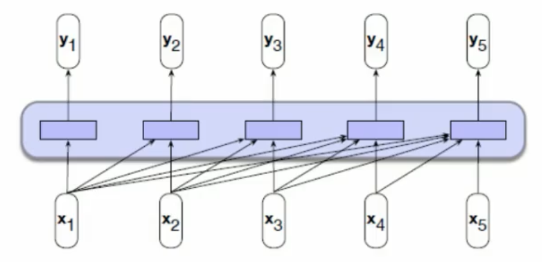
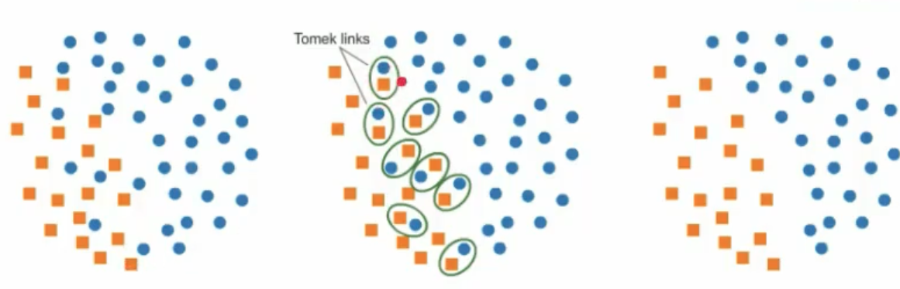
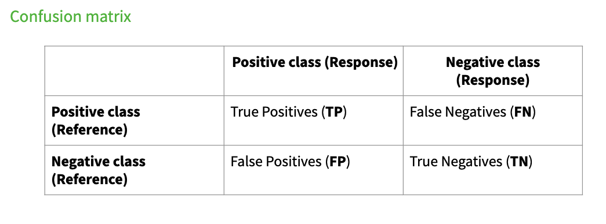
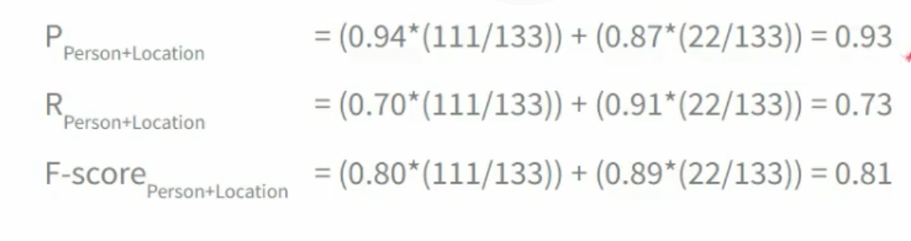
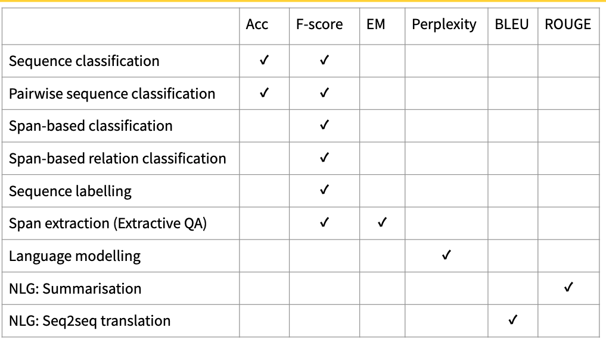
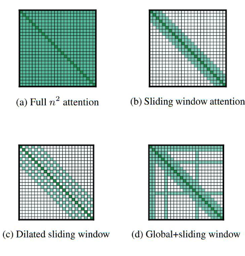
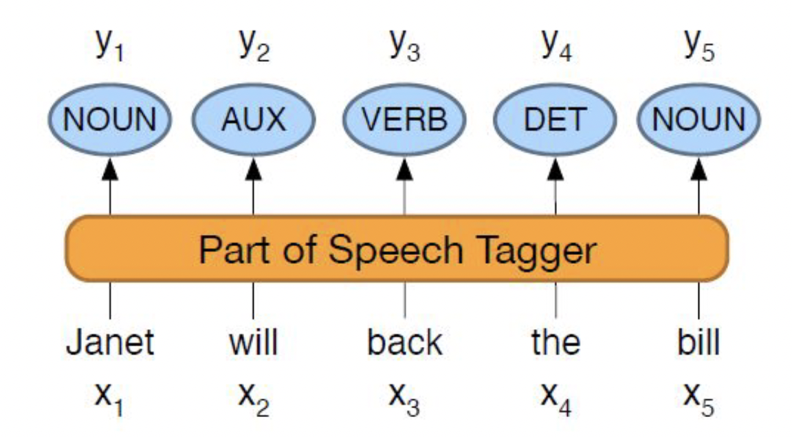

## Week 1

### What is Natural Language Understanding (NLU)

**NLP**: converts unstructred data into a structured form. i.e. tokenisation, stemming, lemmatisation, NER

**NLU**: determines the intended meaning of natural language experssions; enaables machines to recognise variations in language

* It helps in making agents more 


###  NLU Tasks

1. Sequence Classification
2. Pairwise sequence classification
3. Sequence labelling
4. span based operations

### Pairwise Sequence Classification

classification of two sequences according to the relaitonship that holds between them

input:  a predeined set of labels and a sequence pair
* I am confused
* Not all   are clear to me

output: entails

#### Sequence Lablling: BIO Scheme

Classification at the level of token; also known as token classification


#### Span-based Operation

1. Identification: identifying spans of interest as binary classification

input: 

* a label or quesiton (defining what is of interest): keyphrase
* a sequece: hert best groundstroke is her two-handed backhand

output: "grounstroke", "two-handed backand"

2. Classification: classifying spans according to a set of labels

input:

* a predefined set of labels: PER, ORG, GPE
* a sequence: jane Villanueva fo United Airines Holdings discused the merger

output:

* PER: "Jane Villanueva", ORG: "United Airlines Holdings", ORG: "Uited Airlines"

3 relation classification: classifying realtions between spans. (How are two spans related)

input:

* a predefined set of relation type labels: Employe-Of, Spouse-of, Sibling-of
* a sequence: Jane Villanueva of United Airlines Holdings discussed the merger

output:
* employee-of("Jane Villanueva", "United Airlines Holdings")

### Sentiment Analysis

* Given: a piece of text
* Problem: To identify if the sentiment containd is Positive, Negative or Neutral
* Sequence Classification

### Emotion Recognition

* Given a piece of text
* Problem: to identify the type of emotion contained depending on the label sheme used
* sequence classification

### Hate Speech Detection

* Given a piece of text
* Problem; to determine whether the text contains hate or not
* sequence classification

### Natural Language Inference (NLI)

* Given: two pieces of text: a premise and a hpothesis
* Problem: to determine whether the hypothesis is true(entailment), false(contradiction) or is netral in relation to the premise

### Paraphrase Identification

* Given: two pieces of text
* Problem: to determine whether one is a paragraphse of the other
* Pairwise classification

### Named Entity Recognition (NER)

* Given: a sequence
* Problem: to identify a sbsequence corresponding to semantic categories/labels of interest
* Sequence classification
* span based classification

### Entity Linking

* Given: a subsequence
* Probem: to link the subseuence to its standard/canonical form in vocabulary
* Pairise sequence classifcation
* span-based classification

### Semantic Role Labelling (SRL)

* Given: a sequence
* Problem: to identify predicate-argument strutures, answers to the question "who did what to whom where and when?"
* Sequence Labelling
* Span-based Classification


### Relation Extraction

* Given: two subsequences (spans)
* Problem: to identify the relation type that holds between them
* Span based relation classification


### Coreference Resolution

* Given: two subsequences (spans)
* Problem: to determine if the spans refer to the same real-world entity or concept
* span based relation clssification


## Multiple NLU Tasks

### Sentiment Anlysis


* Variation: Aspect-based Sentient Analysis
* Problem: to also identify the aspect of the target of sentiment
* Horrible services. The room was dirty and unpleasant
	* target: room
	* aspect: cleanlines (out of a set of categories that also include price, location, comfort)
* Underlying NLU Tasks
	* spant-based classification (target)
	* span-based classification (aspect)
	* span-based relation classification

predefined set of aspect: for example cleanliness, service time, price etc

predefined set of target: room, food etc

The task is broken down to three NLU task:
1. span-based classification (target)
2. span-based classification (aspect)
3. span-based relation classification: Know the relation between target and aspect.

### Fact Verification

* Given: a piece of text
* Problem: to determine whether the information contained is true (supported by facts) or not. Can be broken down into subtasks.

1. Claim Idenification:

* Problem: determine whether a piee of text is worth fact checking
* Underlying NLU tasks: sequence classification or span based identification

2. Evidence Retrival
	
* Problem: find (wihtin a pre-existing support corpus) pieces of text which are relevant to a given claim.
* Underlying NLU task: pairwise sequence classification

3. Automated Verification

* Problem: determine if a piece fo text contains information that is supported or refuetd by proided pieces of evidence
* Underlying NLU Task: pairwise sequence classification

First identify all the claims, by using sequence classification or span-based identification.

Second retrive evidence for the claims. It checks whether the claim and detected evidence are relevant, by using pairwise sequence classification

Third verify if the evidence support or refuse the claim. This is pairwise sequence classification problem
### Argument Mining

* Given: a piece of text or multiple pieces of text
* Problem: to identify argumentative structures

Subtasks

1. Argument component identification
* Problem: identify claims and premises
* Underlying NLU: span-based classification

2. Argument relation classification
* Problem: classify whetehr a premise supports a claim (whether the relationship between them is supported or oppose)
* Underlying NLU task: span-based relation classification

In the argument component identification, we need identify whether a span is a premise, claim or none of the above.
Given the premises and claims, check whether premise support the claim or refuse the claim

### Question Answering (Extractive)

* Given: two pieces of text, a passage and a question
* Problem: to identify the span of text that answers the question
* Underlying NLU task: pairwise, span-based identification

Which detected spans answers the question. We detect the spans of interest and verify whether it answers the question

### Event Extraction

* Given: a sequence, a list of named entities
* Problem: to identify events, i.e. the event trigger and event participants


Subtask

1. Event Trigger Detection

* Problem: to idenify the word that denotes the event and its type
* Underlying NLU task: span-based classification

Detect which span tiggers the event, and what type of event it is.

2. Event Participant Identification

* Problem: to determine the relationship that holds between a named entity and the event trigger
* Underlying NLU task: span-based relation classification

Detect the relationship between spans. We want to know the type of relationsihp hold betweeen named entities

### Week1 Exercise

Q1: Suppose that a task is concerned with identifying discourse segments, as shown. Which NLU task formulation(s) is/are suitable?

detect the segment in the example. This requires the specific part of the sentence, so we need to use sequence labelling or span-based identification

Q2: Suppose a task is focussed on categorisation according to types of figurative language, as shown. Which task formulation is most suitable? 
classification at the sequence level. Whether a sequence belong to a certain class. In fact multi-class sequence classification problem

Q3: Suppose a task assigns either of the labels "Not the A******" and "You're the A******" to a narration of a conflict (as shown). Which task formulation suits?

sequence classification problem for binary classification

Q4: The goal of temporal relation extraction is to create a graph representing Before/Overlap/After relations between mentions, as shown. 

Every pair of spans are classified according to before/after/overlap

Q8: Based on the output of a sequence labelling model shown below, what do you think are the limitations of the said model?

Because labelling is performed at the token level, the model fails to capture the relationship between tokens belonging to the same entity.

The model cannot capture nested/embedded entities.

IO sheme can't identify relation inside a named entity


## Week2

### Embeddings
Learned representations of the 
meaning of words
Based on vector semantics neighbouring words, tend to have  similar meanings

**tf-idf**
$tf-idf = tf * idf$
$$ 
tf_{c,d} = log_{10}(C(c,d)+1)
$$
$$
idf_{c,d} = log_{10}\frac{N}{df}
$$

N is the total number of documents in the corpus

df: document frequency, the number of documents contains the word c

**PPMI**

$$
PPMI(w,c) = max(log_2 \frac{p(w,c)}{p(w)p(c)},0)
$$

### Exercise

Q1 	
Select all that hold true in relation to fastText embeddings.

In fastText, the sum of subword embeddings is used to obtain a representation for an unknown word.

fastText is trained in a similar way to word2vec (i.e., using a skip gram or continuous bag-of-words model).

As with any vectors, cosine similarity can be used to assess similarity between fastText vectors.


Q2

In fastText, the sum of subword embeddings is used to obtain a representation for an unknown word.

fastText is trained in a similar way to word2vec (i.e., using a skip gram or continuous bag-of-words model).

As with any vectors, cosine similarity can be used to assess similarity between fastText vectors.

Q4 Advantage of RNN compared to N-Gram models

A hidden state in an RNN-based language model can incorporate information from all preceding words in a sequence (and in principle, the size of a sequence can be set to any number). In contrast, n-gram language models can incorporate information only from n-1 preceding tokens.

Additional information:  In n-gram language models, we cannot set n to a very large value because it is unlikely that the exact same history (preceding n-1 tokens) would appear often enough in a corpus. This means that in practice, n is usually set to a value no bigger than 5, which means that an n-gram language model usually can incorporate information only from 4 preceding tokens or less.


## Week3 Transformer

RNN has information bottleneck between the last hidden layer in encoder to the hidden states in decoder.

We use attention mechanism to attend the part that is most relevant states in the encoder to what is predicting for the current hidden state in decoder

### Attention Mechanism

Dot-product attention: 
$$
score(h_{i-1}^d, h_j^e) = h_{i-1}^d \dot h_j^e
$$

calculate this score for all encoder states, resulting in a vector showing the relevance of each encoder state $h_j^e$ to what is currently being decoded.

### Transformer

A shotcoming of sequence-based architecture such as RNN is that computation can't perform in parallel

Transformer can perform computation in parallel

* self-attention


## Week3

### Transformer

* Causal backward looking (left to right) transformer



The architecture allows computation done in parallel

### BERT
 
**Pretraining**

* leanring a representation of meaning of words or sentences
* usually done on huge amounts of textt
* results in pretrained language models

**Fine-tuning**

* taking a pretrained language model
* further training the model to perform a downstream task


**Transfer Learning**

* acquiring knoledge by learning on one task and hten applying it to a new task
* a pretrained BERT language model acquires knowledge about the language, which makes it easier to learn a new downstream NLU task.


#### Pretraining BERT

* BERT model learns a cloze task: filling in the blanks, inteading of predicting the next word

**Masked Language Modelling**: (MLM) first learning objective for BERT

* model is presented with a series of sentences from the training corpus
	* replaced with [mask]
	* replace by another token (randomly sampled based on unigram)
	* left unchanged

**Next Sentence Prediction (NSP)**: second learning objective for BERT

Model is presented with pairs of sentences

* 50% of pairs are adjaent sentences
* 50% of paris are unrelated (randomly selected) sentences

### Contextual Embedding

Vectors representing the meaning of a token within a context

Hw do we obtain them from the BERT language models?

* assume we have a sequence of input tokens $x_1,...,x_n$ and we are interested in the contextual embedings for token $x_i$

We can take the input vector $y_i$ from the final layer of the model

## Week 4

### Evaluation

Types of evaluation

1. Manual vs Automatic
2. Formative vs Summative
3. Intrinsic vs Extrinsic
4. Component vs End-to-End

#### Automatic vs Manual

Manual evaluation: involves human assessment

Limitation:
* inconsistencies
* hard to control for external factors
* time consuming and laborious

Automatic evaluation:

* Data Driven
* requries algorithms mmicking human assessors.

#### Formative Evaluation vs Summative

Formative eval: 

* occurs during development
* inform the developer system performance
* automatic and lightweight

Summative eval:

* conducted after system completion; involves human judges
* assess if system's goal is achived

#### Intrinsic vs Extrinsic

Intrinsic evaluation: assessment in terms of the system's underlying/internal task

Extrinsic evaluaiton: assessment in terms of impact of the system to an external task

Example:  hate speech detection

* intrinsic: how well does the sequence classiication model perform?
* extrinsic: how much faster is a human able to carry out content moderation?


#### Component vs End-to-End

component evaluation: 

* asessing each component comprising a pipeline
* allows or isolating errors and identifying problematic components

end-to-end evaluation

* assssign all components at once
* provides an indication of a system's effectiveness under real-world conditions

### Preparing data for Evaluation

**Fixed Partition**
* training set: the bulk of the entire data
* held out set: divided into
	* development/validation set
* test set: for summative evaluation after system development
* 70/20/10 (training/dev/test)

**Consideration**

* disjointness of the subsets
* if test data and training data is from the same data distribution

Limitation:

* lukcy partition?
 if the entire data set is smal, there might not be enough samples for training

**K-fold corss validation**

* data is split into k folds
* for each round i in k rounds: all folds except fold i are used for training, and fold i for testing
* if parameter tuning is needed, a small part of the training folds is held out


**Watch out for: Sampling bias**

Stratified random sampling
* a representative number of instances are randomly drawn from each class (strata)
* ensrues each class is sufficiently represented (in the test set)

**Watch out for: Imabalanced Data**

Datasets where some classes are over-represented (majority class) whiel others are under-represented (minority) class.

Example: hate speech detection data

**Mitigation**:

1. random under sampling: 
	* randomly selecting what to remove or keep from the majority class
	* can lead to loss in information
2. under sampling using Tomek Links
	* removes Tomek links: pairs of instances from opposite classes which are very similar to each other



3. random over sampling
	* copies randomly selected isntances from the minority class
	* can lead to over-fitting
4. Synthetic minorrrrrrrity over sampling technique (SMOTE): creates new instancesfrom the minoriy class
	* randomly selects an instance m and finds the k (5) nearest neighbour (NNs) to it one NN n is chosen
	* a synthetic instance is generated by taking the convex combination of m and n


### Data Reliability

**Annotator agreement**: measured to help us decide whether we can trust the labels

* intra-annotator agreement: wheter the same human consistently annoates the same item when presented at *different* times
* inter-annotator ageement: whether *mulitple* humans consisetntly annotate the same item even when working independently.

**InterAnnotator Agreement** (IAA)

* the agreement between human annotator (labelers/coders)
* serves as the difficulty level of the task
* serves as an upper bound on the performance of automated methods

Simplistic approach: observed agrreement

* ratio of the number of items on which annotaors agree, to total number of items
* does not take into account agreement by chance (random agreement)

### Cohen's Kappa coefficient

$$
K = \frac{P(a) - P(e)}{1-P(e)}
$$

$P(a)$ is the observed agreement, proportion of times annotators agreed

$P(e)$ is the expected agreement, proportion of times annotators expected to agree by chance

$P(a) = P(A1=yes,A2=yes) + P(A1=No,A2=No)$

$P(e) = P(A1=yes) * P(A2=yes) + P(A1=No) * P(A2=No) $


Interpretation of Kappa Coefficient

1. negative value: disagreement
2. >0.6 is acceptable


### NER Task

Fscore is reported

* annotation from one annotator is gold standard
* annotations from another annotator is considered as response, whose F score is measured against the standard

$$
F = \frac{2PR}{P+R}
$$


### Evaluation Metrics


* Accuracy:
	* limitation: suitable only for balanced data
* Precision: $$P= \frac{TP}{TP+FP} $$
* Recal: $$R = \frac{TP}{TP+FN} $$
8 F socre: $$F = \frac{2PR}{P+R} $$

**Macro Averaging**: average of in certain category: precision, recall, f score

**Weighted Macro Averaging**: sum up the per-category product of metric value and weight $ n_{support}/n_{total_support}$



**Micro Averaging**: pool togather the TPs, FPs, FNs across all categorties

#### Recommendation

* macro averaging: all classes are equally important
* weighted macro averaging: majority class is more important
* micro averaging: minority class is more important


#### Suitable area for F score

* sequence classification
* pairsewise sequence classification task
* span based classification, span based relation classification
* inter annotator agreement
* sequence labelling
* span based identification



#### Perplexity for language model

A language model should not be perplexed (suprised) by a correct sequence of tokens and should assign a high probablity to such a correct sequence 

Given a test sequence $W=w_1w_2w_3...w_n$

$$
PP(W) = P(w_1w_2...w_n)^{\frac{-1}{N}}
$$

The lower the value of PP (the higher probability), the better


## Week 4

### Text Classification

Text classification is defined as the taskof assigning a class from a fixed collection of K classes to a piece of text

$$
MCC = \frac{TP \times TN - FP \times FN}{\sqrt{(TP + FP)(TP + FN)(TN + FP)(TN + FN)}}
$$

### Text Classification Traditional Approach

**Naive Bayes**

$$
P(x_1,...,x_n,C_k) = P(C_k) \prod_{i=}^n P(x_i \mid C_k)
$$


### Depp Learning Approach

DL approaches rely on embeddings and neural network to encode the text and to obtain a distributed and contextualised representation.

The encoder is based on

* averaging of embeddings
* CNN/RNN over embeddings
* Pre-trained lanugauge model, i.e. BERT

```python
class RobertaClasificationHead(nn.Module):
	def __init__(self,config):
		super().__init__()
		self.dense = nn.Linear(config.hidden_size, config.hidden_size)
		self.dropout = nn.Dropout(dropout_prob)
		self.out_proj = nn.Linear(config.hidden_size, config.num_labels)

	def forward(self, roberta_output):
		x = roberta_output[:, 0, :] 
		x = self.dropout(x)
		x = self.dense(x)
		x = torch.tanh(x)
		x = self.dropout(x)
		x = self.out_proj(x)
		return x
```

### Multi Label Multi Class

We don't use Softmax for this task, but we model the probability of each label independently, usign element wise sigmoid and then reduce them to a single scalar


### Long Document Classification

We can use 
* Truncation
* Hierachical approaches
* Dedicated architecture: the LongFormer



## Week 5

### Sequence Labelling

* POS Tagging
* NER
* Semantic Role Labelling (SRL)


#### Part of Speech Tagging

* word classes defined based on 
	* their grammatical relationsihp with neighbouring words
	* morphological properties
* closed class: new words unlikely added
* open class:  new words likely to be added

POS annotation tags comes from

* Penn Treebank
* Universal Scheme


**POS Tagging**

* Task: to assign pos tag to each word in a sequence
* Input: a sequence $x_1,x_2,...,x_n$ of words and a tagset
* Ouput: a sequence $y_1,y_2,...,y_n$ of tags



#### Semantic Role Labelling (SRL)

Identifying predicate-argument structures: who did what to whom where and when


* Predicate: words expressing the event (the what) 行为
* Argument: the participants in the event (the who, whom, where, and when) 时间，地点，人物
* Semantic Role: the role that each argument (predicates) takes

common schemes

* Proposition Bank (propbank): roles are specific for a verb and named with numbers
* Framenet

PropBank
1. Arg0: initiator of the action
2. Arg1: the reciveer of an action
3. Arg2: so on

Framenet: roels are specific to frame

Frame: a set of related concepts that together comprise background knowledge on some event--which can be expressed by verbs, nouns, adjectives, etc

#### NER

Named Entity: anything that can be referred to using a proper name, and can also include expression like dates, time, amounts/prices


Schemes: IO, BIO, BIOSE

### Sequence Labelling Traditional Approach

#### Stochastic Approach HMM


$$
t = argmax P(t_1^n \mid w_1^n) \approx argmax \prod_{i=1}^n P(t_i\mid t_{i-1})P(w_i\mid t_i)
$$


**Issues of HMM**: it's hard to include our own features that can help discriminate between different tags

#### Conditional Random Field

CRF: model that discriminates among all possible tag sequences

$$
\hat{Y} = argmax P(Y \mid X)
$$

It assigns a probability to an entire sequence Y for every possible sequence in y, given the input sequence X


$$
P(Y \mid X) = \frac{1}{Z(X)} \exp{\sum_{k=1}^K w_k \times F_K(X,Y)}
$$

* Global Feature: property of the entire sequences X and Y, which is a sum of local features at each position i in Y
* Local Feature: makes use of current output token y_i, previous output token $y_{i-1}$, any part of the input sequence X, and the current position
* $Z(X)$: normalisation factor
* K number of eatures
* $w_k$ feature weight

#### Deep Learning Approach

BERT 
* local approach. it does not take into account dependencies between tags
