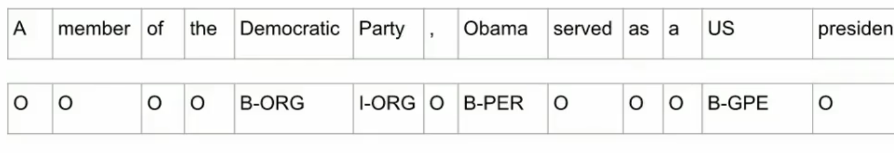
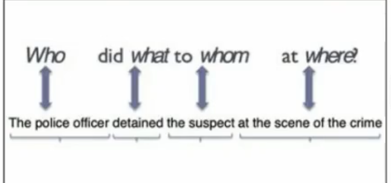
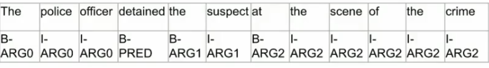
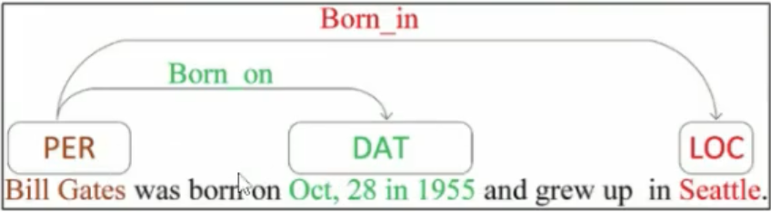
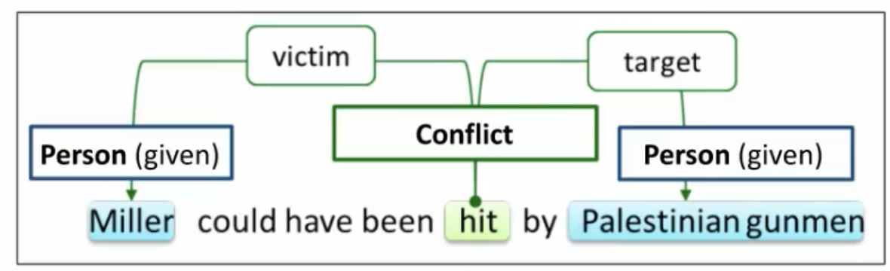

## Week 1

### What is Natural Language Understanding (NLU)

**NLP**: converts unstructred data into a structured form. i.e. tokenisation, stemming, lemmatisation, NER

**NLU**: determines the intended meaning of natural language experssions; enaables machines to recognise variations in language

* It helps in making agents more 

###  NLU Tasks

1. Sequence Classification
2. Pairwise sequence classification
3. Sequence labelling
4. span based operations

### Pairwise Sequence Classification

classification of two sequences according to the relaitonship that holds between them

input:  a predeined set of labels and a sequence pair
* I am confused
* Not all   are clear to me

output: entails

#### Sequence Lablling: BIO Scheme

Classification at the level of token; also known as token classification

#### Span-based Operation

1. Identification: identifying spans of interest as binary classification

input: 

* a label or quesiton (defining what is of interest): keyphrase
* a sequece: hert best groundstroke is her two-handed backhand

output: "grounstroke", "two-handed backand"

2. Classification: classifying spans according to a set of labels

input:

* a predefined set of labels: PER, ORG, GPE
* a sequence: jane Villanueva fo United Airines Holdings discused the merger

output:

* PER: "Jane Villanueva", ORG: "United Airlines Holdings", ORG: "Uited Airlines"

3 relation classification: classifying realtions between spans. (How are two spans related)

input:

* a predefined set of relation type labels: Employe-Of, Spouse-of, Sibling-of
* a sequence: Jane Villanueva of United Airlines Holdings discussed the merger

output:
* employee-of("Jane Villanueva", "United Airlines Holdings")

### Sentiment Analysis

* Given: a piece of text
* Problem: To identify if the sentiment containd is Positive, Negative or Neutral
* Sequence Classification

### Emotion Recognition

* Given a piece of text
* Problem: to identify the type of emotion contained depending on the label sheme used
* sequence classification

### Hate Speech Detection

* Given a piece of text
* Problem; to determine whether the text contains hate or not
* sequence classification

### Natural Language Inference (NLI)

* Given: two pieces of text: a premise and a hpothesis
* Problem: to determine whether the hypothesis is true(entailment), false(contradiction) or is netral in relation to the premise

### Paraphrase Identification

* Given: two pieces of text
* Problem: to determine whether one is a paragraphse of the other
* Pairwise classification

### Named Entity Recognition (NER)

* Given: a sequence
* Problem: to identify a sbsequence corresponding to semantic categories/labels of interest
* Sequence classification
* span based classification

### Entity Linking

* Given: a subsequence
* Probem: to link the subseuence to its standard/canonical form in vocabulary
* Pairise sequence classifcation
* span-based classification

### Semantic Role Labelling (SRL)

* Given: a sequence
* Problem: to identify predicate-argument strutures, answers to the question "who did what to whom where and when?"
* Sequence Labelling
* Span-based Classification

### Relation Extraction

* Given: two subsequences (spans)
* Problem: to identify the relation type that holds between them
* Span based relation classification

### Coreference Resolution

* Given: two subsequences (spans)
* Problem: to determine if the spans refer to the same real-world entity or concept
* span based relation clssification

## Multiple NLU Tasks

### Sentiment Anlysis

* Variation: Aspect-based Sentient Analysis
* Problem: to also identify the aspect of the target of sentiment
* Horrible services. The room was dirty and unpleasant
	* target: room
	* aspect: cleanlines (out of a set of categories that also include price, location, comfort)
* Underlying NLU Tasks
	* spant-based classification (target)
	* span-based classification (aspect)
	* span-based relation classification

predefined set of aspect: for example cleanliness, service time, price etc

predefined set of target: room, food etc

The task is broken down to three NLU task:
1. span-based classification (target)
2. span-based classification (aspect)
3. span-based relation classification: Know the relation between target and aspect.

### Fact Verification

* Given: a piece of text
* Problem: to determine whether the information contained is true (supported by facts) or not. Can be broken down into subtasks.

1. Claim Idenification:

* Problem: determine whether a piee of text is worth fact checking
* Underlying NLU tasks: sequence classification or span based identification

2. Evidence Retrival
	
* Problem: find (wihtin a pre-existing support corpus) pieces of text which are relevant to a given claim.
* Underlying NLU task: pairwise sequence classification

3. Automated Verification

* Problem: determine if a piece fo text contains information that is supported or refuetd by proided pieces of evidence
* Underlying NLU Task: pairwise sequence classification

First identify all the claims, by using sequence classification or span-based identification.

Second retrive evidence for the claims. It checks whether the claim and detected evidence are relevant, by using pairwise sequence classification

Third verify if the evidence support or refuse the claim. This is pairwise sequence classification problem
### Argument Mining

* Given: a piece of text or multiple pieces of text
* Problem: to identify argumentative structures

Subtasks

1. Argument component identification
* Problem: identify claims and premises
* Underlying NLU: span-based classification

2. Argument relation classification
* Problem: classify whetehr a premise supports a claim (whether the relationship between them is supported or oppose)
* Underlying NLU task: span-based relation classification

In the argument component identification, we need identify whether a span is a premise, claim or none of the above.
Given the premises and claims, check whether premise support the claim or refuse the claim

### Question Answering (Extractive)

* Given: two pieces of text, a passage and a question
* Problem: to identify the span of text that answers the question
* Underlying NLU task: pairwise, span-based identification

Which detected spans answers the question. We detect the spans of interest and verify whether it answers the question

### Event Extraction

* Given: a sequence, a list of named entities
* Problem: to identify events, i.e. the event trigger and event participants

Subtask

1. Event Trigger Detection

* Problem: to idenify the word that denotes the event and its type
* Underlying NLU task: span-based classification

Detect which span tiggers the event, and what type of event it is.

2. Event Participant Identification

* Problem: to determine the relationship that holds between a named entity and the event trigger
* Underlying NLU task: span-based relation classification

Detect the relationship between spans. We want to know the type of relationsihp hold betweeen named entities

### Week1 Exercise

Q1: Suppose that a task is concerned with identifying discourse segments, as shown. Which NLU task formulation(s) is/are suitable?

detect the segment in the example. This requires the specific part of the sentence, so we need to use sequence labelling or span-based identification

Q2: Suppose a task is focussed on categorisation according to types of figurative language, as shown. Which task formulation is most suitable? 
classification at the sequence level. Whether a sequence belong to a certain class. In fact multi-class sequence classification problem

Q3: Suppose a task assigns either of the labels "Not the A******" and "You're the A******" to a narration of a conflict (as shown). Which task formulation suits?

sequence classification problem for binary classification

Q4: The goal of temporal relation extraction is to create a graph representing Before/Overlap/After relations between mentions, as shown. 

Every pair of spans are classified according to before/after/overlap

Q8: Based on the output of a sequence labelling model shown below, what do you think are the limitations of the said model?

Because labelling is performed at the token level, the model fails to capture the relationship between tokens belonging to the same entity.

The model cannot capture nested/embedded entities.

IO sheme can't identify relation inside a named entity

## Week2

### Embeddings
Learned representations of the 
meaning of words
Based on vector semantics neighbouring words, tend to have  similar meanings

**tf-idf**
$tf-idf = tf * idf$
$$ 
tf_{c,d} = log_{10}(C(c,d)+1)
$$
$$
idf_{c,d} = log_{10}\frac{N}{df}
$$

N is the total number of documents in the corpus

df: document frequency, the number of documents contains the word c

**PPMI**

$$
PPMI(w,c) = max(log_2 \frac{p(w,c)}{p(w)p(c)},0)
$$

### Exercise

Q1 	
Select all that hold true in relation to fastText embeddings.

In fastText, the sum of subword embeddings is used to obtain a representation for an unknown word.

fastText is trained in a similar way to word2vec (i.e., using a skip gram or continuous bag-of-words model).

As with any vectors, cosine similarity can be used to assess similarity between fastText vectors.

Q2

In fastText, the sum of subword embeddings is used to obtain a representation for an unknown word.

fastText is trained in a similar way to word2vec (i.e., using a skip gram or continuous bag-of-words model).

As with any vectors, cosine similarity can be used to assess similarity between fastText vectors.

Q4 Advantage of RNN compared to N-Gram models

A hidden state in an RNN-based language model can incorporate information from all preceding words in a sequence (and in principle, the size of a sequence can be set to any number). In contrast, n-gram language models can incorporate information only from n-1 preceding tokens.

Additional information:  In n-gram language models, we cannot set n to a very large value because it is unlikely that the exact same history (preceding n-1 tokens) would appear often enough in a corpus. This means that in practice, n is usually set to a value no bigger than 5, which means that an n-gram language model usually can incorporate information only from 4 preceding tokens or less.

## Week3 Transformer

RNN has information bottleneck between the last hidden layer in encoder to the hidden states in decoder.

We use attention mechanism to attend the part that is most relevant states in the encoder to what is predicting for the current hidden state in decoder

### Attention Mechanism

Dot-product attention: 
$$
score(h_{i-1}^d, h_j^e) = h_{i-1}^d \dot h_j^e
$$

calculate this score for all encoder states, resulting in a vector showing the relevance of each encoder state $h_j^e$ to what is currently being decoded.

### Transformer

A shotcoming of sequence-based architecture such as RNN is that computation can't perform in parallel

Transformer can perform computation in parallel

* self-attention

