## Week 1

### What is Natural Language Understanding (NLU)

**NLP**: converts unstructred data into a structured form. i.e. tokenisation, stemming, lemmatisation, NER

**NLU**: determines the intended meaning of natural language experssions; enaables machines to recognise variations in language

* It helps in making agents more 


###  NLU Tasks

1. Sequence Classification
2. Pairwise sequence classification
3. Sequence labelling
4. span based operations

### Pairwise Sequence Classification

classification of two sequences according to the relaitonship that holds between them

input:  a predeined set of labels and a sequence pair
* I am confused
* Not all   are clear to me

output: entails

#### Sequence Lablling: BIO Scheme

Classification at the level of token; also known as token classification


#### Span-based Operation

1. Identification: identifying spans of interest as binary classification

input: 

* a label or quesiton (defining what is of interest): keyphrase
* a sequece: hert best groundstroke is her two-handed backhand

output: "grounstroke", "two-handed backand"

2. Classification: classifying spans according to a set of labels

input:

* a predefined set of labels: PER, ORG, GPE
* a sequence: jane Villanueva fo United Airines Holdings discused the merger

output:

* PER: "Jane Villanueva", ORG: "United Airlines Holdings", ORG: "Uited Airlines"

3 relation classification: classifying realtions between spans. (How are two spans related)

input:

* a predefined set of relation type labels: Employe-Of, Spouse-of, Sibling-of
* a sequence: Jane Villanueva of United Airlines Holdings discussed the merger

output:
* employee-of("Jane Villanueva", "United Airlines Holdings")

### Sentiment Analysis

* Given: a piece of text
* Problem: To identify if the sentiment containd is Positive, Negative or Neutral
* Sequence Classification

### Emotion Recognition

* Given a piece of text
* Problem: to identify the type of emotion contained depending on the label sheme used
* sequence classification

### Hate Speech Detection

* Given a piece of text
* Problem; to determine whether the text contains hate or not
* sequence classification

### Natural Language Inference (NLI)

* Given: two pieces of text: a premise and a hpothesis
* Problem: to determine whether the hypothesis is true(entailment), false(contradiction) or is netral in relation to the premise

### Paraphrase Identification

* Given: two pieces of text
* Problem: to determine whether one is a paragraphse of the other
* Pairwise classification

### Named Entity Recognition (NER)

* Given: a sequence
* Problem: to identify a sbsequence corresponding to semantic categories/labels of interest
* Sequence classification
* span based classification

### Entity Linking

* Given: a subsequence
* Probem: to link the subseuence to its standard/canonical form in vocabulary
* Pairise sequence classifcation
* span-based classification

### Semantic Role Labelling (SRL)

* Given: a sequence
* Problem: to identify predicate-argument strutures, answers to the question "who did what to whom where and when?"
* Sequence Labelling
* Span-based Classification


### Relation Extraction

* Given: two subsequences (spans)
* Problem: to identify the relation type that holds between them
* Span based relation classification


### Coreference Resolution

* Given: two subsequences (spans)
* Problem: to determine if the spans refer to the same real-world entity or concept
* span based relation clssification


## Multiple NLU Tasks

### Sentiment Anlysis


* Variation: Aspect-based Sentient Analysis
* Problem: to also identify the aspect of the target of sentiment
* Horrible services. The room was dirty and unpleasant
	* target: room
	* aspect: cleanlines (out of a set of categories that also include price, location, comfort)
* Underlying NLU Tasks
	* spant-based classification (target)
	* span-based classification (aspect)
	* span-based relation classification

predefined set of aspect: for example cleanliness, service time, price etc

predefined set of target: room, food etc

The task is broken down to three NLU task:
1. span-based classification (target)
2. span-based classification (aspect)
3. span-based relation classification: Know the relation between target and aspect.

### Fact Verification

* Given: a piece of text
* Problem: to determine whether the information contained is true (supported by facts) or not. Can be broken down into subtasks.

1. Claim Idenification:

* Problem: determine whether a piee of text is worth fact checking
* Underlying NLU tasks: sequence classification or span based identification

2. Evidence Retrival
	
* Problem: find (wihtin a pre-existing support corpus) pieces of text which are relevant to a given claim.
* Underlying NLU task: pairwise sequence classification

3. Automated Verification

* Problem: determine if a piece fo text contains information that is supported or refuetd by proided pieces of evidence
* Underlying NLU Task: pairwise sequence classification

First identify all the claims, by using sequence classification or span-based identification.

Second retrive evidence for the claims. It checks whether the claim and detected evidence are relevant, by using pairwise sequence classification

Third verify if the evidence support or refuse the claim. This is pairwise sequence classification problem
### Argument Mining

* Given: a piece of text or multiple pieces of text
* Problem: to identify argumentative structures

Subtasks

1. Argument component identification
* Problem: identify claims and premises
* Underlying NLU: span-based classification

2. Argument relation classification
* Problem: classify whetehr a premise supports a claim (whether the relationship between them is supported or oppose)
* Underlying NLU task: span-based relation classification

In the argument component identification, we need identify whether a span is a premise, claim or none of the above.
Given the premises and claims, check whether premise support the claim or refuse the claim

### Question Answering (Extractive)

* Given: two pieces of text, a passage and a question
* Problem: to identify the span of text that answers the question
* Underlying NLU task: pairwise, span-based identification

Which detected spans answers the question. We detect the spans of interest and verify whether it answers the question

### Event Extraction

* Given: a sequence, a list of named entities
* Problem: to identify events, i.e. the event trigger and event participants


Subtask

1. Event Trigger Detection

* Problem: to idenify the word that denotes the event and its type
* Underlying NLU task: span-based classification

Detect which span tiggers the event, and what type of event it is.

2. Event Participant Identification

* Problem: to determine the relationship that holds between a named entity and the event trigger
* Underlying NLU task: span-based relation classification

Detect the relationship between spans. We want to know the type of relationsihp hold betweeen named entities

### Week1 Exercise

Q1: Suppose that a task is concerned with identifying discourse segments, as shown. Which NLU task formulation(s) is/are suitable?

detect the segment in the example. This requires the specific part of the sentence, so we need to use sequence labelling or span-based identification

Q2: Suppose a task is focussed on categorisation according to types of figurative language, as shown. Which task formulation is most suitable? 
classification at the sequence level. Whether a sequence belong to a certain class. In fact multi-class sequence classification problem

Q3: Suppose a task assigns either of the labels "Not the A******" and "You're the A******" to a narration of a conflict (as shown). Which task formulation suits?

sequence classification problem for binary classification

Q4: The goal of temporal relation extraction is to create a graph representing Before/Overlap/After relations between mentions, as shown. 

Every pair of spans are classified according to before/after/overlap

Q8: Based on the output of a sequence labelling model shown below, what do you think are the limitations of the said model?

Because labelling is performed at the token level, the model fails to capture the relationship between tokens belonging to the same entity.

The model cannot capture nested/embedded entities.

IO sheme can't identify relation inside a named entity


## Week2

### Embeddings
Learned representations of the 
meaning of words
Based on vector semantics neighbouring words, tend to have  similar meanings

**tf-idf**
$tf-idf = tf * idf$
$$ 
tf_{c,d} = log_{10}(C(c,d)+1)
$$
$$
idf_{c,d} = log_{10}\frac{N}{df}
$$

N is the total number of documents in the corpus

df: document frequency, the number of documents contains the word c

**PPMI**

$$
PPMI(w,c) = max(log_2 \frac{p(w,c)}{p(w)p(c)},0)
$$

### Exercise

Q1 	
Select all that hold true in relation to fastText embeddings.

In fastText, the sum of subword embeddings is used to obtain a representation for an unknown word.

fastText is trained in a similar way to word2vec (i.e., using a skip gram or continuous bag-of-words model).

As with any vectors, cosine similarity can be used to assess similarity between fastText vectors.


Q2

In fastText, the sum of subword embeddings is used to obtain a representation for an unknown word.

fastText is trained in a similar way to word2vec (i.e., using a skip gram or continuous bag-of-words model).

As with any vectors, cosine similarity can be used to assess similarity between fastText vectors.

Q4 Advantage of RNN compared to N-Gram models

A hidden state in an RNN-based language model can incorporate information from all preceding words in a sequence (and in principle, the size of a sequence can be set to any number). In contrast, n-gram language models can incorporate information only from n-1 preceding tokens.

Additional information:  In n-gram language models, we cannot set n to a very large value because it is unlikely that the exact same history (preceding n-1 tokens) would appear often enough in a corpus. This means that in practice, n is usually set to a value no bigger than 5, which means that an n-gram language model usually can incorporate information only from 4 preceding tokens or less.


## Week3 Transformer

RNN has information bottleneck between the last hidden layer in encoder to the hidden states in decoder.

We use attention mechanism to attend the part that is most relevant states in the encoder to what is predicting for the current hidden state in decoder

### Attention Mechanism

Dot-product attention: 
$$
score(h_{i-1}^d, h_j^e) = h_{i-1}^d \dot h_j^e
$$

calculate this score for all encoder states, resulting in a vector showing the relevance of each encoder state $h_j^e$ to what is currently being decoded.

### Transformer

A shotcoming of sequence-based architecture such as RNN is that computation can't perform in parallel

Transformer can perform computation in parallel

* self-attention


## Week3

### Transformer

* Causal backward looking (left to right) transformer


The architecture allows computation done in parallel

### BERT
 
**Pretraining**

* leanring a representation of meaning of words or sentences
* usually done on huge amounts of textt
* results in pretrained language models

**Fine-tuning**

* taking a pretrained language model
* further training the model to perform a downstream task


**Transfer Learning**

* acquiring knoledge by learning on one task and hten applying it to a new task
* a pretrained BERT language model acquires knowledge about the language, which makes it easier to learn a new downstream NLU task.


#### Pretraining BERT

* BERT model learns a cloze task: filling in the blanks, inteading of predicting the next word

**Masked Language Modelling**: (MLM) first learning objective for BERT

* model is presented with a series of sentences from the training corpus
	* replaced with [mask]
	* replace by another token (randomly sampled based on unigram)
	* left unchanged

**Next Sentence Prediction (NSP)**: second learning objective for BERT

Model is presented with pairs of sentences

* 50% of pairs are adjaent sentences
* 50% of paris are unrelated (randomly selected) sentences

### Contextual Embedding

Vectors representing the meaning of a token within a context

Hw do we obtain them from the BERT language models?

* assume we have a sequence of input tokens $x_1,...,x_n$ and we are interested in the contextual embedings for token $x_i$

We can take the input vector $y_i$ from the final layer of the model

## Week 4

### Evaluation

Types of evaluation

1. Manual vs Automatic
2. Formative vs Summative
3. Intrinsic vs Extrinsic
4. Component vs End-to-End

#### Automatic vs Manual

Manual evaluation: involves human assessment

Limitation:
* inconsistencies
* hard to control for external factors
* time consuming and laborious

Automatic evaluation:

* Data Driven
* requries algorithms mmicking human assessors.

#### Formative Evaluation vs Summative

Formative eval: 

* occurs during development
* inform the developer system performance
* automatic and lightweight

Summative eval:

* conducted after system completion; involves human judges
* assess if system's goal is achived

#### Intrinsic vs Extrinsic

Intrinsic evaluation: assessment in terms of the system's underlying/internal task

Extrinsic evaluaiton: assessment in terms of impact of the system to an external task

Example:  hate speech detection

* intrinsic: how well does the sequence classiication model perform?
* extrinsic: how much faster is a human able to carry out content moderation?


#### Component vs End-to-End

component evaluation: 

* asessing each component comprising a pipeline
* allows or isolating errors and identifying problematic components

end-to-end evaluation

* assssign all components at once
* provides an indication of a system's effectiveness under real-world conditions

### Preparing data for Evaluation

**Fixed Partition**
* training set: the bulk of the entire data
* held out set: divided into
	* development/validation set
* test set: for summative evaluation after system development
* 70/20/10 (training/dev/test)

**Consideration**

* disjointness of the subsets
* if test data and training data is from the same data distribution

Limitation:

* lukcy partition?
 if the entire data set is smal, there might not be enough samples for training

**K-fold corss validation**

* data is split into k folds
* for each round i in k rounds: all folds except fold i are used for training, and fold i for testing
* if parameter tuning is needed, a small part of the training folds is held out


**Watch out for: Sampling bias**

Stratified random sampling
* a representative number of instances are randomly drawn from each class (strata)
* ensrues each class is sufficiently represented (in the test set)

**Watch out for: Imabalanced Data**

Datasets where some classes are over-represented (majority class) whiel others are under-represented (minority) class.

Example: hate speech detection data

**Mitigation**:

1. random under sampling: 
	* randomly selecting what to remove or keep from the majority class
	* can lead to loss in information
2. under sampling using Tomek Links
	* removes Tomek links: pairs of instances from opposite classes which are very similar to each other


3. random over sampling
	* copies randomly selected isntances from the minority class
	* can lead to over-fitting
4. Synthetic minorrrrrrrity over sampling technique (SMOTE): creates new instancesfrom the minoriy class
	* randomly selects an instance m and finds the k (5) nearest neighbour (NNs) to it one NN n is chosen
	* a synthetic instance is generated by taking the convex combination of m and n


### Data Reliability

**Annotator agreement**: measured to help us decide whether we can trust the labels

* intra-annotator agreement: wheter the same human consistently annoates the same item when presented at *different* times
* inter-annotator ageement: whether *mulitple* humans consisetntly annotate the same item even when working independently.

**InterAnnotator Agreement** (IAA)

* the agreement between human annotator (labelers/coders)
* serves as the difficulty level of the task
* serves as an upper bound on the performance of automated methods

Simplistic approach: observed agrreement

* ratio of the number of items on which annotaors agree, to total number of items
* does not take into account agreement by chance (random agreement)

### Cohen's Kappa coefficient

$$
K = \frac{P(a) - P(e)}{1-P(e)}
$$

$P(a)$ is the observed agreement, proportion of times annotators agreed

$P(e)$ is the expected agreement, proportion of times annotators expected to agree by chance

$P(a) = P(A1=yes,A2=yes) + P(A1=No,A2=No)$

$P(e) = P(A1=yes) * P(A2=yes) + P(A1=No) * P(A2=No) $


Interpretation of Kappa Coefficient

1. negative value: disagreement
2. larger than 0.6 is acceptable


### NER Task

Fscore is reported

* annotation from one annotator is gold standard
* annotations from another annotator is considered as response, whose F score is measured against the standard

$$
F = \frac{2PR}{P+R}
$$


### Evaluation Metrics


* Accuracy:
	* limitation: suitable only for balanced data
* Precision: $$P= \frac{TP}{TP+FP} $$
* Recal: $$R = \frac{TP}{TP+FN} $$
* F socre: $$F = \frac{2PR}{P+R} $$

**Macro Averaging**: average of in certain category: precision, recall, f score

**Weighted Macro Averaging**: sum up the per-category product of metric value and weight $ n_{support}/n_{total_support}$


**Micro Averaging**: pool togather the TPs, FPs, FNs across all categorties

#### Recommendation

* macro averaging: all classes are equally important
* weighted macro averaging: majority class is more important
* micro averaging: minority class is more important


#### Suitable area for F score

* sequence classification
* pairsewise sequence classification task
* span based classification, span based relation classification
* inter annotator agreement
* sequence labelling
* span based identification


#### Perplexity for language model

A language model should not be perplexed (suprised) by a correct sequence of tokens and should assign a high probablity to such a correct sequence 

Given a test sequence $W=w_1w_2w_3...w_n$

$$
PP(W) = P(w_1w_2...w_n)^{\frac{-1}{N}}
$$

The lower the value of PP (the higher probability), the better


## Week 5

### Text Classification

Text classification is defined as the taskof assigning a class from a fixed collection of K classes to a piece of text

$$
MCC = \frac{TP \times TN - FP \times FN}{\sqrt{(TP + FP)(TP + FN)(TN + FP)(TN + FN)}}
$$

### Text Classification Traditional Approach

**Naive Bayes**

$$
P(x_1,...,x_n,C_k) = P(C_k) \prod_{i=}^n P(x_i \mid C_k)
$$


### Depp Learning Approach

DL approaches rely on embeddings and neural network to encode the text and to obtain a distributed and contextualised representation.

The encoder is based on

* averaging of embeddings
* CNN/RNN over embeddings
* Pre-trained lanugauge model, i.e. BERT

```python
class RobertaClasificationHead(nn.Module):
	def __init__(self,config):
		super().__init__()
		self.dense = nn.Linear(config.hidden_size, config.hidden_size)
		self.dropout = nn.Dropout(dropout_prob)
		self.out_proj = nn.Linear(config.hidden_size, config.num_labels)

	def forward(self, roberta_output):
		x = roberta_output[:, 0, :] 
		x = self.dropout(x)
		x = self.dense(x)
		x = torch.tanh(x)
		x = self.dropout(x)
		x = self.out_proj(x)
		return x
```

### Multi Label Multi Class

We don't use Softmax for this task, but we model the probability of each label independently, usign element wise sigmoid and then reduce them to a single scalar


### Long Document Classification

We can use 
* Truncation
* Hierachical approaches
* Dedicated architecture: the LongFormer


## Week 6

### Sequence Labelling

* POS Tagging
* NER
* Semantic Role Labelling (SRL)


#### Part of Speech Tagging

* word classes defined based on 
	* their grammatical relationsihp with neighbouring words
	* morphological properties
* closed class: new words unlikely added
* open class:  new words likely to be added

POS annotation tags comes from

* Penn Treebank
* Universal Scheme


**POS Tagging**

* Task: to assign pos tag to each word in a sequence
* Input: a sequence $x_1,x_2,...,x_n$ of words and a tagset
* Ouput: a sequence $y_1,y_2,...,y_n$ of tags


#### Semantic Role Labelling (SRL)

Identifying predicate-argument structures: who did what to whom where and when


* Predicate: words expressing the event (the what) 行为
* Argument: the participants in the event (the who, whom, where, and when) 时间，地点，人物
* Semantic Role: the role that each argument (predicates) takes

common schemes

* Proposition Bank (propbank): roles are specific for a verb and named with numbers
* Framenet

PropBank
1. Arg0: initiator of the action
2. Arg1: the reciveer of an action
3. Arg2: so on

Framenet: roels are specific to frame

Frame: a set of related concepts that together comprise background knowledge on some event--which can be expressed by verbs, nouns, adjectives, etc

#### NER

Named Entity: anything that can be referred to using a proper name, and can also include expression like dates, time, amounts/prices


Schemes: IO, BIO, BIOSE

### Sequence Labelling Traditional Approach

#### Stochastic Approach HMM


$$
t = argmax P(t_1^n \mid w_1^n) \approx argmax \prod_{i=1}^n P(t_i\mid t_{i-1})P(w_i\mid t_i)
$$


**Issues of HMM**: it's hard to include our own features that can help discriminate between different tags

#### Conditional Random Field

CRF: model that discriminates among all possible tag sequences

$$
\hat{Y} = argmax P(Y \mid X)
$$

It assigns a probability to an entire sequence Y for every possible sequence in y, given the input sequence X


$$
P(Y \mid X) = \frac{1}{Z(X)} \exp{\sum_{k=1}^K w_k \times F_K(X,Y)}
$$

* Global Feature: property of the entire sequences X and Y, which is a sum of local features at each position i in Y
* Local Feature: makes use of current output token y_i, previous output token $y_{i-1}$, any part of the input sequence X, and the current position
* $Z(X)$: normalisation factor
* K number of eatures
* $w_k$ feature weight

#### Deep Learning Approach

BERT 
* local approach. it does not take into account dependencies between tags

## Week 7

### Span Extraction

* Open class document categorisation: keyword extraction
* relation classification without entity mention
* relation extraction without relations: open information extraction
* query-conditioned information extraction: machine reading comprehension (or question answering)

**Span Extraction**: extracting $0...n$ contiguous spans from a piece of text

**Keywords**: are contiguous spans of words in a document which represent and summarise the essential content of the document

**Relation Extraction**: usually concerns the extraction of entities that are related by a fixed set of relations

**Open Information Extraction**: was defined as domain independent discovery of relations extracted from text and readily scale to the diversity and size of the web corpus.

Relation extraction targeted on the constrained set of relations, whereas the open information extraction explore the relations available in the corpus.

**Extractive Machine Reading Comprehension**: is sually defined as finding that span in a passage, that best answers a question referring to that passage

Open information extraction allows to convert information that is conveyed in textual unstructured form in a machine readable format. This allows to perform search, linking, aggregation.

#### Evaluation Metrics for Span Extraction

Usual evaluation metrics are precision, recall and f1-score

Token level f1 score gradualy discounts for missing/superfluous tokens in the prediction by calculating precision and recall at token level.

### Traditional Approach to Information Extraction

* keyword extraction: which terms are central to a document? what does a corpus talk about?
* relation extraction: which entities are related other by a certain relation? how is this expressed in text?
* Open information extraction: what if we want to know everything?

#### RAKE Unsupervised Keyword Extraction

intuition:

* keywords usually appear between stopwords
* keywords are mentioned more often in text

algorithm

1. identify continuous spans between stop words
2. rank and retrieve top-k
3. join stop-word delimted spans if they co-appear often enough

stopwords: and, or, about, after etc

word degrees: Word graph

$$
freq(i) = A_{i,i} \\
deg(i) = sum(A_i)
$$

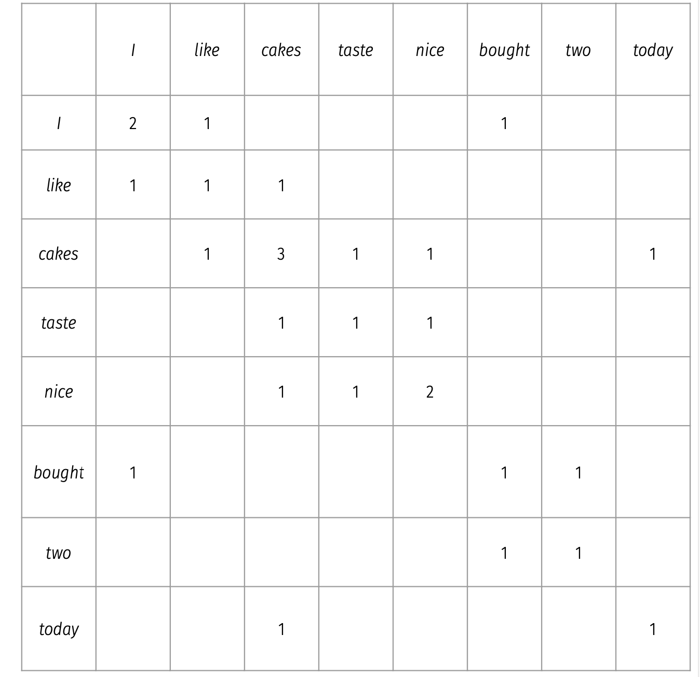

$$
freq('cakes') = 3 \\
deg('cakes') = 7 \\
deg('cakes')/freq('cakes') \approx 2.33
$$

The last equation gives a measure of generality

#### Keyword Extraction for Document Graph Generation

We can characterise the collection in terms of the extracted keywords

* central/exlusive keywords: which keywords ar eextracted often in a single document
* essential keywords: which central keywords are coverred by many documents
* general keywords: which keywords are referenced in many document but extracted by only few docuents

#### Pattern Based RElation Extraction

We can define high-precision/low-recall patterns to extract relations of our interest


These patterns can be syntactic, rely on lexical semantics (using meaning of words) or additional knowledge

##### Boostrapping: Relation Extraction Edition

1. Find new expression for know tripels
2. Extract pattern and add top-K as new
3. Apply new patterns to corpus to extract new triples

#### Open Information Extraction

OpenIE: Domain independent discovery of relations extracted from text and readily scale to the diversity and size of Web corpus

Given a corpus of documents the exptected output is a set of extracted relation

Requirement for OpenIE System

* must be applicable to a lot of heterogeneous documents
* cannot resort to a specific domain knowledge
* cannot take ages for a single domain knowledge

##### Reverb: Algorithm

```
For an input sentence:
	For each verb in sentence:
		Find the longest candidate word sequence r that satisfies two consraints
		Merge adjacent candidates
		For eac hrelation candidate r:
			Find the nearest Noun Phrase left and right of r
			Assign confidence score with a classifer

```


##### OLLIE: OpenIE boostrapping

* take high confidence extraction from ReVerb
* map to a large corpus of sentences (that contains extraction's words)
* generate patterns (paths in dependency parse) by generalising from observed co-occurrences
* apply patterns to corpus to extract new triples


##### End-to-End Neural Open Information Extraction

OpenIE can be modelled as a sequence labelling task

```
For an input sentence
	For each verb
		Expand predicate (P) (rule based, similar to ReVerb)
		For each word
			label as Argument (ARG) or non-participating (O)
```


### Deep Learning Approaches for Span Extraction

DL based approahces to span extraction relh on embeddings to produce a distributed and contextualised representation of question and passage.

This representation is used to predict the probability distribution of a token being beginning/end of span

We look the simplest one: fine-tuning pre-trained language models

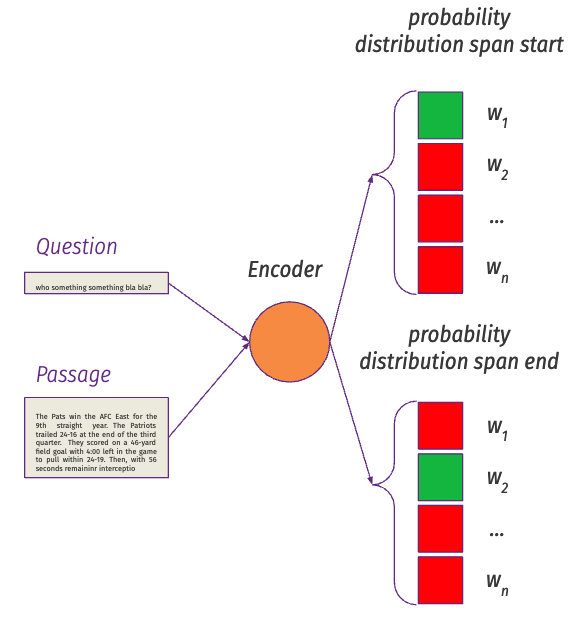

1. Concatenate question and passage as input to the langauge model, multiplying the final layer with two vectors to obtain probability distribution over all tokens
2. minimising the cross entropy loss between the predicted probability distribution over the sequence and the ground truth start and end positions

#### MRC with BERT using SQuAD

Procedure to find the span
```
For all combinations P_is , P_je for all i in j, and j from 1 to len(input)
	- Discard all special tokens (P_[CLS], P_[SEP])
	- Discard all spans where i>j
	- Discard all spans where j-i > k
	- Rank based on P_i + P_j
	- Pick best
```

We aim to use the DL models to predict the best position of s and e which answer the quesiton

```python
class RobertaForQuestionAnswering(RobertaPreTrainedModel):

	def __init__(self, config):
		super().__init__(config)

		self.roberta = RobertaModel(config, add_pooling_layer=False)
		self.qa_outputs = nn.Linear(config.hidden_size, 2)

	def forward(self, input_ids, ...):
		outputs = self.roberta(input_ids,...)

		sequence_output = outputs[0]

		logits = self.qa_outputs(sequence_output)
		start_logits, end_logits = logits.split(1,dim=-1)
		start_logits = start_logits.squeeze(-1).contiguous()
		end_logits = end_logits.squeeze(-1).contiguous()

		return start_logits, end_logits

```

##### Un-answeribility in MRC

If the training data contains un-answerable examples, the model can be optimised to predict [CLS] as answer token for these. In post processing these predictions will be repalced with "unanswerable"

```
For all combinations P_is, P_je for all i in j 1 ... len(chunk)
for all chunk in chunks:
- Discard all special tokens (e.g. P[CLS], P[SEP])
- Discard all spans where i > j
- Discard all spans where j - i > k(e.g. all spans that are way longer than what you’d reasonably expect based on training set)
- Rank based on Pi + Pj
- pick best
- if: best score > P[CLS] + t (threshold hyperparameter)
then: return best span
else: return “Unanswerable”
```

#### Learning Span Representations

represent spans by their boundaries and content

$$
span_{ij} = [h_i; h_j; g_{ij}]
$$

from hidden state i to hidden state j is the span representation, and g is the algorithm for obtaininig the embeddings

##### SpanBERT

Mask spans of text intead of tokens. In addition to Masked Language Modelling objective, predict masked token given start/end span representation (and relative positionla embedding)

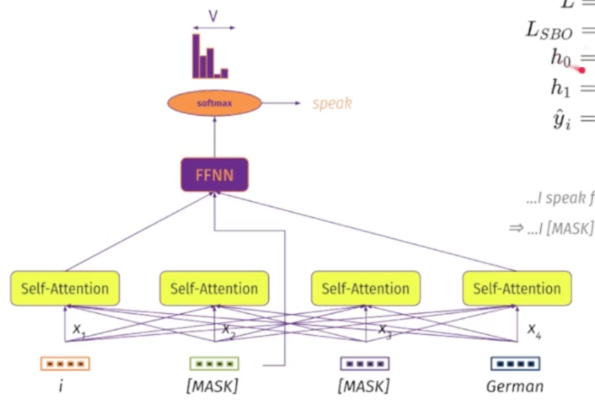

### Coreference Resolution

It is important to identify which *real world concept* the mentions refer to

* On the global level, this task is Entity Linking
* On the local level, this etask is called Coreference Resolution

**Coreference Resolution**: is the taks of identifying all mentions that co-refer to the same concept

Having span representation $span_{ij}$ and $span_{kl}$ we can predict

* how likely $span_{ij}$, $span{kl}$ are mentioning entities (mention score)
* how likely $span_{kl}$ refers to the same entity as $span_{ij}$ (antecedent score)

This information allows to learn a probability distribution of all possible $span_{ij}$ being the antecedent of $span_{kl}$

## Week 8 

### Sequence to Sequence Learning

#### Language Models for NLG

**Autoregresive Generation with RNN Language Models**: the word generated at each time step t is conditioned on the word selected by the RNN from the previous time step t-1

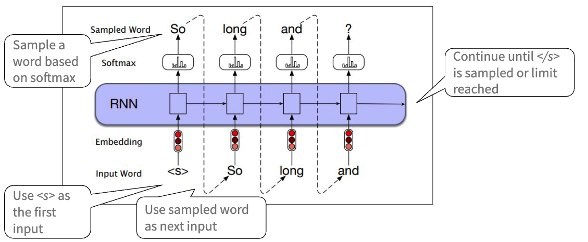

**Autoregressive Generation with Transformer Models**: at each time step t the model has direct access to the prefix text and the outputs it has geenrated so far 

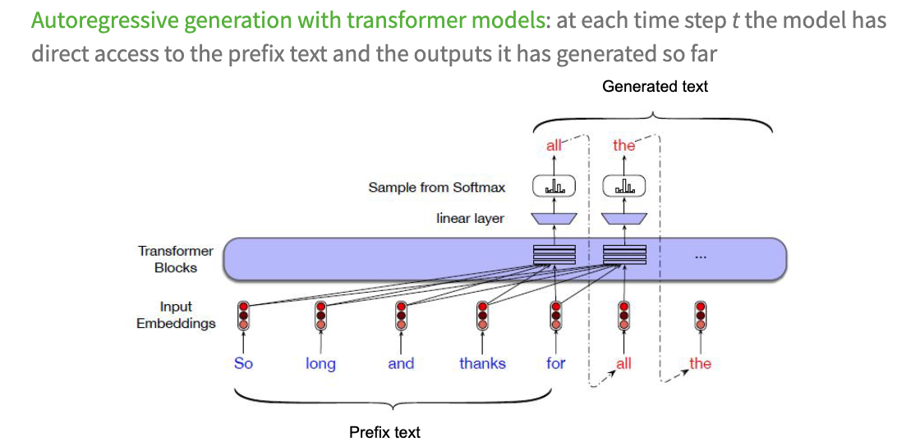

#### GPT Language Models

Two training objectives

1. Language Modelling: unsupervised training on unlabelled data
2. Task specific fine-tuning: supervised training on a target task
* sequence classification
* textual entailment, semantic textual similarity, question answering (multiple choice)

**Masked Multihead Self Attention**:
* multihead: multiple heads, each of which learns a different aspect of the relationships between the input tokens. 每一个头学习输入之间不同的关系
* masked self-attention: hides information to the right of the current token position

### Seq2Seq Learning

The task transform one sequence into another sequence. It takes as input one token sequence and produces another otken sequence as output

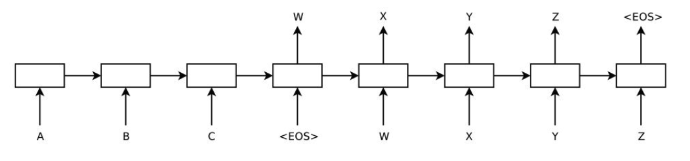

#### Encoder-Decoder Models for Seq2Seq Learning

Takes an input of sequence X of length n, and generates a corresponding sequence of contextualised representation. A context vector is used to generates a sequence of hidden states from which the output sequence Y of length n can be generated by the decoder

### Seq2Seq Learning Application

1. Machine Translation
2. Automatic Text Summarisation
3. Paraphrase Generation
4. Semantic Parsing
5. Long-form Question Answering

#### Paraphrase Generation as Seq2Seq Learning

The task:

* transform an input sequence to another sequence that *preserves the meaning* of the input sequence while having a different lexical or syntactic form
* More formally: given a sequence of n tokens S, generate a sequence Y with m tokens that conveys similar semantics as S

#### Semantic Parsing as Seq2Seq Learning

The task:

* convert an input sequence into a sequence written in meaning representation langage MRL (a data structure that can be executed)

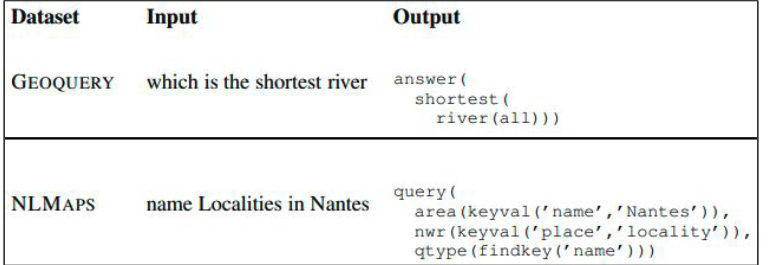


#### Long-form QA as Seq2Seq Learning

The task

* given an open ended question and supporting document generate a *paragraph lenght answer with an explanation*
* with respect to abstractive QA: similar in that the generated answer is not just an extracted span. The answer should be longer than a sentence.

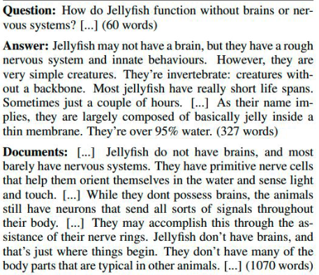

#### Text to Text Transfer Transformer (T5)

A unified framework that casts all NLP tasks as a text to text problem

Further study: T5 Paper: Raffel, Colin, et al. "Exploring the limits of transfer learning with a
unified text-to-text transformer." arXiv preprint arXiv:1910.10683 (2019).

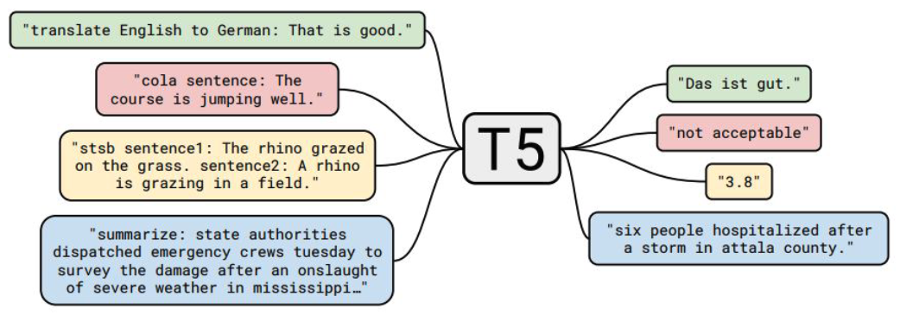

### Machine Translation

The task:

* take a sequence written in one language and translate it into another sequence written in another lanugage
* input: sequence in source language
* output: sequence in target language

Issue: simple word by word translation fails.


#### Traditional Approach to MT

1. Rule Based: rules for reording word by word translation obtained using a bilingual dictionary
2. Transfer based: 
	* syntactic structure generation based on the source text
	* conversion of syntactic structure into corresponding structure in the target language
	* output text is generated based on the corresponding syntactic structure
	* 学习文本语义，然后转换到目标语言内的语义结构，最终生成文本
3. Interlingua based
	* analyssi of the source text and representing it in a language independent formalisim
	* generation of the output text in target language using the formalism
	* 将给定文本以中间化的形式呈现，最终转换到目标语言

### Deep Learning based Approach to MT

#### Encoder-Decoder with RNN

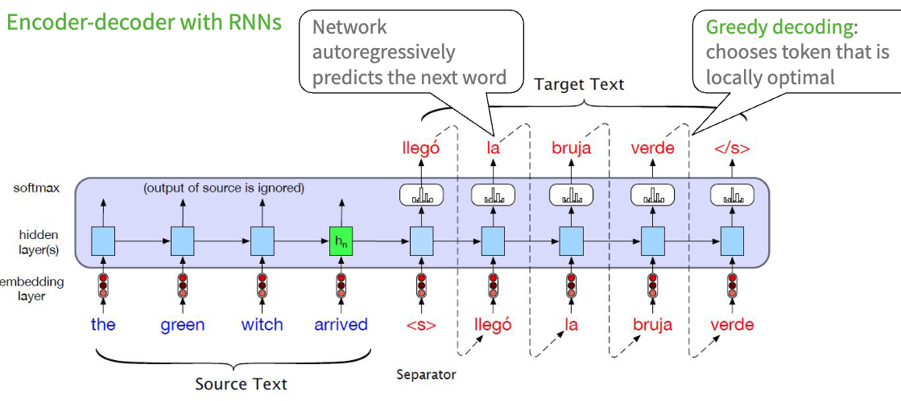

greedy decoding: choose the optimal probability locally

**Search Tree**: graphical representation of the choicees made by a decoder

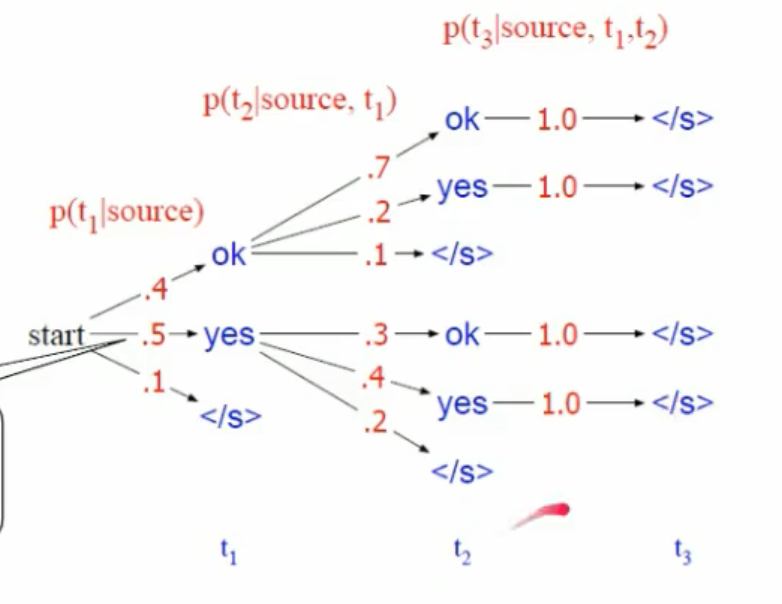


This might miss the global optimal solution


To mitigate the sub-optimal solution

We use **Beam Search**


**Beam Search**: select K possible tokens at each time step, where k is the beam width parameter

```
1. Select the k best options (hypotheses) based on softmax
2. Pass each of the hypotheses through the decoder to obtain softmax over the next possible tokens
3. Score each hypotheses
```
* The procedure repeat until an end of sequence is generated; k is reduced and the search continues unitl k=0
* Probability of a partial translation: sum of log probability

$$
score(y) = \sum_{i=1}^t log(P(y_i \mid y_1,...,y_{i-1},x))
$$

At each time step, add the log probability of the translation so far to the log probability of generating the next token

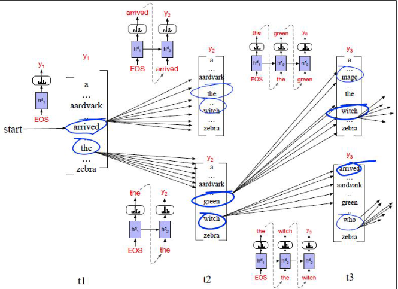

#### Transformer Block in Encoder-Decoder for MT

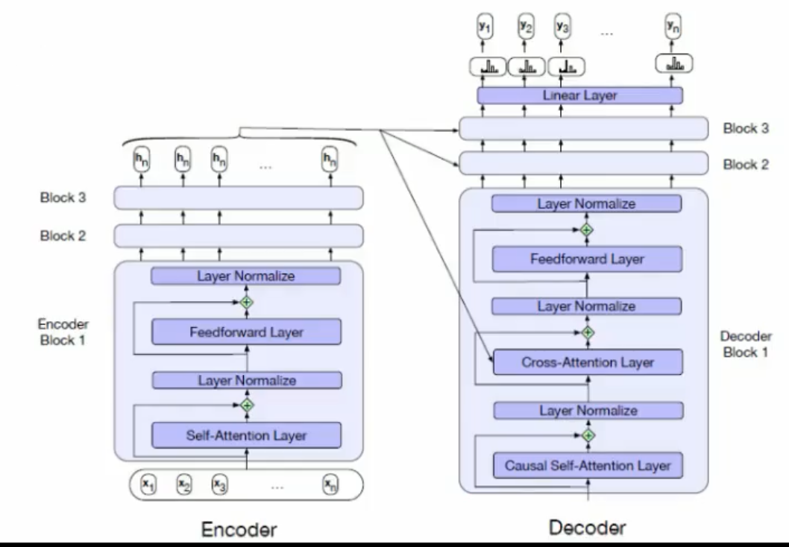

It has an additional cross attention layer

The Cross attention layer can attend to each of the source language tokens projected into the final layer of the encoder. 也就是可以获得编码器最后一层的信息

### Metrics for Manual Evaluation fo Translation

Human evaluators asked to score a translation based on a 5-point scale (1 = strongly
disagree to 5 = strongly agree), according to:

* Adequacy (how well the meaning of the source sentence is captured)
* Fluency (grammaticality, readability, how natural)

#### BLEU

BiLingual Evaluation Understudy

Modification to simple precision

1. For each word in the hypothesis, get the $min(count_{hypothesis}, count_{reference})$
2. BLEU = sum of the niminum values for each word / number words in hypothesis

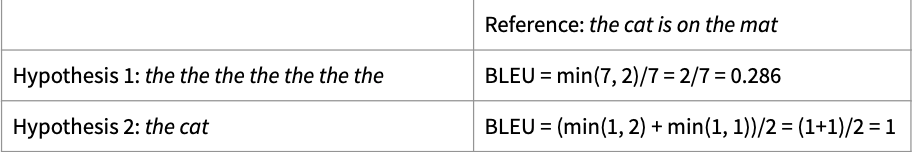

* precision based metric that uses word overlap
* calculated for each translated sequence (averaged over a corpus to report overall performance)


#### BLEU-N: based on n-grams


1. generate n-grams for each of the hypothesis and reference
2. for each n-gram in the hypothesis, get the $min(count_{hypothesis}, count_{reference})$
3. BLEU-N = sum of the minimum values for each n-gram / number of n-grams in hypothesis
4. 对每一个 n-gram 求bleu，然后把他们相加

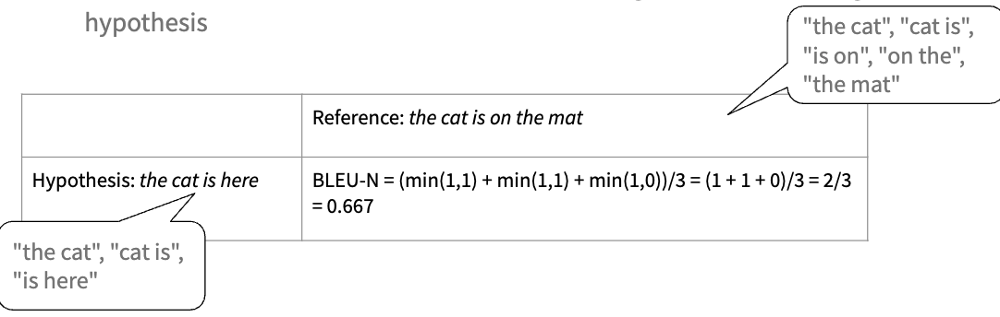


#### Character F-score (chrF)

* based on a function of the number of character n-gram overlaps between a hypothesis and a reference translation
* uses a parameter k (maximum length of a character n-grams to be considered)

chrP = ratio of 1 to k grams in the hypthesis that occur in the reference, averaged

chrR = ratio of 1 to k grams in the reference that occur in the hypothesis, averaged

$$
chrF\beta = (1+\beta^2) \frac{chrP \times chrR}{\beta^2 \times chrP + chrR}
$$

usually $\beta = 2$ for Machine translation

$$
chrF2 = \frac{5 \times chrR \times chrR}{4 \times chrR + chrR}
$$

### Automatic Text Summarisation (ATS)

The task:

* produce a summary of a full-length document
* input sequence: full length text (source)
* output sequence: summarised text (target)


Four types of ATS

1. Input: Single or Multi-document (单一文本, 多文本)
2. Language: Mono, Multi, or Corss Lingual (单一语言, 多语言, 跨语言)
3. Learning: Supervised or Unsupervised (监督学习，非监督学习)
4. Generation: Extractive or Abstractive (提取式, 概括式)

#### Extractive Summarisation

Generates summaries by *extracting phrases or sentences* from the input document, and *selecting phrases/sentences* to include in the summary

Pros:

* simpler
* generated summary tends to be grammatically correct

Cons:

* summary tends to include redundant information
* lack of semantics and cohension

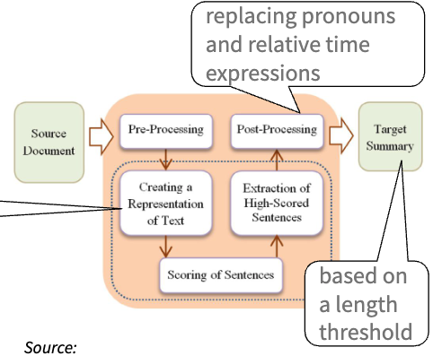

#### Abstractive Summarisation

Generate summaries by *understanding* the content of the input document, and paraphrasing the text to express the same content in fewer words

Pros

* generated summary is closer to human provided summary
* redundancy is reduced since newly produced sentences can compress more information

Cons

* difficult to implement since due to reliance on NLG


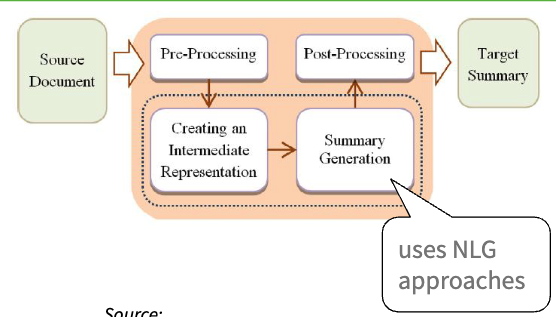

[Resource for Further Study](https://www.sciencedirect.com/science/article/pii/S0957417420305030)

### Traditional Approaches to Extractive ATS

#### Statistical Methods

* word frequency based: a sentence is considered important if it contains a frequent word
* TF-IDF based: used in multi-document summarisation

#### Machine Learning based Methods

* binary classifier: (naive Bayes, random forest) with features such as sentence position, sentence length, capitalisation, existence of thematic words
* graph based (Text Rank): nodes are sentences and edges are similarities; a score for each node is calculated which allows for ranking the sentence


### Deep Learning based Approaches to ATS

**Encoder Decoder Models**

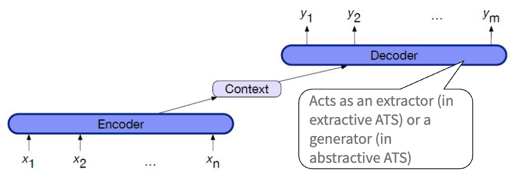


#### Attention Encoder-Decoder RNNs for ATS

With the usual encoder-decoder architecture, the encoder contains features combined with embeddings. The combination extracts more information from the soruce text for the decoder to attend.

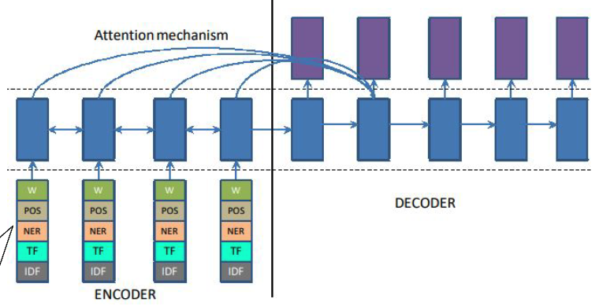

#### Switching generator/pointer model

instead of emitting <UNK> for OOV words, point tot the word's position in the input document

a swtich (i.e probability) decides whether to generate or to point

#### Transformer for ATS

* during inference, the source, with the separator token appendend, is used as input
* target is generated in an auto-regressive manner


### Metrics for Manual Evaluation of Summaries


Ask human evaluator to score the summary based on a 5-point scale

* readability and grammaticality (linguistic quality)
* structure and cohenrence (sentence organisation)
* referential clarity (no unidentifiable pronouns)
* content coverage (inclusion of salient points)
* consiseness and focus (succinctness)
* non-redundancy (no repetition)


#### Recall-Oriented Understudy for Gisting Evaluation (ROUGE)

It counts the number of overlapping units (i.e. n-grams) between the generated (condidates) and reference summaries

**ROUGE-N**: n-gram recall

$$
\frac{\sum_{gram_n \in S} Count_{match}(gram_n) }{\sum_{gram_n \in S} Count(gram_n)}
$$

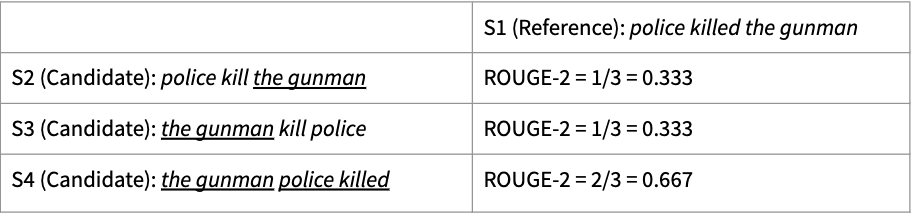

#### ROUGE-L 

Longest common subsequence (LCS)-based F-score

* assuming X and Y are the reference and condidate summaries, with lengths m and n tokens, respectively

$$
R_{lcs} = \frac{LCS(X,Y)}{m} \\

P_{lcs} = \frac{LCS(X,Y)}{n} \\ 

F_{lcs} = \frac{(1+\beta^2) \times P_{lcs} \times R_{lcs}}{ \beta^2 \times P_{lcs} + P_{lcs}}

$$

the longest subsequence requires the order to tokens to be matched

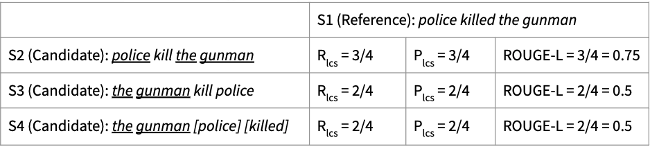


#### ROUGE-S  

It's based on skip-bigram co-occurrences

* assuming X and Y are the reference and candiate summaries, with lengths m and n tokens respectively

$$
R_{skip2} = \frac{SKIP2(X,Y)}{C(m,2)} \\

P_{skip2} = \frac{SKIP2(X,Y)}{C(n,2)} \\

F_{skip2} = \frac{(1+\beta^2) \times P_{skip2} \times R_{skip2}}{\beta^2 \times P_{skip2} + R_{skip2}}
$$

the ROUGE-S allows skip for bi-grams
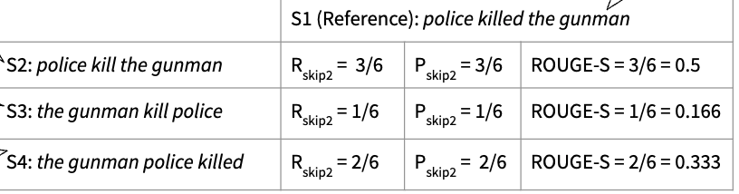


when training the bert classifer there might leak the data which is later used as evaluation set. Because of 10000 examples are split into chunks of 512 tokens, so this might leads to over optimistic results. 

evaluation on the chunk level is not enough. we also need to evaluate on the claim level.


For improvement, split the dataset 9/1 for training and validation for the bert fine-tuning, and train the RNN on the chunks corresponding to the training set, and evaluate the model on the validation set to obtain more robust result. Furthermore, in addition to accuracy, compute precision, recall, and f1 score as well to have a complete understanding of the performance


Aggregate the chunk-level predictions to make a single prediction per claim and report the accuracy at the claim level.