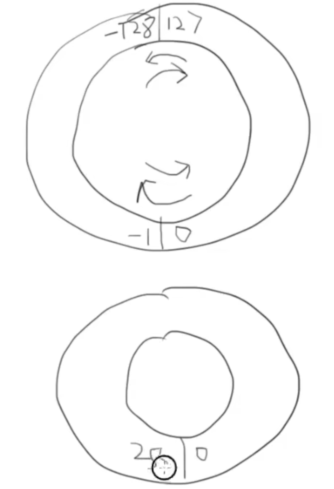

# C/C++ 学习笔记

# C 语言

```c
#include <stdio.h>

int main() {
   printf() displays the string inside quotation
   printf("Hello, World!");

   int price = 0;
   printf("请输入金额\n");

   scanf("%d", &price);
   int change = 100-price;

   printf("找您%d元。\n", change);

   int a,b;
   scanf("%d %d", &a, &b);

   printf("%d + %d = %d", a,b,a+b);

   const int c;
   return 0;
}

```
这段代码展示了C语言输入输出

**const 修饰词**

* const 修饰int 变量c。这个修饰词代表，变量一旦被初始化就无法被修改
* 

## C 语言文件编译过程

```c
gcc -E main.c -o main.i 预处理
gcc -S main.i -o main.s 编译
gcc -c main.s -o main.o 汇编
gcc main.o -o hello 链接

```

## C 语言整数表达



```c
#include <stdio.h>

int main()
{
    char c = 127;
    int i = 255;
    c = c+1;
    printf("c=%d, i=%d\n",c,i);

    return 0;
}

```

这段代码展示的就是蒸熟二进制的补码例子。char 是一个字节，八个比特。二的七次方就是128，但正数范围要少一也就是 $2^7 - 1$。第八个比特作为正负号比特来表示正负。 但如果使用unsigned 正数一个字节可表达的范围就是255。 

上图中的圆圈展示了二进制运算中一个字节正数最大范围 $127 + 1 = -128$，同理在unsigned 的标识中 $255 + 1 = 0$。 在这里二进制运算中包含模数运算的特质。也需要在计算机程序编写中意识到overflow 这个概念。

### 八进制与十六进制

一个十六进制的数可以表达四个比特的二进制数据，十六进制可以很方便的表示二进制数字

### 字符类型

在计算机系统内部，使用的ASCII 编码，数字1 和 字符‘1’ 所表达的数字是不一样的。

```c
    char c;
    char d;
    c = '1';
    d = 'A';

    if(c==d)
        printf("相等\n");
    else
        printf("不想等\n");
    
    printf("c = %d\n",c);
    printf("c = %c\n",c);
```

### 指针

```c
#include <stdio.h>

void f(int *p);
void g(int g);

int main()
{
    int i = 6;
    printf("i = %d\n",i);

// &i gets the address of the variable i
    f(&i);

// the value of i is changed to 26 by pointer
    g(i);
    return 0;
}

void f(int *p)
{
    printf("p = %p\n",p);
    printf("p = %d\n", *p);
    *p = 26;
}

void g(int k)
{
    printf("k = %d\n",k);
}
```


* \*p 代表指针p 指向位置的value
* &p 代表p的位置

我们可以看到 * 和 & 是两个可逆的操作，一个获取变量的地址，一个获取这个地址上的值。 

在C 语言中，当我们在函数参数中传一个数组，那实际上是传递了数组第0个元素的地址。在计算机操作系统中缓存可以想象成一个大数组，在一个数组中，根据数据类型比如int，四个字节，每四个字节存一个元素。如果数组中有八个元素，那么这个数组就会有32个字节。

### const 修饰词

const 要注意在 *  前还是后
1. const 在 * 前， 代表const 所修饰的那个东西不能变
2. const 在 * 后， 代表指针不能变。

```c
int i;
const int *p1 = &i;
int const* p2 = &i;
int *const p3 = &i;
```

在上面的例子中第一二个例子是相等的，而第三个就代表指针是 const。

#### const 数组

```c
const int a[] = {1,2,3,4,5,6};
```

在这个例子中，数组中所有的元素就是const，所以是不能修改的，所以只能使用初始化赋值

#### 指针数组

```c
#include <stdio.h>

int main(void)
{
    char ac[] = {0,1,2,3,4,5,6,7,8,9};
    char *p = ac;
    printf("p = %p\n", p);
    printf("p+1 = %p\n", p+1); /*指针+1 直接指向下一个元素。char 是一个字节 */

    int ai[] = {0,1,2,3,4,5,6,7,8,9};
    int *q = ai;
    printf("q = %p\n", q);
    printf("q+1 = %p\n", q+1); /*int 是四个字节*/
     

    return 0;
}
```

*p 指向数组第0个元素。当我们对指针进行+1 时，就是获取数组下一个元素。也就是直接使用p+1。

*p++ 表示取出p所值得值，再把p移到下一个位置

### 动态内存管理

```c
#include <stdio.h>
#include <stdlib.h>

int main(void)
{
    int i;
    int *a;
    int number;

    printf("输入数量: ");

    scanf("%d", &number);
    a  = (int*)malloc(number * sizeof(int));
    for (i = 0; i<number; i++)
    {
        scanf("%d", &a[i]);
    }
    for(i=number-1; i>=0; i--)
    {
        printf("%d ", a[i]);
    }
    free(a);

    return 0;
}
```

这段代码展示了C语言中怎样申请内存 malloc 和 释放内存 free。 首先声明一个指针 *a，然后使用malloc 分配 n 个以int 大小为基础的内存空间。 在计算机内部内存空间是不分数据类型的，所以malloc 返回 void* 。因此需要加上int* 来讲指针类型转到int 类型指针。在计算机内部不同数据类型是通过数据大小也就是字节来分辨，因此我们可以简单的转类型来达到访问数据的目的。

所以每次申请内存都要同时写好释放内存的代码，以免忘记。

同时需要注意的是如果地址变更了，就无法free，也未变更过的地址不是申请来的。

### 字符串

```c
//字符数组
char word[] = {'H', 'e','l','l','o','!'};

//字符串
char word[] = {'H', 'e','l','l','o','!', '\0'};

```
在C 语言中要在字符数组中加入 0 或者 '\0' 来表示将字符数组视为字符串。注意如果要单引号就要加入反斜杠，否则直接输入0， 而 ‘0‘ 不起到相同作用。

字符串以数组形式存在，以数组或指针形式访问。更多是以指针形式访问
 
#### 字符串变量

```c
char *str = "Hello";
char word[] = "Hello";
char line[10] = "Hello";
```

注意编译器将这个变量改为长度为6的字符串，因为它会自动在结尾加上“\0”

#### 字符串常量

和java 相同，字符串是无法被修改的，如果要修改，就要转换到字符数组的形式修改。

```c
// *s 是一个指针指向一个字符串常量
char* s = "Hello, world!";

// 这个字符串就储存在这个地方
char s[] = "Hello, world!";
```

字符串可以通过 char* 的形式表达，但是不一定表示字符串。它可以指向一个字符，也可以指向一串连续的字符，但只有结尾有0 才可以被视为字符串

### 结构struct

```c
struct point{
    int x;
    int y;
}
struct date{
    int month;;
    int day;
    int year;
}
int main(int argc, char const *argv[])
{
    struct date today = {07,21,2021};
}
```

```c
#include <stdio.h>
#include <stdbool.h>

struct date{
    int month;
    int day;
    int year;
};

bool isLeap(struct date d);

int numberOfDays(struct date d);

int main(int argc, char const *argv[])
{
    struct date today, tomorrow;
    
    printf("Enter today's date (mm dd yyyy):");

    scanf("%i %i %i", &today.month, &today.day, &today.year); //store at the address of the struct

    if( today.day != numberOfDays(today))
    {
        tomorrow.day = today.day + 1;
        tomorrow.month = today.month;
        tomorrow.year =  today.year;
    }else if(today.month == 12)
    {
        tomorrow.day = 1;
        tomorrow.month = 1;
        tomorrow.year = today.year + 1;
    }else{
        tomorrow.day = 1;
        tomorrow.month = today.month+1;
        tomorrow.year = today.year;
    }

    printf("Tomorrow's date is %i-%i-%i.\n",tomorrow.month, tomorrow.day, tomorrow.year);
    return 0;
}

int numberOfDays(struct date d)
{
    int days;
    const int daysPerMonth[12] = {31,28,31,30,31,30,31,31,30,31,30,31};

    if(d.month == 2 && isLeap(d))
    {
        days = 29;
    }else{
        days = daysPerMonth[d.month-1];
    }
    return days;
}

bool isLeap(struct date d)
{
    bool leap = false;
    if((d.year % 4 == 0 && d.year % 100 != 0) || d.year%400 == 0)
        leap = true;
    
    return leap;
}
```

在传递结构是，最好的方式就是传递一个指向这个结构的指针

```c
struct date{
    int month;
    int day;
    int year;
} myday;
struct date *p = &myday;

(*p).month =12; //or

p->month =  12;
```
* -> 表示指针所指的结构变量中的成员


### 自定义类型

```c
typedef struct{
    int month;
    int date;
    int year;
} Date;
```

typedef 给变量一个清晰可记忆的名字从而提高代码可读性

尽量全局变量和静态本地变量，因为这些变量是不可存入的，再多线程场景下是不安全的。

函数返回时，尽量返回传入的指针。因为在函数内部产生的变量的地址之后可能会被用来存储其他变量。


### 宏的定义 Macro

**由 # 开头的都是编译预处理指令**

**#define** 可以定义一个宏

```c
#define PI 3.14159

int main(int argc, char const *argv[])
{
    printf("%f", 2*PI);
    return 0;
}
```

用到带参数的宏，所有的值一定要用括号包裹起来。


```c
#define cube(x) (x * x)

int main(int argc, char const *argv[])
{
    printf("%d", cube(3));
    return 0;
}
```
在定义宏时，不要在末尾加分号；

### 头文件

头文件的格式是非常重要的，标准的格式可以提高代码的重复利用率。
```c
#ifndef max_h
#define max_h

#include <stdio.h>

int max(int a, int b);

extern int gall;

#endif /* max_h */
```


### Resizable Array

这个部分开始实现类似于 java arraylist 的数据结构。

```c
"array.h"

#ifndef
#define _ARRAY_H_

typedef struct{
    int *array;
    int size;
} Array;

Array array_create(int init_size);

void array_free(Array *a);

int array_size(Array *a);

int* array_at(Array *a, int index);

void array_inflate(Array *a, int more size);
#endif

"array.c"

#include "array.h"

Array array_create(int init_size)
{
    Array a;
    a.size = init_size;
    a.array = (int*) malloc(sizeof(int) * init_size);

    return a;
}

void arrray_free(Array *a)
{
    // free the array in the struct Array
    free(a->array);
    a->size = 0;
    a->array = NULL;
}

int array_size(Array *a)
{
    return a.size;
}

int* array_at(Array *a, int index)
{
    // we need to return the pointer not the element
    return &(a->array[index]);
}


```

## C++ 面向对象编程

### head文件

```cpp

complex.h

#ifndef __COMPLEX__
#define __COMPLEX__

class declaration
class complex 
{
	public:
		complex (double r=0, double i=0)
		: re(r), im(i)
		{}
		/* : re(r), im(i) 是运用了cpp编译原理更高效 */

		complex& operator += (const complex&);

		double real() const {return re;}

		double imag() const {return im;}
	private:
		T re, im;

	/* T 就是模版. Generic type*/
		
	friend complex& __doapl (complex*, const complex&)


};


class definition
complex::function
#endif
```


**Pass by Reference: complex&. (Here & is the reference symbol)**


**Pass by Value: complex**

**In general, use Pass by Reference is better**


