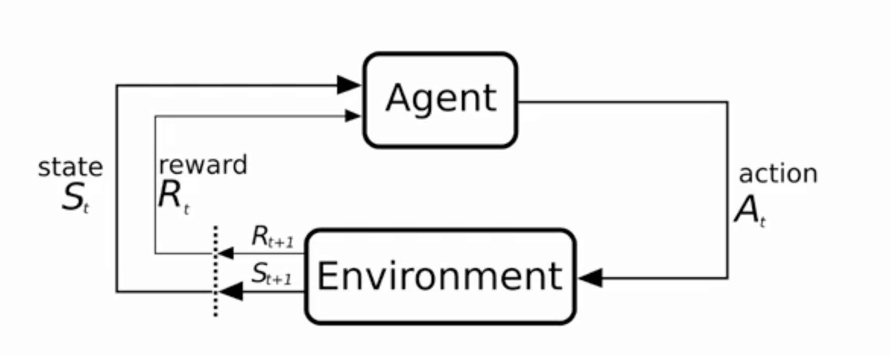

This blog is an organised note of the Reinforcement Learning course I studied while I was in Imperial College.

## Week1

**Reinforcement Learning**: solve the problem of control. i.e chooosing the optimal/best action at the right time.

* Agents interact with environment to gain knowledge
* Explores and recives reward
* Actions change the states of environments
* Choose action to maximize long time reward.

below is the framework for Reinforcement Learning

