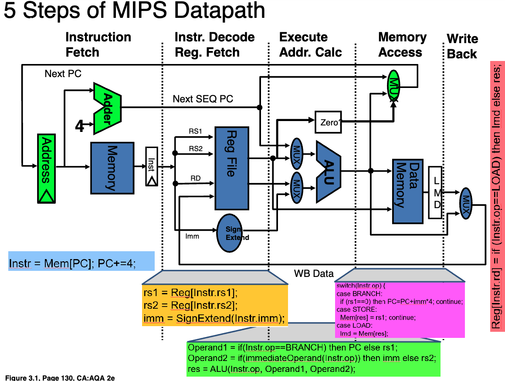
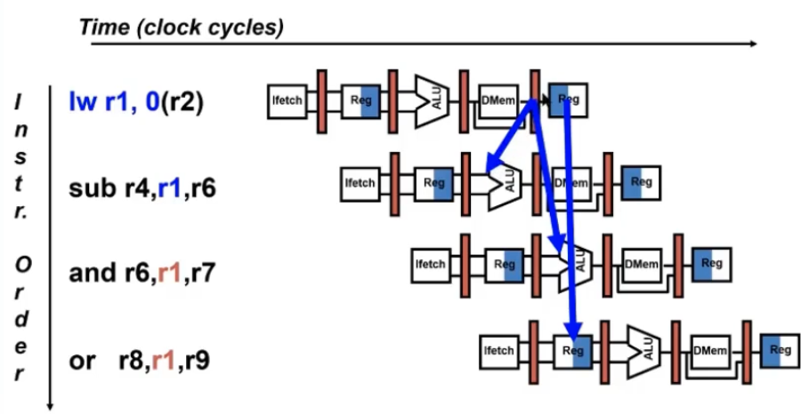
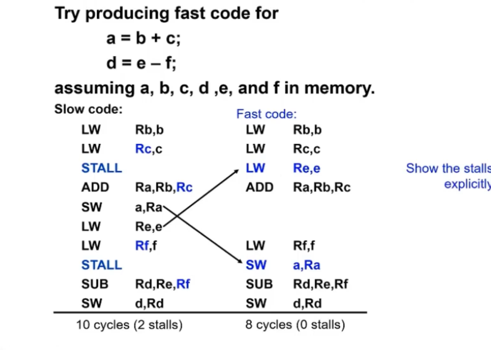

## Week2

### Pipeline



1. 指令取出 (Instruction Fetch)
Memory (存储器)：图中表示用来存储指令的存储器。处理器从内存中取出当前的指令。
PC (Program Counter)：程序计数器，用来存储当前指令的地址。
Adder (加法器)：这个组件对程序计数器 (PC) 进行加法操作，以便获取下一条指令的地址。图中的“PC+4” 表示 MIPS 每条指令占用 4 字节，因此下一条指令的地址为当前 PC 值加上 4。
箭头：指示数据流的方向。PC 的值会传送到 Memory，用于取出对应地址的指令。

2. 指令译码/寄存器取值 (Instruction Decode/Reg Fetch)
Reg File (寄存器文件)：存储寄存器的地方。此模块用于根据指令的操作码，从寄存器文件中读取操作数。
RS1、RS2、RD：这三个是指令中的寄存器编号字段。RS1 和 RS2 是两个源操作数的寄存器，RD 是目标寄存器。
Sign Extend (符号扩展)：用于将立即数（Imm）进行符号扩展。立即数通常是短位的，需要扩展到标准的数据宽度（例如32位）以进行运算。

3. 执行/地址计算 (Execute/Addr. Calc)
ALU (算术逻辑单元)：ALU 执行算术运算或逻辑运算。它根据指令的操作码对操作数进行计算。
MUX (多路复用器)：多路复用器用来选择输入。根据指令的类型，它可能会选择来自寄存器（RS1、RS2）的操作数，或者是立即数（Imm）作为输入。
Zero 输出：ALU 计算结果的零标志位，用来判断是否分支跳转（用于条件分支指令）。

4. 存储器访问 (Memory Access)
Data Memory (数据存储器)：用于加载或存储数据的存储器。在 LOAD 指令时，它从内存中读取数据；在 STORE 指令时，它将数据写入内存。
MUX (多路复用器)：选择要写回寄存器的数据。LOAD 指令从 Data Memory 中获取数据，而 ALU 指令直接将 ALU 的计算结果写回寄存器。
LMD (Load Memory Data)：存储从内存加载的数据。

5. 写回 (Write Back)
WB Data (写回数据)：在这个阶段，处理器将 ALU 或内存的数据写回到寄存器文件（Reg File）中。


#### Data Hazard

```
add r1, r2, r3 # r1 = r2 + r3
sub r4, r1, r5 # r4 = r1 - r5
```

Forwarding: Solving the Data Hazard
With forwarding, instead of waiting for the result to be written to the register file, the processor detects that the result is available earlier in the pipeline, usually after the Execute (EX) or Memory (MEM) stage, and forwards this result directly to the next instruction that needs it.

1. Detect the dependency: The processor detects that the destination register of the previous instruction is needed as a source operand in a subsequent instruction. 
2. Forward the Data: The result of the add instruction is read in the EX or MeM, even though it has not been wirtten abck to the register. The processor forwards the result from these intermediate pippeline stages directly to the input of the next instruction that needs it.
3. Execute without Stalling: 


**Load to Use Delay**: 



#### Software Schedulling to Avoid Load Hazards



#### Control Hazard on Branches

Branch predictions are hard. The next instruction to fetch after a branch can only be found after a whole data processing procedure is resovled.


##
