## Week 2

### Challenges in Distributed Computing

* Scalability
* Fault Tolerance
* High Availability
* Consistency
* Performance

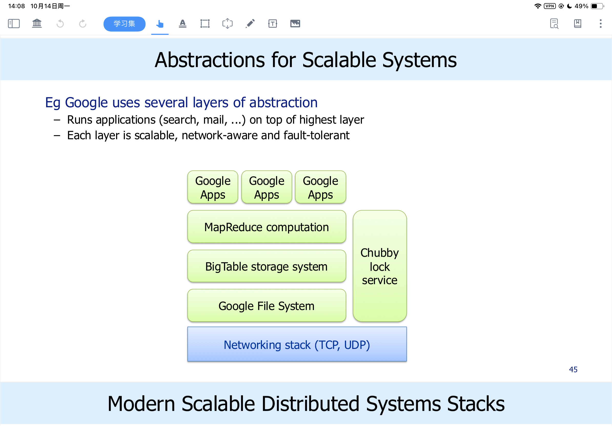

### Design Principles for Scalable System

1. Stateless Service: stateless services give high fault tolerance and high availability


2. Caching
    * Latency is the king. 


3. Partition/aggregation pattern
    * Partition task to multiple backedn servers, and aggregate the result back to the request
    * Task Parallelism and Data Parallelism are enabled

4. Weaker Consistency
    * Strongly consistent operations: often imposes additional latency for common case
    * Inconsistent Operations: 
5. Efficient failure Recoverry
    * full redundancy is too expensive -> use failure recovery
        * impossible to build redundant system at scaler
        * rather reduce the cost of failure recoverh
    * Failure recovery: **Replication** vs **recomputation**
    * Replication
        * need to replicate data and service
        * introduce consistency issues
    * Recomputation
        * Easy for stateless protocols (eg HTTP requests)
        * Remember data lineage for compute jobs


## Week3

### Cloud Computing and Data Centres

**Cloud Computing**: is the delivery of computing as a service

* The shared resources software, and data are provided to users by a provider

**Pros and Cons**

* Speed
* Global scale and elasticity
* Productivity
* Performance and Security
* Customizaility

**Cons**

* Dependency on network and internet connectivity
* Security and Privacy
* Cost of Migration
* Cost and risk of vendor lock-in

Types of Cloud Computing

* Public Cloud
* Private Cloud
* Hybrid Cloud

### Cloud Service Models

#### Infrastructure as a Service (IaaS)

Immediate available computing infrastructure.

Include storage, processing, memory, network bandwidth

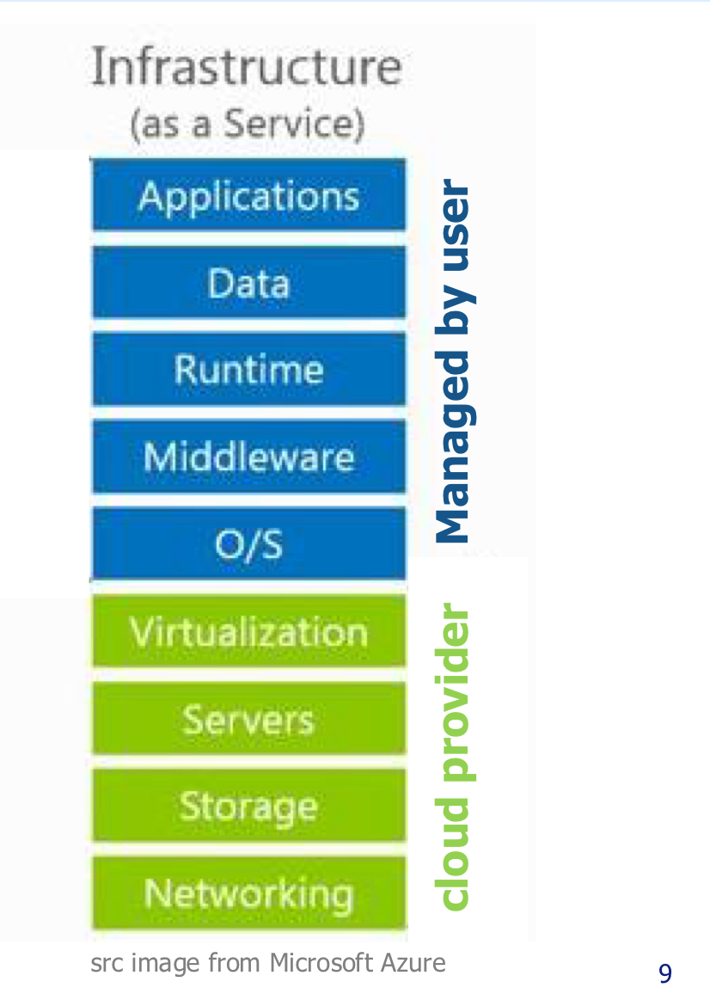


#### Platform as a Service (PaaS)

Complete development and deployment environment.

Include system software (OS, middleware), platforms, DBMS,
BI services and Libraries to assist in development and deployment of cloud-based application

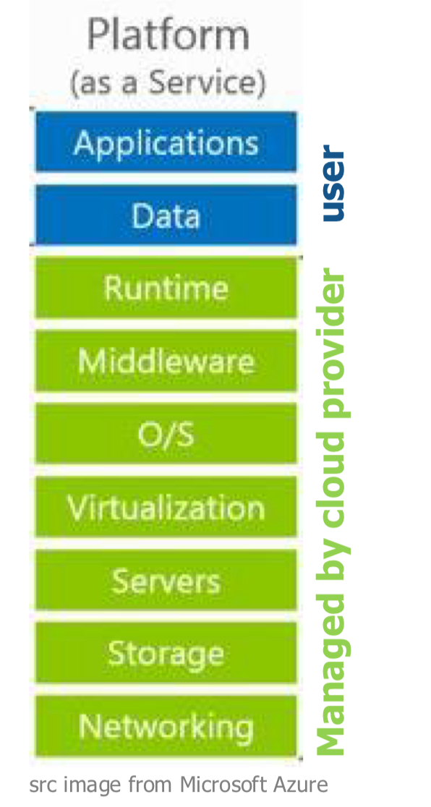


### Data Centre

A **Data Centre (DC)** is a physical facility that enterprises use to house computing and storage infrastructure in a variety of networked formats

Main function is to deliver utilities needed by the equipment and personnel

* power 
* cooling
* shelter
* security


Challenges

1. Cooling Data Centres
2. Energy Proportional Computing
3. Managing a Data Centre and its Recources
4. Managing a Data Centre and its Recoures

## BigTable Paper discussion


**Questions**:

1. what is the problem that this paper tries to solve? How would summarise its main idea in a few sentences? How does it work in more detail?
2. What is good about the paper? What is not good about the paper?

### Motivation

* Lots of data: copies of web, satellite data, user data etc.
* Many incoming requests
* No commercial system is big enough


Data is lexically ordered according to row keys.

SSTbales are immutable.

Writes are sufficient

Sequential write is like continusouly appending data.

Random write is like write data at random location.

MemTable is the SSTable in memory

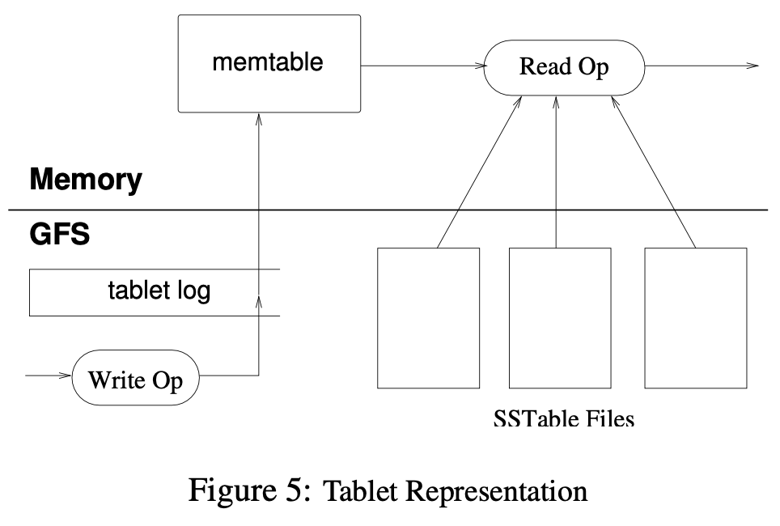

**Compaction**

Read operation takes longer tiime. It need to read data from memtable and all SSTables to find the row index key.

By having few SSTable saves the data.

Bloom filters is a probabilistic data structure for checking set membership checking. It llows you to ask whether an SSTable might contain any data for a specified row/column pair


Minor compaction process has two goasl

1. it shrinks the memory usage of the tablet server
2. it reduces the amount of data that has to be read from the commit log during recovery if this server dies.

Major compaction: rewrite all SStables into exactly one SSTable

**Value of Immutability**:

* Concurrency control

Always adding data sequentially, the order won't missed up when concurrently accessing data

We have one MemTable per tablet server.

Column family is a hint for locality.

Each tablet server serves a tablet. 

Commit log is there to help recovery in case of failure, because MemTable is a pure in memory data structure. 


### Building Blocks

* scheduler
* Google File System
* Chubby Lock Service

* Sawzall
* MapReduce

#### GFS

large scale distroibuted file system

master: responsible for metadata

chunk servers: responsible for reading and writing large chunks of data

chunks replicated on 3 machines, master responsible for ensuring replicas exist

#### Chubby

{lock/file/name} service

coarse-grained locks, can store small amount ofg data in a lock

5 replicas, need a majority vote to be active

#### Data Model: A Big Map

<Row, Column, Timestamp> triple for key: each value is uninterpreted array of bytes

Arbitrary "columns" on row by row basis

* columns family:qualifier
* family is heavyweight, qualifier lightweight
* column-oriented physical store: rows are spares

Lookup, insert, delete API

* Each read and write of data is atomic under a single row.

In Big Table, the data model is triple on row, column and timestamp.


#### Bigtable vs. Relational DB

* no table-wide integrity constraints
    * no foreign key or unique. data integrity need to be done by clients
* no multi-row transactions
* unterpreted values: no aggregation over data
* immutable data similar to versioning DBS
* client indicates what data to cache in memory
* data stored lexicagraphically sorted: clients control locality by naming of rows and columns
* C++ functions, not SQL (no complex queries)
    * low complexity query, high performance query.
* Data stored: lexicographically sorted
    * clients control locality by naming rows and columns

The key for a row is unique, which is the identifier of the row.


#### SSTable (Sort String Table)

Immmutable, sorted file of key-value paris

* Once SSTable is created it can't be modified, which ensures the write consistency
* Sorted: The SSTable is sorted according to key, which allows high efficiency search.

chunks of data + index

* index is of block ranges, not values
* index loaded into memory when SSTable is opened
* lookup is single disk seek

Client can load SSTable into Memory


#### Tablet

* Contains some ranges of rows of table
* Unit of distribution and loading balancing
* Built out of multiple SSTables

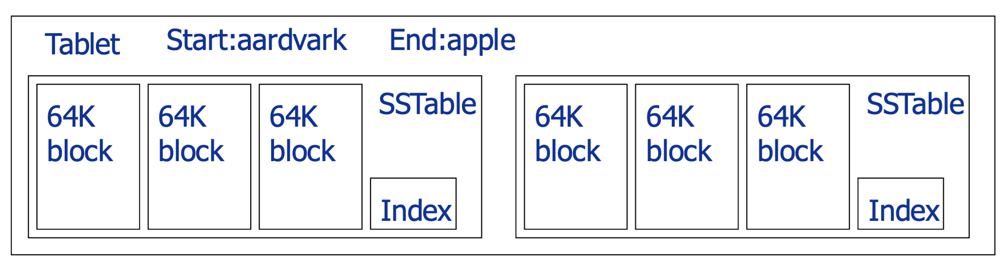

rows in tablet are stored as SSTable. Tablet consists of multiple SSTable.

#### Table

* Multiple tablet make up a table
* SSTable can be shared
* Tablet can't overlap, but SSTable can overlap

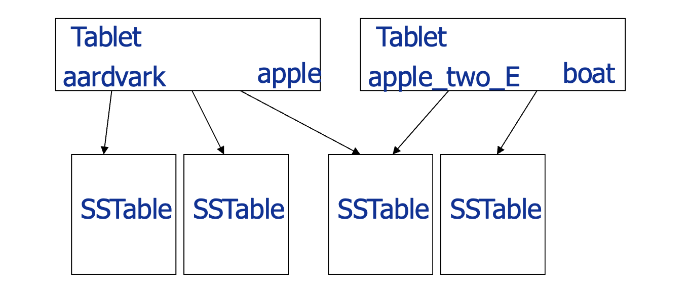

Different tablets have shared SSTable, because SSTable is a file-based structure which span across multiple tablet for optimal disk usage.


#### Finding a Tablet

Client library caches tablet locations

Metadata table includes log of all events pertaining to each tablet

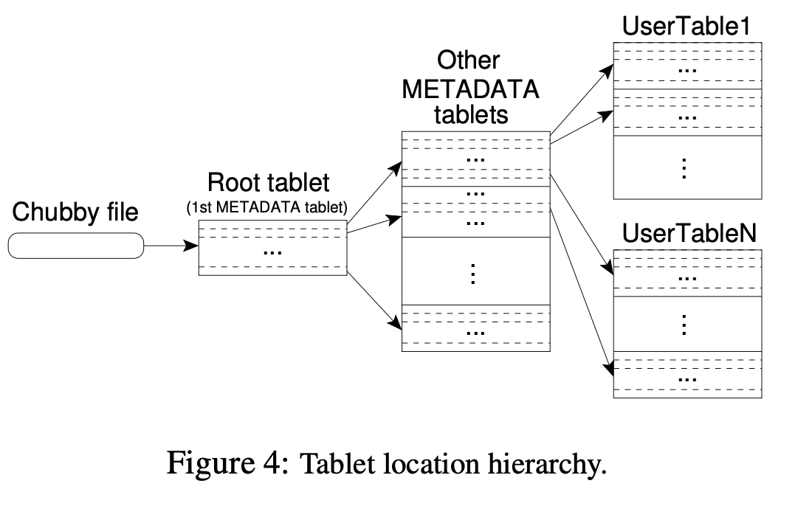

1. chubby file: is a distirbuted lock service: it stores the location of the root tablet.
2. root tablet (first metadata tablet): stores information about other metadata tablet. It contains information such as locations of other metadata tablets.
3. other metadata tablet: store information about user tablets. 
    * tablet start and end row keys
    * SStables that store the data for the tablet
    * location of the tablet server.
4. user tablets: contain the actual data requested by the clients.

**Keys**:

* metadata is organized as hierachies
* chubby ensures high consistency


#### Servers

Tablet servers manage tablets, multiple tablets per server

* each tablet is 100 - 200 MBs
* each tablet lives at only one server
* Tablet server splits tables that get too big

Master responsible for load balancing and fault tolerance

* use chubby to monitor health of tablet servers, restart failed servers
* GFS replicates data
* prefer to start tablet server on same machine that the data is already at

#### Editing/Reading a Table

1. Mutations committed to commit log
    * mutations are write or other operations that change the data
2. Commit log transfer to MemTable, a table in main memory to store data
3. When Memtable is full, transfer data to SSTable

* Reads and writes continue during split or merge

Read is based on a merged view on SSTable and Memtable


#### Compactions 

Minor Compaction: Convert full memtable into an SSTable, and start new memtable

* reduce memory usage
* reduce log traffic on restart

Merging Compaction

* Reduce number of SSTables
* Good place to apply policy keep only N versions
* Read content of few SSTable and MemTable and write a new SSTable
* The old SStables can be disgarded

Major Compaction

* merging compaction that results in only one SSTable
* No deletion

Minor compaction: convert memtable to SSTable. For daily writes

Merge compaction: Reduce number of SStable and reduces the cost of swtiching between different SSTable

Major compaction: Merge SSTables to a single SSTable

#### Locality Group

1. Group related column families togather into a single SSTable
2. Can compress locality groups (10:1 typical)
3. Bloom Filters on locality groups

## Week4

## Dynamo: Amazon's Highly Available Key-Value Store

* What is the problem that htis paper tries to solve? How would summarise its main idea in a few sentences? How does it work in more detail?
* What is good about the paper? What is not good about the paper?
* To what extent is the design of Dynamo inspired by Distributed Hash Tables? What are the advantages and disadvantges of such a design?
* How does the design of Dynamo compare to that of BigTable

Tail latency is important because every outlier will result in lost in money and trust from users.

Scalability is one design requirement.

Read may fail as concurrent read and write are happening the same time.

Dynamo potential write inconsistent data with multiple versions of data. It puts the complexity on reading time, which pull all versions of data objects to reconcile version conflicts.

Dynamo is a decentralised distributed system, in which every node is the same having the same functionality.

Consistency hashing maps every key to a set of nodes responsible for storing the key.


### Consistent hashing

Using SHA-A to hash for key and IP-address for node

When a key is hashed into the ring, it traverses through the ring clockwise and is assigned to the first node it encountered.

The set up of the ring, enables a decentralised data model to store.

This set up incrementally scale up the system. When you need to scalue up, you can add nodes and further partition.


### Gossip Protocol

Periodically selects some nodes to exchange states and apply 


### Motivation: Services in Modern Data Centres

* handres of services
* thousands of services
* millions of customer at peak time
* Performance + Reliability = Efficiency = \$\$\$
* High latency is bad


### Service Requirements in DCs

* Availability: service must accessible at all times
* Scalability: service must scale well to handle customer growth and machine growth
* Failure toletance: with thousands of machines, failure is default case
* Manageability: must not cost a fortune to maintain


### Design Assumption

* Query model
    * simple R/W ops to adata with unique IDs
    * No ops span multiple recoreds
    * data stored as binary objects of small size
* ACID Properties: **weaker (eventual) consistency**
* Efficiency: optimise for 99.9th percentile

### Dynamo's API

* put(key, context, object)
    * key: primary key associated with data objects
    * context: vector clocks and history (needed for merging)
    * object: data to store
* get(key)

### CAP Theorem

* Brewer's conjecture: CAP Theorem
    * consistency, availability, and partition-tolerance
    * pick 2 out of 3

* Avaialbility of online servies = customer trust: can't be sacrifice
* In data centres, failures happen all the time: we must tolerate partitions

During system failure, a system can only select two of the three.

### Eventual Consistency

* eventual consistency model
    * many services do tolerate small inconsistencies
    * lose consistency -> eventual consistency

**Dynamo: sacrifice strong consistency for availability**

Conflicts resolved during read. Always writable.

### Service Level Agreement (SLA)

A description on system performance by a list of means, medians, and variances.

Amazon targets for 99.9% percentiles.

### Deisgn Consideration

* incremental scalability: system should be able to grow by adding storage host (node) at a time
* symmetry: every node has same set of responsibility
* decentralisation: favor decentralised techniques over centralisation
* hetrogeneity: workload partitioning should be proportional to capabilities of servers.

### Summary of techniques used in Dynamo and their advantages

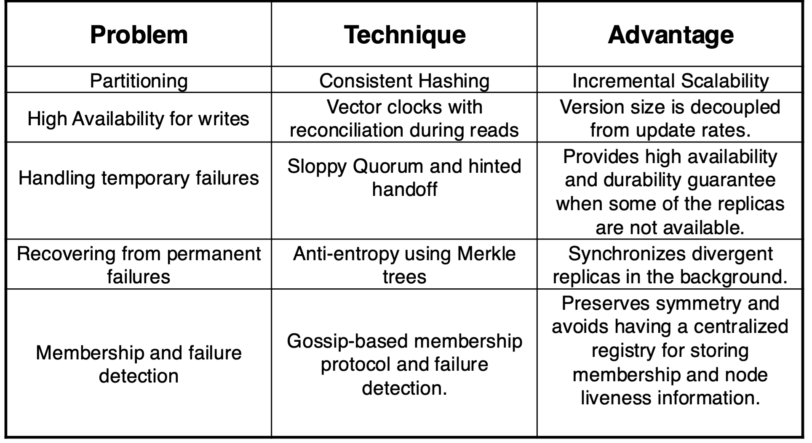


#### Consistency and Availability

* strong consistency and high availability cannot be achievbed simultaneously
* optimistic replication techniques- eventually consistent model
    
    * propagate changes to replicas in the background 
    
    * can lead to conflicting changes that have to be detected and resolved

When do you resolve conflicts

* during writes: tarditional approach
* during reads: Dynamo approach

Who resolves conflicts

* choices: data store or application

Data Store
* application-unaware, so choices limited
* simple policy, such as last write wins

Application
* application aware of meaning of data
* can do application-aware conflict resolution
* merge shopping car versions to get unified shopping cart

Fall back to "last write wins" if app doesn't want to bother

### Data Partitioning and Replication

Use Consistent Hashing

* only need K/n number of keys need to remapped, K=keys, n = slots

Distributed Hash Table (DHT)

* get ID from space of key
* nodes arranged in ring
* data stored on first node clockwise of current placement of data key.

Replication: preference list of N nodes following associated nodes

### DHT Overview

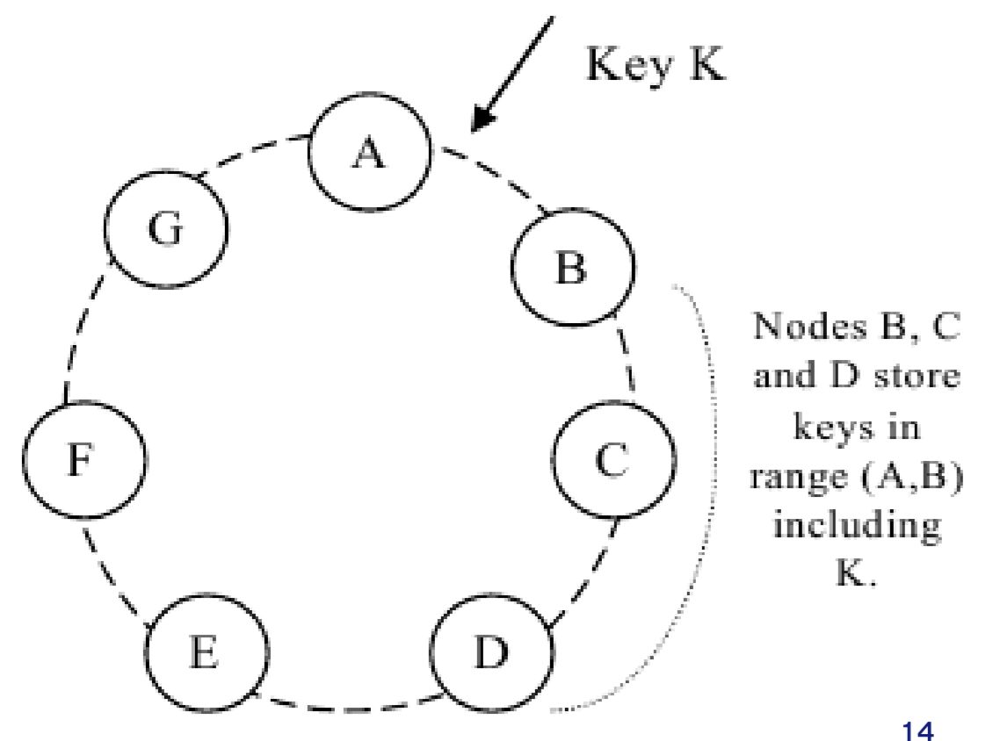

key-identifier: SHA-1(key)

node-identifier: SHA-1(IP Address)

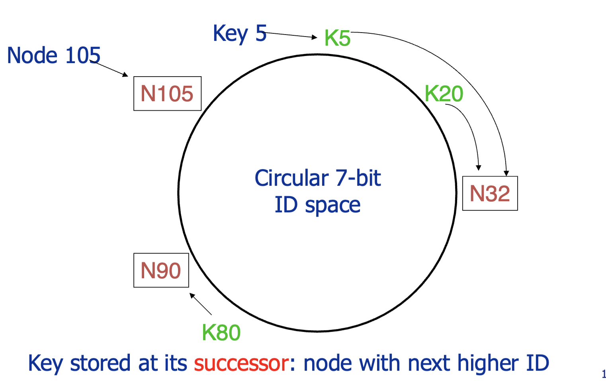

### Virtual Node in DHT Ring

Usual DHT cause uneven distribution on some load.


In dynamo, it use virtual node 

* each physical node has multiple virtual node
    * more powerful machine has more virtula nodes
* distribute virutla node across ring

Advantage: balanced load distribution

* If node becomes unavailable, load evenly dispersed among available nodes
* If node added it accepts equal amount of load from other node
* number of virtual node per system can be based on capacity of the node.

### Data Replication

Data replicate on N hosts

Coordinator replicates key at N-1 clockwise successors node in ring.


### Data Versioning

Not all updatse may arrive at all replicas

Application-basd reconciliation

* each modification of data is treated as new version

vector clocks used for versioning

* capture causality between different versions of same object
* vector clock is set of (node, counter) pairs
* returned as context from a get() operation

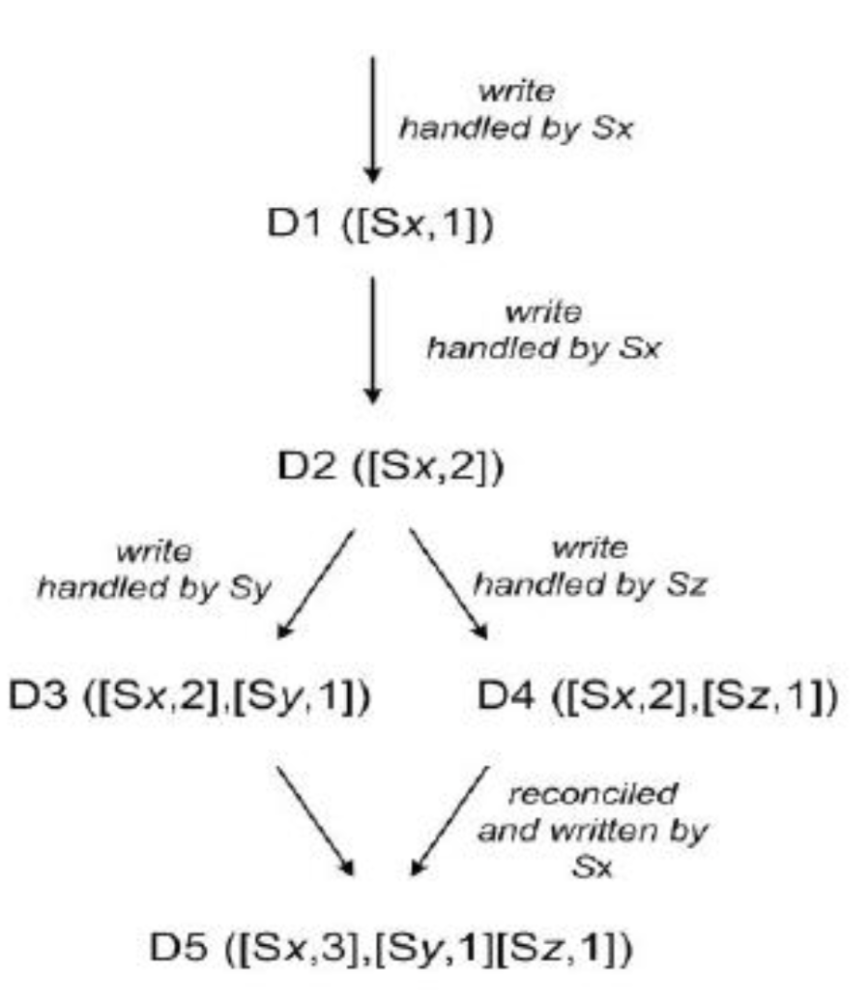


### Execution of get() and put()

coordinator node is among top N in preference list

coordinator runs R W quorum system: identical to weighted voting system

$$
R = read \ quorum \\
W = write \ quorum \\

R + W > N
$$

If a write is responded by W nodes successfull then the operation is done. Same for read operation


### Storage Nodes

Each node has three components

1. request coordination 
    * coordinator excutes read/write requests on behalf of requesting clients
    * state machine contains all logic for identifying nodes responsible for key,
    sending requests, waiting for response, retries etc.
    * each state machine instance handles one request
2. membership detection
3. local persistent storage
    * different storage engines may be used depending on needs

### Handling Failures

* Temporary failures: hinted handoff
    * offloads data to node that follows the last node in the preference list on ring.
    * responsibility sent back when node recovers.
* Permanent failures: replica Synchronisation
    * synchronise with another node.
    * Merkel Trees

### Markel Tree

Advantage: parts can be checked without need to compare whole tree

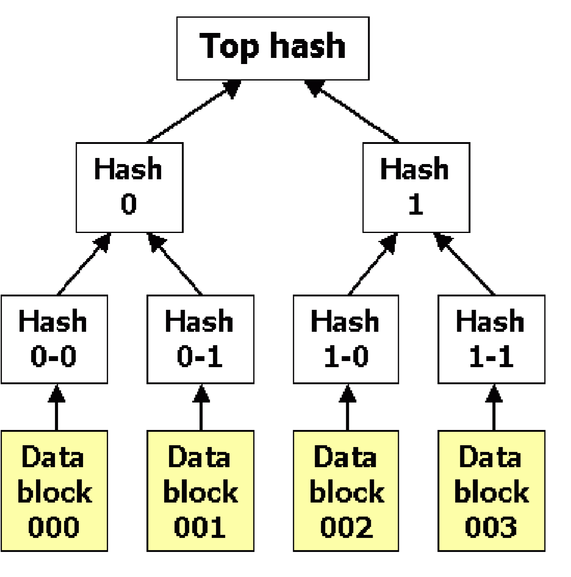

## Spanner: Google's Globally-Distributed Database

**What the paper want to achieve?**

Provide consistency when replicating data across multiple datacentre.

Improving opon the Bigtable, where data do not have complex schema

### Truetime API

It has a time interval with uncertainty. The leader excute the operation when uncertainty is high; otherwise it will wait.

Different systems use different clock, but introducing the uncertainty notion, it allows the distributed system to integrate 
wide range of applications.

TrueTime.now gives an interval containinng the possible time current interval. 

### Software Stack

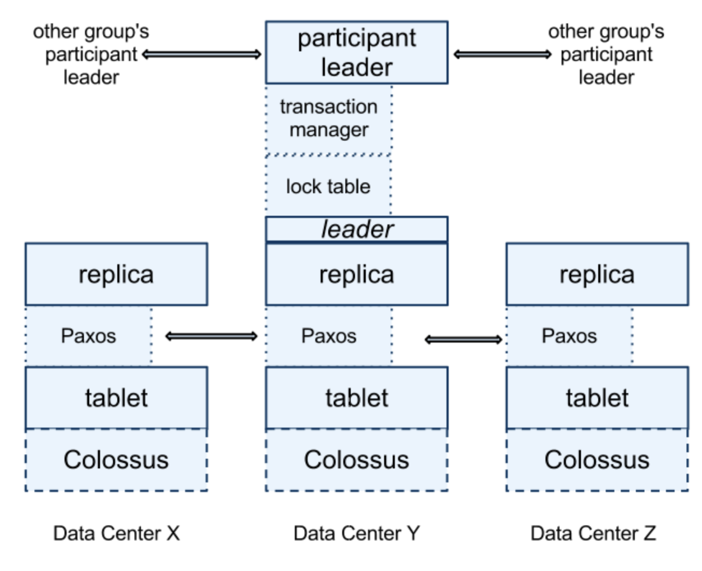

#### Paxos

Leader protocol. Leader drives the process, and make sure all participant agrees on some data.

They support replication in Spanner itself to gain more control over the application in terms of locality.

The Paxos leader gain a consensus for a data, making sure all Paxos group have updated the data, and ready to commit. Once it's ready
it will make every Paxos to perform a list of operation given the timestamp.


#### Data Model

Span exposes the below features to applications

* a data  model based on schemitized semi-relational table
* a query language
* general purpose transactions

#### Concurency Control

This section discussed how **externally copnsistent transactions**, **lock free read-only transaction** and **non-blocking reads** is implemented.

Operations Spanner support

* read-write transaction
* read-only transaction
* snapshot read transaction

A **Snapshot** is a consistent view of the data at a specific time.

### What is Spanner

Next step from Bigtable in RDBMS evolution with strong time semantics: 
**Distributed multi-version Database**

Key features of spanner_software

* General purpose transaction  (ACID)
    * **externally consistent** global write-transactions with synchronous replication
    * transactions across data centres
    * Lock-free read-only transaction
* Schematised, semi-relational (tabular) data model

### Spanner Overview

* Property: external consistency of distributed transactions
    * first system at global scale
    * enable transaction serialization via global timestamp

* Implementation: integration of concerrency control replciation, and 2PC (two phase commit)
    * corrctness and performance
    * auto-sharding, auto rebalancing, automatic failure detection

* Enableing Tech: **TrueTime**
    * interval based global time
    * scknowledge clock uncertainty and auarantees a bound ot it.

### External Consistency

consistent view

* synchronised snapshot read of database
* effect of past transaction should be seen and effect of future transaction
should not be seen across data centres

**Equivalent to Linearizability**

If transaction T1 commits before another transaction
T2 starts, then T1's commit timestamp is smaller than
T2's

### Reading transaction

1. Generate page of friends' recent posts: consistent view of friend list and their posts

Doing on a single machien is easy.

### Multiple machines

give data across multiple machien even multipel data centres

### External Consistency

consistent view: 

* synchronised snapshot read of Database
* effect of past transaction should be seen and effect of future
* strong consistency guarantee that can be achieved in practices


### Version Management

Transaction that write use strict 2PL (two phase locking): 

1. each transaction T assigned timestamp s
2. data written by T timestamped with s


### Read Write transaction

Use read locks on all data items that are read

* acquired at leader
* read latest version, not based on timestamp

Writes buffered, and acquire write locks at commit time (when prepare is done)

* Timestamp assigned at commit time.

### Timestamps

Two-phase locking for write transaction

* acquired locks
* release locks

strict two phase locking for write transaction. Assign timestamp while locks are held.


### Clock skew in Distributed System

Typically there is no global clock in distribted system

Individual node has local clock.

This means concurrent write can't be ordered.

### Truetime

* Leverage hardware features like **GPS and atomic clocks**

A set of time master servers per data centre and time slave daemon per machines

* majority of time masters GPS fitted; few otehr atomic clock fitted
* Daemon poll variety of masters and reaches consensus about the data

TT use GPS and Atomic clocks sine they are different failure rates and scenarios

Two methods:

* after(t): reutrn True if t is definitely passed
* before(t): return True if t is defintely not passed

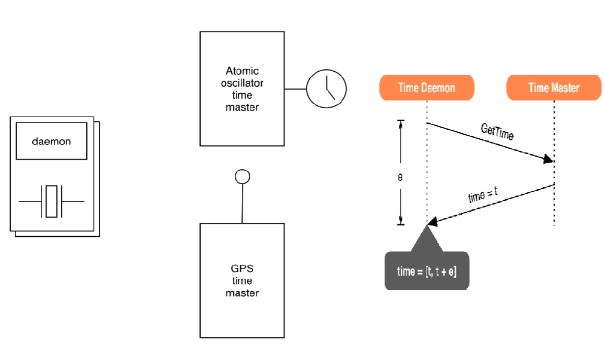

TrueTime provides a time estimate with an uncertainty.


### TrueTime supported Transaction

read-write : requires locks

read-only: lock free

* requries declaration before start of transaction
* reads information that is up-to-datacentre


snapshot-read: read information from past by specifying timestamp or bound

### Timestamps + TrueTime

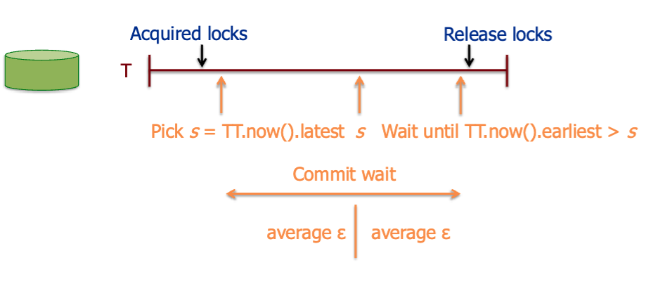

The acquire a lock, the system will wait to pass the uncertain window, then release the lock.

This is the ealiest estimate of current time is passed.

### Commit wait and Replication


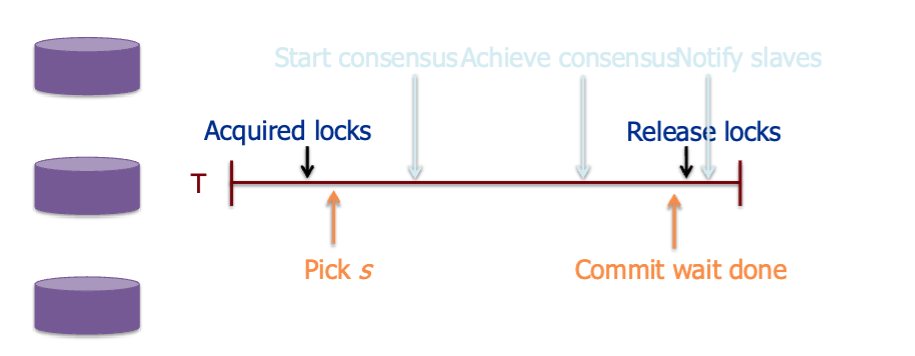

This image demonstrate how truetime and commit wait are integrated.

1. It acuquire a lock using current time s
2. It starts a consensus, in Spanner is Paxos for consistency protocol.
3. It achived consensus 
4. The wait window is passed, and then the lock is released
5. All slaves are notified

### Commit Wait and 2-Phase Commit

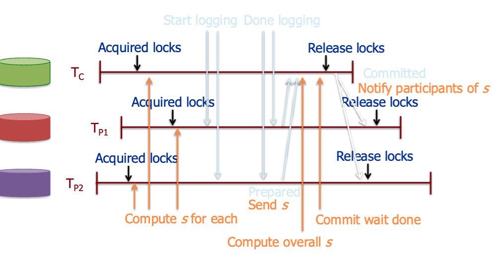

This image demonsrates how Spanner integrate Commit Wait and 2PC.

Tc is the transaction coordianator reponsible managing the event lifecycle.

Tp is the transaction participants reponsible of processing the events. 

Each transaction machine will acquire a time S, and participants will prepare logging. Once they 
finished, they will update to Tc. 

Tc will compute overall time S, which will make sure the uncertainty window is passed. Then it
willl notify each particants to commit the log.

Finally all machine release their locks.

### Architecture

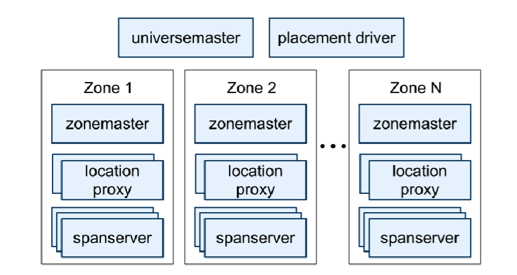

Universe master mangge everything in Spanner. Underneath there are many zones serving shards of data.

In each zone, there is a zonemaster, which manages everything in the zone. Also there are many
span servers which actuall serve all the data.

### Software Stack

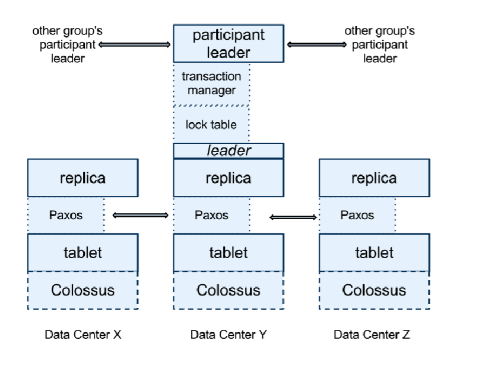

The transaction is started by the participant leader. The lock table will acquire locks for the 
associated resources to avoid conflicts.

The write will be written in Leader and broadcast to other followers by the Paxos. Only after a 
consensus is achived, the write will be considered as done; otherwise fail.

Each tablet contains a subset of the table, and the actual data is physically stored in the Colossus
system.

### Paxos Groups in Spanner

Tablets are replciagted (between datacenters, possibly inter-continental), concurrency coordination by Paxos

The consistency of transactions aross replicas. This is achieved by Paxos.

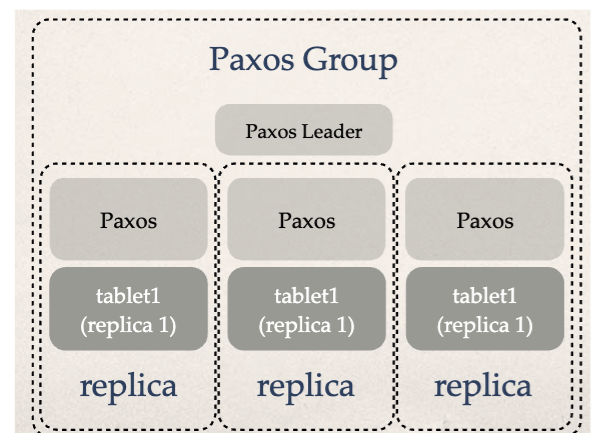

A Paxos Group has multiple components:

1. Paxos Leader: elected among Paxos group. It's reponsible for managing client requests and braodcasting
result to all followers
2. Replicas of tablets. Every replicas are the same.
3. Paxos: the transaction protocol in the group.

If a transaction involves multiple Paxos group, use transaction manageer to coordiante.


### Data chunks

Directory- analogous to bucket in BigTable

* smallest unit of data placement
* smallest unit to define replication Properties

Directory might in turn be shared into fragments if it grows too large


## Week 5

## MapReduce

Developers need to write parallization application in order to use the distributed services.

The need to perform simple logic computation over large scale dataset. 

The issue of  parallizization, data distribution, and fault-tolerance are key reasons giving MapReduce to arise.

The underlying assumption on the data input is that the data was served on GFS.

### Highlight

* Straggler: handling those tasks run very slow at the end, which constrained the overall performance.
* Fault Tolerance: the master never dies, and followers get replaced if not responding.
* Locality: task map tasks are done on machine which have the required data cached.
* Task granularity: gives a good upper bound on map and reduce tasks


### Programming Model

Use map and reduce two function which abstract all the computation.


### Data Model

The data model are a set of key value pair.

Map function transform key into value.

Reduce function recieves a key and a list of values, it aggregates values that have the key into the list.

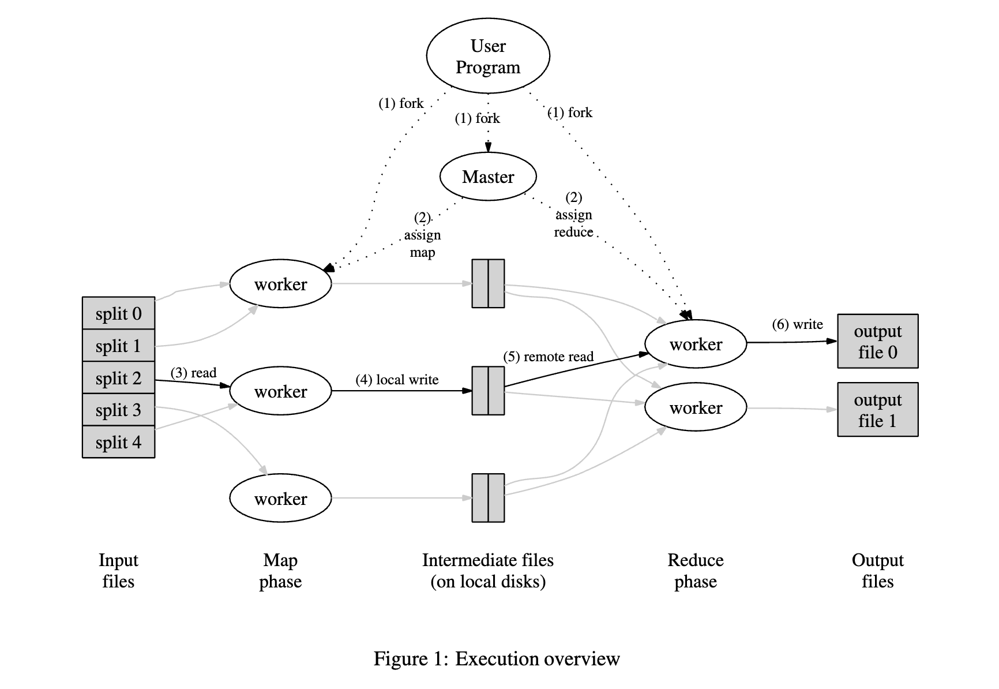

### Partion Phase

It use hash function to repartition keys, and sorted in a way that reduce function can extract relevant data in the range.

### MapReduce Overview

Mainstream big data analytics framework

* page rank
* made popular by google

Open source version Hadoop by Yahoo/Apache

* simple programming model
* transparaent parallelisation
* fault tolerant processing

### Distributed Dataflow

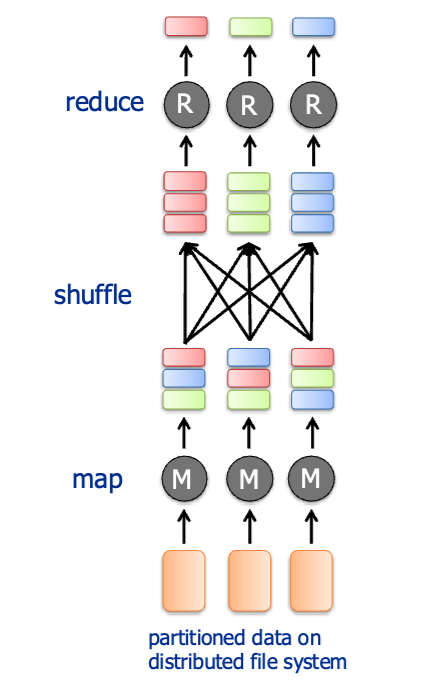

The image demonstrates workflow of MapReduce.

File on distributed file system partitions to chunks.

The Map uses a user defined function which transform input key-value pairs to intermediate
key-value pair.

Then the intermediate results will be shuffled and then reduce according to another funciton.
Usually reduce function will reduce the values of key to a list of values.


### Wordcount

* Map
* Shuffle
* Reduce

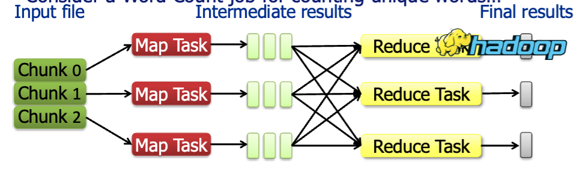

* Map: Processes input data and generates (key, value) pairs
 e.g. {(cat, 5), (dog, 7), (elephant, 9)}
* Shuffle: Distributes intermediate pairs to reduce tasks
 e.g. all words starting with A to reducer 1, those with B to reducer 2
* Reduce: Aggregates all values associated to each key
 e.g. sum all values for word “cat”, all values for word “dog”

### MapReduce Execution Model

* Map/reduce tasks scheduled across cluster nodes: locality aware scheduler
* Intermediate results persisted to local disks: final results of mapreduce job stored in GFS


### Failure Recovery

1. Task failure: restart task

* map tasks fetch data from GFS
* Reduce tasks fetch intermediate results from local disks

2. Node Failure: restart tasks on new node

* Need to re-run all tasks because intermedaite results are lost.


### Speculative Execution

MapReduce jobs dominated by slowest task

MapReduce attempts to locate slow tasks processing remaining task, and mark the task done once the task is done or the remaining task is done.

### Locating Straggler

Hadoop uses progress score between 0 to 1

If task's progress less than average - 0.2 + task ran for at least 1 minute

* mark as straggler


### Support for Iteration

* Iteration useful for many algorithm: ML/Data mining algorithm (pagerank, k-means, logistic regression)
* Loop unrolling: multiple MapReduce jobs

* Challenge: Materialisation of intermediate results becomes expensive

### Dryad: Dataflows as DAGs

* Arbitrary function as tasks: eg joins, group by etc
* Dataflow graph -> directed acyclic graph
* smae model as spark

## Data Storage

OS often stops best performance of DBMS

DBMS needs to do things in its own way

* specialized prefetching
* control over buffer repalcement policy
    * LRU not always best sometimes worst (LRU 最近最少使用)
* control over thread/process scheduling
    * convoy problem: arises when OS scheduling conflicts with DBMS locking
* control over flushing data to disk

DBMS stores information on disk, which as **huge implication** in DBMS design

* **READ**: transfer data from disk to main memory
* **WRITE**: transfer data from RAM to disk
* Both are high-cost operations, relative to in-memory operations, so must be planned carefully

### Not in Main Memory

* costs too high:
    * high-end databases today in the petabyte range
    * 60% of the cost of a production system is in the disks
* main memory is volatile
* **But** main meomry database systems do exist!
    * smaller size, performance optimized
    * volatility is ok for some applications


### Storage Hierachy

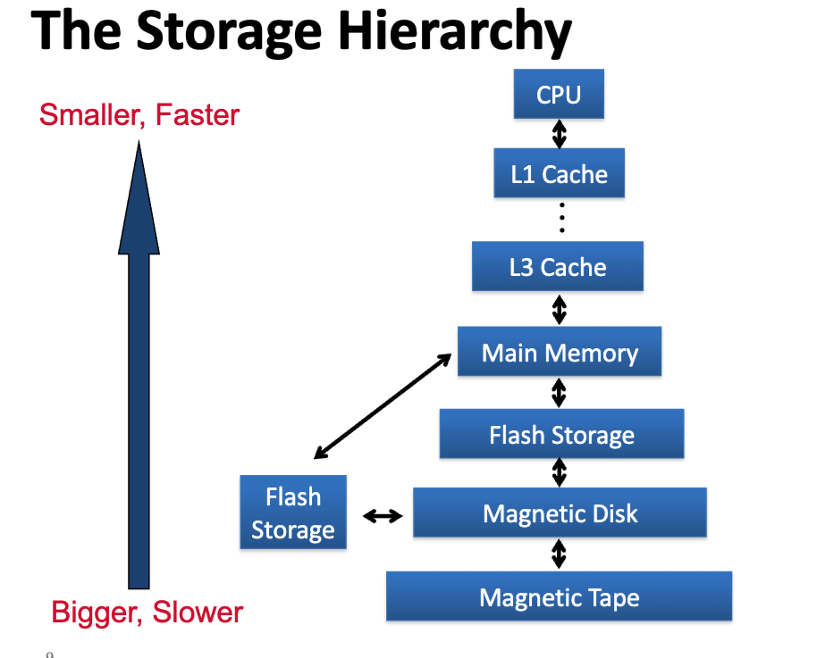

the higher the faster processing speed, but higher cost. 

the lower the slower processing speed, but lower cost.

In this diagram, the flash storage is a bridge between main memory and magnetic disk.

The main memory is volatile, but the flash storage is non-volatile; therefore the data in main memory can
be written fast to flash SSD.

The flash SSD has no mechanical part, so the processind speed is faster than magnetic disk but slower than
main memory.

### Database Storage Layer

#### Disks

Secondary storage device of choice. 

Random Access: directly pick an element from a location.

Sequential Access: move from the begining to the required location.

Data is stored and retrieved in units called disk blocks or pages.

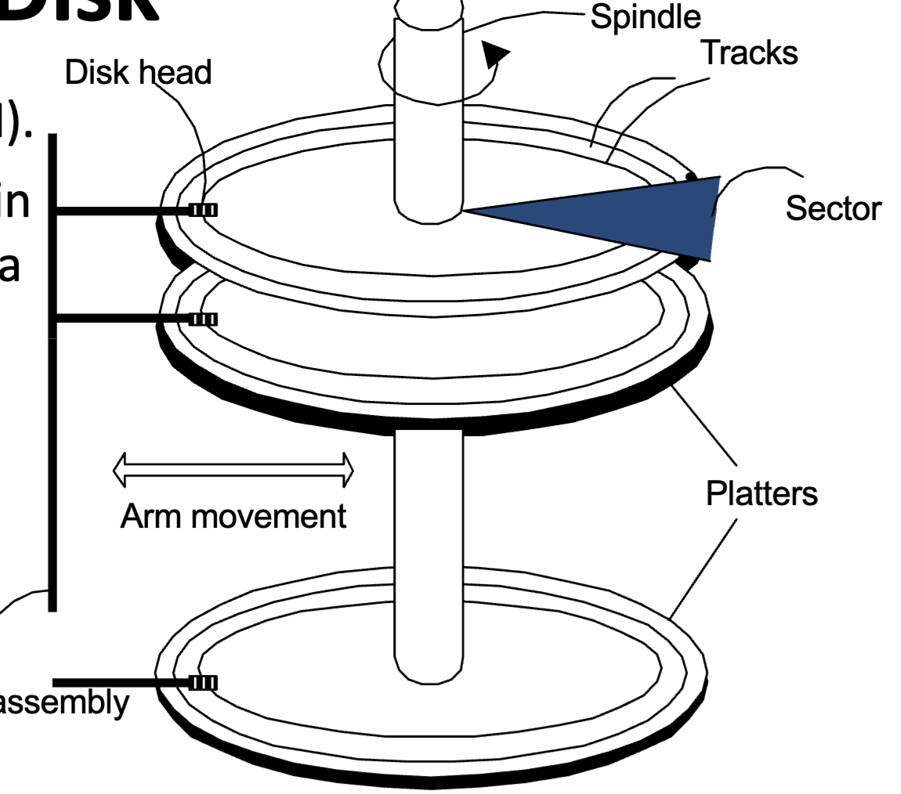

The platters spin (5-15 kRPM)

The arm assenbly is moved in or out to position a head on a desired track. Tracks under heads make a cylinder.

Only one head reads/writes at any one time.

* Blocks size is a multiple of sector size

Disk is a mechanical device, which rotates the platter to access information. 

The accessing time of disk page depend on the location on disk, as it needs to move the mechanical
parts.


#### Accessing a Disk Page

Time to access (read/write) a disk block:

* seek time (moving arms to position disk head on track)
* rotational delay (waiting for block to rotate under head)
* transfer time (actually moving data to/from disk surface)

#### Seek Time and Rotational Delay Dominate

* Seek time varies from about 1 to 20ms
* Rotational delay varies from 0 to 10 ms

* Key to lower I/O cost: reduce seek/ rotation delays

Therefore, the best thing to do is to redcue seek time and rotation delays!

#### Arranging pages on Disk

"Next" block concept

* blocks on same track, followed by
* blocks on same cylinder, followed by
* blocks on adjacent cylinder


* Blocks in a file should be arranged sequentially on disk to minimize seek and rotational delay.
* An importatn optimization: pre-fetching

adjacent cylinder is obtained by shorter or longer arm, which will form different cylinder

Using the next block idea, **pre-fetching** is a good optimization technique.

**Adjacent Block**: Equidistant wrt access time from starting block. 

### Disk Space Management

* Lowest layer of DBMS software manages spae on disk
* Higher levels call upon this layer to:
    * allocate/de-allocate a page
    * read/write a page
* Best if a request for a sequence of pages is satisfied by pages stored sequentially on disk! Higher levels don't need to know if/how this is done,
or how free space is managed.

#### Rules of Thumb

1. Memory access much faster than disk I/O
2. Sequentially I/O faster than random I/O

### Main Memory Indexing

#### Memory Basics

* memory hierarchu:
    * cpu
    * L1
    * L2
    * TLB
    * Capacity restricted by price/performance

* Cache Performance is crucial
    * Similar to disk cache (buffer pool)
    * Catch: DBMS has no direct control

#### Improving Cache Behavior

* Factor:
    * cache TLB capacity
    * locality (temporal and spatial)
* To improve locality
    * no random acess (scan, index traversal)
    * clustering to a cache line
    * squeeze more operations into a cache line.
    * Often trade CPU for memory access

The factors affecting cache behavior is Cache capacity and Locality (temporal and spatial)

To improve locality:

* non random access (scan, dinex traversal) 扫描
    * clustering to a cache line
    * squeeze more operations (useful data) into a cache line
* random access (hash join)
* often trade CPU for memory access


#### Cache Conscious Indexing

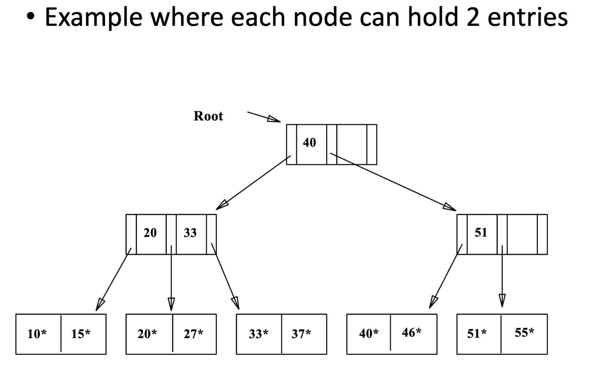

Tree Index

* Index entries: <search key value, page id> they direct search for data entires in leaves.
* Example where each node can hold 2 entries.

The index entires direct search. Data is stored in leaves

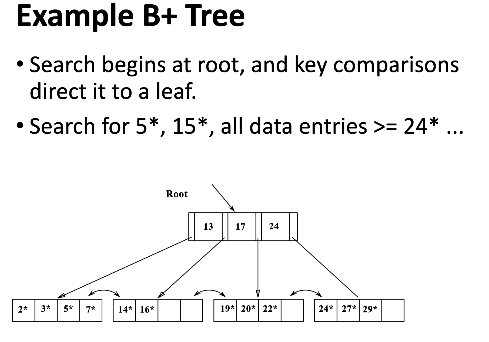

B+ Tree Properties

* balanced
* every node except root must be at least 1/2 full
* order: the minimum number of keys/pointers in a non-leaf node
* Fanout of a node: the number of pointers out of the node.

* searching: log_d(n) where d is the order and n is the number of entires
* insertion:
    * find the leaf to insert into
    * if full, split the node and adjust index accordingly
    * similar cost as searching
* deletion:
    * fidn the leaf node 
    * delete 
    * may not remain falf-full; must adjust the index

#### Cache Sensitive Search Tree

* Key: improve locality
* similar as B+ tree
* fit each node into a L2 cache line
    * higher penlaity of L2 misses
    * can fit in more nodes than L1
* Increase fan-out by:
    * variable lenth keys to fixed length via dictionary

Cache sensitive search tree has similar structure as B+ tree, but focusing on cache optimization.


#### CSB+ tree

* children of the same node stored in an array
* parent node with only a pointer to the child array
* similar search performance as CSS tree
* good update performance if no split

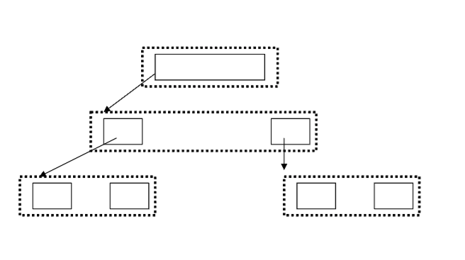

#### Performance Consideration

### Cache Conscious Join Method

#### Vertical Decomposed storage

* divide a base table into m array (m as number of attributes)
* each array stores the <oid, value> pair for the ith attribute
* using fixedf length via dictionary compression
* **Reconstruction** is chpea just an array access.

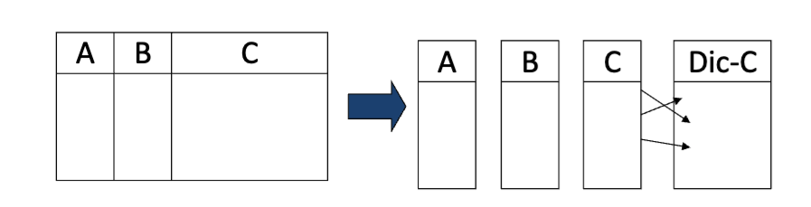

### Existing equal join methods

* Sort-Merge: bad since usually one of the relation will not fit in cache
* Hash Join: bad if inner relation can not fit in cache
* Clustered hash join: 
    * One pass to generate cache sized partitions
    * bad if number of partitions exceeds number cache lines or TLB entries.


#### Radix Join

Multi passes of partition

* the fan-out of each pass does not exceed number of cache lines AND TLN entries
* partition based on B bits of the join attribute

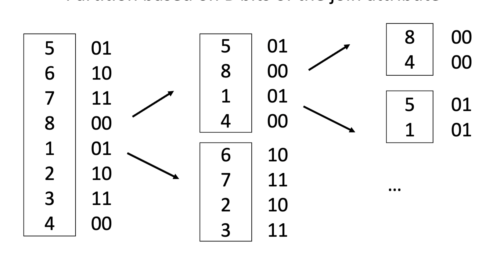

Radix 把数据分区，根据的二进制数值，不断的分化，直到数据可以放进L2 cache 的大小。

内部小partition 通过nested loop 相连，大partition 通过hash join 相连


## In Memory Database

### OLAP vs OLTP

* OLAP (Business Intelligence)
    * massive amounts of data
    * complex queries
    * large number of tables
    * long running but still somewhat interactive
    * mostly read only
* OLTP
    * Really only transaction (updatse)
    * Few tables touched
    * Typically generated queries

In a typical in memory database, only 4% of time is doing useful work.

* 24% recovery
* 24 latching
* 24% locking
* 24% buffer pool

**ACID**

* Atomicity
* Consistency
* Isolation
* Durability


#### Solution Choices

* OldSQL:  legacy RDBMS
* NoSQL: give up SQL and ACID for performance
* NewSQL:
    * preserve SQL and ACID
    * get performance from a new architecture

#### ACID

These are situations need ACID

* transfer: moving from X to Yahoo
* integrity constraints
    * back out if failures
* Multi-record state

#### NoSQL Summary

* Good for non-transactional systems
* appropriate for single record transactions that are commutative

### NewSQL

The challenges need to overcome

1. Needs something other than traditional record level locking: Using timestamp order, and multi-version concurrent control
2. Needs a solution to buffer pool overhead: Using main memory (at least for data that is not cold) and other ways to reduce the buiffer pool
3. Needs a solution to latching for shared data structure
4. Needs a solution to write-ahead logging: Using built-in replication and failover

**Note**: latching is a shorten lock used for data structure. It's short time lock for single operation.


### NewSQL Example VoltDB

VoldDB is main memory storage, single threaded, run transaction to completion, no locking and no latching. It has built-in high
availability and durability (no logs)

* Main memory storage
* single threaded, run transaction to completion (no locking and no latching)
* Built-in high availability and durability, no logs (in the traditional sense)

The single thread design, remove the need for locking and latching. This will remove 50% overhead.

### Currnet VoltDB status

* runs a subset of SQL
* runs on VoltDB clusters (in memory on commodity hardware)
* use LAN and SQN replication
* scales to 384 scores

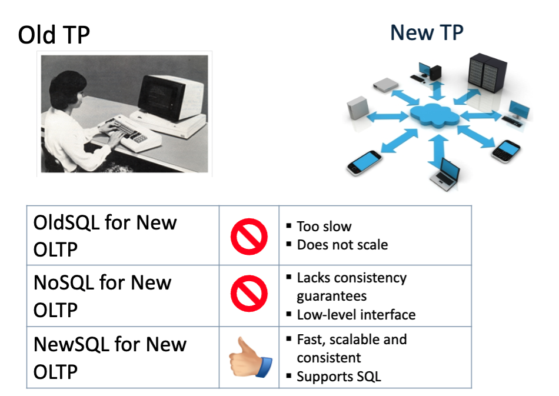

OldSQL for New OLTP: too slow and not scalable

NOSQL for New OLTP: lacks consistency guarantees and Low Level Interface

NewSQL for New OLTP: 
    * fast scalable and consistent. It 
    * supports SQL

### Technical Overview

VoltDB avoids the overhead of traditinoal databases

* K-safety for fault tolerance
* no logging
* in memory operation for maximum throughput
* no buffer management
* partition operate autonomously and single-threaded
* no latching or locking

## Week6

## Solid state storage and Database:

#### Fresh Disk

secondary storage or caching layer

main advantage over disks: random reads qually fast as sequential reads.

* slow random writes

Data organized in pages (similar to disks) and pages organized in flash blocks.

* Like RAM, time to retrieve a disk page is not related to location on flash disk.

Flash disk has equal fast speed for random read as sequential read

* data organized as pages
* like RAM, time to retrieve a disk page is not related to lcoation of a flash disk.

#### Internal of Flash Disks

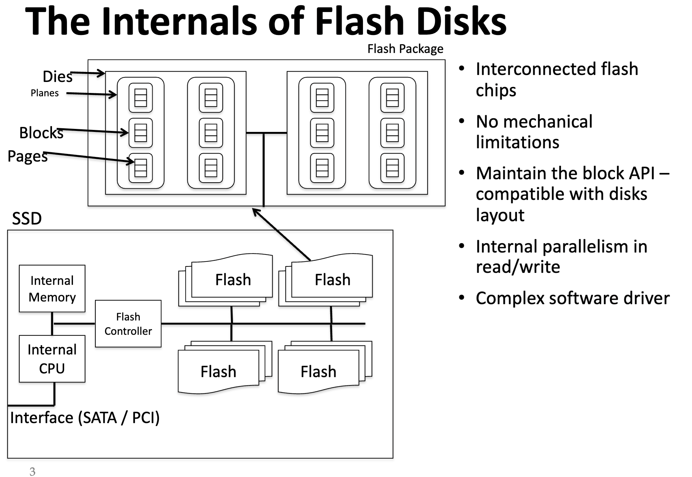

According to the up diagram, the hierachy is organised As

* page: 4KB
* block: about 64 pages
* planes: multiple blocks
* dies: multiple dies organized and allowing parallel processing

The bottom diagram shows

* Flash controller: managing all reads/writes, garbage collection
* Internal CPU: process logic unit and optimization operation, such as data compression and error correction
* Internal Memory: used data cache and meta-data. These can accelerate the reads/writes

**Properties of Flash Disk**

* Inter-connected chips
* No Mechanic Limitation
* Main Block Level API
* Internal Parallel reads/writes
* Complex software driver


#### Accessing a Flash Page

This part discusses accessing a flash page. The first section is on data organization, and
the second part talks abot the Flash Translation Layer (FTL)


* Access time depends on
    * device organization (internal parallelism)
    * software efficiency (driver)
    * bandwidth of flash packages
* Flash Translation Layer (FTL)
    * complex device driver (firware)
    * Trunes performance and device lifetime

#### Flash disk vs HDD

Hard Disk Drives have high capacity but the performance is really low; whereas the flash disks have fast performance, but the cost is high.

Today SSD acts as a bridge between RAM and HDD.

#### Storage and Data Management

* DBMS traditionally designed from groupd up around a HDD model
* some common HDD optimizations
    * data structures: b-trees, bitmap indexes, column organization, compression
    * query plans (prefer sequential vs random access)
    * buffer poll, buffering policies, write-ahead logging
    * column stores


#### Storage and Data Management

* DBMS traditionally designed from ground up around a HDD model
* Common HDD optimization
    * Data structure: B-trees, bitmap indexes, column organization, compression
    * Query Plans (prefer sequential vs random access)
    * Buffer Pool, buffering policies, write-ahead logging
    * Column stores

#### What to do with Flash

Flash position in memory hierarchy

* HDD repalcement
* Intermiedaite layer
* Side by side with HDDs

No 'correct' use

* depends on workload (dataset size, access pattern)
* Future trends: 

#### Flash Only OLTP

* OLTP I/O dominated by random reads/writes
* Random reads/ writes much faster on flash
* Flash-resident workload: usually a couple of flash devices can hold working set.


Very good for random reads/writes. Flash can improve throughput of OLTP

For flash only OLTP, the throughput of flash decays over time in hours. This is because as more data write in, the garbage collection
wear levelling, write amplication mechanism are starting more requently. And the flash requires logging before write, therefore,
each the throughpout becomes lower over time.

#### Append/Pack

Sequential write, append the data at the back. Once storage is full, space will be reclaimed. When updates required, the old place
will be marked as invalid page, and update will be written in a new place.


#### Flash-aided Business intelligence (OLAP)

Data warehouse workload

* read-only quries (scans)
* scattered updates
* how to combine efficiently?

Traditionally two choices

* Freshness: in-place updates
* Performance: batch updates

#### Flash as a (write) cache for analytics

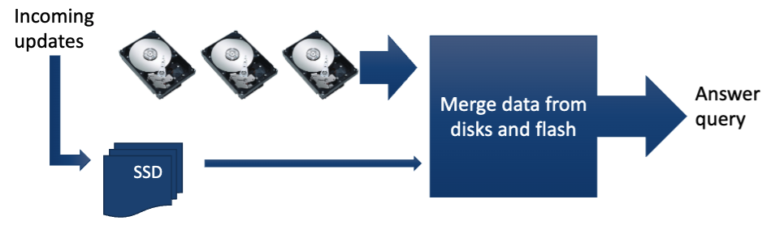

#### Logging on Flash and HDD

Transactional logging: major bottleneck

* today, OLTP DBs fit into main memory, but still must flush redo log to stable media
* Log access pattern: small sequential writes, HDD incur full rotational delays


### In-Memory Database

#### OLAP versus OLTP

* OLAP (Vysiness Intelligence)
    * massive amount of data
    * complex quries
    * large number of tables
    * long running but still somewhat interactive
    * mostly read only
* OLTP
    * read only transaction 
    * few tables touched
    * typically generated queries

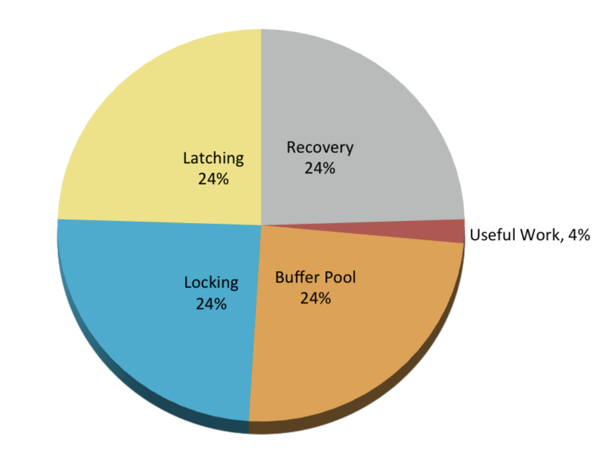

#### How to go Faster

Solution Choices

1. OldSQL: legacy RDBMS vendors
2. NoSQL: give up sql and ACID for performance
3. NewSQL: Preserve SQL and ACID, Get performance from a new architecture

#### NewSQL

Needs something other than traditional record level locking (1st big source of overhead)

* timestamp order
* MVCC

Needs a solution to buffer pool overhead (2nd big source of overhead)

* Main memory (at least for data tahta is not cold)
* some other way to reduce buffer pool cost

Needs a solution to latching for shared data structures (3rd big source of overhead)

### VoltDB

* Main Memory storage
* Single threaded, run transaction to completion
    * no locking
    * no latching
* Built-in high availability durability

* runs a subset of SQL
* On VoldDB Clusters (in memory on commodity hardware)
* With LSN and WAN replication
* 70x a polular OldSQL DBMS on TPC-C
* 5-7x cassandra on VoltDB key-value layer


## XML and RDMBS

#### Rules

* The first tag is the root of the tree. There must be a single root
* Every other matcing pair of tags becomes one node. If a pair of tags is contained in another pair, the contained pair becomes a child of the containing pair. Children have a defined order.
* Text becomes a child of the node corresponding to the tag that encloses the text. This is always a leaf node.
* XML allows single tag. Single tag always become leaves with a box.
* XMl tags are case sensitive and they must be always properly nested.

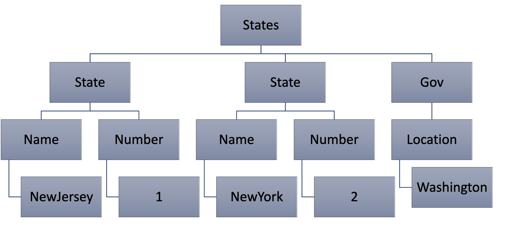

#### Document Type Definition (DTD)

A valid XML document is a well formed XML document, which also conforms to the furles of the DTD.

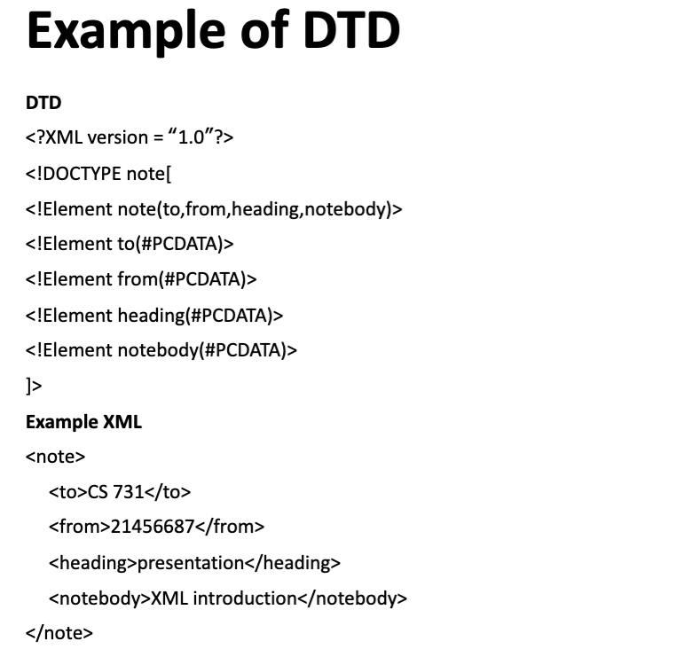

!doctype defines a type with a list of elements. The first element is similar to the constructor specifing all its parameters.

Followings are the elemetns and their type.

PCDATA: poarsed character data: a character string

! is minumum one occurrence of the same element

+ zero or more occcurrenes of the same element

? zero or one occurrences of the same element

#### Advantages of XML

* xml open standard
* human readable 
* easy to process
* used to integrate complex web based systems.

* all modern web systems architecture is designed based on XML

#### Storing and Quering XML in Database

XML data can be stored in following ways

* relational databse
* file system
* object-oriented database
* a special purpose system such as Lore, Lotus Note, or Tamino

XML 可以通过一下方式储存

* 关系数据库
* 文件系统
* 面对对象数据库
* special purpose system


#### Two Ways Storing XML data 

* Structure Mapping Approach: in SMP, the design of database schema is based on the understanding of DTD that
 describes the structure of XML doc. (结构映射, 使用DTD信息)
* Model Mapping Approach: In MMA no DTD information is required for data storage. A fixed database schema is used to store
 any XML documents without assistance of DTD. (不用任何DTD信息)


#### Advantage of Model Mapping Approach

1. Capable of supporting any sophiscated XML applications that are considered 
either as static (the DTD are not changed) or dynamic (the DTD vary from time to time)
2. Capable of supporting well-formed but non-DTD XML applications
3. It does not require extending the expressive power of database models, in order to support 
XML documents. It is possible to store large XML document.


#### Model Mapping Approaches

In MMA, it can also be classifed to four Approaches

1. Edge: all the edge of XML document are stored in a single table
2. Monet: It partitions the edge table according to all possible label paths.
3. XParent: Based on LabelPath, DataPath, Element and Data
4. XRel: XML data sotred based on Path, Element, Text, and Attribute.

The first three are edge oriented approaches, and the fourth is Node Oriented Approach

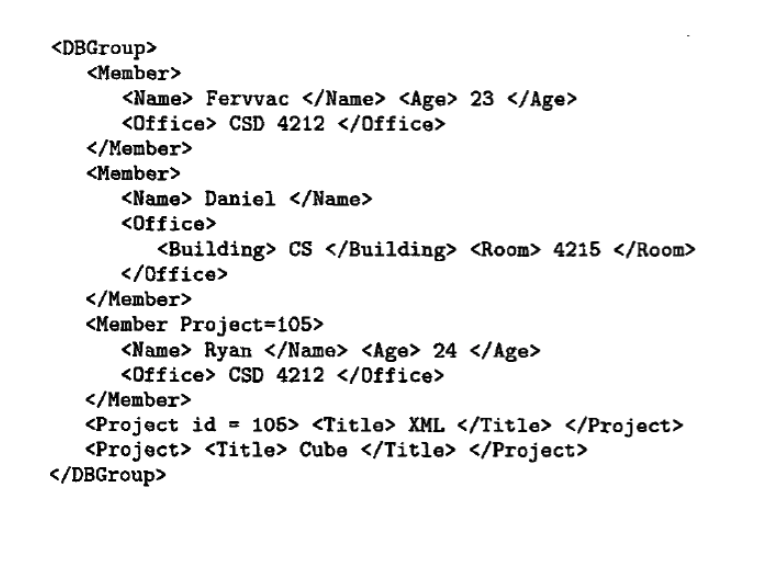
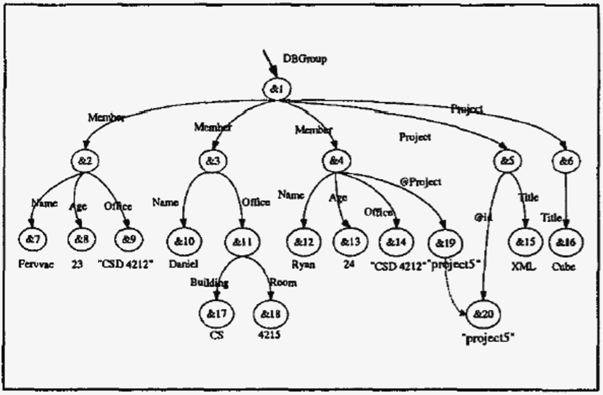

The <Member Project= 105> links the current member to Project with id 105.

From the root node, it branches to multiple member object, each has their own definition. The first and second member have
different format for office definition. This variant is reflected in the data graph

#### Key Terms

* Ordinal: The ordinal of an element is the order of this element among all siblings that share the same parent
* a Label-Path: is an XML data graph is a dot separated sequence fo edge labels
* a Data-Path is a dot separated alternating sequence of element nodes


Ordinal: 该元素在parent 下的与同级element 的相对位置

Label-Path: 是由点分割的边序列: DBGroup.Member.name

Data-Path: 是由点分割的元素序列: &1.&2.&7

#### Edge Approach

The edge table can be represented as 

Edge(Source, Ordinal, Target, Label, Flag, Value)

* Source: represents the source node in the data graph
* Ordinal: order of element among the sibilings
* Target: node to which the current node is pointing to
* Label: the name in the XML document
* Flag: the type of the data being represented
* Value: represents the data in the XML document

## Graph databases

### Graph Databses: Pros and Cons

* Pros:
    * powerful data models, as general as RDBMS
    * connected data locally indexed
    * essy to query
    * scales up reasonably well
Cons:
    * sharding (lots of peopel working on this)

### What are graphs good for?

* recommmendations
* Business Intelligence
* Social Computing
* Geospatial
* Systems Management
* Web of things
* Genealogy
* Time Series of Data
* Product Catalogue
* Web analytics

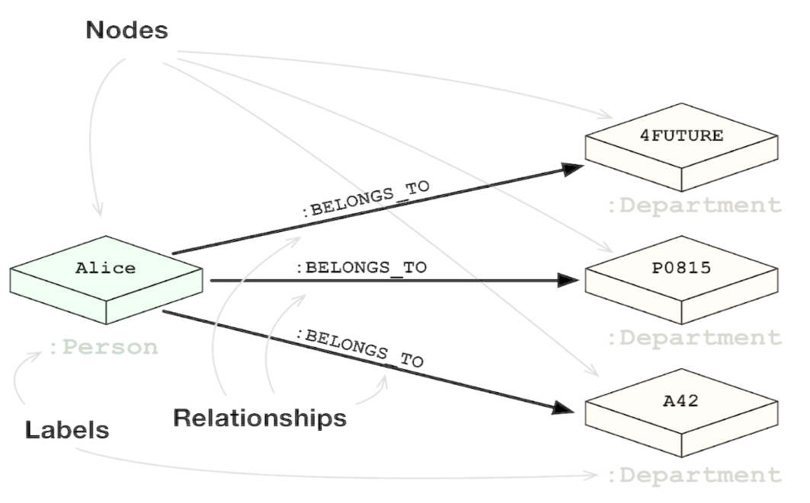


### What is a Graph Database

* A database with an explicit graph structure
* Each node knows its adjacent nodes
* As the number of nodes increases, the cost of a local step (or hop) remains the same
* Plus an index for lookups

### Translating to Neo4j

* each entity table is represented by a label on nodes
* each row in a entity table is a node
* columns on those tables become node properties
* add unique constraints for business primary keys add indexes for frequent lookup attributes.

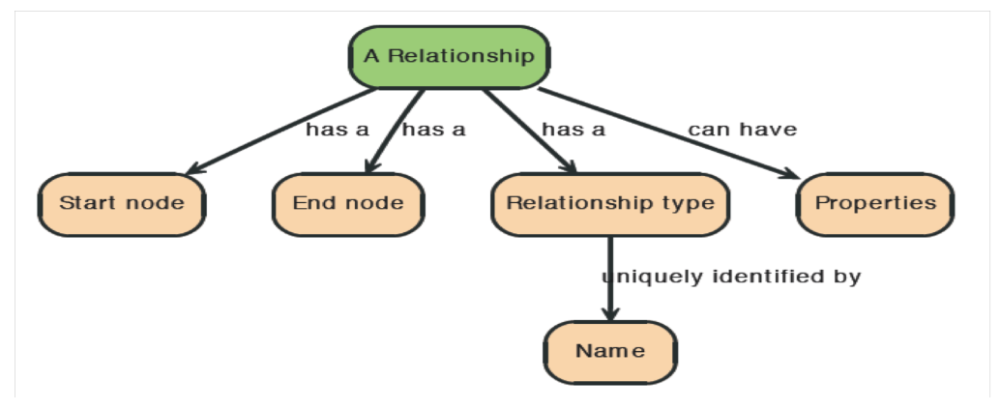

Neo4j 

* can have relationships
* can have properties

### Properties

* Both **nodes and relationship** can have properties.
* Properties are **key-value** pairs where the key is a string.
* Property values can either a primitive or an array of one primitive type.
* For example String, int and int[] values are valid for properties.

### Cypher

* Declarative Pattern Matching langauge
* SQL like Syntax
* Designed for graphs

```
Start a = node(*)
Match (a) -[r] -> ()
Return a.name, type(r)

Start a=node(*)
Match (a) -[:Acted_In] -> (m)
Return a.name, m.title;

Start a=node(*)
Match (a) -[r : Acted_In] -> (m)
Return a.name, r.roles, m.title;
```

### paths

(a)-->(b)-->(c)

[a]-->[b]<--[c]

```
Start a=node(*)
Match (a)-[:Acted_In] -> (m) <-[:Directed] - (d)
Return a.name, m.title, d.name;

Start a=node(*)
Match (a)-[:Acted_In] -> (m),  (m) <- [:Directed] - (d)
Return a.name, m.title, d.name;

Start a=node(*)
Match (a)-[:Acted_In] -> (m), (d) -[ : Directed] -> (m)
Return a.name, m.title, d.name;

Start a=node(*)
Match p = (a)-[:Acted_In] -> (m), (d) -[ : Directed] -> (m)
Return nodes(p);
```

The above query seach for actors and director who acted or directed in the same movie.


### aggregation

```
Start a = node(*)
Match (a) -[ : Acted_In] -> (m) <- [Directed] -  (d)
Return a.name, d.name, count(m)
```

### Unique Relationships in paths

```
Start a=node(*)
Match (a) - [:Acted_In] -> (m) <- [:Acted_In] - (a)
Return a.name, m.title;
```

### Sort and Limitation

```
Start a=node(*) Match (a) - [:Acted_In] -> (m) <- [:Directed] -(d) Return a.name, d.name
count(*) As count
Order By(count) Desc
Limit 5;
```

### aggregation

* count(x): add up the number of occurrences
* min(x): get the lowest value
* max(x): get the highest value
* avg(x): get the average of a numeric value
* collect(x): collected all the occurrences into an array

```
Start a=node(*) 
Match (a) - [:Acted_In] -> (m) <- [:Directed] -(d) 
Return a.name, d.name
```

### Find a specific node

```
Where - filter the results
has(n.name) - AND n.name = "Tom Hanks"
Return n;
```

### Conditions

#### Constraints on properties

```
Match (tom) - [ : Acted_In] -> (movie)
Where tom.name = "Tom Hanks" And movie.released < 1980
Return Distinct movie.title

Match (keanu) -[: Acted_In] -> (movie) <- [:Acted_In]- (n)
Where Not((hugo) - [:Acted_In] -> (movie)) And keanu.name = “Keanu Reeves” AND hugo.name = “Hugo
Weaver”
Return Distince n.name;

```

### Updating with Cypher

#### Create

```
CREATE ({title:"Mystic River", released:1993});

START a=node(*)
MATCH (a)
WHERE a.title = “Mystic River”
RETURN a
```

#### Updating Property

```
Start a=nodes(*)
Match (a)
Where a.title = "Mystic River
Set movie.tagline == "We bury our sins here, Dave. We wash them clean."
Return movie=
```

#### Changing Properties

```
START a=node(*)
MATCH (a)
WHERE a.title = “Mystic River”
SET movie.released = 2003
RETURN movie;
```

#### Creating Relationships

```
Create Unique (kevin)- [:Acted_In {roles: ["Sean"]}] -> (movie)
Where movie.title = “Mystic River” AND kevin.name = “Kevin Bacon”
Return
```

Change Kevin Bacons role in Mystic River
from “Sean” to “Sean Devine”

```
MATCH (kevin)-[r:ACTED_IN]->(movie)
WHERE kevin.name = “Kevin Bacon” AND movie.title = “Mystic
River”
SET r.roles = ["Sean Devine"]
RETURN r.roles;
```


Add Clint Eastwood as the director of Mystic
River

```
CREATE UNIQUE (clint)-[:DIRECTED]->(movie)
WHERE clint.name = “Clint Eastwood” AND
movie.title = “Mystic River”
```

List all the characters in the movie The Matrix”

```
Match (movie) <- [r:Acted_In] - ()
Where matrix.name = "The Matrix"
Return r.roles
```

Here the movie is the requested subject. We want to list all actors who acted in the movie--The Matrix.

The [r:Acted_In] specfies that we want all nodes hold a Acted_In relation with the movie.

#### Deleting nodes and relationship

Delete relationships of the node emil name equals to Emil Eifrem

```
MATCH (emil)-[r]->()
WHERE emil.name = “Emil Eifrem”
DELETE r;
```

```
MATCH (emil)-[r]->()
WHERE emil.name = “Emil Eifrem”
DELETE r, emil;
```

Add KNOWS relationships between all actors who were in the same movie

```
Start a = node(*)
Match a ->[:Acted-In] -> () <- [:Acted-In] - b
Create Unique (a) - [:Knows] -> (b);

```

## Document Database

### Motivation

Limit of SQL:

* Rigid schema
* Not easy scalable
* unintuitive join

Advantage of MongoDB

* Easy interface with common programing language
* Run on any environment
* Keeps essential features of RDBMS while learning from key-value noSQL system.

### Data Model

* document based (max 16 MB)
* documents are in BSON format, consisting of field-value pairs
* each document stored in a collection
* collections:
    * have index set in common
    * like tables of relational DB's
    * documents do not need to have uniform structure

collection 就像relationDB 中的table

* 具有共享索引集合
* 类似于relatinoal DB 中的table
* 文件不需要有一致的结构

### JSON

* Easy for humans to write/read, easy for computers to parse/generate
* Object can be nested
* Built on 
    * name/value paris
    * ordered list of values

#### BSON

* Binary JSON
* Binary encoded seralization of JSON like docs
* Embedded structure reduces need for joins
* Goals
    * lightweight
    * traversable
    * efficient


```
\x16\x00\x00\x00
\x02 name\x00\x06\x00\x00\x00Alice\x00
\x10 age\x00\x19\x00\x00\x00
\x04 hobbies\x00\x26\x00\x00\x00\x02 0\x00\x08\x00\x00\x00reading\x00
\x02 1\x00\x0A\x00\x00\x00traveling\x00\x00
\x08 is_student\x00\x00
```

Above is an example of BSON format specifying data type.

### ID_filed

Id field is a core field in MongoDB. It serves for fast indexing. The default type of id is Objectid, which is small, unique, immutable 
and ordered. Sorting on ObjectId is equivalent to sorting on creation time.


### MongoDB VS SQL

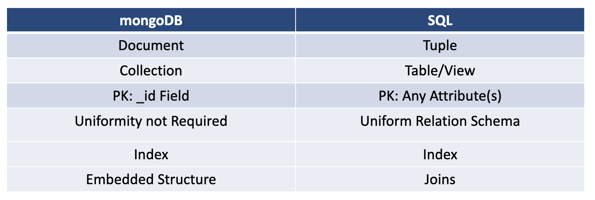

Mongo DB is basically schema-free

* The purpose of schema in SQL is for meeting the requirements of tables and quirky SQL implementation
* Every row in a db table is a data structure much like a struct in C or a class in Java. A table is then an array of such data structure


### CRUD in MongoDB

#### CRUD Inserting
To insert documents into a collection/make a new collection:

```
db.<collection>.insert(<document>)
```

Insert one document

```
db.<collection>.insert({<field>:<value>})
```

Inserting a document with a field name new to the collection is supported by BSON. {<field>:<value>}

#### CRUD Querying

Find all documents

```
db.<collection>.find()

db.<collection>.findOne()

db.<collection>.find({<field>:<value>})
“AND”
db.<collection>.find({<field1>:<value1>,
<field2>:<value2>
})

<!-- below is the RDBMS query -->
SELECT *
FROM <table>
WHERE <field1> = <value1> AND <field2> = <value2>;
```

#### CRUD Updating

```
db.<collection>.update(
    <field1>: <value1>,  #all docs with field1=value1
    {$set: {<field2>:<value2>}}, # set field2 to value2
    multi=true) #multiple doc updates
```

To reomvve a field

```
db.<collection>.update(
    {<field>:<value>},
    {$unset: {<field>:1}}
    
)

```

To replace all fields and values

```
db.<collection>.update({<field>:<value>},
{ <field>:<value>, <field>:<value>})
```

#### CRUD Removal

```
db.<collection>.remove({<field>:<value>})

<!-- remove only the first document -->
db.<collection>.remove({<field>:<value>}, true)
```


### CRUD Isolation

All writes are atomic on the level of document, which means that write on a single document either all successful or all fail, and there is no
partial done.

Concurrent write indicate potential inconsistency in write.


### MongoDB is Schema Free

A fow in SQL Table is like a data structure, and a table is a list of such data structure.

MongoDB allows more nested structure encoding BSON. This is a more complex data structure than SQL.


### Patterns

#### Embedding

1. One-to-One relationship
2. One to Many relationship

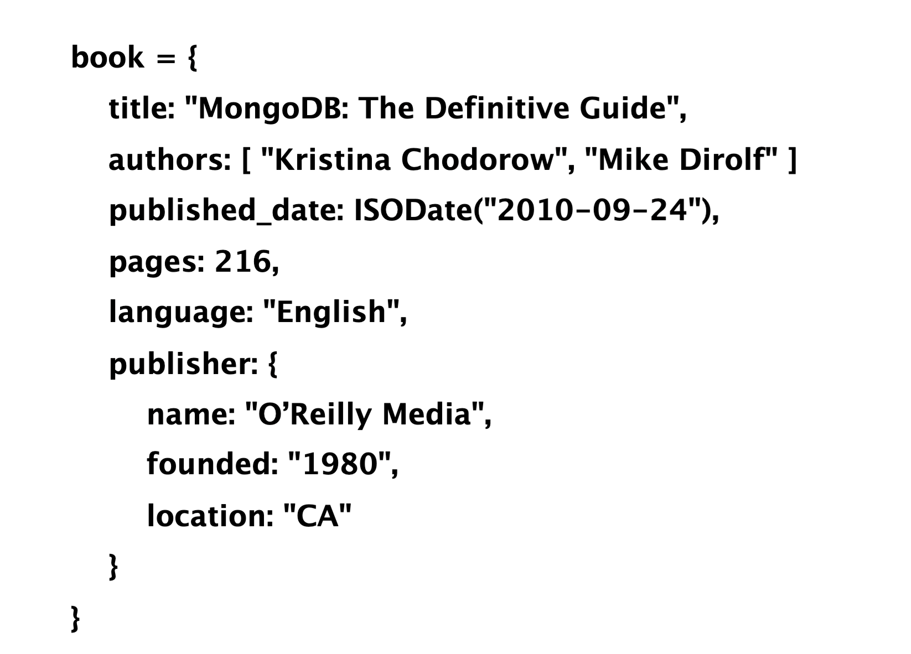

##### Linking

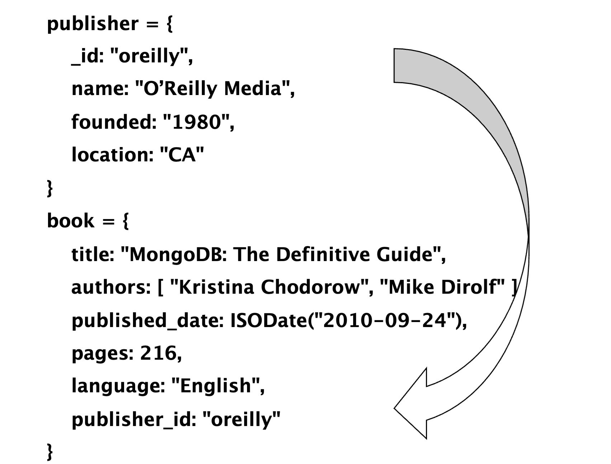

#### Linking vs Embedding

* embedding is a bit like pre-joning data
* document level operations are easy for the server to handle
* embed when the many objects always appear with (view in the context of ) their parents
* Linking whne you need more flexibility

## DNA Storage

### DNA

* Carrier of genetic instruction
* Double, long chain of molecules called Nucleotides
* Four different nucleotides: A, T, C and G
* Complrementarity (A & T, C & G) provides stability

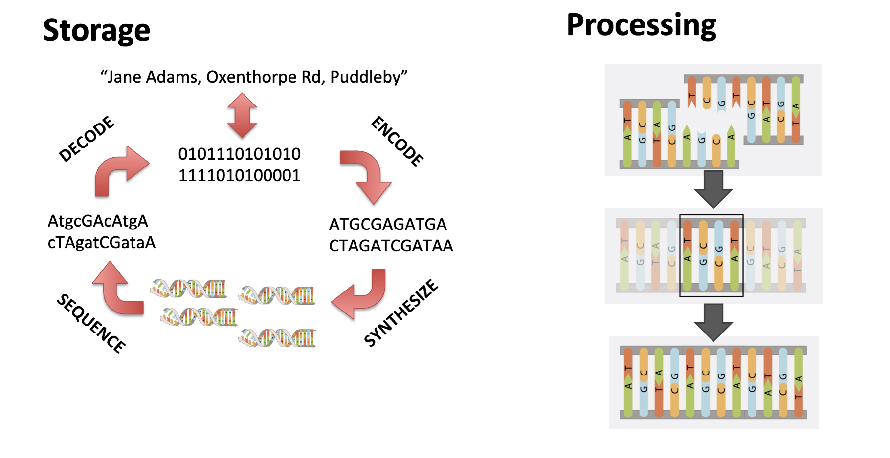

### Encoding Information in DNA

00 -> A
01 -> T
10 -> C
11 -> G

In reality 1 nucleotide per bit, but in theory 0.5 nucleotide per bit.

Challenge

* biological constraints
* error prone synthesis and sequencing

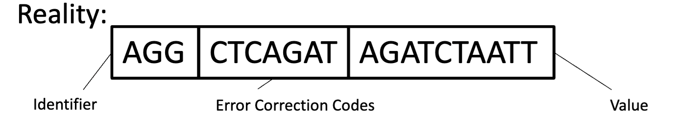

You have identifier, error correction code and the actual value.


## Week 7

## Cold Storage

Most data get cold.

The objectives are

* high performance
* low cost

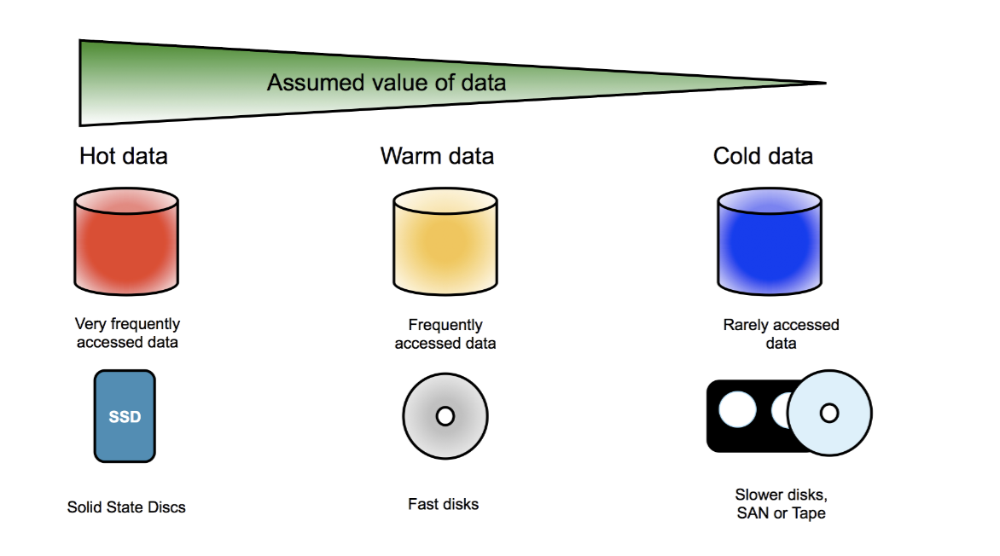

Price low accessing time slow. Price high accessing time fast

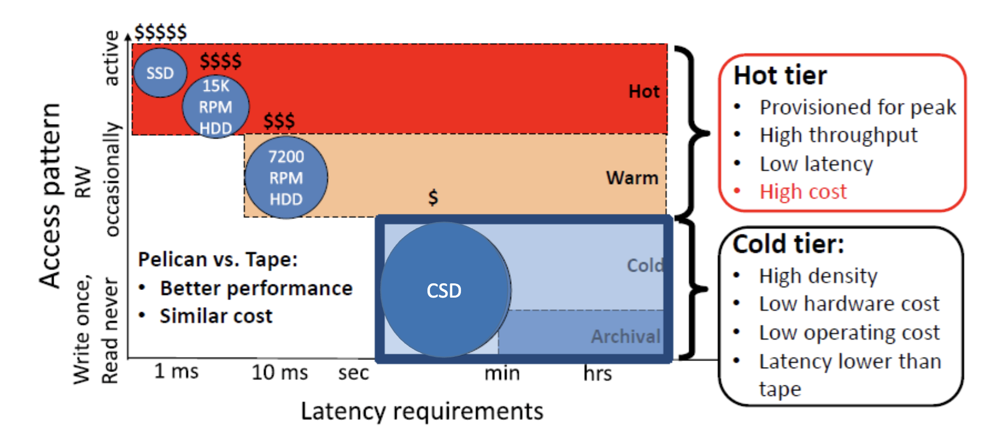


### Adquate Provisioning


**Adequate Provisioning**: provision resources just for the cold data workload.

* Disk: archival and SMR intead of commodity drives
* Power, cooling, bandwidth -> Only enough for the required workload not to keep all disks spining.


**Advantaes**: Benefits of removing unnecessary resources:

* High density of storage
* Low hardware cost
* Low operating cost

### Cold Storage Device

* Limited power and cooling facilities: only one disk group is spun up. 
    * Disk switch latency: 10-30 seconds

Example Systems:

* Microsoft Pelican
* Facebook Cold Storage
* Amazon Glacier


**Workload: Write once read occasionally (WORO)**


### Pelican

* Mechanically, hardware and storage stack co-designed.
* Designed to store blobs which are infrequently accessed data.

#### Resource Domain

* Each domain is provisioned to supply resources to a subset of disk.
* Each disk uses resources a set of resource domain.

**Domain Conflicting**: Disks that are in the same resoruce domain.

**Domain Disjoint**: Disks that share no common resource domains.

Pelican domains

* cooling
* power
* bandwidth

#### Schematic Representation

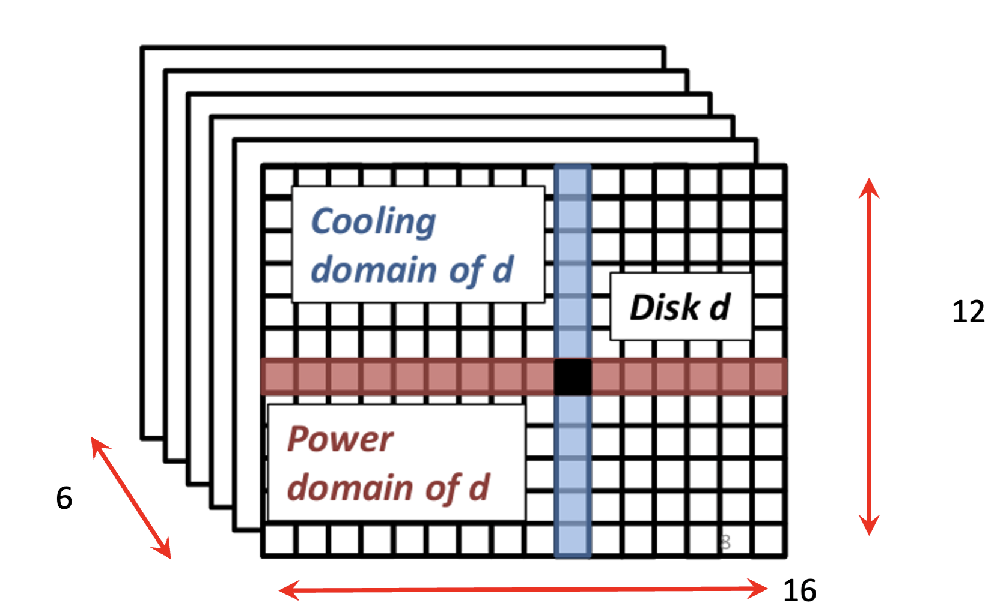

#### Data Layout

Objective: maximize number of requests that can be concurrently surved while operating within constraints.

Each blob is stored across a set of disks.

Each blob is splited into a sequence of 128Kb fragments. 

For each k fragments, additional r fragments are generated.

In Pelican, disks are partitioned into groups, and disks in the same group can be active at the same time.


#### IO scheduler

Pelican reorder request to minimize spin up latency. Traditional disks reorder IO to minimize seek latency.

Seek Latency is good source for traditional frequent access data.

Spin up latency is the time start spin a disk, which is the main concern.

Four independent IO schedulers. Each scheduler reorder requests. The reordering happens at class level.

Each IO scheduler uses two queues. One for reordering, and another for other operations.

Reordering aims to amortise group spin up latency.

#### Pros and Cons

Pros

* low cost, low power consumption
* erasure code for failure tolerance
* hardwar abstraction simplifies IO scheduler works

Cons

* tight constraints - less flexible (the resource is just minimum required to support application)
* sensitive to hardware change (hardware spin up time and other measures affect the performance)
* no sure if is the optimal setting. 

### Data Processing

The data processing on CSD is different from traditional hot data access. 

The former has non-uniform data placement, indicating data is stored across multiple disks. 

The access data is largely depend on network latency, and latency in switch disks.

### Need for Software and Hardware Co-Design

1. Data access need to be hard-ware driven to minimize group swtiches
2. Query execution engine has to process data pushed from storage in out-of-order manner. 
    * data delivered to engine from disk is not in-order, due to latencies and hetogeneous location in disk.
3. Reduce data round trip to cold storage. (Reduce data passing back and forth by smart cache)

### Batch Processing in CSD

The data is first stored in CSD racks. The data is then scanned from CSD, and each data is assigned to a partition
according to a hash function. 


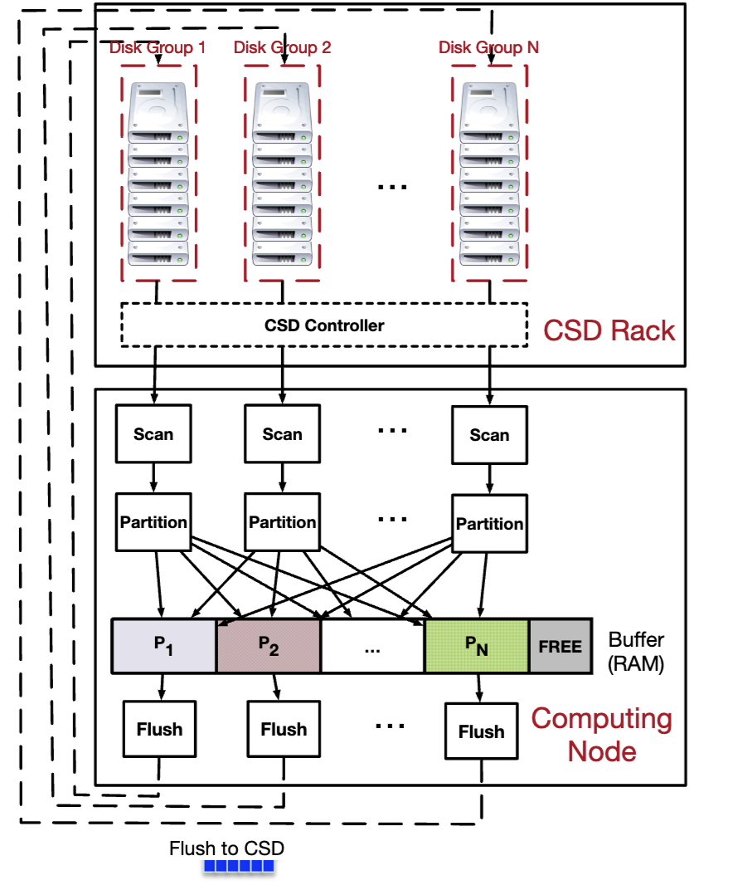


### Flushing

**Buff Pack**: 

* flush into the current disk group to avoid switching, if possible.
* otherwise, switch to disk group with the largest buffer.

**Off Pack**:

* flush current buffer into the correct target disk
* flush not active buffer into offload_buffer, but latter move them to the correct disk.

Estimates for the number of disk group switches and computation
time of each algorithm

$$
T_{total} = T_{swtich} + T_{seek} + T_{read} + T_{write}
$$

Off Pack: fewer switches, more read/write

Off Pack is better for

* smaller buffer
* higher number of disk groups
* higher throughput


## Database on MultiCore 

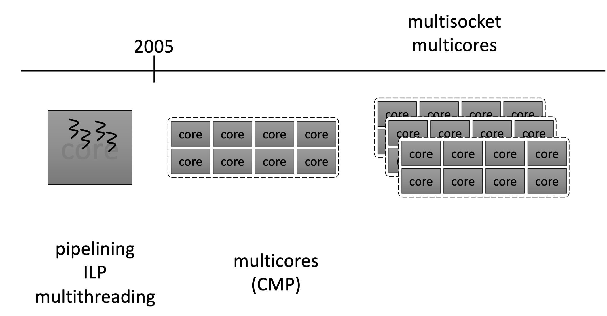

multicores: have multiple cores packaged as an unit.

multi-socket: have multiple units of multi-cores.

socket 插槽

Use multi-sockit and multi-cores to enhence computation power.

### Vertical Dimension: Cores and caches

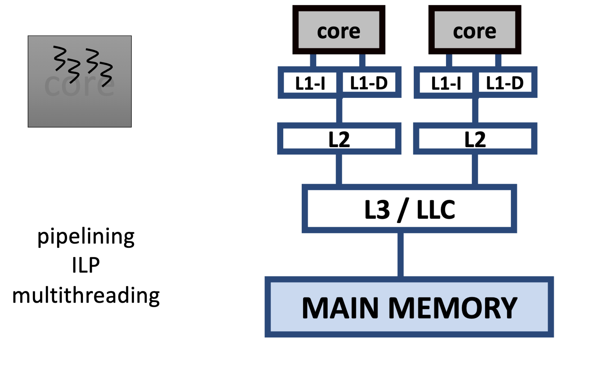

The diagram illustrates the hierachy of the core and caches. Each core has L1/L2 caches and shared L3 caches with main memory.

Pipelining: The idea of decomposing instructions into multiple stages. It allows parallel processing of instruction, enhencing CPU usage

Instruction Level Parallelism: The idea of using processors to process multiple instrucitons in a cycle.

Multi-Threading: On a single core, alternating between threads to maximize core utilization.

### Horizontal Dimension: Cores and Sockits

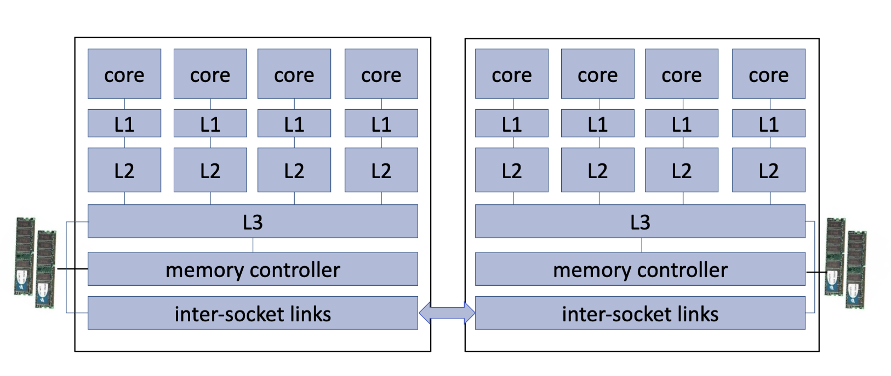

### Source of Stalls

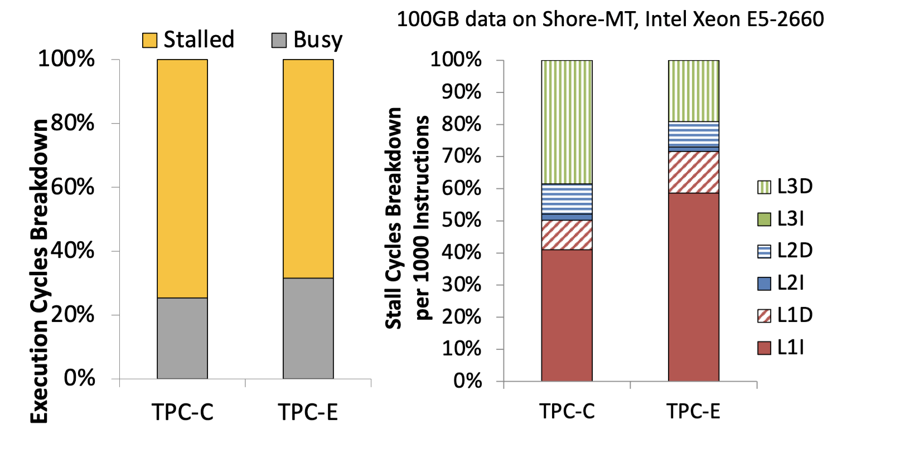

50%-80% of cules are stalls:

* Problem: instruction fetch and long latency data misses
* Instruction need more capacity
* Data misses are compulsory

**Important**: Focus on maximizing **L1-Locality** and Cache Line Utilization for Data.

Minimizing Memory Stalls

* prefetching
    * light
    * temporal sttream
    * software-guided
* being cache Conscious
    * code optimizations
    * alternative data structures/Layout
    * vectorized execution

#### Prefetching

nextline: miss A -> fetch A+1

stream: miss A, A+1 -> fetch A+2, A+3

Favors sequential access and spatial locality.

#### Temporal Streaming

Use the pattern in accessing data to leverage tempeoral accessing sequence.

Temporal Streaming will prefetch the next data accordin to the pattern.

#### Software Guided Prefetching

Prefetch child nodes from parent in trees.

#### Code optimization

* simplifed code: in-memory databasese have smaller instraction footprint
* better code Layout
    * minimize jumps -> exploit next line prefetcher
    * profile-guided optimization (static)
    * just in time (dynamic)

#### Cache Conscious Data Layouts

**Goal**: maximize cache line utilization and exploit next-line prefetcher.

Row Stores: Good for OLTP accessing many columns

Column Stores: Good for OLAP acceessing a few columns

OLTP access an entire row, which lead to access many columns.

OLAP access few columns, and perform computation for those columns.

#### Cache Conscious Data Structures

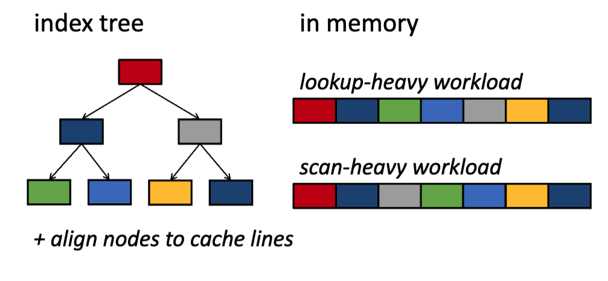

lookup-heavy workload, use depth first traversal.

scan-heavy workload use bread first traversal.


#### Summary

* DBMS undertilize a core's resources

* Problem 1: L1- missies
    * due to capacity
    * minimized footrpint & illusion of a larger cache by maximizing re-use
* Problem 2: LLC data misses
    * compulsory
    * maximize cache-line utilization through cache-conscious algorithms and layout.

### Critical Section Types

* unbounded: the length of critical section variable, creating large amount of requests on certain resources. 
    * locking, latching
* fixed: fxied length critical section. Limited time allowed to hold a lock, and limited amount of operation to perform.
    * transaction manager
* cooperative: different thread cooperatively work togather, removing the need for locks.
    * logging


### Scalling up OLTP

* unscalable components:
    * locking
    * latching
    * logging

#### locking


* synchronization
    * tradoffs
    * best practices

* non-uniform communication
    * hardware islands

##### Hot Shared Locks Cause Contention

Some locks release and request the same locks repeatedly. This cause repeated calling for locks.

##### Speculative Lock Inheritance

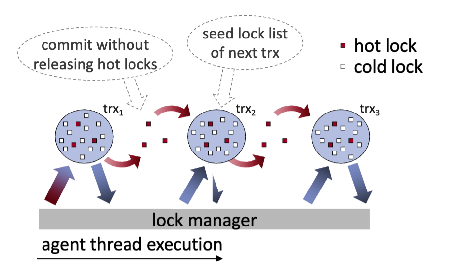


Hot Locks are not released, and are inherited by the next thread.

This significantly reduces lock contention.


#### latching

#### Data Access in Centralized B-Tree

#### Multisocket multicores

#### OLTP Hardware

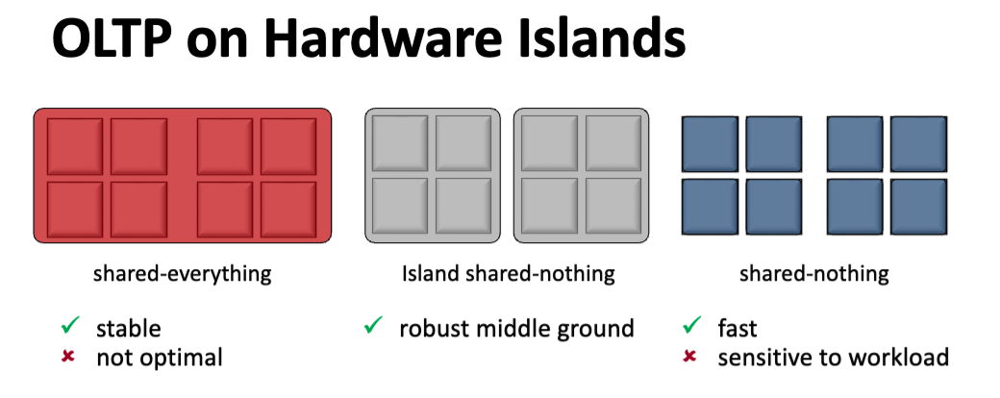


### Summary

1. Identify bottlenecks in existing systems
2. deisgn new system from the ground up
3. do not assume uniformity in communication
4. choose the right sychronization mechanism

Non-uniformity

In multi-core system the communication latency between nodes are different. System design need to 
address this non-uniformity.

Different Synchonisation Mechanism affect the system performance.

## Learning Index

### Challenge

Traditional ML library and algorithms are not designed for nano seconds execution time.

We want to proper fitting and over-fitting. This is suitable for the workload.

### Model Types

* Neural Networks
* Regressions
* and others.

### Overfitting

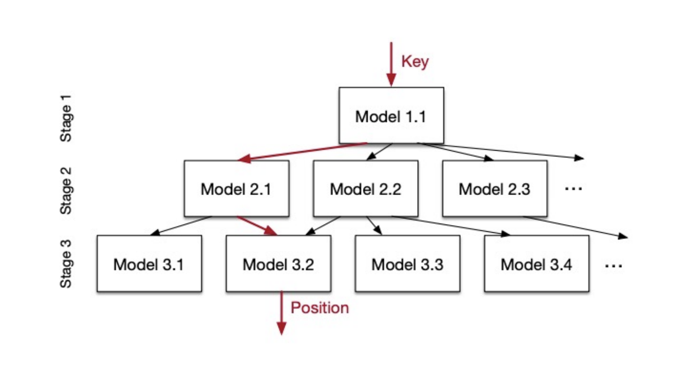

The multi stage learning algorithm provides high granularity on small perturbation of data.

This will lead to overfitting, which exactly what we want.

### Delta Indexing

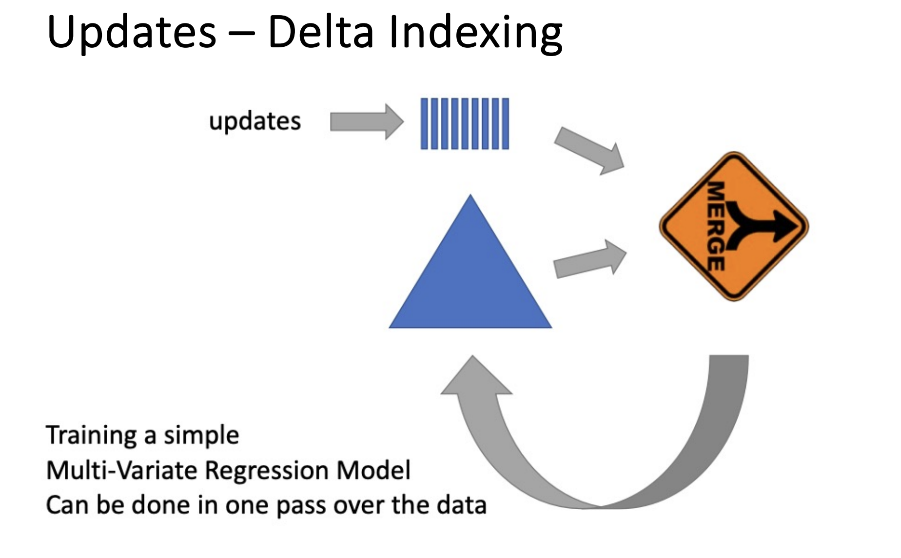

Each batch update is temporarily stored in a place as shown in blue stripes. When the temporary storage is full, the delta update
will merge with the main indices.

### Mixing Indexes with Models (MADEX)

**Approches for Indexing**

* Algorithmic Index
    * Pros:
        * Lookup time guarantee
        * Update time guarantee
        * Guarantees to handle all data types & distributions
        * Efficient implemention on CPU,Groups

* Learned Index
    * Pros
        * Considers pattern in data distribution
        * Lookup time guarantee on read-only data
    * Cons
        * No guarantee after update
        * No guarantee on update time
        * Retraining for update is slow
        * Don't support every key type

**MADEX**: combine traditional algorithmic index with learned index. It uses model to assist algorithmic indexing.

* Transformation: transform the key-input to the form that suitable for indexing
* Layout Optimization: optimize the layout of data in disk to enhence query performance
* Accleration: Use learned model to locate subtrees or nodes of algorithm tree to reduce search time.

### Model Assisted B+ Tree (MAB+Tree)

1. First it use the CDF to predict the relative position of the key. There will be an offset due to prediction error
2. Second the correction model will be used to correct the key prediction
3. Third embed the model and correction meta-data as part of the B+ tree index to improve prediction
4. Use large node, to reduce tree depth

MAB+ Tree use interpolation for a query

$$
pos(v_q) = \lfloor\frac{pos_K - pos_1}{v_K - v_1}\times(v_q - v_1)\rfloor
$$

The fraction represents the slope and the subtraction represents the 
relative placement from $v_1$ to $v_q$

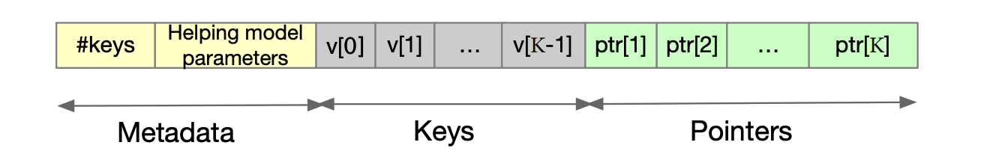

Helping model parameters

* Model parameters
* Correction Information

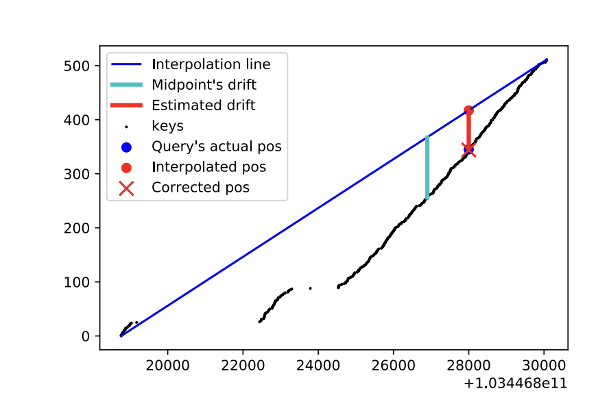

The middle reference key prediction error (drift) is

$$
midp_{err} = pos(keys(K/2) - K/2)
$$

The first part is the predicted middle point, $midp_est$

and the second part the actual middle point.

if $pos(v_q) < midp_est$
$$
error(v_q) = \frac{midp_{err}}{midp_{est}} \times pos(v_q)
$$

if $pos(v_q) > midp_{est}$

$$
error(v_q) = \frac{midp_{err}}{midp_{est} - K} \times (pos(v_q) - K)
$$

No Correction on the root node if it has few keys

No correction on node if small drift.

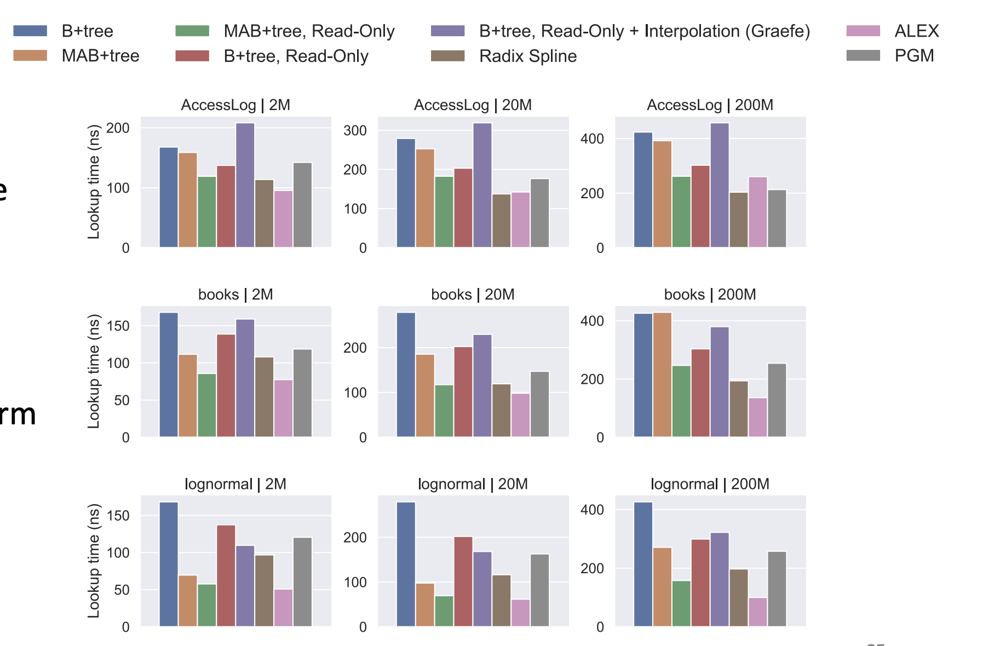

### Model Integration with Spatial Index Structure

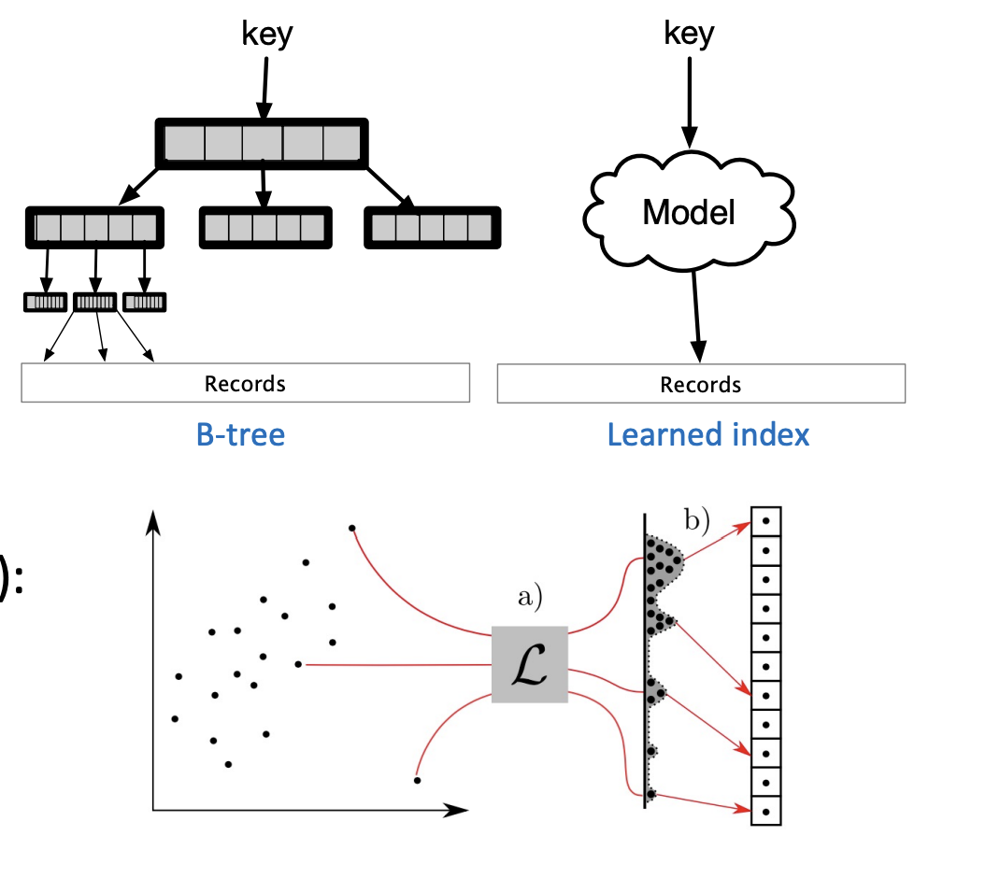

Multi-Dimension Data

* no order to sort the recoreds


#### Spatila Index

* Grids
* Spatial Partition Tree
    * R-tree

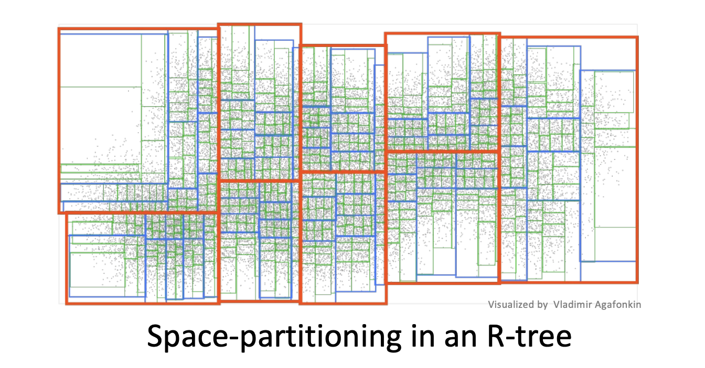

#### Interpolation Friendly Spatial Tree

* Use model assisted indexing for spatial tree
* Retian the structure of the spatial tree
* Use computational lightweight model (interpolation) when data is predictable.

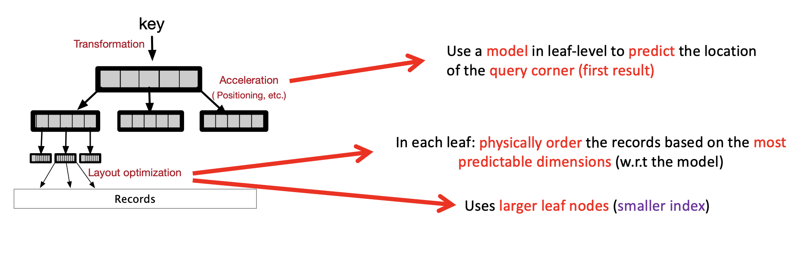

* predict the query corner i.e the boxes.
* physically order the records based on the *most predictable dimension*

Question: most predictable dimension?

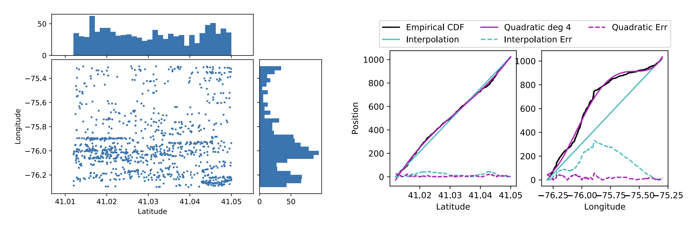

Reasons for choose the most preditable dimension 

* reduce the search cost
* optimize index structure
* increase interpolation accuracy

#### Data Layout

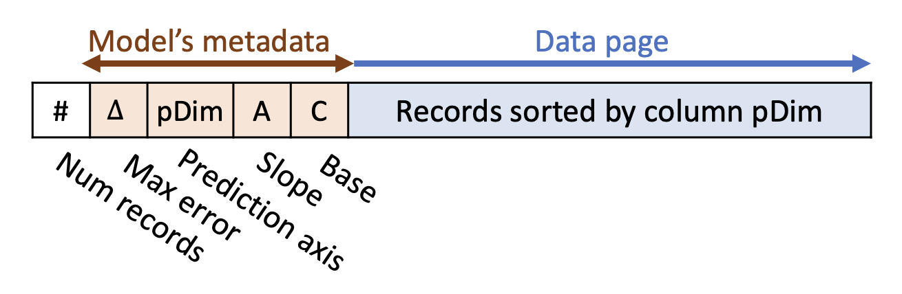

#### Prediction Model

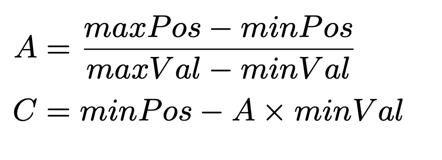

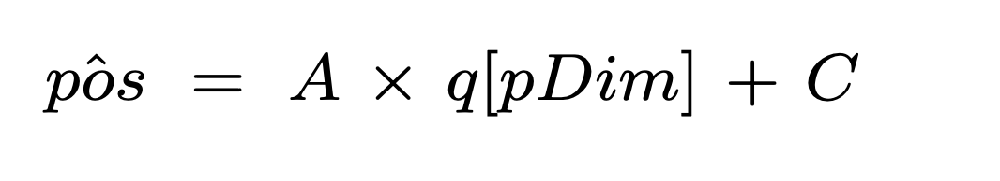

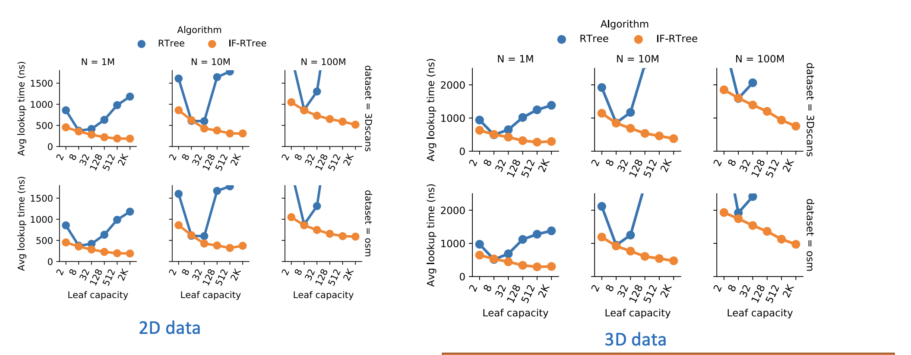

### Correlation Aware Indexing (COAX)


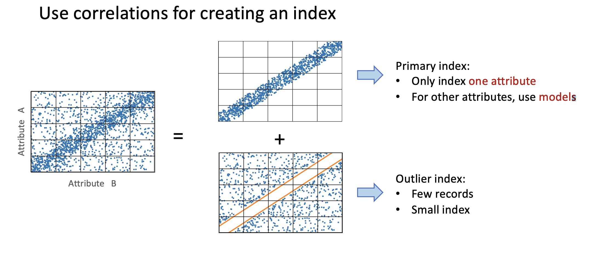

Choose one dimension for the primary, the most predictable dimension

The selected dimension will using index, and other attribute will use
models

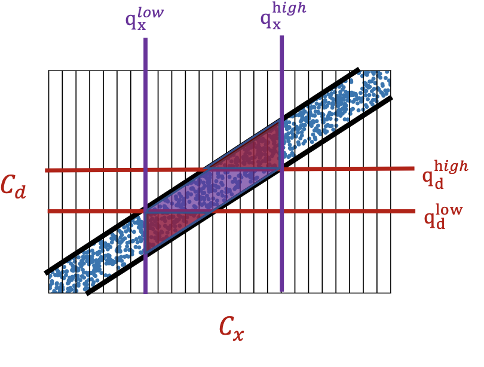

For each correlated pair of attribute, only index one attribute

Cx is the index attribute, and Cd is the dependent attribute

Model:

$$
C_d = a\times C_x + b + \epsilon
$$

$\epsilon$ is small error.

The qx low and qx high set a fixed range, and the range transform to
the dependet attribute will have qd low and qd high


### FLIRT Learned Index for Stream Data Window Based Processing

#### Problem

* Learned index is desgiend for static index, when adopting learned index
in sliding window processing, the learned index need to handle the constantly updating index

* For dynamic situation such as window processing, the index need to frequently update.


**Core**: How to obtain update performance for streaming data structure and 
combining the search performance of learned index.


#### Design of FLIRT


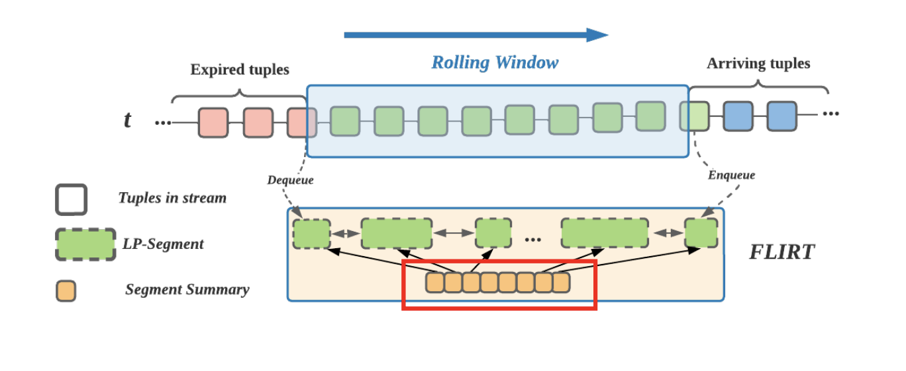

On the top is a circular queue called summarylist, which sotres summary
of segments.

Each segment stores information stores starting key and slope to allow 
for inference. This allows to make inference without touching memory.

Each LP-segment holds a linear regression model.

* this linear model approaximate the location of the records. 
* the approaximation error bound is controlled a threshould err

The accuracy of linear model depends on the distribution. 

FLIRT use auto-tuner to react to distribution shift in real time.

Notation:

* segment $i=seg_i$
* slope of sement $i=S_i$
* key stored in segment $i$ at index $j=k_{i,j}$


There are upper bound and lower bound for the slope.

The slope updating formula is using below:

$$
S_i^u = min(S_i^u, \frac{|k_i| + Err}{k - k_{i,0}})
$$

$$
S_i^l = max(s_i^l, \frac{|k_i|-Err}{k - k_{i,0}})
$$

If the key fall inside of the error bounds

* update the slope
* append the data to the end of the segment

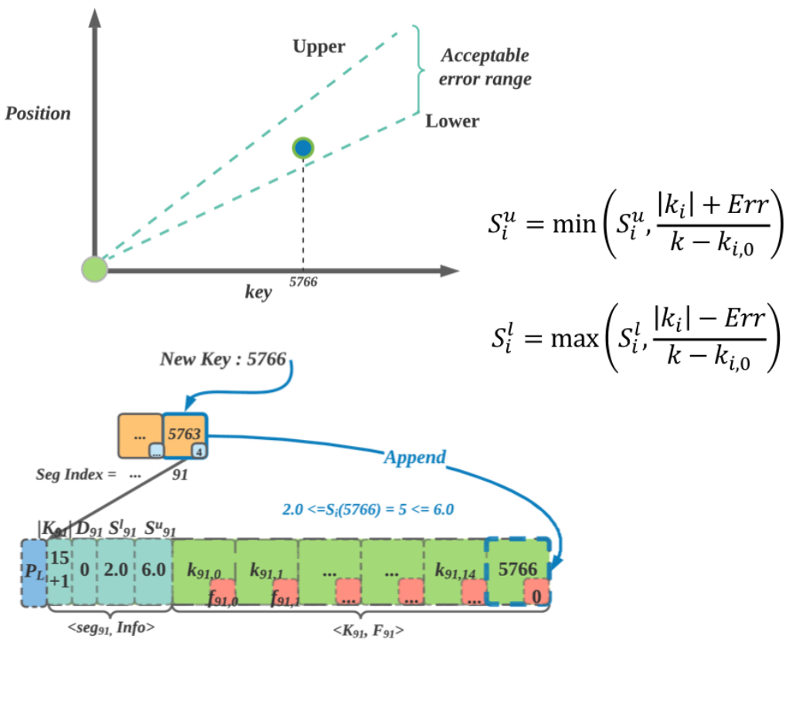

If the key fall outside of the error bounds

* we can't guarantee the record exists in the error bound
* start a new segment

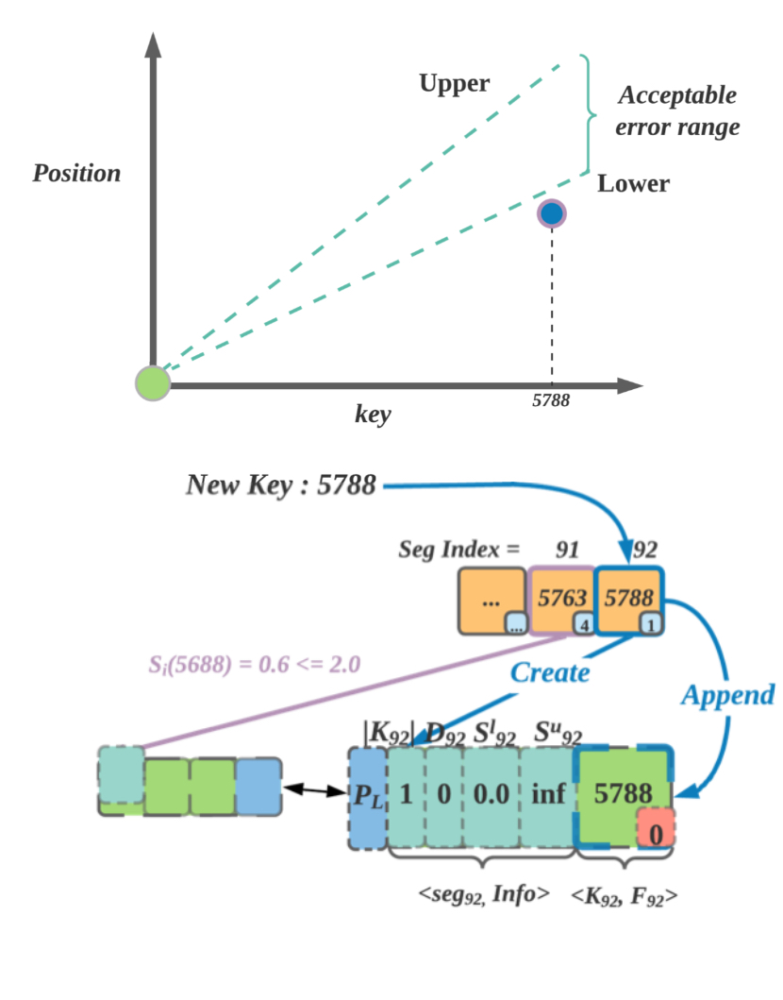


#### Dequeue from FLIRT

Two levels of Dequeue

* in the segment level: "pseudo" delete and use a deletion flag To
indiate deleted keys
* in the summarylist level: one the segment contains entiredly of epiered keys
we remove the segmetn from the summarylist

#### Searching FLIRT

1. search the summarylist to locate segmetn that contains the lookup key
2. predict the position of the key $pos_i(key)$
3. tranverse the range $pos_i(key) - Err$ to $pos_i(key) + Err$
4. check whether the key have expired by checking the deletion flag


#### Parallel Partitioned Flirt (PPFlirt)

* partition data: each thread has its' local data
* synchronous search without communication
* each thread are equally partitioned
* thread configured in a circular loop


## Week 9

## Spark

### Spark Motivation

Need for multi stage application (iterative machine learning and graph processing)

More interactive ad-hoc queries

Complex apps and interactive queries both need one thing that MapReduce lacks: Efficient Priitives for Data Sharing.

#### Disk-Based Data Sharing

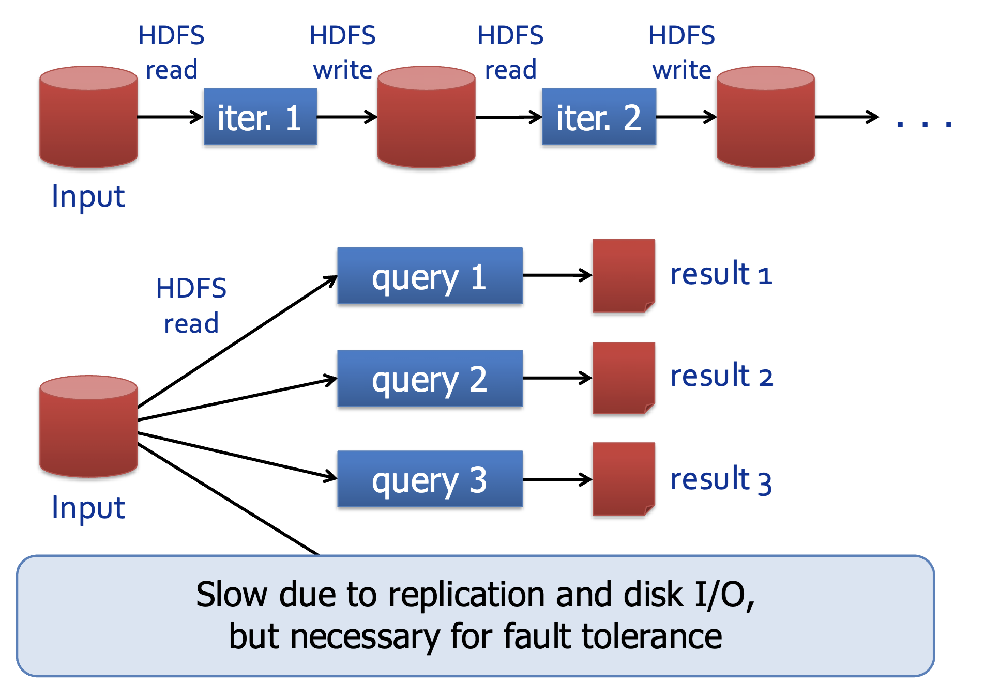

HDFS (Hadoop Distributed File System)

In each iteration MapReduce extract the information from HDFS. Compute and store information back to HDFS.

This apporach is slow, but fault tolerance.

### Goal: In Memory Data Sharing

As the memory getting cheaper, using all data in memory and perform computation is much more feasible

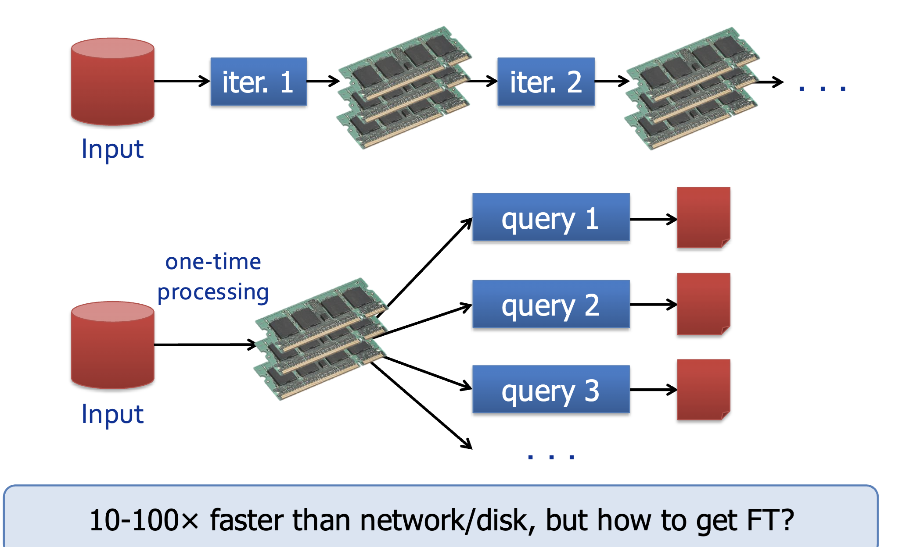

Make all data available in main memory, which load all data once.


### Challenge

How to design a distributed memory abstraction that is both fault-tolerant and efficent?


### Resilient Distributed Datasets (RDD)

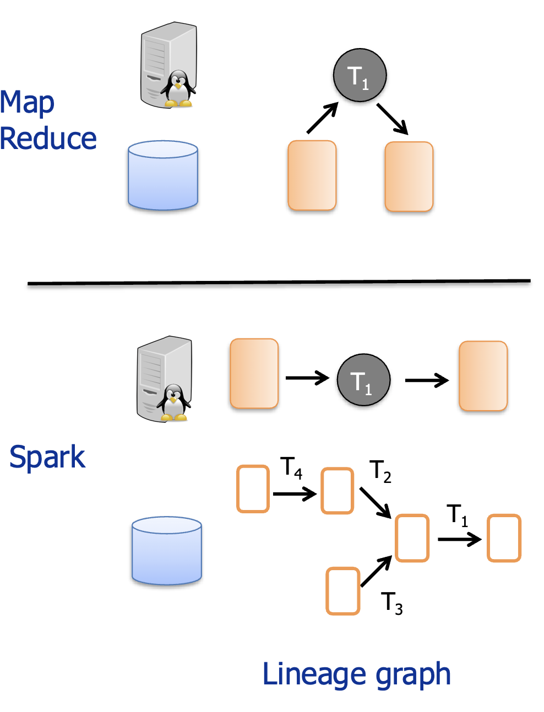

* Idea
    * store data lineage instead of data
    * recompute data based on lineage
* RDD
    * partitioned across nodes
    * immutable to simplify lineage tracking 
    * can only be built though coarse-grained determinsitc transfomration
    * *checkpointing* to disk to avoid unbounded lineage
* Enables Efficient in-memory computation

### RDD Recovery

Input to intermediate stage, recompute the partition when encountering failures.

### Generality of RDDs

* Many parallel algorithms can be expressed by RDDs
* Unify current programming languages


### Tradeoff Space

For batch workload can be expressed in terms of Spark. It leverages locality by using bulk operations

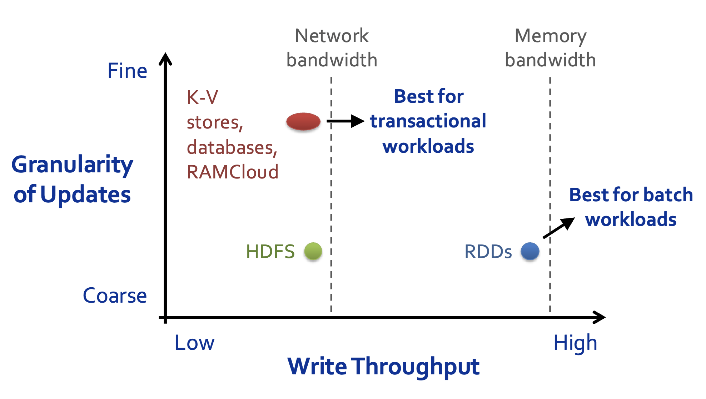

* RDDs are best for batch workload
* K-V stores are best for transactional workload

### Spark Programming Interface

DryadLINQ-like API in the scala langauge

Usable interactively from Scala interpreter

Provides

* resilient distributed datasets (RDD)
* operation on RDDs: transformation (build new RDDs), actions (compute and output results)

### Example Log Mining

load error message from a log into memory, then interactively search for various patterns

```

lines = spark.textFile(“hdfs://...”)
errors = lines.filter(_.startsWith(“ERROR”))
messages = errors.map(_.split(‘\t’)(2))
messages.persist()

messages.filter(_.contains(“foo”)).count
messages.filter(_.contains(“bar”)).count
```

### Fault Recovery

RDDs track the graph of transformation that biult them to rebuild lost data.

Tracking the linear transformation graph, removes the need for checkpoint on multi version.

The narrow dependency and wide dependency speicifies different transformation graph.

The narrow dependency is more clear on rebuild.

The wide dependency requires rebuilds of multiple data sources.

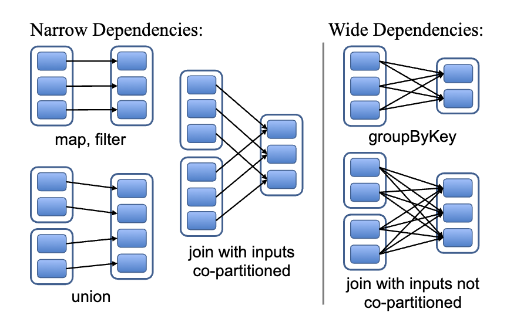


### Example PageRank

links and ransk repeatedly joined 

Can co-partition themn to avoid shuffles

Can also use app knolwedge eg hash on DNS name

### Comparison between RDD and DSM

Distributed shared memory system assume nodes have same access to memory.

RDD is desigend to complement what DSM failed to achieve

### Key Points

Introduction of Resilient Distributed Datasets (RDDs):

1. RDDs are a distributed memory abstraction designed for in-memory computations in cluster environments.
They are particularly suited for iterative algorithms (e.g., PageRank, K-means) and interactive data mining.
Key Features of RDDs:

2. Fault Tolerance: Achieved via lineage logging, where the system tracks the transformations used to generate the RDD, enabling recomputation of lost data without replication.
Coarse-Grained Transformations: Operations such as map, filter, and join are applied to the entire dataset rather than fine-grained updates.
Explicit Persistence and Partitioning: Users can choose to store RDDs in memory and control their partitioning for data placement optimization.
Advantages Over Existing Models:

3. Avoids overhead from replication, I/O, and serialization found in other cluster computing frameworks like MapReduce.
Efficient fault recovery without requiring checkpointing or data replication.
Supports mitigation of slow nodes (stragglers) by re-executing tasks on backup nodes.
Applications and Use Cases:

4. Iterative computations in machine learning and graph algorithms.
Interactive querying of data, enabling real-time exploration of large datasets.
General-purpose computing frameworks previously limited to specific models (e.g., Pregel for graph processing).
Implementation in Spark:

5. Spark leverages RDDs and provides a user-friendly API for transformations and actions, supporting both batch processing and interactive queries.
Spark achieves significant performance improvements (up to 20x faster than Hadoop for iterative computations).
Evaluation Results:

6. Demonstrates superior performance in iterative machine learning tasks and graph processing compared to Hadoop.
Proves scalable with interactive queries handling terabyte-scale data with sub-10-second latency.
Limitations:

7. RDDs are less suitable for applications requiring fine-grained updates to shared state, such as web applications or incremental web crawling.
This work established the foundation for Spark as a widely used framework for large-scale data processing, emphasizing performance, fault tolerance, and flexibility.